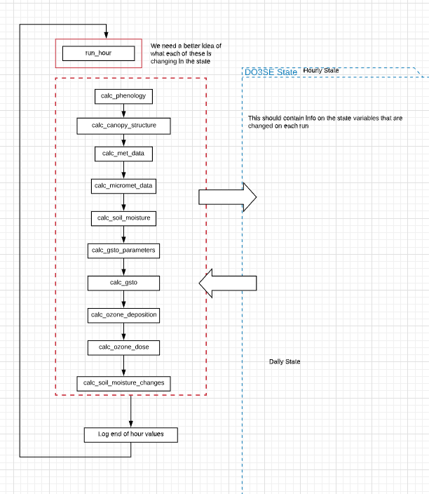

Background to the DO3SE Model
=============================

Download the original word file  :download:`Background.docx <Background.docx>`

.. container:: WordSection1

   Background to the DO\ :sub:`3`\ SE Model

    

   Describe the aims, development and applications of the DO3SE model,
   provide details of the different model versions with some simple flow
   charts, (and respective paper publications); brief overview of
   planned next steps for model development

   Contents

   `Aims 1 <#toc50040733>`__

   `Development.1 <#toc50040734>`__

   `Applications.1 <#toc50040735>`__

   `Model Flow..1 <#toc50040736>`__

   `References.1 <#toc50040737>`__

    

   .. _Toc50040733:

   \_

   .. rubric:: Aims
      :name: aims

    

   .. _Toc50040734:

   \_

   .. rubric:: Development
      :name: development

    

   .. _Toc50040735:

   \_

   .. rubric:: Applications
      :name: applications

   .. _Toc50040736:

   \_

   .. rubric:: Model Flow
      :name: model-flow

   |image0|

   Figure 1: (WIP) An overview of the data flow in the model.

    

    

   .. _Toc50040737:

   \_

   .. rubric:: References
      :name: references

    

