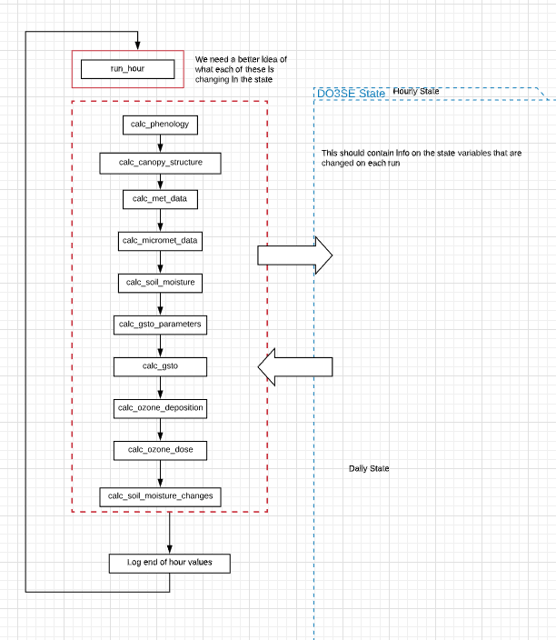

Page Title
==========

Download the original word file  :download:`Template.docx <Template.docx>`

.. container:: WordSection1

   Page Title

    

   .. _Toc50027899:

   \_

   .. rubric:: Introduction
      :name: introduction

   Some introduction text that gives an overview of the module

    

   Automated table of contents. Must be updated before saving by
   clicking the contents then Update Table.

   Contents

   `Introduction.1 <#toc50027899>`__

   `Model Flow..2 <#toc50027900>`__

   `Model Type Options.3 <#toc50027901>`__

   `Processes Within This Part of The Model4 <#toc50027902>`__

   `Appendix.5 <#toc50027903>`__

   `Glossary of parameters.5 <#toc50027904>`__

   `References.6 <#toc50027905>`__

    

    

   .. _Toc50027900:

   \_

   .. rubric:: Model Flow
      :name: model-flow

   An overview of the data flow in this part of the model preferably
   with a flow chart

   |image0|

    

   .. _Toc50027901:

   \_

   .. rubric:: Model Type Options
      :name: model-type-options

   | Explain key alternate configurations within this part of the model
     (e.g. fixed vs calculated)

    

   .. _Toc50027902:

   \_

   .. rubric:: Processes within This Part of the Model
      :name: processes-within-this-part-of-the-model

   | Main documentation on how this part of the model runs and any
     background on equations used etc.

    

   .. rubric:: Equation example
      :name: equation-example

   .. container::

      +-----------------------------------------------------------------------+
      |                                                 2                     |
      +-----------------------------------------------------------------------+

   .. _Toc50027903:

    

   .. rubric:: Appendix
      :name: appendix

   .. _Toc50027904:

   \_

   .. rubric:: Glossary of parameters
      :name: glossary-of-parameters

   +-----------------+-----------------+-----------------+-----------------+
   | **Parameter in  | **Parameter in  | **Description** | **Units**       |
   | Equation**      | code**          |                 |                 |
   +-----------------+-----------------+-----------------+-----------------+
   |                 |                 |                 |                 |
   +-----------------+-----------------+-----------------+-----------------+
   |                 |                 |                 |                 |
   +-----------------+-----------------+-----------------+-----------------+
   |                 |                 |                 |                 |
   +-----------------+-----------------+-----------------+-----------------+
   |                 |                 |                 |                 |
   +-----------------+-----------------+-----------------+-----------------+

    

    

   .. _Toc50027905:

   \_

   .. rubric:: References
      :name: references

   Mulholland, B.J., Fussell, M., Edmondson, R.N., Burns, I.G., McKee,
   J.M.T. and Basham, J. (2000) Effect of humidity and nutrient feed
   K/Ca ratio on physiological responses and the accumulation of dry
   matter, Ca and K in tomato. Journal of Horticultural Science &
   Biotechnology 75 (6): 713-722

   Olioso, A., Bethenod, O., Rambal, S., Thamitchian, M. (1995)
   Comparison of empirical leaf photosynthesis and stomatal conductance
   models. In 10th International Photosynthesis Congress, Montpellier
   (FRA), 20-25 August 1995, 4pp.

    

