Documentation/Manual of DO3SE model
===================================

Download the original word file  :download:`general.docx <general.docx>`

.. container:: WordSection1

    

   .. container::

      .. _Ref371692333:

      \_

      .. rubric:: Documentation of the DO3SE1 model
         :name: documentation-of-the-do3se1-model

   Contents

   `1.    Introduction.3 <#toc36708826>`__

   `1.1     DO3SE for total O3 deposition.4 <#toc36708827>`__

   `1.2     DO3SE for risk assessment (and interface DO3SE version
   3.1)4 <#toc36708828>`__

   `2.    DO3SE Model Formulation and
   Parameterisation.5 <#toc36708829>`__

   `2.1.    DO3SE input data requirements5 <#toc36708830>`__

   `2.2.    Atmospheric resistance (Ra)6 <#toc36708831>`__

   `2.2.1      Rasimp7 <#toc36708832>`__

   `2.2.2      Racomp7 <#toc36708833>`__

   `2.3.    Boundary layer resistance (Rb & rb)8 <#toc36708834>`__

   `2.3.1.     Canopy level quasi-laminar boundary layer resistance
   (Rb)8 <#toc36708835>`__

   `2.3.2.     Leaf level quasi-laminar boundary layer resistance
   (rb)9 <#toc36708836>`__

   `3.    Phenology (SGS, EGS and fphen) and Canopy Structure (LAI and
   SAI) 10 <#toc36708837>`__

   `3.1.    Phenology.10 <#toc36708838>`__

   `3.1.1.     Canopy level Fphen13 <#toc36708839>`__

   `3.1.2      Canopy Structure.22 <#toc36708840>`__

   `4.    Surface resistance (Rsur)25 <#toc36708841>`__

   `4.1.    Multiplicative stomatal resistance
   (Rsto)25 <#toc36708842>`__

   `4.1.1.     Maximum stomatal conductance ( <#toc36708843>`__\ )26

   `4.2     Photosynthesis based stomatal resistance
   (Rsto)37 <#toc36708844>`__

   `4.2.1      Biochemical Farquhar model for net photosynthesis
   (Anet)38 <#toc36708845>`__

   `4.2.2      Coupled photosynthesis-stomatal conductance (Anet-gsto)
   model.40 <#toc36708846>`__

   `4.2.3      Micrometeorological CO2 supply model42 <#toc36708847>`__

   `4.2.4      Parameterisation.43 <#toc36708848>`__

   `5.    Up-scaling from leaf to canopy.48 <#toc36708849>`__

   `5.1.    Big-leaf model48 <#toc36708850>`__

   `5.2     Multi-layer model48 <#toc36708851>`__

   `5.2.1      The hybrid multi-layer multi-component
   model48 <#toc36708852>`__

   `5.2.2      Photosynthesis based modelling.52 <#toc36708853>`__

   `6     Non-Stomatal resistance terms Rsoil, Rinc and Rext
   57 <#toc36708854>`__

   `4.3.1      External leaf-resistance (rext)57 <#toc36708855>`__

   `4.3.2      In-Canopy resistance (Rinc)58 <#toc36708856>`__

   `4.3.3      Soil resistance (Rsoil)58 <#toc36708857>`__

   `7     Total and Stomatal Ozone flux (Ftot and
   Fst)62 <#toc36708858>`__

   `5.1     Total O3 flux (Ftot)62 <#toc36708859>`__

   `5.2     Stomatal O3 flux (Fst)63 <#toc36708860>`__

   `5.2.2      Accumulated stomatal flux (AFstY)63 <#toc36708861>`__

   `5.2.3      Canopy Level stomatal ozone flux for forest trees (Canopy
   AFst)63 <#toc36708862>`__

   `8     Carbon allocation.64 <#toc36708863>`__

   `8.1     Fixed C allocation coefficients65 <#toc36708864>`__

   `8.2     Dynamic C allocation driven by allometric
   constraints65 <#toc36708865>`__

   `8.1  Dynamic C allocation driven by resource
   availability.66 <#toc36708866>`__

   `9 SMD Calculation Method.70 <#toc36708867>`__

   `10 Transfer functions for wind speed and ozone
   concentration.79 <#toc36708868>`__

   `10.1 Wind speed.79 <#toc36708869>`__

   `10.2 Ozone concentration.81 <#toc36708870>`__

   `APPENDIX I85 <#toc36708871>`__

   `AIII.1 Unit conversions92 <#toc36708872>`__

   `AIII.!.!. Radiation.92 <#toc36708873>`__

   `AIII.1.2 Temperature.92 <#toc36708874>`__

   `AIII.1.3 Water Vapour Pressure.92 <#toc36708875>`__

   `AIII.1.4 Ozone concentration.92 <#toc36708876>`__

   `References95 <#toc36708877>`__

    

    

   Add list of main symbols and abbreviations

.. container:: WordSection2

   .. _Toc36708826:

   \_

   .. rubric:: 1.    Introduction
      :name: introduction

   -  Describe what the DO\ :sub:`3`\ SE model is designed to do:
      estimate both total ozone deposition for mass balance and stomatal
      ozone flux for risk assessment add schematic(s) .... (add how and
      by whom it has been used/implemented so far? i.e. EMEP, MM,
      individuals etc.)…
   -  Describe how the DO\ :sub:`3`\ SE model has evolved (refer to
      Table 1) and the versions that exist as the model has developed
      and, more recently, for different applications. Describe possible
      differences between site-specific and EMEP/national scale
      model….largely (?) related to availability of input
      meteorology….i.e. when this is modelled (as opposed to measured)
      complete dataset of more variables tend to be available though
      with a lower local scale reliability…when measured datasets tend
      to be more limited in data compliment though would be expected to
      be more representative of the local conditions….
   -  Describe what needs will ideally be met by the development of this
      interfaced version this sounds very much as if the main scope of
      this document is on the interface – is this what we want?
   -  Give brief details of “support” provided with this interfaced
      model (i.e. e-mail address for people who should be contacted when
      all goes wrong)….
   -  Add a sentence on ownership of model?

   ** **

    

   **Table 1.** Evolution of the DO\ :sub:`3`\ SE model (update)

    

   +-----------------+-----------------+-----------------+-----------------+
   | **Version**     | **Key modules / | **Parameterisat | **Reference**   |
   |                 | additions**     | ion**           |                 |
   +-----------------+-----------------+-----------------+-----------------+
   | DO\ 3\ SE Ver1  | Ra, Rb, gsto,   | X forest        | Emberson et al  |
   |                 | LAI scaling     | species         | (2000)          |
   |                 |                 |                 |                 |
   |                 |                 | X crops species |                 |
   |                 |                 |                 |                 |
   |                 |                 | X grassland     |                 |
   |                 |                 | species         |                 |
   +-----------------+-----------------+-----------------+-----------------+
   | DO3SE Ver2      |                 |                 | EMEP Unified    |
   |                 |                 |                 | Model (2003)    |
   |                 |                 |                 |                 |
   |                 |                 |                 |                 |
   +-----------------+-----------------+-----------------+-----------------+
   | DO3SE Ver3      |                 |                 | EMEP status     |
   |                 |                 |                 | report (2006)   |
   +-----------------+-----------------+-----------------+-----------------+
   | DO\ 3\ SE Ver2  | Latitude        |                 | Emberson et al  |
   |                 | derived GS, SMD |                 | (2007)          |
   |                 | (VPD driven)    |                 |                 |
   +-----------------+-----------------+-----------------+-----------------+
   | DO\ 3\ SE       | SMD (Penman     |                 | Büker et al.    |
   | Ver3.1 &        | Monteith)       |                 | (2012)          |
   | interfaced      |                 |                 |                 |
   | version         |                 |                 |                 |
   +-----------------+-----------------+-----------------+-----------------+
   |                 |                 |                 |                 |
   +-----------------+-----------------+-----------------+-----------------+
   | DO\ 3\ SE Ver4  | Multi-layer &   | Grassland       | Emberson et al. |
   |                 | multi-PFT model |                 | (in prep)       |
   +-----------------+-----------------+-----------------+-----------------+
   |                 |                 |                 |                 |
   +-----------------+-----------------+-----------------+-----------------+
   |                 |                 |                 |                 |
   +-----------------+-----------------+-----------------+-----------------+

    

    

    

    

   .. _Toc36708827:

   \_

   .. rubric:: 1.1          DO3SE for total O3 deposition
      :name: do3se-for-total-o3-deposition

   Include details of land-cover classes here

   .. _Toc36708828:

   \_

   .. rubric:: 1.2          DO3SE for risk assessment (and interface
      DO3SE version 3.1)
      :name: do3se-for-risk-assessment-and-interface-do3se-version-3.1

   Include details of species here

    

    

.. container:: WordSection3

   .. _Toc36708829:

   \_

   .. rubric:: 2.    DO3SE Model Formulation and Parameterisation
      :name: do3se-model-formulation-and-parameterisation

   .. _Toc36708830:

   \_

   .. rubric:: 2.1.                  DO3SE input data requirements
      :name: do3se-input-data-requirements

    

    

   +-----------------------+-----------------------+-----------------------+
   | **Input data**        | **Height (m)**        | **Units**             |
   +-----------------------+-----------------------+-----------------------+
   | Ozone concentration   | Reference height and  | ppb                   |
   | (O3)                  | surface canopy height |                       |
   +-----------------------+-----------------------+-----------------------+
   | Horizontal windspeed  | Reference height and  | m s\ -1               |
   | (u)                   | surface canopy height |                       |
   +-----------------------+-----------------------+-----------------------+
   | Turbulent stress (t)  | surface               | kg m\ -1 s\ -2        |
   +-----------------------+-----------------------+-----------------------+
   | Heat flux density     | surface               | W m\ -2               |
   | (Hd)                  |                       |                       |
   +-----------------------+-----------------------+-----------------------+
   | Air pressure (p)      | surface               | N m\ -2               |
   +-----------------------+-----------------------+-----------------------+
   | Global radiation      | Top of canopy         | W m\ -2               |
   |                       |                       |                       |
   | **OR**                |                       |                       |
   |                       |                       |                       |
   | Photon Photosynthetic | Top of canopy         | mmol m\ -2 s\ -1      |
   | Flux Density (PPFD)   |                       |                       |
   +-----------------------+-----------------------+-----------------------+
   | Air temperature       | surface               | K                     |
   | (Tair) / Leaf         |                       |                       |
   | temperature (Tleaf)   |                       |                       |
   +-----------------------+-----------------------+-----------------------+
   | Vapour Pressure       | Surface               | kPa                   |
   | Deficit (VPD)         |                       |                       |
   +-----------------------+-----------------------+-----------------------+
   | Precipitation (Pr)    | Ground                | mm                    |
   +-----------------------+-----------------------+-----------------------+
   | **Site/Grid specific  | **Character**         | **Ideal units**       |
   | variables**           |                       |                       |
   +-----------------------+-----------------------+-----------------------+
   | Latitude and          | -                     | :sup:`o`\ , ‘         |
   | Longitude (lat &      |                       |                       |
   | long)                 |                       |                       |
   +-----------------------+-----------------------+-----------------------+
   | Elevation (e)         | -                     | m a.s.l.              |
   +-----------------------+-----------------------+-----------------------+
   | Target canopy height  | -                     | m                     |
   | (tgt)                 |                       |                       |
   +-----------------------+-----------------------+-----------------------+
   | Soil texture          | coarse / medium /     | -                     |
   |                       | fine                  |                       |
   +-----------------------+-----------------------+-----------------------+

    

   N.B. Input data greyed out are only needed to estimate atmospheric
   stability (and are not required by the DO\ :sub:`3`\ SE model
   interface since here we assume a stable atmosphere); the
   DO\ :sub:`3`\ SE model will default to a medium soil texture if this
   information is not provided

    

   Update table; make it very clear which parameters are required for
   which version of model!

    

   The DO\ :sub:`3`\ SE model’s total dry deposition scheme is shown in
   Fig 1\ `[B1] <#msocom-1>`__\ \  . The model assumes the key
   resistances to O\ :sub:`3` deposition are the aerodynamic resistance
   (Ra), the quasi-laminar sub-layer resistance (Rb) above the canopy,
   and the surface resistance (Rsur). Rsurcomprises two resistance paths
   in series; the stomatal and non-stomatal resistance. The latter
   represents a) within canopy aerodynamic resistance (Rinc) and
   subsequent b) soil resistance to decomposition at the soil surface
   (Rgs) which encompasses features such as leaf litter and ground
   vegetation under forest canopies, as well as c) resistance to
   adsorption to the external plant parts (Rext) including cuticle, bark
   etc… a comment on planned revision of estimation of Rext here?

   |image0|

    

   As such, the loss rate of ozone to the ground surface, within a
   volume unit area and height Δ\ *z* is given by the product of the
   deposition velocity (*Vg*) at height z\ :sub:`ref` and the
   concentration (C:sub:`i`) at that height as described in eq. 1.

    

   .. _Ref393790837:

   1

    

   Where *Vg* is estimated as given in eq. 2

   .. _Ref393790933:

   2

    

   .. _Toc36708831:

   \_

   .. rubric:: 2.2.                  Atmospheric resistance (Ra)
      :name: atmospheric-resistance-ra

    

   We have to explain when Ra is needed and when not (e.g. for
   leaf-level applications with available ozone data measured at top of
   plant canopy)

   The atmospheric resistance (Ra) term describes the resistance to
   O\ :sub:`3` transfer due to mechanical and thermal atmospheric mixing
   processes between a specific reference height in the atmosphere at
   which the O\ :sub:`3` concentration is modelled or measured (zR) and
   the top of the plant canopy (z1) for which O\ :sub:`3` deposition or
   uptake is being calculated.

   Ra is estimated using two different methods, the selection of which
   depends primarily upon the complement of available input data. The
   more data intensive method incorporates both mechanical and thermal
   atmospheric mixing processes in the estimation of Ra (here termed
   Ra\ :sub:`comp`) and requires heat flux data (both sensible and
   latent) which are often unavailable at site-specific locations. The
   less data intensive method only incorporates mechanical atmospheric
   mixing processes (i.e. assumes neutral stability of the atmospheric
   profile) in the estimation of Ra (here termed Ra\ :sub:`simp`).

   These Ra formulations both incorporate canopy roughness
   characteristics which will in part determine atmospheric turbulence.
   The vegetation roughness length (*zo)* and displacement height *(d)*
   are approximately 10 % and 70 % of the vegetation height (*h*)
   respectively (references). Default values for *h* used in EMEP
   DO\ :sub:`3`\ SE are given in Table x\ `[p2] <#msocom-2>`__\ \  .
   Here, z1 is more accurately defined as the top of the quasi-laminar
   canopy boundary layer (zo+d).

    

   The interfaced version of the DO\ 3\ SE model uses the Rasimp model
   formulations.

    

   .. _Toc36708832:

   \_

   .. rubric:: 2.2.1       Rasimp
      :name: rasimp

   Assuming neutral stability, Ra\ simp and friction velocity (u\*) can
   be estimated as follows using standard methods consistent with those
   described in the UNECE (2004).

              Ra\ simp =

    

   The friction velocity, u\ :sup:`\*` (m s\ :sup:`-1`) is derived from
   :-

               u\*\ `[B3] <#msocom-3>`__\ \     =

   Where *k* is the von Karman constant (0.41), *u\** is the friction
   velocity, *u*\ (*z*) is the windspeed at height *z*, *d* is the
   displacement height and *zo* is the roughness length.

   .. _Toc36708833:

   \_

   .. rubric:: 2.2.2       Racomp
      :name: racomp

    

   Where data are available to determine the actual stability profile of
   the atmosphere, Ra\ :sub:`comp` can be approximated following the
   procedure given by Garland (1978), using the Monin-Obukhov similarity
   relations for the dimensionless wind shear and potential temperature
   gradient suggested by Businger et al. (1971):

   Ra\ comp  =\ `[p4] <#msocom-4>`__\ \  

   Where *k* is the von Karman constant (0.41), u\* is the friction
   velocity, *d* is the displacement height, *zo* is the vegetation
   roughness length and *L* is the Monin-Obukhov length. ψh is the
   integrated stability function for heat.

   According to Arya (1988), integration of simplified forms of the
   similarity functions with respect to height yields the formulations
   used for the stability function for heat (ψh) and momentum (ψm)

    

   ψh (ξ) = ψm (ξ) = -5
   ξ                                                                          
   if ξ ≥ 0 (stable)

   ψ\ :sub:`m` (ζ ) = ln                                 if ζ < 0
   (unstable)

   ψ\ :sub:`h` (ζ ) = 2 ln
                                                                            
   if ζ < 0 (unstable)

   where x = (1-16 ζ ) :sup:`¼` and ζ = (z-d)/L or zo/L.

    

   The friction velocity, u\ :sup:`\*` (m s\ :sup:`-1`) is derived from
   :-

   u\* = ,

    

   where τ is turbulent surface stress (kg / m / s\ :sup:`-2`) and *ρ*
   is surface density of dry air (kg/m:sup:`3`) derived from :-

   *ρ* =

    

   where P is surface air pressure (Pa), *Rmass* is the mass gas
   constant for dry air (J / Kg / K) and T\ :sub:`2` is the surface air
   temperature (Kelvin).

   The Monin-Obukhov length,L, is derived from

               L = -|image1|

   `[p5] <#msocom-5>`__\ \  

   where c\ :sub:`p` is the specific heat capacity of dry air; k is von
   Karman’s constant (0.41), g is the gravitational acceleration (9.81 m
   s\ :sup:`-2`) and H is the surface flux of sensible heat (W
   m\ :sup:`-2`).

   .. _Toc36708834:

   \_

   .. rubric:: 2.3.                  Boundary layer resistance (Rb & rb)
      :name: boundary-layer-resistance-rb-rb

   The boundary layer of a plant surface can be defined as the layer of
   air surrounding the surface within which O\ :sub:`3` transfer is
   reduced from that which would occur in the atmosphere due to friction
   imparted by the plant surface. The processes which determine transfer
   across canopy and leaf boundary layers occur due both to mechanical
   forcing (imparted by the momentum of the atmosphere) and molecular
   diffusion, with the latter becoming more important closer to the leaf
   surface as the momentum is reduced due to surface friction. The
   boundary layer resistance is commonly termed quasi-laminar since it
   comprises turbulent air movement occurring in the direction of
   laminar flow. The calculation of total O\ :sub:`3` deposition
   requires that the whole **canopy** boundary layer resistance (Rb) be
   estimated. In contrast, to estimate stomatal O\ :sub:`3` deposition
   to representative leaves of the upper canopy, **leaf** boundary layer
   resistances (rb) need to be calculated.  Explain what is of relevance
   for interface

   .. _Toc36708835:

   \_

   .. rubric:: 2.3.1.     Canopy level quasi-laminar boundary layer
      resistance (Rb)
      :name: canopy-level-quasi-laminar-boundary-layer-resistance-rb

    

   Whole canopy boundary layer resistance is approximated according to
   the following formulation presented by Hicks et al (1987)

    

   Rb = |image2|

    

   where Sc is the Schmidt number equal to *v*/*Di*, with *v* being the
   kinematic viscosity of air (0.15 cm\ :sup:`-2` s\ :sup:`-1` at 20°C),
   *Di* being the molecular diffusivity (for O\ :sub:`3` this is 0.15
   cm\ :sup:`-2` s\ :sup:`-1`  and for H\ :sub:`2`\ O this is 0.25
   cm\ :sup:`-2` s\ :sup:`-1` at 20\ :sup:`o`\ C) and Pr being the
   Prandtl number (0.72).

   [Include Rb for CO2, H2O, O3 and heat]

   ** **

   .. _Toc36708836:

   \_

   .. _Ref393795104:

   \_

   .. _Ref393795084:

   \_

   .. _Ref393724949:

   \_

   .. _Ref393724938:

   \_

   .. _Ref393724934:

   \_

   .. rubric:: 2.3.2.     Leaf level quasi-laminar boundary layer
      resistance (rb)
      :name: leaf-level-quasi-laminar-boundary-layer-resistance-rb

    

   Consistency of the quasi-laminar boundary layer is harder to achieve,
   so a leaf-level r\ :sub:`b` term (McNaughton and van der Hurk, 1995)
   is used. This incorporates the cross-wind leaf dimension *L* (given
   in m) and *u*\ (*h*) (the wind speed at the top of the canopy given
   in m/s). According to Campbell & Norman (1998), r\ :sub:`b` for heat
   (for forced convection) can be calculated according to eq. 3 giving
   values in s/m (these formulations take into account both sides of the
   leaf and therefore provide r\ :sub:`b` for PLA).

    

    

   .. _Ref393793568:

   3

    

   The approximate value of 150 (as used in the UNECE Mapping Manual
   (LRTAP Convention, 2010)) is arrived at using the value of 0.135
   which is a constant for heat conductance in mol m\ :sup:`-2`
   s\ :sup:`-1` for a single leaf surface and is converted to a
   resistance term (s/m). This is achieved using 41 to convert from mol
   m\ :sup:`-2` s\ :sup:`-1` to m/s, 2 from single surface to PLA and by
   dividing by 1 to give a resistance (i.e. 1/(0.135*2)/41 which gives
   151.85 and is then rounded down to 150).

    

   For the gases - water vapour, carbon dioxide and ozone, the values of
   0.147, 0.110 and 0.105 are the constants used for used for
   conductance in mol m\ :sup:`-2` s\ :sup:`-1` for a single leaf
   surface (i.e. these replace the 0.135 constant for heat). These are
   equivalent to 139, 186 and 195 when used in the equations giving
   units in s/m (similar to eq 3). 

    

   N.B. Some boundary layer models also make a distinction between free
   (or natural) convection and forced convection. Free (natural)
   convection occurs due to temperature differences which affect the
   density, and thus relative buoyancy, of the fluid (e.g. water
   vapour). In forced convection, sometimes also called heat convection,
   fluid movement results from external surface forces such as expansion
   of air due to heat. Free (or natural) convection is not currently
   used in the DO\ 3\ SE model. However, we describe the method to
   estimate free (or natural) convection below in case this might be
   introduced in subsequent model versions.

    

   For the definition of the criteria for free *vs*. forced convection,
   a ratio term is necessary which is calculated as in eq. 4.

    

   .. _Ref393794979:

   4

    

   ratio      = (9.81*abs(Tleaf_K-Tair_K))/((u**2)*((Tleaf_K+Tair_K)/2))
   – these brackets aren’t correct and what does ‘abs’ stand for.

               

   If ratio ≤ 0.1, then forced convection dominates (see above). Else if
   the ratio is > 0.1 then free convention is occurring which is
   estimated according to Campbell & Norman (1998) as described in eq. 5
   in units of s/m. 

    

   .. _Ref393794954:

   5

   .. _Toc36708837:

   \_

   .. rubric:: 3.    Phenology (SGS, EGS and fphen) and Canopy Structure
      (LAI and SAI) [p6] 
      :name: phenology-sgs-egs-and-fphen-and-canopy-structure-lai-and-sai-p6

   .. _Toc36708838:

   \_

   .. rubric:: 3.1.  Phenology
      :name: phenology

   A key driver of O\ 3 deposition to vegetated surfaces and stomatal
   O\ 3 flux is seasonality (i.e. the timing of the physiologically
   active growth period); this will primarily depend on geographical
   location but will also be influenced by land-cover type and species.
   Add an extra introductory descriptive para with a schematic that
   describes how SGS/EGS, F/fphen and LAI are all part of one approach
   accounting for seasonality of flux; also describe the difference
   between SGS/EGS and Astart/Aend

    

    

   .. rubric:: Estimation of length of growth period (SGS and EGS) this
      chapter has to be updated – define what is of importance for
      interface
      :name: estimation-of-length-of-growth-period-sgs-and-egs-this-chapter-has-to-be-updated-define-what-is-of-importance-for-interface

    

   **Forest Trees**

   For forest trees the EMEP latitude model was developed to identify
   the timing of the growing season of the “generic” deciduous tree
   species (UNECE, 2004). This model gave good agreement with observed
   phenological data for a range of deciduous species (e.g. birch, beech
   and oak; see also Fig x), with measurements of carbon flux from
   CarboEurope (\ http://www.carboeurope.org/\ ) which were used to
   identify the initiation and cessation of physiological activity, and
   was also able to describe the onset of forest green-up and dormancy
   as determined from European remotely sensed data (Zhang et al. 2004);
   see UNECE (2004) for additional details.

   **Fig xComparison of observational phenological data with the EMEP
   latitude model. The black lines show the SGS and EGS determined with
   the EMEP latitude model. The green and orange lines show the onset of
   green-up and dormancy described by remotely sensed data for the year
   2001 (Zhang et al. 2004) and the vertical red lines show the
   variation in observed SGS and EGS dates for sites at specific
   latitudes for a number of different years. **

    

   |image3|

    

   The EMEP forest latitude model for the estimation of SGS and EGS is
   given below.

    

   .. container::

      SGS occurs at year day 105 at latitude 50\ o\ N. SGS will alter by
      1.5 day per degree latitude earlier on moving south and later on
      moving north.

       

      EGS occurs at year day 297 at latitude 50\ o\ N. EGS will alter by
      2 days per degree latitude earlier on moving north and later on
      moving south.

       

      The effect of altitude on phenology is incorporated by assuming a
      later SGS and earlier EGS by 10 days for every 1000 m a.s.l.

   `[p7] <#msocom-7>`__\  

   It is useful to define the physiologically active growth period using
   the terms SGS and EGS. SGS is defined as the date of leaf unfolding
   (deciduous & broadleaved evergreen species) or the start of
   leaf/needle physiological activity (coniferous and evergreen
   species). For the “real” species\ `[p8] <#msocom-8>`__\ \  , SGS is
   estimated by the EMEP latitude model with the exception of temperate
   conifers south of ~55\ o\ N, where SGS is defined by prevailing
   environmental conditions (using the f\ temp function), and for
   Mediterranean trees where a year round growth period is
   assumed\ `[p9] <#msocom-9>`__\  . EGS is defined as the onset of
   dormancy; the EMEP latitude model is used to identify EGS, again with
   the exception of temperate conifers south of ~55\ o\ N where EGS is
   defined by prevailing environmental conditions (using the f\ temp
   function) and for Mediterranean trees where a year round growth
   period is assumed. Table x summarises the methods used to derive SGS
   and EGS for different real species by forest type.

    

   **Crops**

   The EMEP Crop latitude model uses a simple function :-

    

   .. container::

      SGS occurs at year day 105 at latitude 50\ o\ N. SGS will alter by
      3.0 days per degree latitude earlier on moving south and later on
      moving north.\ `[p10] <#msocom-10>`__\  

    

   **Table (x)   Default deposition land-cover and species class
   methods/values for estimation of the start (SGS) and end (EGS) of the
   growing season.**

    

   +-------------+-------------+-------------+-------------+-------------+
   | **Land-cove | **Climate   | **SGS**     | **EGS**     | **Reference |
   | r           | region**    |             |             | **          |
   | type &      |             |             |             |             |
   | Species**   |             |             |             |             |
   +-------------+-------------+-------------+-------------+-------------+
   | ** **       |             |             |             |             |
   +-------------+-------------+-------------+-------------+-------------+
   | **Coniferou |             | EMEP Forest | EMEP Forest | UNECE       |
   | s           |             | Latitude    | Latitude    | (2004)      |
   | Forests     |             | model       | model       |             |
   | (CF)**      |             |             |             |             |
   +-------------+-------------+-------------+-------------+-------------+
   | Norway      | Northern    | EMEP Forest | EMEP Forest | UNECE       |
   | spruce      | Europe      | Latitude    | Latitude    | (2004)      |
   |             |             | model       | model       |             |
   | (Picea      |             |             |             |             |
   | abies)      |             |             |             |             |
   +-------------+-------------+-------------+-------------+-------------+
   | Scots Pine  | Atlantic    | f\ temp     | f\ temp     | UNECE       |
   |             | Central     |             |             | (2004)      |
   | (Pinus      | Europe      |             |             |             |
   | sylvestris) |             |             |             |             |
   +-------------+-------------+-------------+-------------+-------------+
   | Norway      | Continental | f\ temp     | f\ temp     | UNECE       |
   | Spruce      | Central     |             |             | (2004)      |
   |             | Europe      |             |             |             |
   | (Picea      |             |             |             |             |
   | abies)      |             |             |             |             |
   +-------------+-------------+-------------+-------------+-------------+
   | **Deciduous |             | EMEP Forest | EMEP Forest | UNECE       |
   | Forests**   |             | Latitude    | Latitude    | (2004)      |
   |             |             | model       | model       |             |
   | **(DF)**    |             |             |             |             |
   +-------------+-------------+-------------+-------------+-------------+
   | **Generic   | **All       | EMEP Forest | EMEP Forest | **UNECE     |
   | Deciduous** | Europe**    | Latitude    | Latitude    | (2004)**    |
   |             |             | model       | model       |             |
   +-------------+-------------+-------------+-------------+-------------+
   | Silver      | Northern    | EMEP Forest | EMEP Forest | UNECE       |
   | birch       | Europe      | Latitude    | Latitude    | (2004)      |
   |             |             | model       | model       |             |
   | (Betula     |             |             |             |             |
   | pendula)    |             |             |             |             |
   +-------------+-------------+-------------+-------------+-------------+
   | Beech       | Atlantic    | EMEP Forest | EMEP Forest | UNECE       |
   |             | Central     | Latitude    | Latitude    | (2004)      |
   | (Fagus      | Europe      | model       | model       |             |
   | sylvatica)  |             |             |             |             |
   +-------------+-------------+-------------+-------------+-------------+
   | Oak         | Atlantic    | EMEP Forest | EMEP Forest | UNECE       |
   |             | Central     | Latitude    | Latitude    | (2004)      |
   | (Quercus    | Europe      | model       | model       |             |
   | petraea &   |             |             |             |             |
   | robur)      |             |             |             |             |
   +-------------+-------------+-------------+-------------+-------------+
   | Beech       | Continental | EMEP Forest | EMEP Forest | UNECE       |
   |             | Central     | Latitude    | Latitude    | (2004)      |
   | (Fagus      | European    | model       | model       |             |
   | sylvatica)  |             |             |             |             |
   +-------------+-------------+-------------+-------------+-------------+
   | Beech       | Mediterrane | EMEP Forest | EMEP Forest | UNECE       |
   |             | an          | Latitude    | Latitude    | (2004)      |
   | (Fagus      | Europe      | model       | model       |             |
   | sylvatica)  |             |             |             |             |
   +-------------+-------------+-------------+-------------+-------------+
   | **Needlelea |             | **Year      | **Year      | UNECE       |
   | f           |             | round       | round       | (2004)      |
   | Forests**   |             | growth**    | growth**    |             |
   |             |             |             |             |             |
   | **(NF)**    |             |             |             |             |
   +-------------+-------------+-------------+-------------+-------------+
   | Aleppo Pine | Mediterrane | Year round  | Year round  | UNECE       |
   |             | an          | growth      | growth      | (2004)      |
   | *(Pinus     | Europe      |             |             |             |
   | halepensis) |             |             |             |             |
   | *           |             |             |             |             |
   +-------------+-------------+-------------+-------------+-------------+
   | **Broadleaf |             | Year round  | Year round  | UNECE       |
   | Forests**   |             | growth      | growth      | (2004)      |
   |             |             |             |             |             |
   | **(BF)**    |             |             |             |             |
   +-------------+-------------+-------------+-------------+-------------+
   | **Generic   | **All       | **Year      | **Year      | **UNECE     |
   | Evergreen   | Europe**    | round       | round       | (2004)**    |
   | Mediterrane |             | growth**    | growth**    |             |
   | an**        |             |             |             |             |
   +-------------+-------------+-------------+-------------+-------------+
   | Holm Oak    | Mediterrane | Year round  | Year round  | UNECE       |
   |             | an          | growth      | growth      | (2004)      |
   | (Quercus    | Europe      |             |             |             |
   | ilex)       |             |             |             |             |
   +-------------+-------------+-------------+-------------+-------------+
   | **Temperate |             | EMEP Crop   | = SGS + 90  | Simpson et  |
   | crops**     |             | Latitude    |             | al. (2003)  |
   |             |             | model       |             |             |
   | **(TC)**    |             |             |             |             |
   +-------------+-------------+-------------+-------------+-------------+
   | **Generic   | **All       | **= (2.57   | **= SGS +   | **UNECE     |
   | crop**      | Europe**    | \* latitude | 90**        | (2004)**    |
   |             |             | + 40) -     |             |             |
   |             |             | 50 **       |             |             |
   +-------------+-------------+-------------+-------------+-------------+
   | Wheat       | All Europe  | = (2.57 \*  | = SGS + 92  | UNECE       |
   |             |             | latitude +  |             | (2004);     |
   | (Triticum   |             | 40) - 50    |             |             |
   | aestivum)   |             |             |             |             |
   +-------------+-------------+-------------+-------------+-------------+
   | **Mediterra |             | EMEP Crop   | = SGS + 92  | Simpson et  |
   | nean        |             | Latitude    |             | al. (2003)  |
   | crops**     |             | model       |             |             |
   |             |             |             |             |             |
   | **(MC)**    |             |             |             |             |
   +-------------+-------------+-------------+-------------+-------------+
   | Maize       | All Europe  | 130         | 250         | ICP         |
   |             |             |             |             | Vegetation  |
   | *(Zea       |             |             |             | contract    |
   | mays)*      |             |             |             | report      |
   |             |             |             |             | (2006);     |
   +-------------+-------------+-------------+-------------+-------------+
   | Sunflower   | All Europe  | 150         | 250         | ICP         |
   |             |             |             |             | Vegetation  |
   | *(Helianthu |             |             |             | contract    |
   | s           |             |             |             | report      |
   | annuus)*    |             |             |             | (2006);     |
   +-------------+-------------+-------------+-------------+-------------+
   | Tomato      | All Europe  | 180         | 300         | ICP         |
   |             |             |             |             | Vegetation  |
   | *(Solanum   |             |             |             | contract    |
   | lycopersicu |             |             |             | report      |
   | m)*         |             |             |             | (2006);     |
   +-------------+-------------+-------------+-------------+-------------+
   | Grape vine  | All Europe  | 105         | 270         | ICP         |
   |             |             |             |             | Vegetation  |
   | *(Vitis     |             |             |             | contract    |
   | vinifera)*  |             |             |             | report      |
   |             |             |             |             | (2006);     |
   +-------------+-------------+-------------+-------------+-------------+
   | **Root      |             | 146         | 216         | Simpson et  |
   | crops**     |             |             |             | al. (2003); |
   |             |             |             |             | UNECE       |
   | **(RC)**    |             |             |             | (2004)      |
   +-------------+-------------+-------------+-------------+-------------+
   | Potato      | All Europe  | 146         | 266\ `[B11] | UNECE       |
   |             |             |             |  <#msocom-1 | (2004);     |
   | (Solanuum   |             |             | 1>`__\ \    | Simpson et  |
   | tuberosum)  |             |             |             | al. (2003)  |
   +-------------+-------------+-------------+-------------+-------------+
   | **Semi-Natu |             | 1           | 365         | Simpson et  |
   | ral         |             |             |             | al. (2003)  |
   | /           |             |             |             |             |
   | Moorland**  |             |             |             |             |
   |             |             |             |             |             |
   | **(SNL)**   |             |             |             |             |
   +-------------+-------------+-------------+-------------+-------------+
   | **Grassland |             | 1           | 365         | Simpson et  |
   | **          |             |             |             | al. (2003)  |
   |             |             |             |             |             |
   | **(GR)**    |             |             |             |             |
   +-------------+-------------+-------------+-------------+-------------+
   | Perennial   | All Europe  | 1           | 365         | Simpson et  |
   | rye grass   |             |             |             | al. (2003)  |
   |             |             |             |             |             |
   | (Lolium     |             |             |             |             |
   | perenne)    |             |             |             |             |
   +-------------+-------------+-------------+-------------+-------------+
   | Clover      | All Europe  | 1           | 365         | Simpson et  |
   |             |             |             |             | al. (2003)  |
   | (Trifolium  |             |             |             |             |
   | repens)     |             |             |             |             |
   |             |             |             |             |             |
   |             |             |             |             |             |
   +-------------+-------------+-------------+-------------+-------------+
   | **Mediterra |             | 1           | 365         | Simpson et  |
   | nean        |             |             |             | al. (2003)  |
   | scrub**     |             |             |             |             |
   +-------------+-------------+-------------+-------------+-------------+

    

   .. rubric:: 3.1.  Estimation of canopy and leaf level gsto during the
      growth period (Fphen and fphen)
      :name: estimation-of-canopy-and-leaf-level-gsto-during-the-growth-period-fphen-and-fphen

    

   .. _Toc36708839:

   \_

   .. rubric:: 3.1.1.     Canopy level Fphen
      :name: canopy-level-fphen

    

   **Forest trees**

   Coniferous and deciduous forest species

   For the “Coniferous” and “Deciduous” forests species the F\ phen
   parameterisation is based on data describing the increase and
   reduction in g\ sto with the onset and end of physiological activity
   (coniferous species) and the green growth period (deciduous species)
   respectively. The minimum length of these respective periods (see
   Tables V.A1 to V.A4) has been used in the parameterisation to ensure
   that periods when forests are potentially experiencing higher ozone
   uptake are incorporated in the risk assessment.

    

   For the beginning of the growing season the increase in g\ sto to
   g\ max will begin on the year day defined as SGS. The time to reach
   g\ max is defined by fphen\_e\ `[p12] <#msocom-12>`__\  . For the end
   of the growing season, the decrease in g\ sto from g\ max is defined
   by fphen\_f\ `[p13] <#msocom-13>`__\  and assumed to occur on the
   year day defined as EGS. Would be good to add schematic here....

    

   **Mediterranean evergreen forest species are updates available
   here?**

   For Mediterranean forests, the F\ phen value would ideally be set
   equal to 1 and the reduction in g\ sto that is frequently observed
   during the summer period would be estimated as a function of soil
   water status. However, if tested methods to determine soil water
   content for the “real” species and conditions are not available, it
   is recommended to default to the F\ phen relationship used previously
   for Mediterranean evergreen “generic” species (see notes for Table
   V.A4). This function acts as a surrogate for soil water stress and
   may also incorporate phenological limitations to g\ sto that have
   been suggested to occur during the summer. For example, a depletion
   in g\ sto for Holm Oak was found during summer even under apparent
   non-drought stress conditions (Alonso et al., 2008) suggesting both
   the F\ phen and f\ SWP terms may be required to estimate g\ sto. In
   conclusion it is recognised that further work is needed to improve
   methods to understand the influence of drought on g\ sto and hence
   O\ 3 uptake; for example, ideally, the onset of soil water stress
   would determine the timing and extent of leaf flushing avoiding
   inconsistencies that currently exist between assumed fixed periods of
   stress and leaf flushing.

    

   **Crops**

   …add text….

    

   A generic formulation for the canopy g\ sto relationship with canopy
   age (F\ phen) is given by the equations provided below. This allows
   the use of a consistent formulation irrespective of whether there is
   a mid-season dip in F\ phen (as is required to model F\ phen for some
   Mediterranean species in the absence of methods to simulate the
   effect of water stress on gsto) check equations:-

    

   Fphen = 0

   when dd £ SGS

    

   Fphen = ((1-Fphen_a)*((dd-SGS)/fphen1)+fphen_a)

   when SGS < dd£fphen1+SGS

    

   Fphen = Fphen_b

   when fphen1+SGS < dd£Fphen_limA

    

   Fphen = (1-fphen_c) \* (((fphen2 + Fphen_limA)  -  (Fphen_limA +
   (dd-Fphen_limA))) /fphen2) + fphen_c

   when Fphen_limA < dd < Fphen_limA + fphen2

    

   Fphen = Fphen_c

   when Fphen_limA + fphen2£dd£Fphen_limB - fphen3

    

   Fphen = (1-fphen_c) \* ((dd-(Fphen_limB - fphen3))/fphen3) + fphen_c

   when Fphen_limB - Fphen3 < dd < Fphen_limB

    

   Fphen = Fphen_d

   when Fphen_limB£ dd£EGS - fphen4

    

   Fphen = (1-fphen_e) \* ((EGS-dd) / fphen4) + fphen_e

   when EGS - fphen4 < dd < EGS

    

   Fphen = 0

   When dd ≥ EGS

    

   Fig x. Generic function for Fphen relationship.

    

   |image4|

    

.. container:: WordSection4

   Table (x)           Default deposition land-cover and species class
   values for fphen parameters.

   Problem that Fphen2 and Fphen3 may not work if the growth period is
   in the wrong place i.e. for crops where the SGS starts later but the
   growth period is only short (i.e. for approx 100 days). Will work if
   can use SGS but not sure this is possible in the code???

    

   +----+----+----+----+----+----+----+----+----+----+----+----+----+----+
   | ** | ** | F\ | F\ | F\ | F\ | F\ | F\ | F\ | F\ | F\ | F\ | F\ | ** |
   | La | Cl |  p |  p |  p |  p |  p |  p |  p |  p |  p |  p |  p | Re |
   | nd | im | he | he | he | he | he | he | he | he | he | he | he | fe |
   | -c | at | n\ | n\ | n\ | n\ | n\ | n\ | n\ | n\ | n\ | n\ | n\ | re |
   | ov | e  |  * |  * |  * |  * |  * |  * |  * |  * |  * |  * |  * | nc |
   | er | re | *\ | *\ | *\ | *\ | *\ | *1 | *2 | *3 | *4 | *\ | *\ | e* |
   | ty | gi | _a | _b | _c | _d | _e | ** | ** | ** | ** | _l | _l | *  |
   | pe | on | ** | ** | ** | ** | ** |    |    |    |    | im | im |    |
   | &  | ** |    |    |    |    |    |    |    |    |    | A* | B* |    |
   | Sp |    |    |    |    |    |    |    |    |    |    | *  | *  |    |
   | ec |    |    |    |    |    |    |    |    |    |    |    |    |    |
   | ie |    |    |    |    |    |    |    |    |    |    |    |    |    |
   | s* |    |    |    |    |    |    |    |    |    |    |    |    |    |
   | *  |    |    |    |    |    |    |    |    |    |    |    |    |    |
   +----+----+----+----+----+----+----+----+----+----+----+----+----+----+
   | ** |    |    |    |    |    |    |    |    |    |    |    |    |    |
   |  * |    |    |    |    |    |    |    |    |    |    |    |    |    |
   | *  |    |    |    |    |    |    |    |    |    |    |    |    |    |
   +----+----+----+----+----+----+----+----+----+----+----+----+----+----+
   | ** |    | 0  | -  | 1  | -  | 0  | 30 | -  | -  | 35 | -  | -  |    |
   | Co |    |    | (1 |    | (1 |    |    | (2 | (2 |    | (0 | (0 |    |
   | ni |    |    | )  |    | )  |    |    | 00 | 00 |    | )  | )  |    |
   | fe |    |    |    |    |    |    |    | )  | )  |    |    |    |    |
   | ro |    |    |    |    |    |    |    |    |    |    |    |    |    |
   | us |    |    |    |    |    |    |    |    |    |    |    |    |    |
   | Fo |    |    |    |    |    |    |    |    |    |    |    |    |    |
   | re |    |    |    |    |    |    |    |    |    |    |    |    |    |
   | st |    |    |    |    |    |    |    |    |    |    |    |    |    |
   | s  |    |    |    |    |    |    |    |    |    |    |    |    |    |
   | (C |    |    |    |    |    |    |    |    |    |    |    |    |    |
   | F) |    |    |    |    |    |    |    |    |    |    |    |    |    |
   | ** |    |    |    |    |    |    |    |    |    |    |    |    |    |
   +----+----+----+----+----+----+----+----+----+----+----+----+----+----+
   | No | No | 0  | -  | 1  | -  | 0  | 20 | -  | -  | 30 | -  | -  | UN |
   | rw | rt |    | (1 |    | (1 |    |    | (2 | (2 |    | (0 | (0 | EC |
   | ay | he |    | )  |    | )  |    |    | 00 | 00 |    | )  | )  | E  |
   | sp | rn |    |    |    |    |    |    | )  | )  |    |    |    | (2 |
   | ru | Eu |    |    |    |    |    |    |    |    |    |    |    | 00 |
   | ce | ro |    |    |    |    |    |    |    |    |    |    |    | 4) |
   |    | pe |    |    |    |    |    |    |    |    |    |    |    |    |
   | (P |    |    |    |    |    |    |    |    |    |    |    |    |    |
   | ic |    |    |    |    |    |    |    |    |    |    |    |    |    |
   | ea |    |    |    |    |    |    |    |    |    |    |    |    |    |
   | ab |    |    |    |    |    |    |    |    |    |    |    |    |    |
   | ie |    |    |    |    |    |    |    |    |    |    |    |    |    |
   | s) |    |    |    |    |    |    |    |    |    |    |    |    |    |
   +----+----+----+----+----+----+----+----+----+----+----+----+----+----+
   | Sc | At | 0. | -  | 1  | -  | 0. | 40 | -  | -  | 40 | -  | -  | UN |
   | ot | la | 8  | (1 |    | (1 | 8  |    | (2 | (2 |    | (0 | (0 | EC |
   | s  | nt |    | )  |    | )  |    |    | 00 | 00 |    | )  | )  | E  |
   | Pi | ic |    |    |    |    |    |    | )  | )  |    |    |    | (2 |
   | ne | Ce |    |    |    |    |    |    |    |    |    |    |    | 00 |
   |    | nt |    |    |    |    |    |    |    |    |    |    |    | 4) |
   | (P | ra |    |    |    |    |    |    |    |    |    |    |    |    |
   | in | l  |    |    |    |    |    |    |    |    |    |    |    |    |
   | us | Eu |    |    |    |    |    |    |    |    |    |    |    |    |
   | sy | ro |    |    |    |    |    |    |    |    |    |    |    |    |
   | lv | pe |    |    |    |    |    |    |    |    |    |    |    |    |
   | es |    |    |    |    |    |    |    |    |    |    |    |    |    |
   | tr |    |    |    |    |    |    |    |    |    |    |    |    |    |
   | is |    |    |    |    |    |    |    |    |    |    |    |    |    |
   | )  |    |    |    |    |    |    |    |    |    |    |    |    |    |
   +----+----+----+----+----+----+----+----+----+----+----+----+----+----+
   | No | Co | 0  | -  | 1  | -  | 0  | 0  | -  | -  | 0  | -  | -  | UN |
   | rw | nt |    | (1 |    | (1 |    |    | (2 | (2 |    | (0 | (0 | EC |
   | ay | in |    | )  |    | )  |    |    | 00 | 00 |    | )  | )  | E  |
   | Sp | en |    |    |    |    |    |    | )  | )  |    |    |    | (2 |
   | ru | ta |    |    |    |    |    |    |    |    |    |    |    | 00 |
   | ce | l  |    |    |    |    |    |    |    |    |    |    |    | 4) |
   |    | Ce |    |    |    |    |    |    |    |    |    |    |    |    |
   | (P | nt |    |    |    |    |    |    |    |    |    |    |    |    |
   | ic | ra |    |    |    |    |    |    |    |    |    |    |    |    |
   | ea | l  |    |    |    |    |    |    |    |    |    |    |    |    |
   | ab | Eu |    |    |    |    |    |    |    |    |    |    |    |    |
   | ie | ro |    |    |    |    |    |    |    |    |    |    |    |    |
   | s) | pe |    |    |    |    |    |    |    |    |    |    |    |    |
   +----+----+----+----+----+----+----+----+----+----+----+----+----+----+
   | ** |    | 0  | -  | 1  | -  | 0  | 20 | -  | -  | 30 | -  | -  |    |
   | De |    |    | (1 |    | (1 |    |    | (2 | (2 |    | (0 | (0 |    |
   | ci |    |    | )  |    | )  |    |    | 00 | 00 |    | )  | )  |    |
   | du |    |    |    |    |    |    |    | )  | )  |    |    |    |    |
   | ou |    |    |    |    |    |    |    |    |    |    |    |    |    |
   | s  |    |    |    |    |    |    |    |    |    |    |    |    |    |
   | Fo |    |    |    |    |    |    |    |    |    |    |    |    |    |
   | re |    |    |    |    |    |    |    |    |    |    |    |    |    |
   | st |    |    |    |    |    |    |    |    |    |    |    |    |    |
   | s* |    |    |    |    |    |    |    |    |    |    |    |    |    |
   | *  |    |    |    |    |    |    |    |    |    |    |    |    |    |
   |    |    |    |    |    |    |    |    |    |    |    |    |    |    |
   | ** |    |    |    |    |    |    |    |    |    |    |    |    |    |
   | (D |    |    |    |    |    |    |    |    |    |    |    |    |    |
   | F) |    |    |    |    |    |    |    |    |    |    |    |    |    |
   | ** |    |    |    |    |    |    |    |    |    |    |    |    |    |
   +----+----+----+----+----+----+----+----+----+----+----+----+----+----+
   | ** | ** | 0  | -  | 1  | -  | 0  | 15 | -  | -  | 20 | -  | -  | ** |
   | Ge | Al |    | (1 |    | (1 |    |    | (2 | (2 |    | (0 | (0 | UN |
   | ne | l  |    | )  |    | )  |    |    | 00 | 00 |    | )  | )  | EC |
   | ri | Eu |    |    |    |    |    |    | )  | )  |    |    |    | E  |
   | c  | ro |    |    |    |    |    |    |    |    |    |    |    | (2 |
   | De | pe |    |    |    |    |    |    |    |    |    |    |    | 00 |
   | ci | ** |    |    |    |    |    |    |    |    |    |    |    | 4) |
   | du |    |    |    |    |    |    |    |    |    |    |    |    | ** |
   | ou |    |    |    |    |    |    |    |    |    |    |    |    |    |
   | s* |    |    |    |    |    |    |    |    |    |    |    |    |    |
   | *  |    |    |    |    |    |    |    |    |    |    |    |    |    |
   +----+----+----+----+----+----+----+----+----+----+----+----+----+----+
   | Si | No | 0  | -  | 1  | -  | 0  | 20 | -  | -  | 30 | -  | -  | UN |
   | lv | rt |    | (1 |    | (1 |    |    | (2 | (2 |    | (0 | (0 | EC |
   | er | he |    | )  |    | )  |    |    | 00 | 00 |    | )  | )  | E  |
   | bi | rn |    |    |    |    |    |    | )  | )  |    |    |    | (2 |
   | rc | Eu |    |    |    |    |    |    |    |    |    |    |    | 00 |
   | h  | ro |    |    |    |    |    |    |    |    |    |    |    | 4) |
   |    | pe |    |    |    |    |    |    |    |    |    |    |    |    |
   | (B |    |    |    |    |    |    |    |    |    |    |    |    |    |
   | et |    |    |    |    |    |    |    |    |    |    |    |    |    |
   | ul |    |    |    |    |    |    |    |    |    |    |    |    |    |
   | a  |    |    |    |    |    |    |    |    |    |    |    |    |    |
   | pe |    |    |    |    |    |    |    |    |    |    |    |    |    |
   | nd |    |    |    |    |    |    |    |    |    |    |    |    |    |
   | ul |    |    |    |    |    |    |    |    |    |    |    |    |    |
   | a) |    |    |    |    |    |    |    |    |    |    |    |    |    |
   +----+----+----+----+----+----+----+----+----+----+----+----+----+----+
   | Be | At |    |    |    |    |    |    |    |    |    |    |    | UN |
   | ec | la |    |    |    |    |    |    |    |    |    |    |    | EC |
   | h  | nt |    |    |    |    |    |    |    |    |    |    |    | E  |
   |    | ic |    |    |    |    |    |    |    |    |    |    |    | (2 |
   | (F | Ce |    |    |    |    |    |    |    |    |    |    |    | 00 |
   | ag | nt |    |    |    |    |    |    |    |    |    |    |    | 4) |
   | us | ra |    |    |    |    |    |    |    |    |    |    |    |    |
   | sy | l  |    |    |    |    |    |    |    |    |    |    |    |    |
   | lv | Eu |    |    |    |    |    |    |    |    |    |    |    |    |
   | at | ro |    |    |    |    |    |    |    |    |    |    |    |    |
   | ic | pe |    |    |    |    |    |    |    |    |    |    |    |    |
   | a) |    |    |    |    |    |    |    |    |    |    |    |    |    |
   +----+----+----+----+----+----+----+----+----+----+----+----+----+----+
   | Oa | At | 0  | -  | 1  | -  | 0  | 20 | -  | -  | 30 | -  | -  | UN |
   | k  | la |    | (1 |    | (1 |    |    | (2 | (2 |    | (0 | (0 | EC |
   |    | nt |    | )  |    | )  |    |    | 00 | 00 |    | )  | )  | E  |
   | (Q | ic |    |    |    |    |    |    | )  | )  |    |    |    | (2 |
   | ue | Ce |    |    |    |    |    |    |    |    |    |    |    | 00 |
   | rc | nt |    |    |    |    |    |    |    |    |    |    |    | 4) |
   | us | ra |    |    |    |    |    |    |    |    |    |    |    |    |
   | pe | l  |    |    |    |    |    |    |    |    |    |    |    |    |
   | tr | Eu |    |    |    |    |    |    |    |    |    |    |    |    |
   | ae | ro |    |    |    |    |    |    |    |    |    |    |    |    |
   | a  | pe |    |    |    |    |    |    |    |    |    |    |    |    |
   | &  |    |    |    |    |    |    |    |    |    |    |    |    |    |
   | ro |    |    |    |    |    |    |    |    |    |    |    |    |    |
   | bu |    |    |    |    |    |    |    |    |    |    |    |    |    |
   | r) |    |    |    |    |    |    |    |    |    |    |    |    |    |
   +----+----+----+----+----+----+----+----+----+----+----+----+----+----+
   | Be | Co | 0  | -  | 1  | -  | 0. | 20 | -  | -  | 20 | -  | -  | UN |
   | ec | nt |    | (1 |    | (1 | 4  |    | (2 | (2 |    | (0 | (0 | EC |
   | h  | in |    | )  |    | )  |    |    | 00 | 00 |    | )  | )  | E  |
   |    | en |    |    |    |    |    |    | )  | )  |    |    |    | (2 |
   | (F | ta |    |    |    |    |    |    |    |    |    |    |    | 00 |
   | ag | l  |    |    |    |    |    |    |    |    |    |    |    | 4) |
   | us | Ce |    |    |    |    |    |    |    |    |    |    |    |    |
   | sy | nt |    |    |    |    |    |    |    |    |    |    |    |    |
   | lv | ra |    |    |    |    |    |    |    |    |    |    |    |    |
   | at | l  |    |    |    |    |    |    |    |    |    |    |    |    |
   | ic | Eu |    |    |    |    |    |    |    |    |    |    |    |    |
   | a) | ro |    |    |    |    |    |    |    |    |    |    |    |    |
   |    | pe |    |    |    |    |    |    |    |    |    |    |    |    |
   |    | an |    |    |    |    |    |    |    |    |    |    |    |    |
   +----+----+----+----+----+----+----+----+----+----+----+----+----+----+
   | Be | Me | 0  | -  | 1  | -  | 0  | 15 | -  | -  | 20 | -  | -  | UN |
   | ec | di |    | (1 |    | (1 |    |    | (2 | (2 |    | (0 | (0 | EC |
   | h  | te |    | )  |    | )  |    |    | 00 | 00 |    | )  | )  | E  |
   |    | rr |    |    |    |    |    |    | )  | )  |    |    |    | (2 |
   | (F | an |    |    |    |    |    |    |    |    |    |    |    | 00 |
   | ag | ea |    |    |    |    |    |    |    |    |    |    |    | 4) |
   | us | n  |    |    |    |    |    |    |    |    |    |    |    |    |
   | sy | Eu |    |    |    |    |    |    |    |    |    |    |    |    |
   | lv | ro |    |    |    |    |    |    |    |    |    |    |    |    |
   | at | pe |    |    |    |    |    |    |    |    |    |    |    |    |
   | ic |    |    |    |    |    |    |    |    |    |    |    |    |    |
   | a) |    |    |    |    |    |    |    |    |    |    |    |    |    |
   +----+----+----+----+----+----+----+----+----+----+----+----+----+----+
   | ** |    | 1  | 1  | 0. | 1  | 1  | -  | 13 | 60 | -  | 80 | 32 |    |
   | Ne |    |    |    | 3  |    |    | (0 | 0  |    | (0 |    | 0  |    |
   | ed |    |    |    |    |    |    | )  |    |    | )  |    |    |    |
   | le |    |    |    |    |    |    |    |    |    |    |    |    |    |
   | le |    |    |    |    |    |    |    |    |    |    |    |    |    |
   | af |    |    |    |    |    |    |    |    |    |    |    |    |    |
   | Fo |    |    |    |    |    |    |    |    |    |    |    |    |    |
   | re |    |    |    |    |    |    |    |    |    |    |    |    |    |
   | st |    |    |    |    |    |    |    |    |    |    |    |    |    |
   | s* |    |    |    |    |    |    |    |    |    |    |    |    |    |
   | *  |    |    |    |    |    |    |    |    |    |    |    |    |    |
   |    |    |    |    |    |    |    |    |    |    |    |    |    |    |
   | ** |    |    |    |    |    |    |    |    |    |    |    |    |    |
   | (N |    |    |    |    |    |    |    |    |    |    |    |    |    |
   | F) |    |    |    |    |    |    |    |    |    |    |    |    |    |
   | ** |    |    |    |    |    |    |    |    |    |    |    |    |    |
   +----+----+----+----+----+----+----+----+----+----+----+----+----+----+
   | Al | Me | 1  | 1  | 0. | 1  | 1  | -  | 13 | 60 | -  | 80 | 32 | UN |
   | ep | di |    |    | 3  |    |    | (0 | 0  |    | (0 |    | 0  | EC |
   | po | te |    |    |    |    |    | )  |    |    | )  |    |    | E  |
   | Pi | rr |    |    |    |    |    |    |    |    |    |    |    | (2 |
   | ne | an |    |    |    |    |    |    |    |    |    |    |    | 00 |
   |    | ea |    |    |    |    |    |    |    |    |    |    |    | 4) |
   | *( | n  |    |    |    |    |    |    |    |    |    |    |    | ;  |
   | Pi | Eu |    |    |    |    |    |    |    |    |    |    |    |    |
   | nu | ro |    |    |    |    |    |    |    |    |    |    |    |    |
   | s  | pe |    |    |    |    |    |    |    |    |    |    |    |    |
   | ha |    |    |    |    |    |    |    |    |    |    |    |    |    |
   | le |    |    |    |    |    |    |    |    |    |    |    |    |    |
   | pe |    |    |    |    |    |    |    |    |    |    |    |    |    |
   | ns |    |    |    |    |    |    |    |    |    |    |    |    |    |
   | is |    |    |    |    |    |    |    |    |    |    |    |    |    |
   | )* |    |    |    |    |    |    |    |    |    |    |    |    |    |
   +----+----+----+----+----+----+----+----+----+----+----+----+----+----+
   | ** |    | 1  | 1  | 0. | 1  | 1  | -  | 13 | 60 | -  | 80 | 32 |    |
   | Br |    |    |    | 1  |    |    | (0 | 0  |    | (0 |    | 0  |    |
   | oa |    |    |    |    |    |    | )  |    |    | )  |    |    |    |
   | dl |    |    |    |    |    |    |    |    |    |    |    |    |    |
   | ea |    |    |    |    |    |    |    |    |    |    |    |    |    |
   | f  |    |    |    |    |    |    |    |    |    |    |    |    |    |
   | Fo |    |    |    |    |    |    |    |    |    |    |    |    |    |
   | re |    |    |    |    |    |    |    |    |    |    |    |    |    |
   | st |    |    |    |    |    |    |    |    |    |    |    |    |    |
   | s* |    |    |    |    |    |    |    |    |    |    |    |    |    |
   | *  |    |    |    |    |    |    |    |    |    |    |    |    |    |
   |    |    |    |    |    |    |    |    |    |    |    |    |    |    |
   | ** |    |    |    |    |    |    |    |    |    |    |    |    |    |
   | (B |    |    |    |    |    |    |    |    |    |    |    |    |    |
   | F) |    |    |    |    |    |    |    |    |    |    |    |    |    |
   | ** |    |    |    |    |    |    |    |    |    |    |    |    |    |
   +----+----+----+----+----+----+----+----+----+----+----+----+----+----+
   | ** | ** | ** | ** | ** | ** | ** | ** | ** | ** | ** | ** | ** | ** |
   | Ge | Al | 1* | 1* | 0. | 1* | 1* | -  | 13 | 60 | -  | 80 | 32 | UN |
   | ne | l  | *  | *  | 1* | *  | *  | (0 | 0* | ** | (0 | ** | 0* | EC |
   | ri | Eu |    |    | *  |    |    | )* | *  |    | )* |    | *  | E  |
   | c  | ro |    |    |    |    |    | *  |    |    | *  |    |    | (2 |
   | Ev | pe |    |    |    |    |    |    |    |    |    |    |    | 00 |
   | er | ** |    |    |    |    |    |    |    |    |    |    |    | 4) |
   | gr |    |    |    |    |    |    |    |    |    |    |    |    | ** |
   | ee |    |    |    |    |    |    |    |    |    |    |    |    |    |
   | n  |    |    |    |    |    |    |    |    |    |    |    |    |    |
   | Me |    |    |    |    |    |    |    |    |    |    |    |    |    |
   | di |    |    |    |    |    |    |    |    |    |    |    |    |    |
   | te |    |    |    |    |    |    |    |    |    |    |    |    |    |
   | rr |    |    |    |    |    |    |    |    |    |    |    |    |    |
   | an |    |    |    |    |    |    |    |    |    |    |    |    |    |
   | ea |    |    |    |    |    |    |    |    |    |    |    |    |    |
   | n* |    |    |    |    |    |    |    |    |    |    |    |    |    |
   | *  |    |    |    |    |    |    |    |    |    |    |    |    |    |
   +----+----+----+----+----+----+----+----+----+----+----+----+----+----+
   | Ho | Me | 1  | 1  | 0. | 1  | 1  | -  | 13 | 60 | -  | 80 | 32 | UN |
   | lm | di |    |    | 1  |    |    | (0 | 0  |    | (0 |    | 0  | EC |
   | Oa | te |    |    |    |    |    | )  |    |    | )  |    |    | E  |
   | k  | rr |    |    |    |    |    |    |    |    |    |    |    | (2 |
   |    | an |    |    |    |    |    |    |    |    |    |    |    | 00 |
   | (Q | ea |    |    |    |    |    |    |    |    |    |    |    | 4) |
   | ue | n  |    |    |    |    |    |    |    |    |    |    |    |    |
   | rc | Eu |    |    |    |    |    |    |    |    |    |    |    |    |
   | us | ro |    |    |    |    |    |    |    |    |    |    |    |    |
   | il | pe |    |    |    |    |    |    |    |    |    |    |    |    |
   | ex |    |    |    |    |    |    |    |    |    |    |    |    |    |
   | )  |    |    |    |    |    |    |    |    |    |    |    |    |    |
   +----+----+----+----+----+----+----+----+----+----+----+----+----+----+
   | ** |    | 0. | -  | 1  | -  | 0. | 0  | -  | -  | 45 | -  | -  | Si |
   | Te |    | 1  | (1 |    | (1 | 1  |    | (S | (2 |    | (0 | (0 | mp |
   | mp |    |    | )  |    | )  |    |    | GS | 00 |    | )  | )  | so |
   | er |    |    |    |    |    |    |    | )  | )  |    |    |    | n  |
   | at |    |    |    |    |    |    |    |    |    |    |    |    | et |
   | e  |    |    |    |    |    |    |    |    |    |    |    |    | al |
   | cr |    |    |    |    |    |    |    |    |    |    |    |    | .  |
   | op |    |    |    |    |    |    |    |    |    |    |    |    | (2 |
   | s* |    |    |    |    |    |    |    |    |    |    |    |    | 00 |
   | *  |    |    |    |    |    |    |    |    |    |    |    |    | 3) |
   |    |    |    |    |    |    |    |    |    |    |    |    |    |    |
   | ** |    |    |    |    |    |    |    |    |    |    |    |    |    |
   | (T |    |    |    |    |    |    |    |    |    |    |    |    |    |
   | C) |    |    |    |    |    |    |    |    |    |    |    |    |    |
   | ** |    |    |    |    |    |    |    |    |    |    |    |    |    |
   +----+----+----+----+----+----+----+----+----+----+----+----+----+----+
   | ** | ** | 0. | -  | 1  | -  | 0. | 0  | -  | -  | 45 | -  | -  | ** |
   | Ge | Al | 1  | (1 |    | (1 | 1  |    | (S | (2 |    | (0 | (0 | UN |
   | ne | l  |    | )  |    | )  |    |    | GS | 00 |    | )  | )  | EC |
   | ri | Eu |    |    |    |    |    |    | )  | )  |    |    |    | E  |
   | c  | ro |    |    |    |    |    |    |    |    |    |    |    | (2 |
   | cr | pe |    |    |    |    |    |    |    |    |    |    |    | 00 |
   | op | ** |    |    |    |    |    |    |    |    |    |    |    | 4) |
   | ** |    |    |    |    |    |    |    |    |    |    |    |    | ** |
   +----+----+----+----+----+----+----+----+----+----+----+----+----+----+
   | Wh | Al | 0. | -  | 1  | -  | 0. | 0  | -  | -  | 45 | -  | -  | UN |
   | ea | l  | 1  | (1 |    | (1 | 1  |    | (S | (2 |    | (0 | (0 | EC |
   | t  | Eu |    | )  |    | )  |    |    | GS | 00 |    | )  | )  | E  |
   |    | ro |    |    |    |    |    |    | )  | )  |    |    |    | (2 |
   | (T | pe |    |    |    |    |    |    |    |    |    |    |    | 00 |
   | ri |    |    |    |    |    |    |    |    |    |    |    |    | 4) |
   | ti |    |    |    |    |    |    |    |    |    |    |    |    | ;  |
   | cu |    |    |    |    |    |    |    |    |    |    |    |    |    |
   | m  |    |    |    |    |    |    |    |    |    |    |    |    |    |
   | ae |    |    |    |    |    |    |    |    |    |    |    |    |    |
   | st |    |    |    |    |    |    |    |    |    |    |    |    |    |
   | iv |    |    |    |    |    |    |    |    |    |    |    |    |    |
   | um |    |    |    |    |    |    |    |    |    |    |    |    |    |
   | )  |    |    |    |    |    |    |    |    |    |    |    |    |    |
   +----+----+----+----+----+----+----+----+----+----+----+----+----+----+
   | ** |    | 0. | -  | 1  | -  | 0. | 0  | -  | -  | 45 | -  | -  | Si |
   | Me |    | 1  | (1 |    | (1 | 1  |    | (S | (2 |    | (0 | (0 | mp |
   | di |    |    | )  |    | )  |    |    | GS | 00 |    | )  | )  | so |
   | te |    |    |    |    |    |    |    | )  | )  |    |    |    | n  |
   | rr |    |    |    |    |    |    |    |    |    |    |    |    | et |
   | an |    |    |    |    |    |    |    |    |    |    |    |    | al |
   | ea |    |    |    |    |    |    |    |    |    |    |    |    | .  |
   | n  |    |    |    |    |    |    |    |    |    |    |    |    | (2 |
   | cr |    |    |    |    |    |    |    |    |    |    |    |    | 00 |
   | op |    |    |    |    |    |    |    |    |    |    |    |    | 3) |
   | s* |    |    |    |    |    |    |    |    |    |    |    |    |    |
   | *  |    |    |    |    |    |    |    |    |    |    |    |    |    |
   |    |    |    |    |    |    |    |    |    |    |    |    |    |    |
   | ** |    |    |    |    |    |    |    |    |    |    |    |    |    |
   | (M |    |    |    |    |    |    |    |    |    |    |    |    |    |
   | C) |    |    |    |    |    |    |    |    |    |    |    |    |    |
   | ** |    |    |    |    |    |    |    |    |    |    |    |    |    |
   +----+----+----+----+----+----+----+----+----+----+----+----+----+----+
   | Ma | Al | 0. | -  | 1  | -  | 0. | 0  | -  | -  | 45 | -  | -  | Si |
   | iz | l  | 1  | (1 |    | (1 | 1  |    | (S | (2 |    | (0 | (0 | mp |
   | e  | Eu |    | )  |    | )  |    |    | GS | 00 |    | )  | )  | so |
   |    | ro |    |    |    |    |    |    | )  | )  |    |    |    | n  |
   | *( | pe |    |    |    |    |    |    |    |    |    |    |    | et |
   | Ze |    |    |    |    |    |    |    |    |    |    |    |    | al |
   | a  |    |    |    |    |    |    |    |    |    |    |    |    | .  |
   | ma |    |    |    |    |    |    |    |    |    |    |    |    | (2 |
   | ys |    |    |    |    |    |    |    |    |    |    |    |    | 00 |
   | )* |    |    |    |    |    |    |    |    |    |    |    |    | 3) |
   +----+----+----+----+----+----+----+----+----+----+----+----+----+----+
   | Su | Al | 0. | -  | 1  | -  | 0. | 34 | -  | -  | 34 | -  | -  | IC |
   | nf | l  | 6  | (1 |    | (1 | 4  |    | (2 | (2 |    | (0 | (0 | P  |
   | lo | Eu |    | )  |    | )  |    |    | 00 | 00 |    | )  | )  | Ve |
   | we | ro |    |    |    |    |    |    | )  | )  |    |    |    | ge |
   | r  | pe |    |    |    |    |    |    |    |    |    |    |    | ta |
   |    |    |    |    |    |    |    |    |    |    |    |    |    | ti |
   | *( |    |    |    |    |    |    |    |    |    |    |    |    | on |
   | He |    |    |    |    |    |    |    |    |    |    |    |    | co |
   | li |    |    |    |    |    |    |    |    |    |    |    |    | nt |
   | an |    |    |    |    |    |    |    |    |    |    |    |    | ra |
   | th |    |    |    |    |    |    |    |    |    |    |    |    | ct |
   | us |    |    |    |    |    |    |    |    |    |    |    |    | re |
   | an |    |    |    |    |    |    |    |    |    |    |    |    | po |
   | nu |    |    |    |    |    |    |    |    |    |    |    |    | rt |
   | us |    |    |    |    |    |    |    |    |    |    |    |    | (2 |
   | )* |    |    |    |    |    |    |    |    |    |    |    |    | 00 |
   |    |    |    |    |    |    |    |    |    |    |    |    |    | 6) |
   |    |    |    |    |    |    |    |    |    |    |    |    |    | ;  |
   +----+----+----+----+----+----+----+----+----+----+----+----+----+----+
   | To | Al | 0. | -  | 1  | -  | 0. | 0  | -  | -  | 45 | -  | -  | IC |
   | ma | l  | 1  | (1 |    | (1 | 1  |    | (S | (2 |    | (0 | (0 | P  |
   | to | Eu |    | )  |    | )  |    |    | GS | 00 |    | )  | )  | Ve |
   |    | ro |    |    |    |    |    |    | )  | )  |    |    |    | ge |
   | *( | pe |    |    |    |    |    |    |    |    |    |    |    | ta |
   | So |    |    |    |    |    |    |    |    |    |    |    |    | ti |
   | la |    |    |    |    |    |    |    |    |    |    |    |    | on |
   | nu |    |    |    |    |    |    |    |    |    |    |    |    | co |
   | m  |    |    |    |    |    |    |    |    |    |    |    |    | nt |
   | ly |    |    |    |    |    |    |    |    |    |    |    |    | ra |
   | co |    |    |    |    |    |    |    |    |    |    |    |    | ct |
   | pe |    |    |    |    |    |    |    |    |    |    |    |    | re |
   | rs |    |    |    |    |    |    |    |    |    |    |    |    | po |
   | ic |    |    |    |    |    |    |    |    |    |    |    |    | rt |
   | um |    |    |    |    |    |    |    |    |    |    |    |    | (2 |
   | )* |    |    |    |    |    |    |    |    |    |    |    |    | 00 |
   |    |    |    |    |    |    |    |    |    |    |    |    |    | 6) |
   |    |    |    |    |    |    |    |    |    |    |    |    |    | ;  |
   +----+----+----+----+----+----+----+----+----+----+----+----+----+----+
   | Gr | Al | 0. | -  | 1  | -  | 0. | 60 | -  | -  | 45 | -  | -  | IC |
   | ap | l  | 2  | (1 |    | (1 | 2  |    | (2 | (2 |    | (0 | (0 | P  |
   | e  | Eu |    | )  |    | )  |    |    | 00 | 00 |    | )  | )  | Ve |
   | vi | ro |    |    |    |    |    |    | )  | )  |    |    |    | ge |
   | ne | pe |    |    |    |    |    |    |    |    |    |    |    | ta |
   |    |    |    |    |    |    |    |    |    |    |    |    |    | ti |
   | *( |    |    |    |    |    |    |    |    |    |    |    |    | on |
   | Vi |    |    |    |    |    |    |    |    |    |    |    |    | co |
   | ti |    |    |    |    |    |    |    |    |    |    |    |    | nt |
   | s  |    |    |    |    |    |    |    |    |    |    |    |    | ra |
   | vi |    |    |    |    |    |    |    |    |    |    |    |    | ct |
   | ni |    |    |    |    |    |    |    |    |    |    |    |    | re |
   | fe |    |    |    |    |    |    |    |    |    |    |    |    | po |
   | ra |    |    |    |    |    |    |    |    |    |    |    |    | rt |
   | )* |    |    |    |    |    |    |    |    |    |    |    |    | (2 |
   |    |    |    |    |    |    |    |    |    |    |    |    |    | 00 |
   |    |    |    |    |    |    |    |    |    |    |    |    |    | 6) |
   |    |    |    |    |    |    |    |    |    |    |    |    |    | ;  |
   +----+----+----+----+----+----+----+----+----+----+----+----+----+----+
   | ** |    | 0. | -  | 1  | -  | 0. | 20 | -  | -  | 45 | -  | -  | Si |
   | Ro |    | 2  | (1 |    | (1 | 2  |    | (S | (2 |    | (0 | (0 | mp |
   | ot |    |    | )  |    | )  |    |    | GS | 00 |    | )  | )  | so |
   | cr |    |    |    |    |    |    |    | )  | )  |    |    |    | n  |
   | op |    |    |    |    |    |    |    |    |    |    |    |    | et |
   | s* |    |    |    |    |    |    |    |    |    |    |    |    | al |
   | *  |    |    |    |    |    |    |    |    |    |    |    |    | .  |
   |    |    |    |    |    |    |    |    |    |    |    |    |    | (2 |
   | ** |    |    |    |    |    |    |    |    |    |    |    |    | 00 |
   | (R |    |    |    |    |    |    |    |    |    |    |    |    | 3) |
   | C) |    |    |    |    |    |    |    |    |    |    |    |    |    |
   | ** |    |    |    |    |    |    |    |    |    |    |    |    |    |
   +----+----+----+----+----+----+----+----+----+----+----+----+----+----+
   | Po | Al | 0. | -  | 1  | -  | 0. | 20 | -  | -  | 45 | -  | -  | UN |
   | ta | l  | 2  | (1 |    | (1 | 2  |    | (S | (2 |    | (0 | (0 | EC |
   | to | Eu |    | )  |    | )  |    |    | GS | 00 |    | )  | )  | E  |
   |    | ro |    |    |    |    |    |    | )  | )  |    |    |    | (2 |
   | (S | pe |    |    |    |    |    |    |    |    |    |    |    | 00 |
   | ol |    |    |    |    |    |    |    |    |    |    |    |    | 4) |
   | an |    |    |    |    |    |    |    |    |    |    |    |    | ;  |
   | uu |    |    |    |    |    |    |    |    |    |    |    |    |    |
   | m  |    |    |    |    |    |    |    |    |    |    |    |    |    |
   | tu |    |    |    |    |    |    |    |    |    |    |    |    |    |
   | be |    |    |    |    |    |    |    |    |    |    |    |    |    |
   | ro |    |    |    |    |    |    |    |    |    |    |    |    |    |
   | su |    |    |    |    |    |    |    |    |    |    |    |    |    |
   | m) |    |    |    |    |    |    |    |    |    |    |    |    |    |
   +----+----+----+----+----+----+----+----+----+----+----+----+----+----+
   | ** |    | 0. | -  | 1  | -  | 0. | 0  | -  | -  | 45 | -  | -  | Si |
   | Se |    | 1  | (1 |    | (1 | 1  |    | (S | (2 |    | (0 | (0 | mp |
   | mi |    |    | )  |    | )  |    |    | GS | 00 |    | )  | )  | so |
   | -N |    |    |    |    |    |    |    | )  | )  |    |    |    | n  |
   | at |    |    |    |    |    |    |    |    |    |    |    |    | et |
   | ur |    |    |    |    |    |    |    |    |    |    |    |    | al |
   | al |    |    |    |    |    |    |    |    |    |    |    |    | .  |
   | /  |    |    |    |    |    |    |    |    |    |    |    |    | (2 |
   | Mo |    |    |    |    |    |    |    |    |    |    |    |    | 00 |
   | or |    |    |    |    |    |    |    |    |    |    |    |    | 3) |
   | la |    |    |    |    |    |    |    |    |    |    |    |    |    |
   | nd |    |    |    |    |    |    |    |    |    |    |    |    |    |
   | ** |    |    |    |    |    |    |    |    |    |    |    |    |    |
   |    |    |    |    |    |    |    |    |    |    |    |    |    |    |
   | ** |    |    |    |    |    |    |    |    |    |    |    |    |    |
   | (S |    |    |    |    |    |    |    |    |    |    |    |    |    |
   | NL |    |    |    |    |    |    |    |    |    |    |    |    |    |
   | )* |    |    |    |    |    |    |    |    |    |    |    |    |    |
   | *  |    |    |    |    |    |    |    |    |    |    |    |    |    |
   +----+----+----+----+----+----+----+----+----+----+----+----+----+----+
   | ** |    | 1. | -  | -  | -  | 1. | -  | -  | -  | -  | -  | -  | Si |
   | Gr |    | 0  | (1 | (1 | (1 | 0  | (0 | (2 | (2 | (0 | (0 | (0 | mp |
   | as |    |    | )  | )  | )  |    | )  | 00 | 00 | )  | )  | )  | so |
   | sl |    |    |    |    |    |    |    | )  | )  |    |    |    | n  |
   | an |    |    |    |    |    |    |    |    |    |    |    |    | et |
   | d* |    |    |    |    |    |    |    |    |    |    |    |    | al |
   | *  |    |    |    |    |    |    |    |    |    |    |    |    | .  |
   |    |    |    |    |    |    |    |    |    |    |    |    |    | (2 |
   | ** |    |    |    |    |    |    |    |    |    |    |    |    | 00 |
   | (G |    |    |    |    |    |    |    |    |    |    |    |    | 3) |
   | R) |    |    |    |    |    |    |    |    |    |    |    |    |    |
   | ** |    |    |    |    |    |    |    |    |    |    |    |    |    |
   +----+----+----+----+----+----+----+----+----+----+----+----+----+----+
   | Pe | Al | 1. | -  | -  | -  | 1. | -  | -  | -  | -  | -  | -  | Si |
   | re | l  | 0  | (1 | (1 | (1 | 0  | (0 | (2 | (2 | (0 | (0 | (0 | mp |
   | nn | Eu |    | )  | )  | )  |    | )  | 00 | 00 | )  | )  | )  | so |
   | ia | ro |    |    |    |    |    |    | )  | )  |    |    |    | n  |
   | l  | pe |    |    |    |    |    |    |    |    |    |    |    | et |
   | ry |    |    |    |    |    |    |    |    |    |    |    |    | al |
   | e  |    |    |    |    |    |    |    |    |    |    |    |    | .  |
   | gr |    |    |    |    |    |    |    |    |    |    |    |    | (2 |
   | as |    |    |    |    |    |    |    |    |    |    |    |    | 00 |
   | s  |    |    |    |    |    |    |    |    |    |    |    |    | 3) |
   |    |    |    |    |    |    |    |    |    |    |    |    |    |    |
   | (L |    |    |    |    |    |    |    |    |    |    |    |    |    |
   | ol |    |    |    |    |    |    |    |    |    |    |    |    |    |
   | iu |    |    |    |    |    |    |    |    |    |    |    |    |    |
   | m  |    |    |    |    |    |    |    |    |    |    |    |    |    |
   | pe |    |    |    |    |    |    |    |    |    |    |    |    |    |
   | re |    |    |    |    |    |    |    |    |    |    |    |    |    |
   | nn |    |    |    |    |    |    |    |    |    |    |    |    |    |
   | e) |    |    |    |    |    |    |    |    |    |    |    |    |    |
   +----+----+----+----+----+----+----+----+----+----+----+----+----+----+
   | Cl | Al | 1. | -  | -  | -  | 1. | -  | -  | -  | -  | -  | -  | Si |
   | ov | l  | 0  | (1 | (1 | (1 | 0  | (0 | (2 | (2 | (0 | (0 | (0 | mp |
   | er | Eu |    | )  | )  | )  |    | )  | 00 | 00 | )  | )  | )  | so |
   |    | ro |    |    |    |    |    |    | )  | )  |    |    |    | n  |
   | (T | pe |    |    |    |    |    |    |    |    |    |    |    | et |
   | ri |    |    |    |    |    |    |    |    |    |    |    |    | al |
   | fo |    |    |    |    |    |    |    |    |    |    |    |    | .  |
   | li |    |    |    |    |    |    |    |    |    |    |    |    | (2 |
   | um |    |    |    |    |    |    |    |    |    |    |    |    | 00 |
   | re |    |    |    |    |    |    |    |    |    |    |    |    | 3) |
   | pe |    |    |    |    |    |    |    |    |    |    |    |    |    |
   | ns |    |    |    |    |    |    |    |    |    |    |    |    |    |
   | )  |    |    |    |    |    |    |    |    |    |    |    |    |    |
   |    |    |    |    |    |    |    |    |    |    |    |    |    |    |
   |    |    |    |    |    |    |    |    |    |    |    |    |    |    |
   +----+----+----+----+----+----+----+----+----+----+----+----+----+----+
   | ** |    | 0. | -  | 1  | -  | 0. | 13 | -  | -  | 13 | -  | -  | Si |
   | Me |    | 2  | (1 |    | (1 | 2  | 0  | (2 | (2 | 0  | (0 | (0 | mp |
   | di |    |    | )  |    | )  |    |    | 00 | 00 |    | )  | )  | so |
   | te |    |    |    |    |    |    |    | )  | )  |    |    |    | n  |
   | rr |    |    |    |    |    |    |    |    |    |    |    |    | et |
   | an |    |    |    |    |    |    |    |    |    |    |    |    | al |
   | ea |    |    |    |    |    |    |    |    |    |    |    |    | .  |
   | n  |    |    |    |    |    |    |    |    |    |    |    |    | (2 |
   | sc |    |    |    |    |    |    |    |    |    |    |    |    | 00 |
   | ru |    |    |    |    |    |    |    |    |    |    |    |    | 3) |
   | b* |    |    |    |    |    |    |    |    |    |    |    |    |    |
   | *  |    |    |    |    |    |    |    |    |    |    |    |    |    |
   +----+----+----+----+----+----+----+----+----+----+----+----+----+----+

.. container:: WordSection5

   .. rubric:: 3.1.1.3.          Current and older needle classes for
      Coniferous forest species [B14] 
      :name: current-and-older-needle-classes-for-coniferous-forest-species-b14

   However, coniferous forest species have rather complex canopies due
   to the presence of needles of different ages within the canopy that
   will have different maximum g\ :sub:`s` values. In addition, the
   proportion of needles of different ages will vary over the course of
   the year according to the phenological stage of the tree.

    

   To accommodate this, the EMEP model divides the canopy LAI into two
   needle classes a) current needles and b) older needles. The variation
   over the course of the year in the respective ratio of these two
   classes is modelled according to data provided by Beadle et al.
   (1982) and the start of the growing season (SGS) as shown in equation
   x

    

   Pc :sub:`month` =
   (Pc_max-Pc_min)*((month-SGS:sub:`month`)/5)+Pc_min                               
   x

   When SGS :sub:`month` £ month £ SGS :sub:`month`\ +5 

    

   where Pc :sub:`month` is the canopy ratio of current to older needles
   for that specific month (1-12); Pc_max is the maximum canopy ratio of
   current to older needles; Pc_min is the minimum canopy ratio of
   current to older needles; SGS\ :sub:`month` is the month (1 to 12) in
   which the start of the growing season occurs.  Pc_max and Pc_min are
   given values of 0.5 and 0.1 respectively after Beadle et al. (1982). 
   Outside the growing season g\ :sub:`phen` for both current and older
   needles is assumed to be equal to g\ :sub:`min`.

   The stomatal conductance of current year needles (g:sub:`phen`) is
   influenced by age and modelled as described in Table 1. The stomatal
   conductance of older needles (g:sub:`phen` :sub:`old`) is assumed
   constant at 0.5 relative g. The phenological variation in canopy
   stomatal conductance (G:sub:`phen`)  is calculated according to
   equation x

    

   G\ :sub:`phen` = Pc \* g\ :sub:`phen` + (1-Pc) \* g\ :sub:`phen`
   :sub:`old             `
                                                               x

    

   The G\ :sub:`phen` and G\ :sub:`PFD` values can then be substituted
   for g\ :sub:`phen` and g\ :sub:`PFD` in equation to provide estimates
   of canopy stomatal conductance (G\ sto) rather than needle stomatal
   conductance (gsto).

   ** **

   .. rubric:: 3.1.1.4.          Leaf  level fphen
      :name: leaf-level-fphen

    

   For **wheat and potato** the leaf-level fphen is different to the
   canopy level Fphen.The method for defining fphen has been revised in
   subsequent versions of the UNECE Mapping Manual. Initially a fixed
   day method was used whereby fphen ‘sat’ around the date of
   mid-anthesis which could, for example, be determined according to
   latitude (LRTAP Convention, 2004); this is described below under
   fphen_v1. In later versions of the Manual an aditional method was
   introduced which estimated fphen according to thermal time rather
   than the fixed days used previously (LRTAP Convention, 2008); below
   this is referred to as fphen_v2. Finally, the thermal time method
   from 2008 was updated with new parameterisations that accounted for a
   plateau in fphen around the time of anthesis (LRTAP Convention,
   2010); the description of this method is given under fphen_v3 below.
   **For all other species the leaf-level f\ phen is equal to the canopy
   level F\ phen.**

    

   For all methods the time period over which fphen is calculated
   defines the accumulation period for PODy where Astart and Aend are
   the start and end of the accumulation period respectively.

   These parameters are also described by SGS (start of growing season)
   and EGS (end of growing season) respectively for receptors such as
   forest trees).

    

    

   **fphen_v1**

   The phenology function can be based on either a fixed number of days
   or effective temperature sum accumulation and has the same shape for
   both approaches. However, use of the effective temperature sum is
   generally accepted to describe plant development more accurately than
   using a fixed time period since it allows for the influence of
   temperature on growth. fphen is calculated according to Equations
   3.13a, b and c (when using a fixed number of days) and 3.14a, b and c
   (when using effective temperature sum accumulation). Each pair of
   equations gives fphen in relation to the accumulation period for
   AFstY where Astart and Aend are the start and end of the accumulation
   period respectively. The parameters fphen\_a and fphen\_b denote the
   maximum fraction of gmax that gsto takes at the start and end of the
   integration period for ozone flux. The start and end of the
   integration period are expressed as either number of days before
   (fphen\_c) and after (fphen\_d) anthesis and tuber initiation in
   wheat and potato (for equations 3.13a,b,c) or the temperature sum
   before (fphen\_e) and after (fphen\_f) anthesis and tuber initiation
   in wheat and potato (for equations 3.14 a,b,c).

    

    

    

    

    

   where dd is the year day; Astartand Aendare the year days for the
   start and end of the ozone accumulation period respectively. Describe
   how Astart and Aend are set with reference to Table XX

    

   Fig x. Generic function for leaf fphen relationship for wheat and
   potato.\ `[DP15] <#msocom-15>`__\ \  

    

   |image5|

    

   Table XX

   +-----------------------+-----------------------+-----------------------+
   | Parameter             | Wheat                 | Potato                |
   +-----------------------+-----------------------+-----------------------+
   | A\ :sub:`start`       | = (2.57 \* latitude + | 146                   |
   |                       | 40) - 15              |                       |
   +-----------------------+-----------------------+-----------------------+
   | A\ :sub:`end`         | = A\ :sub:`start` +   | 216                   |
   |                       | 55                    |                       |
   +-----------------------+-----------------------+-----------------------+
   | f\ :sub:`phen_a`      | 0.8                   | 0.4                   |
   +-----------------------+-----------------------+-----------------------+
   | f\ :sub:`phen_b`      | 0.2                   | 0.2                   |
   +-----------------------+-----------------------+-----------------------+
   | f\ :sub:`phen_1`      | 15                    | 20                    |
   +-----------------------+-----------------------+-----------------------+
   | f\ :sub:`phen_2`      | 40                    | 50                    |
   +-----------------------+-----------------------+-----------------------+

    

   N.B. The interface will only use fixed day methods, used in
   conjunction with latitude models.\ `[p16] <#msocom-16>`__\ \  

    

   **fphen_v2**

   The parameters fphen_a and fphen_b denote the maximum fraction of
   gmax that gsto takes at the start and end of the accumulation period
   for ozone flux. fphen_c to fphen-i are receptor-specific parameters
   describing the shape of the function within the  accumulation period.

   ** **

   When Astart ≤ tt < (Astart + fphen_e)

    

    

   When (Astart + fphen_e) ≤ tt ≤ (Aend – fphen_f)

    

    

   When (Aend – fphen_d) < tt ≤ Aend

    

   Where *tt* is the effective temperature sum in degree days using a
   base temperature of 0oC and Astart and Aend are the effective
   temperature sums (above a base temperature of 0\ :sup:`o`\ C at the
   start and end of the ozone accumulation period respectively. As such
   Astart will be equal to 0\ :sup:`o`\ C.

   **fphen_v3 (only for wheat)**

   **[see version on R:\SEI-Y RESEARCH GROUPS\Theme 1 MES\Projects\DO3SE
   Documentation]**

    

   ·       \ **Estimating the timing of mid-anthesis (and SGS, EGS,
   Astart, Aend)**

   The Mappping Manual provides different methods for estimating
   mid-anthesis based on national crop statistics, thermal time
   phenological models or a latitude function. For this **fphen-v3**
   version calculation it would seem most consistent to use the thermal
   time models to estimate mid-anthesis.

    

   Mid-anthesis is estimated to occur 1075\ :sup:`o`\ C days after plant
   emergence. Spring wheat and winter wheat (both common types of wheat
   grown across Europe) are sown at different times (winter wheat in the
   preceding autumn and spring wheat in the spring); therefore plant
   emergence will occur at different times of the year.

    

   For winter wheat it is assumed the plant will overwinter and hence
   the plant will already have emerged by the start of the year.
   Therefore, mid-anthesis is estimated according to thermal time
   (1075:sup:`o`\ C days) accumulated from 1\ :sup:`st` January. For
   spring wheat, the thermal time should be accumulated from the time of
   plant emergence which occurs 75\ :sup:`o`\ C days after sowing
   (assuming a base temperature of 0\ :sup:`o`\ C for both); sowing
   varies by region with climate ranging from 10\ :sup:`th` Feb in
   Mediterranean Europe to 30\ :sup:`th` May in Northern Europe (see
   Table 1x).

    

   **Table 1.x Observed sowing dates for spring wheat in Europe**

    

   +-----------------------+-----------------------+-----------------------+
   | **Region**            | **Range**             | **Default**           |
   +-----------------------+-----------------------+-----------------------+
   | **Northern Europe**   | ** **                 | ** **                 |
   +-----------------------+-----------------------+-----------------------+
   | Finland               | 1-30 May              | 30 May                |
   +-----------------------+-----------------------+-----------------------+
   | Norway                | 1-20 May              | 30 May                |
   +-----------------------+-----------------------+-----------------------+
   | Sweden                | 1-20 April            | 20 Apr                |
   +-----------------------+-----------------------+-----------------------+
   | Denmark               | 1 Mar - 20 Apr        | 20 Mar                |
   +-----------------------+-----------------------+-----------------------+
   | **Continental Central | ** **                 | ** **                 |
   | Europe**              |                       |                       |
   +-----------------------+-----------------------+-----------------------+
   | Poland                | 1-20 Apr              | 10 Apr                |
   +-----------------------+-----------------------+-----------------------+
   | Czech Republic        | 10-30 Apr             | 20 Apr                |
   +-----------------------+-----------------------+-----------------------+
   | Slovakia              | 10-30 Apr             | 20 Apr                |
   +-----------------------+-----------------------+-----------------------+
   | Germany               | 10 Mar – 10 Apr       | 01 Apr                |
   +-----------------------+-----------------------+-----------------------+
   | **Atlantic Central    | ** **                 | ** **                 |
   | Europe**              |                       |                       |
   +-----------------------+-----------------------+-----------------------+
   | UK                    | 20 Feb – 20 Mar       | 10 Mar                |
   +-----------------------+-----------------------+-----------------------+
   | The Netherlands       | 1-30 Mar              | 15 Mar                |
   +-----------------------+-----------------------+-----------------------+
   | France                | 1 Mar – 10 Apr        | 20 Mar                |
   +-----------------------+-----------------------+-----------------------+
   | **Meditterranean      | ** **                 | ** **                 |
   | Europe**              |                       |                       |
   +-----------------------+-----------------------+-----------------------+
   | Bulgaria              |                       |                       |
   +-----------------------+-----------------------+-----------------------+
   | Portugal              | 20 Jan-10 Mar         | 10 Feb                |
   +-----------------------+-----------------------+-----------------------+
   | Spain                 | 1-28 Feb              | 10 Feb                |
   +-----------------------+-----------------------+-----------------------+

    

   For regional scale DO\ :sub:`3`\ SE model runs (e.g. when using data
   from across Europe that cannot easily be assigned to particular
   country/climate regions) we run three versions of the model to
   account for the variation in sowing date of spring wheat i.e. one run
   using 10 Feb; one run using 1 April and one run using 1 May for all
   regions.

    

   The estimates of SGS and EGS (which are intended to represent the
   period during which Fphen is greater than zero) need to be consistent
   with these thermal time estimates. Currently, the DO\ :sub:`3`\ SE
   model assumes that the full wheat growth period (from SGS to EGS)
   takes 92 days. To accommodate the new thermal time model we will now
   assume that for spring wheat SGS starts at plant emergence and ends
   at Aend. For winter wheat, where plant emergence occurs the
   preseeding year, we assume that SGS occurs when the thermal time
   reach70\ :sup:`o`\ C days after 1\ :sup:`st` Jan.          

    

    

   ·       \ **Estimating fphen**

   The parameters fphen_a and fphen_b denote the maximum fraction of
   gmax that gsto takes at the start and end of the accumulation period
   for ozone flux. fphen_c to fphen-i are receptor-specific parameters
   describing the shape of the function within the  accumulation period.

   ** **

   When

    

    

    

   When

    

    

    

   When ()

    

    

    

   Where *tt* is the effective temperature sum in degree days using a
   base temperature of 0\ :sup:`o`\ C and  and  are the effective
   temperature sums (above a base temperature of 0\ :sup:`o`\ C) at the
   start and end of the ozone accumulation period respectively. As such
    will be equal to 200\ :sup:`o`\ C days before  (-200oC), to
   0\ :sup:`o`\ C days,  to 700\ :sup:`o`\ C days after . The total
   temperature sum thus being 900\ :sup:`o`\ C days.

    

   +-----------------+-----------------+-----------------+-----------------+
   | **Parameter**   | **Units**       | **Winter        | **Spring        |
   |                 |                 | Wheat**         | wheat**         |
   +-----------------+-----------------+-----------------+-----------------+
   | SGS             | :sup:`o`\ Cdays | =75\ :sup:`o`\  | =75\ :sup:`o`\  |
   |                 |                 | C               | C               |
   |                 |                 | days            | days            |
   |                 |                 | accumulated     | accumulated     |
   |                 |                 | from 1 Jan      | from sowing     |
   |                 |                 |                 | date            |
   +-----------------+-----------------+-----------------+-----------------+
   | EGS             | :sup:`o`\ Cdays | =1775\ :sup:`o` | =1775\ :sup:`o` |
   |                 |                 | \ C             | \ C             |
   |                 |                 | days            | days            |
   |                 |                 | accumulated     | accumulated     |
   |                 |                 | from 1 Jan      | from sowing     |
   |                 |                 |                 | date            |
   +-----------------+-----------------+-----------------+-----------------+
   | A\ :sub:`start` | :sup:`o`\ C     | =875\ :sup:`o`\ | =950\ :sup:`o`\ |
   |                 | days            |  C              |  C              |
   |                 |                 | days            | days            |
   |                 |                 | accumulated     | accumulated     |
   |                 |                 | from 1 Jan      | from sowing     |
   |                 |                 |                 | date            |
   +-----------------+-----------------+-----------------+-----------------+
   | Mid Anthesis    | :sup:`o`\ C     | 1075\ :sup:`o`\ | 1075\ :sup:`o`\ |
   |                 | days            |  C              |  C              |
   |                 |                 | accumulated     | accumulated     |
   |                 |                 | from 1 Jan      | from SGS        |
   +-----------------+-----------------+-----------------+-----------------+
   | f\ :sub:`phen_a | fraction        | 0.3             | 0.3             |
   | `               |                 |                 |                 |
   +-----------------+-----------------+-----------------+-----------------+
   | f\ :sub:`phen_b | fraction        | 0.7             | 0.7             |
   | `               |                 |                 |                 |
   +-----------------+-----------------+-----------------+-----------------+
   | f\ :sub:`phen_e | :sup:`o`\ C     | 200             | 200             |
   | `               | days            |                 |                 |
   +-----------------+-----------------+-----------------+-----------------+
   | f\ :sub:`phen_f | :sup:`o`\ C     | 0               | 0               |
   | `\ :sup:`\*`    | days            |                 |                 |
   +-----------------+-----------------+-----------------+-----------------+
   | f\ :sub:`phen_g | :sup:`o`\ C     | 100             | 100             |
   | `               | days            |                 |                 |
   +-----------------+-----------------+-----------------+-----------------+
   | f\ :sub:`phen_h | :sup:`o`\ C     | 525             | 252             |
   | `               | days            |                 |                 |
   +-----------------+-----------------+-----------------+-----------------+
   | f\ :sub:`phen_i | :sup:`o`\ C     | 700             | 700             |
   | `               | days            |                 |                 |
   +-----------------+-----------------+-----------------+-----------------+

    

    

    

    

   |image6|

    

    

    

    

    

    

    

    

    

    

    

    

    

    

    

    

    

    

    

   .. _Toc36708840:

   \_

   .. rubric:: 3.1.2       Canopy Structure
      :name: canopy-structure

   The modelling of LAI and F\ phen needs to be consistent with the
   timing of SGS and EGS.

    

   The development of both??? Leaf Area Index (LAI) within the growing
   season is modelled with the simple function given in equations [x]:

    

   LAI = LAImin             

   when dd < SGS

    

   LAI = (LAImax-LAImin)*((dd-SGS)/LAIs) + LAImin   

   SGS£dd < SGS+LAIs

    

   LAI = LAImax             

   When   SGS+Ls  ≥ dd < EGS-LAIe

    

   LAI = (LAImax-LAImin)*((EGS-dd)/LAIe) + LAImin 

   When  EGS-LAIe  ≥ dd < EGS

    

   LAI = LAImin

   when dd ≥ EGS

    

    

   where dd is the day of year, LAIs is the number of days to go from
   minimum (LAI\ :sub:`min`) to maximum (LAI\ :sub:`max`) LAI and LAIe
   is the number of days to go from maximum (LAI\ :sub:`max`) to minimum
   (LAI\ :sub:`min`) LAI.

    

    

   SAI\ `[p17] <#msocom-17>`__\ \   is simply set to LAI=1 for forests,
   orLAI for non-crop vegetation. A simplified version of the
   methodology of Tuovinen et al (2003), based upon the life cycle of
   wheat, is applied for this crop type :-

    

   SAI     = LAI +            

   when SGS < dd < SGS+LAIs

    

   LAI + 1.5

   when SGS + LAIs < dd < EGS

    

   where dd is the day number.

   Out-side the growing season, SAI = LAI = 0 m2 m-2.

    

   The structure of the LAI function for Holm Oak is based on data for
   that species from Ferretti & Bussotti (2007) as follows:

    

   LAI =  0.35*((LAIs-dd)/LAIs)+LAImin                        

   when  dd ≤ LAIs

    

   LAI =
   (LAImax-LAImin)*(dd-LAIs)/LAIs+LAImin                              

   when LAIs < dd ≤ (366 – LAIe)

    

   LAI = (LAImax-(LAImin+0.35))*((366-dd)/LAIe)+(LAImin+0.35)        

   when dd > (366 – LAIe)

    

   N.B. Aleppo pine and beech follow the original LAI function described
   in the Mapping Manual, LRTAP Convention, 2004.

    

   LAI at SGS = 3.85

   Second point LAI = 3.5

   Third point LAI = 5

   LAI at EGS is 3.85

   Period from LAI_a to LAI_b = 100

   Period from LAI_b to LAI_c = 100

   `[p18] <#msocom-18>`__ 

   Fig x. Generic function for LAI relationships over the course of the
   year…this needs to change to allow for Med evergreen…

    

   | |image7|

    

    

   **Table (x)   Default deposition land-cover and species class values
   for LAI parameters.**

    

   +---------+---------+---------+---------+---------+---------+---------+
   | **Land- | **Clima | **LAI\  | **LAI\  | **LAI\  | **LAI\  | **Refer |
   | cover   | te      | min**   | max**   | s**     | e**     | ence**  |
   | type &  | region* |         |         |         |         |         |
   | Species | *       |         |         |         |         |         |
   | **      |         |         |         |         |         |         |
   +---------+---------+---------+---------+---------+---------+---------+
   | ** **   |         |         |         |         |         |         |
   +---------+---------+---------+---------+---------+---------+---------+
   | **Conif | ** **   | **3.4** | **4.5** | **192** | **96**  | **Simps |
   | erous   |         |         |         |         |         | on      |
   | Forests |         |         |         |         |         | et al   |
   | (CF)**  |         |         |         |         |         | (2003)* |
   |         |         |         |         |         |         | *       |
   +---------+---------+---------+---------+---------+---------+---------+
   | Norway  | Norther | 6.5     | 6.5     | -       | -       | UNECE   |
   | spruce  | n       |         |         |         |         | (2004); |
   |         | Europe  |         |         |         |         | Schulze |
   | (Picea  |         |         |         |         |         | .       |
   | abies)  |         |         |         |         |         | (2000); |
   |         |         |         |         |         |         | Lagergr |
   |         |         |         |         |         |         | en      |
   |         |         |         |         |         |         | et al.  |
   |         |         |         |         |         |         | (2002); |
   |         |         |         |         |         |         | Slovik  |
   |         |         |         |         |         |         | et      |
   |         |         |         |         |         |         | al.(199 |
   |         |         |         |         |         |         | 5);     |
   |         |         |         |         |         |         | Nihlgar |
   |         |         |         |         |         |         | dh.     |
   |         |         |         |         |         |         | (1972)  |
   +---------+---------+---------+---------+---------+---------+---------+
   | Scots   | Atlanti | 4.5     | 4.5     | -       | -       | UNECE   |
   | Pine    | c       |         |         |         |         | (2004)  |
   |         | Central |         |         |         |         |         |
   | (Pinus  | Europe  |         |         |         |         |         |
   | sylvest |         |         |         |         |         |         |
   | ris)    |         |         |         |         |         |         |
   +---------+---------+---------+---------+---------+---------+---------+
   | Norway  | Contine | 12      | 12      | -       | -       | UNECE   |
   | Spruce  | ntal    |         |         |         |         | (2004); |
   |         | Central |         |         |         |         | Breuer  |
   | (Picea  | Europe  |         |         |         |         | et al.  |
   | abies)  |         |         |         |         |         | (2003); |
   |         |         |         |         |         |         | Schaub. |
   |         |         |         |         |         |         | (pers.  |
   |         |         |         |         |         |         | comm);  |
   |         |         |         |         |         |         | Braun.  |
   |         |         |         |         |         |         | (pers.  |
   |         |         |         |         |         |         | comm.)  |
   |         |         |         |         |         |         |         |
   |         |         |         |         |         |         |         |
   +---------+---------+---------+---------+---------+---------+---------+
   | **Decid | ** **   | **3.5** | **5.0** | **56**  | **92**  | **Simps |
   | uous    |         |         |         |         |         | on      |
   | Forests |         |         |         |         |         | et al   |
   | **      |         |         |         |         |         | (2003)* |
   |         |         |         |         |         |         | *       |
   | **(DF)* |         |         |         |         |         |         |
   | *       |         |         |         |         |         |         |
   +---------+---------+---------+---------+---------+---------+---------+
   | **Gener | **All   |         | ** **   |         |         | **UNECE |
   | ic      | Europe* |         |         |         |         | (2004)* |
   | Deciduo | *       |         |         |         |         | *       |
   | us**    |         |         |         |         |         |         |
   +---------+---------+---------+---------+---------+---------+---------+
   | Silver  | Norther | 0.0     | 3.0     | 15      | 30      | UNECE   |
   | birch   | n       |         |         |         |         | (2004); |
   |         | Europe  |         |         |         |         | Wang et |
   | (Betula |         |         |         |         |         | al.     |
   | pendula |         |         |         |         |         | (1995)  |
   | )       |         |         |         |         |         |         |
   +---------+---------+---------+---------+---------+---------+---------+
   | Beech   | Atlanti | 0.0     | 4.0     | 15      | 30      | UNECE   |
   |         | c       |         |         |         |         | (2004)  |
   | (Fagus  | Central |         |         |         |         |         |
   | sylvati | Europe  |         |         |         |         |         |
   | ca)     |         |         |         |         |         |         |
   +---------+---------+---------+---------+---------+---------+---------+
   | Oak     | Atlanti | 0.0     | 4.0     | 20      | 30      | UNECE   |
   |         | c       |         |         |         |         | (2004)  |
   | (Quercu | Central |         |         |         |         |         |
   | s       | Europe  |         |         |         |         |         |
   | petraea |         |         |         |         |         |         |
   | &       |         |         |         |         |         |         |
   | robur)  |         |         |         |         |         |         |
   +---------+---------+---------+---------+---------+---------+---------+
   | Beech   | Contine | 0.0     | 5.0     | 15      | 20      | UNECE   |
   |         | ntal    |         |         |         |         | (2004); |
   | (Fagus  | Central |         |         |         |         | Bugman. |
   | sylvati | Europea |         |         |         |         | (1994); |
   | ca)     | n       |         |         |         |         | Zierl.  |
   |         |         |         |         |         |         | (2000); |
   |         |         |         |         |         |         | Brassel |
   |         |         |         |         |         |         | &       |
   |         |         |         |         |         |         | Brandli |
   |         |         |         |         |         |         | .(1999) |
   +---------+---------+---------+---------+---------+---------+---------+
   | Beech   | Mediter | 0.0     | 5.0     | 15      | 30      | UNECE   |
   |         | ranean  |         |         |         |         | (2004); |
   | (Fagus  | Europe  |         |         |         |         | Ferrett |
   | sylvati |         |         |         |         |         | i.      |
   | ca)     |         |         |         |         |         | (pers.c |
   |         |         |         |         |         |         | omm.)   |
   +---------+---------+---------+---------+---------+---------+---------+
   | **Needl | ** **   | **3.5** | **3.5** | **192** | **96**  | **Simps |
   | eleaf   |         |         |         |         |         | on      |
   | Forests |         |         |         |         |         | et al   |
   | **      |         |         |         |         |         | (2003)* |
   |         |         |         |         |         |         | *       |
   | **(NF)* |         |         |         |         |         |         |
   | *       |         |         |         |         |         |         |
   +---------+---------+---------+---------+---------+---------+---------+
   | Aleppo  | Mediter | 5.0     | 5.0     | -       | -       | UNECE   |
   | Pine    | ranean  |         |         |         |         | (2004); |
   |         | Europe  |         |         |         |         | Gimeno. |
   | *(Pinus |         |         |         |         |         | (pers.c |
   | halepen |         |         |         |         |         | omm.)   |
   | sis)*   |         |         |         |         |         |         |
   +---------+---------+---------+---------+---------+---------+---------+
   | **Broad | ** **   | **3.5** | **3.5** | **192** | **96**  | **Simps |
   | leaf    |         |         |         |         |         | on      |
   | Forests |         |         |         |         |         | et al   |
   | **      |         |         |         |         |         | (2003)* |
   |         |         |         |         |         |         | *       |
   | **(BF)* |         |         |         |         |         |         |
   | *       |         |         |         |         |         |         |
   +---------+---------+---------+---------+---------+---------+---------+
   | **Gener | **All   | **5.0** | **5.0** |         |         | **UNECE |
   | ic      | Europe* |         |         |         |         | (2004)* |
   | Evergre | *       |         |         |         |         | *       |
   | en      |         |         |         |         |         |         |
   | Mediter |         |         |         |         |         |         |
   | ranean* |         |         |         |         |         |         |
   | *       |         |         |         |         |         |         |
   +---------+---------+---------+---------+---------+---------+---------+
   | Holm    | Mediter | 3.5     | 5.0     | 100     | 166     | UNECE   |
   | Oak     | ranean  |         |         |         |         | (2004); |
   |         | Europe  |         |         |         |         | Ferrett |
   | (Quercu |         |         |         |         |         | i.      |
   | s       |         |         |         |         |         | (pers.c |
   | ilex)   |         |         |         |         |         | omm.)   |
   +---------+---------+---------+---------+---------+---------+---------+
   | **Tempe | ** **   | **0.0** | **3.5** | **70**  | **22**  | **Simps |
   | rate    |         |         |         |         |         | on      |
   | crops** |         |         |         |         |         | et al.  |
   |         |         |         |         |         |         | (2003)* |
   | **(TC)* |         |         |         |         |         | *       |
   | *       |         |         |         |         |         |         |
   +---------+---------+---------+---------+---------+---------+---------+
   | **Gener | **All   | **0.0** | **3.5** | **70**  | **22**  | **Simps |
   | ic      | Europe* |         |         |         |         | on      |
   | crop**  | *       |         |         |         |         | et al.  |
   |         |         |         |         |         |         | (2003)* |
   |         |         |         |         |         |         | *       |
   +---------+---------+---------+---------+---------+---------+---------+
   | Wheat   | All     | 0.0     | 3.5     | 70      | 22      | Simpson |
   |         | Europe  |         |         |         |         | et al.  |
   | (Tritic |         |         |         |         |         | (2003); |
   | um      |         |         |         |         |         |         |
   | aestivu |         |         |         |         |         |         |
   | m)      |         |         |         |         |         |         |
   +---------+---------+---------+---------+---------+---------+---------+
   | **Medit | ** **   | **0.0** | **3.0** | **70**  | **44**  | **Simps |
   | erranea |         |         |         |         |         | on      |
   | n       |         |         |         |         |         | et al.  |
   | crops** |         |         |         |         |         | (2003)* |
   |         |         |         |         |         |         | *       |
   | **(MC)* |         |         |         |         |         |         |
   | *       |         |         |         |         |         |         |
   +---------+---------+---------+---------+---------+---------+---------+
   | Maize   | All     | 0.0     | 3.0     | 40      | 30      | ICP     |
   |         | Europe  |         |         |         |         | Vegetat |
   | *(Zea   |         |         |         |         |         | ion     |
   | mays)*  |         |         |         |         |         | contrac |
   |         |         |         |         |         |         | t       |
   |         |         |         |         |         |         | report  |
   |         |         |         |         |         |         | (2006); |
   +---------+---------+---------+---------+---------+---------+---------+
   | Sunflow | All     | 0.0     | 5.0     | 30      | 0.0     | ICP     |
   | er      | Europe  |         |         |         |         | Vegetat |
   |         |         |         |         |         |         | ion     |
   | *(Helia |         |         |         |         |         | contrac |
   | nthus   |         |         |         |         |         | t       |
   | annuus) |         |         |         |         |         | report  |
   | *       |         |         |         |         |         | (2006); |
   +---------+---------+---------+---------+---------+---------+---------+
   | Tomato  | All     | 0.0     | 4.5     | 90      | 0       | ICP     |
   |         | Europe  |         |         |         |         | Vegetat |
   | *(Solan |         |         |         |         |         | ion     |
   | um      |         |         |         |         |         | contrac |
   | lycoper |         |         |         |         |         | t       |
   | sicum)* |         |         |         |         |         | report  |
   |         |         |         |         |         |         | (2006); |
   +---------+---------+---------+---------+---------+---------+---------+
   | Grape   | All     | 0.0     | 3.0     | 20      | 20      | ICP     |
   | vine    | Europe  |         |         |         |         | Vegetat |
   |         |         |         |         |         |         | ion     |
   | *(Vitis |         |         |         |         |         | contrac |
   | vinifer |         |         |         |         |         | t       |
   | a)*     |         |         |         |         |         | report  |
   |         |         |         |         |         |         | (2006); |
   +---------+---------+---------+---------+---------+---------+---------+
   | **Root  | ** **   | **0**   | **4.2** | **35**  | **65**  | **Simps |
   | crops** |         |         |         |         |         | on      |
   |         |         |         |         |         |         | et al.  |
   | **(RC)* |         |         |         |         |         | (2003); |
   | *       |         |         |         |         |         | UNECE   |
   |         |         |         |         |         |         | (2004)* |
   |         |         |         |         |         |         | *       |
   +---------+---------+---------+---------+---------+---------+---------+
   | Potato  | All     |         |         |         |         | UNECE   |
   |         | Europe  |         |         |         |         | (2004); |
   | (Solanu |         |         |         |         |         | Simpson |
   | um      |         |         |         |         |         | et al.  |
   | tuberos |         |         |         |         |         | (2003)  |
   | um)     |         |         |         |         |         |         |
   +---------+---------+---------+---------+---------+---------+---------+
   | **Semi- | ** **   | **2.0** | **3.0** | **192** | **96**  | **Simps |
   | Natural |         |         |         |         |         | on      |
   | /       |         |         |         |         |         | et al.  |
   | Moorlan |         |         |         |         |         | (2003)* |
   | d**     |         |         |         |         |         | *       |
   |         |         |         |         |         |         |         |
   | **(SNL) |         |         |         |         |         |         |
   | **      |         |         |         |         |         |         |
   +---------+---------+---------+---------+---------+---------+---------+
   | **Grass | ** **   | **2.0** | **3.5** | **140** | **135** | **Simps |
   | land**  |         |         |         |         |         | on      |
   |         |         |         |         |         |         | et al.  |
   | **(GR)* |         |         |         |         |         | (2003)* |
   | *       |         |         |         |         |         | *       |
   +---------+---------+---------+---------+---------+---------+---------+
   | Perenni | All     | 4.0     | 4.0     | -       | -       | Simpson |
   | al      | Europe  |         |         |         |         | et al.  |
   | rye     |         |         |         |         |         | (2003)  |
   | grass   |         |         |         |         |         |         |
   |         |         |         |         |         |         |         |
   | (Lolium |         |         |         |         |         |         |
   | perenne |         |         |         |         |         |         |
   | )       |         |         |         |         |         |         |
   +---------+---------+---------+---------+---------+---------+---------+
   | Clover  | All     | 4.0     | 4.0     | -       | -       | Simpson |
   |         | Europe  |         |         |         |         | et al.  |
   | (Trifol |         |         |         |         |         | (2003)  |
   | ium     |         |         |         |         |         |         |
   | repens) |         |         |         |         |         |         |
   |         |         |         |         |         |         |         |
   |         |         |         |         |         |         |         |
   +---------+---------+---------+---------+---------+---------+---------+
   | **Medit | ** **   | **2.5** | **2.5** | **1**   | **1**   | **Simps |
   | erranea |         |         |         |         |         | on      |
   | n       |         |         |         |         |         | et al.  |
   | scrub** |         |         |         |         |         | (2003)* |
   |         |         |         |         |         |         | *       |
   +---------+---------+---------+---------+---------+---------+---------+

    

    

    

   .. _Toc36708841:

   \_

   .. rubric:: 4.    Surface resistance (Rsur)
      :name: surface-resistance-rsur

   Surface or canopy resistance R\ suris calculated as a function of
   stomatal and non-stomatal canopy resistances (see eq x). Non-stomatal
   resistances include external plant surface (r\ ext), within-canopy
   (R\ inc) and ground surface/soil resistances
   (R\ gs\ `[p19] <#msocom-19>`__\ \  ) for which empirical methods and
   constants are employed based on published literature….(give details).
   Stomatal and external resistances to O\ :sub:`3` deposition are
   defined at a leaf/needle level (denoted by a lower case r) and scaled
   according to leaf and surface area indices (LAI and SAI,
   respectively).

    

   Rsur = |image8|                     

    

   LAI is the leaf area index (m2/m2, one sided), and SAI is the stand
   area index (m2/m2).

    

    

   .. _Toc36708842:

   \_

   .. _Ref393792537:

   \_

   .. _Ref393792508:

   \_

   .. _Ref393792493:

   \_

   .. rubric:: 4.1.                  Multiplicative stomatal resistance
      (Rsto)
      :name: multiplicative-stomatal-resistance-rsto

   Mean canopy level stomatal conductance to O\ :sub:`3` (G\ sto), the
   inverse of stomatal resistance (R\ sto), is calculated with the
   multiplicative model of Emberson et al. (2000a):

    

               Gsto = gmax \* Fphen \* Flight \* max{fmin, (ftemp \*
   fVPD \* fSWP)}

    

   where g\ max is the leaf/needle-level maximum stomatal conductance
   (mmol O\ :sub:`3` m\ :sup:`-2` PLA s\ :sup:`-1`), F\ phen is the bulk
   canopy stomatal conductance relationship with seasonal canopy age,
   F\ light is the whole canopy stomatal conductance relationship with
   irradiance penetrating within the canopy, f\ min is the minimum
   daylight stomatal conductance, and f\ temp, f\ VPD and f\ SWP are the
   stomatal conductance relationships with temperature, vapour pressure
   deficit and soil water potential respectively. This calculation gives
   a mean g\ sto value for all leaves/needles in the canopy. As such,
   G\ sto can be scaled according to LAI to estimate whole canopy
   stomatal conductance (Gsto\ canopy\ `[p20] <#msocom-20>`__\ \  ).

   Leaf level stomatal conductance to O\ :sub:`3` (g\ sto) is calculated
   again with the multiplicative model of Emberson et al. (2000a) but
   following the formulations of UNECE (2004) :-

    

   g\ sto = g\ :sub:`max` \* {min (f:sub:`phen`, fO\ 3) \*
   f\ :sub:`light` \* {max (f:sub:`min`, f\ :sub:`temp` \* f\ :sub:`VPD`
   \* f\ :sub:`SWP`})

    

   where g\ max is the leaf/needle-level maximum stomatal conductance
   (mmol O\ 3 m\ -2 PLA s\ -1),\ `[p21] <#msocom-21>`__\ \  
   f\ :sub:`phen` is the leaf/needle level stomatal conductance
   relationship with leaf/needle age, fO3 is..... (see below), f\ light
   is the stomatal conductance relationship with irradiance at the top
   of the canopy, f\ min is the minimum daylight stomatal conductance,
   and f\ temp, f\ VPD and f\ SWP are the stomatal conductance
   relationships with temperature, vapour pressure deficit and soil
   water potential respectively\ `[p22] <#msocom-22>`__\ \  . This
   calculation gives a leaf/needle level g\ sto value for leaves/needles
   representative of those at the top of the canopy (or in the case of
   wheat, the flag leaf). As such, g\ sto can then be used to estimate
   upper canopy leaf/needle stomatal O\ :sub:`3` flux for risk
   assessment. 

   The term fO\ 3, which allows for O\ :sub:`3` exposure to cause early
   senescence, is currently only established for wheat and potato and
   therefore is set equal to 1 for all other cover-types and species.

   The flux-effect models developed by Pleijel et al. (2002) and
   Danielsson et al. (2003) include a function to allow for the
   influence of ozone concentrations on stomatal conductance (fO\ 3) on
   wheat and potato via the onset of early senescence. As such this
   function is used in association with the fphen function to estimate
   gsto. The fO\ 3 function typically operates over a one-month period
   and only comes into operation if it has a stronger
   senescence-promoting effect than normal senescence. The functions are
   given in Equations 3.21 and 3.22. The ozone function for spring wheat
   (based on Danielsson et al. (2003) but recalculated for PLA):

   fO\ 3 = ((1+(AFst0/11.5)10)-1) [xxx]

   where AFst0 is accumulated from Astart

   The ozone function for potato (based on Pleijel et al. (2002)):

   fO\ :sub:`3` = ((1+(AOT0/40)5)-1) [xxx]

   where AOT0 is accumulated from Astart

    

   .. _Toc36708843:

   \_

   .. rubric:: 4.1.1.     Maximum stomatal conductance ()
      :name: maximum-stomatal-conductance

   Table 1 lists absolute maximum stomatal conductance values (in mmol
   O\ :sub:`3` m\ :sup:`-2` PLA s\ :sup:`-1`, denoted , where the
   exponent :sup:`m` stands for the median of g\ :sub:`s` values taken
   from the literature) and f\ :sub:`min` values (provided as a fraction
   of ).  These values are given for the vegetation cover types (as
   necessary for regional deposition modelling) and by key species (from
   which the cover typeand f\ :sub:`min` values have been derived).

   The values for  are provided often provided for gases other than
   O\ :sub:`3` (i.e. H\ :sub:`2`\ O vapour or CO\ :sub:`2`), for total
   or projected leaf/needle areas and in conductance units of e.g. mm
   s\ :sup:`-1` rather than molar units.

    

   For pressure (P) and temperature (T), g\ max in m s-1 units is given
   by:

    

   g\ max = *RT/P*

    

   R is here the gas-constant (8.314 J/mol/K). At normal
   `[p23] <#msocom-23>`__\ \  temperature and pressure, g\ max ≈ /14000.

   `[p24] <#msocom-24>`__\ \  

    

    

    

    

.. container:: WordSection6

   .. _Ref395016154:

   \_Ref395016154

   .. _Ref395016168:

   Table

   1 Default deposition land-cover and species class values for  and
   f\ :sub:`min` parameters.
    

   +-------------+-------------+-------------+-------------+-------------+
   | **Land-cove | **Climate   | *g\ max*\ m | f\ min      | **Reference |
   | r           | region**    | mol         |             | **          |
   | type &      |             | O\ 3 m\ -2  |             |             |
   | Species**   |             | PLA s\ -1   |             |             |
   +-------------+-------------+-------------+-------------+-------------+
   | ** **       |             |             |             |             |
   +-------------+-------------+-------------+-------------+-------------+
   | **Coniferou |             | 160         | 0.1         | Simpson et  |
   | s           |             |             |             | al. (2003)  |
   | Forests     |             |             |             |             |
   | (CF)**      |             |             |             |             |
   +-------------+-------------+-------------+-------------+-------------+
   | Norway      | Northern    | 112         | 0.1         | UNECE       |
   | spruce      | Europe      | (111-118(11 |             | (2004);     |
   |             |             | 9))         |             | Zimmerman   |
   | (Picea      |             |             |             | et al.      |
   | abies)      |             |             |             | (1988)      |
   |             |             |             |             | [112];      |
   |             |             |             |             | Sellin.     |
   |             |             |             |             | (2001)      |
   |             |             |             |             | [119];      |
   |             |             |             |             | Hansson et  |
   |             |             |             |             | al.(in      |
   |             |             |             |             | prep) [111] |
   +-------------+-------------+-------------+-------------+-------------+
   | Scots Pine  | Atlantic    | 180         | 0.1         | UNECE       |
   |             | Central     | (171-188)   |             | (2004);     |
   | (Pinus      | Europe      |             |             | Whitehead   |
   | sylvestris) |             |             |             | et al.      |
   |             |             |             |             | (1984)      |
   |             |             |             |             | [188];      |
   |             |             |             |             | Beadle et   |
   |             |             |             |             | al. (1985)  |
   |             |             |             |             | [175];      |
   |             |             |             |             | Sturm et    |
   |             |             |             |             | al. (1998)  |
   |             |             |             |             | [171]       |
   +-------------+-------------+-------------+-------------+-------------+
   | Norway      | Continental | 125         | 0.16        | UNECE       |
   | Spruce      | Central     | (87-140)    |             | (2004) cf.  |
   |             | Europe      |             |             | Körner et   |
   | (Picea      |             |             |             | al. (1979)  |
   | abies)      |             |             |             | [87]; Dixon |
   |             |             |             |             | et al.      |
   |             |             |             |             | (1995)      |
   |             |             |             |             | [121];      |
   |             |             |             |             | Emberson et |
   |             |             |             |             | al. (2000)  |
   |             |             |             |             | [130];      |
   |             |             |             |             | Zweifel et  |
   |             |             |             |             | al. (2000,  |
   |             |             |             |             | 2001, 2002) |
   |             |             |             |             | [140];      |
   |             |             |             |             | Korner.     |
   |             |             |             |             | (1979)      |
   |             |             |             |             |             |
   |             |             |             |             |             |
   +-------------+-------------+-------------+-------------+-------------+
   | **Deciduous |             | 134         | 0.13        | Simpson et  |
   | Forests**   |             |             |             | al. (2003)  |
   |             |             |             |             |             |
   | **(DF)**    |             |             |             |             |
   +-------------+-------------+-------------+-------------+-------------+
   | **Generic   | **All       | **150       | **0.1**     | **UNECE     |
   | Deciduous** | Europe**    | (100-180)** |             | (2004)**    |
   +-------------+-------------+-------------+-------------+-------------+
   | Silver      | Northern    | 196         | 0.1         | UNECE       |
   | birch       | Europe      | (180-211)   |             | (2004);     |
   |             |             |             |             | Uddling et  |
   | (Betula     |             |             |             | al. (2005a) |
   | pendula)    |             |             |             | [180];      |
   |             |             |             |             | Sellin et   |
   |             |             |             |             | al.(2005)   |
   |             |             |             |             | [211]       |
   +-------------+-------------+-------------+-------------+-------------+
   | Beech       | Atlantic    | 150         | 0.1         | UNECE       |
   |             | Central     | (100-180)   |             | (2004);     |
   | (Fagus      | Europe      |             |             |             |
   | sylvatica)  |             |             |             |             |
   +-------------+-------------+-------------+-------------+-------------+
   | Oak         | Atlantic    | 230         | 0.06        | UNECE       |
   |             | Central     | (177-325)   |             | (2004);     |
   | (Quercus    | Europe      |             |             | Breda et    |
   | petraea &   |             |             |             | al. (1995)  |
   | robur)      |             |             |             | [228];      |
   |             |             |             |             | Epron &     |
   |             |             |             |             | Dreyer.     |
   |             |             |             |             | (1993)      |
   |             |             |             |             | [177];      |
   |             |             |             |             | Breda et    |
   |             |             |             |             | al. (1993a) |
   |             |             |             |             | [233];      |
   |             |             |             |             | Breda et    |
   |             |             |             |             | al. (1993b) |
   |             |             |             |             | [275];      |
   |             |             |             |             | Q.robur     |
   |             |             |             |             | from Epron  |
   |             |             |             |             | & Dreyer.   |
   |             |             |             |             | (1993)      |
   |             |             |             |             | [198];      |
   |             |             |             |             | Dolman &    |
   |             |             |             |             | Van den     |
   |             |             |             |             | Burg.(1988) |
   |             |             |             |             | [264]       |
   +-------------+-------------+-------------+-------------+-------------+
   | Beech       | Continental | 150         | 0.13        | UNECE       |
   |             | Central     | (132-300)   |             | (2004);     |
   | (Fagus      | European    |             |             | Nunn et al. |
   | sylvatica)  |             |             |             | (2005)      |
   |             |             |             |             | [147];      |
   |             |             |             |             | Matyssek et |
   |             |             |             |             | al. (2004)  |
   |             |             |             |             | [132]; Keel |
   |             |             |             |             | et al.      |
   |             |             |             |             | (2007)      |
   |             |             |             |             | [180];      |
   |             |             |             |             | Kutsch et   |
   |             |             |             |             | al. (2001)  |
   |             |             |             |             | [300];      |
   |             |             |             |             | Freeman     |
   |             |             |             |             | (1998) cf.  |
   |             |             |             |             | Medlyn et   |
   |             |             |             |             | al.(2001)   |
   |             |             |             |             | [180]; cf.  |
   |             |             |             |             | Körner et   |
   |             |             |             |             | al.(1979)   |
   |             |             |             |             | [150];      |
   |             |             |             |             | Schaub      |
   |             |             |             |             | (pers.      |
   |             |             |             |             | comm.)      |
   |             |             |             |             | [137];      |
   |             |             |             |             | Korner.     |
   |             |             |             |             | (1994)      |
   +-------------+-------------+-------------+-------------+-------------+
   | Beech       | Mediterrane | 145         | 0.02        | UNECE       |
   |             | an          | (100-183)   |             | (2004);     |
   | (Fagus      | Europe      |             |             | Raftoyannis |
   | sylvatica)  |             |             |             | & Radoglou  |
   |             |             |             |             | (2002)      |
   |             |             |             |             | [156]; cf.  |
   |             |             |             |             | Körner et   |
   |             |             |             |             | al.(1979)   |
   |             |             |             |             | [100; 140]; |
   |             |             |             |             | Nunn et al. |
   |             |             |             |             | (2005)      |
   |             |             |             |             | [147];      |
   |             |             |             |             | Matyssek et |
   |             |             |             |             | al.(2004)   |
   |             |             |             |             | [132];      |
   |             |             |             |             | Aranda et   |
   |             |             |             |             | al. (2000)  |
   |             |             |             |             | [183]       |
   +-------------+-------------+-------------+-------------+-------------+
   | **Needlelea |             | 180         | 0.13        | Simpson et  |
   | f           |             |             |             | al. (2003)  |
   | Forests**   |             |             |             |             |
   |             |             |             |             |             |
   | **(NF)**    |             |             |             |             |
   +-------------+-------------+-------------+-------------+-------------+
   | Aleppo Pine | Mediterrane | 215         | 0.15        | UNECE       |
   |             | an          |             |             | (2004);     |
   | *(Pinus     | Europe      |             |             | Elvira et   |
   | halepensis) |             |             |             | al (2007)   |
   | *           |             |             |             | [215]       |
   +-------------+-------------+-------------+-------------+-------------+
   | **Broadleaf |             | 200         | 0.03        | Simpson et  |
   | Forests**   |             |             |             | al. (2003)  |
   |             |             |             |             |             |
   | **(BF)**    |             |             |             |             |
   +-------------+-------------+-------------+-------------+-------------+
   | **Generic   | **All       | **175       | **0.02**    | **UNECE     |
   | Evergreen   | Europe**    | (70-365)**  |             | (2004)**    |
   | Mediterrane |             |             |             |             |
   | an**        |             |             |             |             |
   +-------------+-------------+-------------+-------------+-------------+
   | Holm Oak    | Mediterrane | 180         | 0.02        | Rhizopoulos |
   |             | an          | (134-365\ \ |             | & Mitrakos  |
   | (Quercus    | Europe      |  `[B25] <#m |             | (1990)      |
   | ilex)       |             | socom-25>`_ |             | [250];      |
   |             |             | _\ \  )     |             | Manes et    |
   |             |             |             |             | al.(1997)   |
   |             |             |             |             | [366];      |
   |             |             |             |             | Filho et    |
   |             |             |             |             | al. (1998)  |
   |             |             |             |             | [225];      |
   |             |             |             |             | Tognetti et |
   |             |             |             |             | al.(1998)   |
   |             |             |             |             | [195]; Sala |
   |             |             |             |             | & Tenhunen  |
   |             |             |             |             | (1994)      |
   |             |             |             |             | [165];      |
   |             |             |             |             | Alonso et   |
   |             |             |             |             | al. (2007)  |
   |             |             |             |             | [183, 191]; |
   |             |             |             |             | Infante et  |
   |             |             |             |             | al. (1999)  |
   |             |             |             |             | [323];      |
   |             |             |             |             | Castell et  |
   |             |             |             |             | al.(1994)   |
   |             |             |             |             | [177];      |
   |             |             |             |             | Damesin et  |
   |             |             |             |             | al. (1998)  |
   |             |             |             |             | [171];      |
   |             |             |             |             | Mediavilla  |
   |             |             |             |             | & Escudero  |
   |             |             |             |             | (2003)      |
   |             |             |             |             | [122];      |
   |             |             |             |             | Corcuera et |
   |             |             |             |             | al. (2005)  |
   |             |             |             |             | [134];      |
   |             |             |             |             | Gratani et  |
   |             |             |             |             | al.(2000)   |
   |             |             |             |             | [159];      |
   |             |             |             |             | Bussotti &  |
   |             |             |             |             | Ferretti    |
   |             |             |             |             | (2007)      |
   |             |             |             |             | [166, 188,  |
   |             |             |             |             | 156]        |
   +-------------+-------------+-------------+-------------+-------------+
   | **Temperate |             | 300         | 0.01        | Simpson et  |
   | crops**     |             |             |             | al. (2003)  |
   |             |             |             |             |             |
   | **(TC)**    |             |             |             |             |
   +-------------+-------------+-------------+-------------+-------------+
   | **Generic   | **All       | **450**     | **0.01**    | **UNECE     |
   | crop**      | Europe**    |             |             | (2004)**    |
   +-------------+-------------+-------------+-------------+-------------+
   | Wheat       | All Europe  | 450         | 0.01        | UNECE       |
   |             |             |             |             | (2004);Arau |
   | (Triticum   |             |             |             | s           |
   | aestivum)   |             |             |             | et          |
   |             |             |             |             | al.(1989) ; |
   |             |             |             |             | Ali et al.  |
   |             |             |             |             | (1999) ;    |
   |             |             |             |             | Gruters et  |
   |             |             |             |             | al. (1995); |
   |             |             |             |             |             |
   |             |             |             |             | Korner et   |
   |             |             |             |             | al. (1979); |
   |             |             |             |             | Danielsson  |
   |             |             |             |             | et al.      |
   |             |             |             |             | (2003);De   |
   |             |             |             |             | la Torre    |
   |             |             |             |             | (2004):     |
   |             |             |             |             |             |
   |             |             |             |             |             |
   +-------------+-------------+-------------+-------------+-------------+
   | **Mediterra |             | 156         | 0.019       | Simpson et  |
   | nean        |             |             |             | al. (2003)  |
   | crops**     |             |             |             |             |
   |             |             |             |             |             |
   | **(MC)**    |             |             |             |             |
   +-------------+-------------+-------------+-------------+-------------+
   | Maize       | All Europe  | 305 (27     | 0.05        | ICP         |
   |             |             | s.d.)       |             | Vegetation  |
   | *(Zea       |             |             |             | contract    |
   | mays)*      |             |             |             | report      |
   |             |             |             |             | (2006);     |
   |             |             |             |             | Körner et   |
   |             |             |             |             | al. (1979)  |
   |             |             |             |             | [315];      |
   |             |             |             |             | Sinclair et |
   |             |             |             |             | al.         |
   |             |             |             |             | (1975) [355 |
   |             |             |             |             | ];          |
   |             |             |             |             | Stigter &   |
   |             |             |             |             | Lammers     |
   |             |             |             |             | (1974)      |
   |             |             |             |             | [295]; Tard |
   |             |             |             |             | ieu         |
   |             |             |             |             | et al.      |
   |             |             |             |             | (1991);     |
   |             |             |             |             | Ozier-Lafon |
   |             |             |             |             | tein        |
   |             |             |             |             | et          |
   |             |             |             |             | al.(1998)   |
   |             |             |             |             | [300]       |
   +-------------+-------------+-------------+-------------+-------------+
   | Sunflower   | All Europe  | 370 (230    | 0.05        | ICP         |
   |             |             | s.d.)       |             | Vegetation  |
   | *(Helianthu |             |             |             | contract    |
   | s           |             |             |             | report      |
   | annuus)*    |             |             |             | (2006);     |
   |             |             |             |             | Ward &      |
   |             |             |             |             | Bunce       |
   |             |             |             |             | (1986)      |
   |             |             |             |             | [390];      |
   |             |             |             |             | Connor &    |
   |             |             |             |             | Jones       |
   |             |             |             |             | (1985)      |
   |             |             |             |             | [325];      |
   |             |             |             |             | Wookey et   |
   |             |             |             |             | al.(1991)   |
   |             |             |             |             | [153];      |
   |             |             |             |             | Schurr et   |
   |             |             |             |             | al. (1992)  |
   |             |             |             |             | [397];      |
   |             |             |             |             | Rivelli et  |
   |             |             |             |             | al. (2002)  |
   |             |             |             |             | [586];      |
   |             |             |             |             | Hirasawa et |
   |             |             |             |             | al. (1995)  |
   |             |             |             |             | [473];      |
   |             |             |             |             | Wample &    |
   |             |             |             |             | Thornton    |
   |             |             |             |             | (1984)      |
   |             |             |             |             | [233]; Fay  |
   |             |             |             |             | & Knapp     |
   |             |             |             |             | (1996)      |
   |             |             |             |             | [1104];     |
   |             |             |             |             | Steduto et  |
   |             |             |             |             | al. (2000)  |
   |             |             |             |             | [732];      |
   |             |             |             |             | Turner et   |
   |             |             |             |             | al. (1984)  |
   |             |             |             |             | [323];      |
   |             |             |             |             | Turner et   |
   |             |             |             |             | al. (1985)  |
   |             |             |             |             | [372];      |
   |             |             |             |             | Quick et    |
   |             |             |             |             | al. (1992)  |
   |             |             |             |             | [350];      |
   |             |             |             |             | Körner et   |
   |             |             |             |             | al.(1979)   |
   |             |             |             |             | [385; 355;  |
   |             |             |             |             | 355]        |
   +-------------+-------------+-------------+-------------+-------------+
   | Tomato      | All Europe  | 285 (74     | 0.01        | ICP         |
   |             |             | s.d.)       |             | Vegetation  |
   | *(Solanum   |             |             |             | contract    |
   | lycopersicu |             |             |             | report      |
   | m)*         |             |             |             | (2006);     |
   |             |             |             |             | Duniway     |
   |             |             |             |             | (1971)      |
   |             |             |             |             | [385],      |
   |             |             |             |             | Moreshet &  |
   |             |             |             |             | Yocum       |
   |             |             |             |             | (1972)      |
   |             |             |             |             | [200];Kater |
   |             |             |             |             | ji          |
   |             |             |             |             | et          |
   |             |             |             |             | al.(1998)   |
   |             |             |             |             | [216];      |
   |             |             |             |             | Bakker      |
   |             |             |             |             | (1991)      |
   |             |             |             |             | [283];      |
   |             |             |             |             | Boulard et  |
   |             |             |             |             | al. (1991)  |
   |             |             |             |             | [208];      |
   |             |             |             |             | Pirker et   |
   |             |             |             |             | al. (2003)  |
   |             |             |             |             | [307, 384,  |
   |             |             |             |             | 288]        |
   +-------------+-------------+-------------+-------------+-------------+
   | Grape vine  | All Europe  | 215 (51     | 0.01        | ICP         |
   |             |             | s.d.)       |             | Vegetation  |
   | *(Vitis     |             |             |             | contract    |
   | vinifera)*  |             |             |             | report      |
   |             |             |             |             | (2006);     |
   |             |             |             |             | Schultz     |
   |             |             |             |             | (2003)      |
   |             |             |             |             | [225], Naor |
   |             |             |             |             | & Wample    |
   |             |             |             |             | (1995)      |
   |             |             |             |             | [210];      |
   |             |             |             |             | Schultz     |
   |             |             |             |             | (2003a)     |
   |             |             |             |             | [134,       |
   |             |             |             |             | 150],       |
   |             |             |             |             | Medrano et  |
   |             |             |             |             | al. (2003)  |
   |             |             |             |             | [279, 204]; |
   |             |             |             |             | Patakas et  |
   |             |             |             |             | al. (2003)  |
   |             |             |             |             | [211, 216,  |
   |             |             |             |             | 201];       |
   |             |             |             |             | Winkel &    |
   |             |             |             |             | Rambal      |
   |             |             |             |             | (1993)      |
   |             |             |             |             | [267, 193]; |
   |             |             |             |             | Winkel &    |
   |             |             |             |             | Rambal      |
   |             |             |             |             | (1990)      |
   |             |             |             |             | [264, 336,  |
   |             |             |             |             | 216];       |
   |             |             |             |             | Correia et  |
   |             |             |             |             | al.(1995)   |
   |             |             |             |             | [276];      |
   |             |             |             |             | Jacobs et   |
   |             |             |             |             | al.(1996)   |
   |             |             |             |             | [188];      |
   |             |             |             |             | Massman et  |
   |             |             |             |             | al.(1994)   |
   |             |             |             |             | [315]       |
   +-------------+-------------+-------------+-------------+-------------+
   | **Root      |             | 360         | 0.02        | Simpson et  |
   | crops**     |             |             |             | al. (2003)  |
   |             |             |             |             |             |
   | **(RC)**    |             |             |             |             |
   +-------------+-------------+-------------+-------------+-------------+
   | Potato      | All Europe  | 750         | 0.01        | UNECE       |
   |             |             |             |             | (2004);Jeff |
   | (Solanuum   |             |             |             | ries        |
   | tuberosum)  |             |             |             | (1994); Vos |
   |             |             |             |             | & Groenwald |
   |             |             |             |             | (1989);     |
   |             |             |             |             | Marshall &  |
   |             |             |             |             | Vos (1991); |
   |             |             |             |             | Pleijel et  |
   |             |             |             |             | al. (2002); |
   |             |             |             |             | Danielsson  |
   |             |             |             |             | (2003)      |
   |             |             |             |             |             |
   |             |             |             |             |             |
   +-------------+-------------+-------------+-------------+-------------+
   | **Semi-Natu |             | 60          | 0.01        | Simpson et  |
   | ral         |             |             |             | al. (2003)  |
   | /           |             |             |             |             |
   | Moorland**  |             |             |             |             |
   |             |             |             |             |             |
   | **(SNL)**   |             |             |             |             |
   +-------------+-------------+-------------+-------------+-------------+
   | **Grassland |             | 270         | 0.01        | Simpson et  |
   | **          |             |             |             | al. (2003)  |
   |             |             |             |             |             |
   | **(GR)**    |             |             |             |             |
   +-------------+-------------+-------------+-------------+-------------+
   | Perennial   | All Europe  | 295         | 0.02        | ICP         |
   | rye grass   |             |             |             | Vegetation  |
   |             |             |             |             | contract    |
   | (Lolium     |             |             |             | report      |
   | perenne)    |             |             |             | (2009);     |
   |             |             |             |             | Sheehy et   |
   |             |             |             |             | al. (1975); |
   |             |             |             |             | Gay (1986); |
   |             |             |             |             | Nijs et al. |
   |             |             |             |             | (1989);     |
   |             |             |             |             | Ferris et   |
   |             |             |             |             | al. (1996); |
   |             |             |             |             | Jones et    |
   |             |             |             |             | al.         |
   |             |             |             |             | (1996) ;Coy |
   |             |             |             |             | le          |
   |             |             |             |             | (personal   |
   |             |             |             |             | communicati |
   |             |             |             |             | on);        |
   |             |             |             |             | Mills &     |
   |             |             |             |             | Hayes       |
   |             |             |             |             | (pers.      |
   |             |             |             |             | comm.)      |
   |             |             |             |             |             |
   |             |             |             |             |             |
   +-------------+-------------+-------------+-------------+-------------+
   | Clover      | All Europe  | 360         | 0.02        | ICP         |
   |             |             |             |             | Vegetation  |
   | (Trifolium  |             |             |             | contract    |
   | repens)     |             |             |             | report      |
   |             |             |             |             | (2009);     |
   |             |             |             |             | Degl'Innoce |
   |             |             |             |             | nti         |
   |             |             |             |             | et          |
   |             |             |             |             | al.(2003);  |
   |             |             |             |             | Nussbaum,   |
   |             |             |             |             | and Fuhrer  |
   |             |             |             |             | (2000)      |
   +-------------+-------------+-------------+-------------+-------------+
   | **Mediterra |             | 213         | 0.014       | Simpson et  |
   | nean        |             |             |             | al. (2003)  |
   | scrub**     |             |             |             |             |
   +-------------+-------------+-------------+-------------+-------------+

    

    is given in mmol O\ 3 m\ -2 PLA s\ -1. PLA is projected leaf area
   (m2). Species g\ max is the median of all values rounded to the
   nearest 5 mmol O\ 3 m\ -2 PLA s\ -1. A/H describes whether the
   stomata are found over the entire leaf or (A=amphistomatous) or one
   side (H=hypostomatous). The conversion of total to projected leaf
   area for needles uses a factor of 2.6. The median of species values
   are rounded to the nearest multiple of 5; values given in square
   brackets are the study specific maximum g\ s values in mmol O\ 3
   m\ -2 PLA s\ -1. The mean cover type  values are rounded to the
   nearest multiple of 10. \*gs data given for the flag leaf. † Q. ilex
   is chosen to represent the climax vegetation type of this broad cover
   type. Cover type f\ min values are assigned according to the lowest
   species f\ min value within that group, key reference used to
   establish this value is provided though other references may exist
   that support the value selected.

.. container:: WordSection7

   .. rubric:: 4.1.1.3.          Irradiance (flight)
      :name: irradiance-flight

   The ‘big leaf’ DO\ 3\ SE model uses a one-layer “two big-leaf”
   approach to calculate the stomatal conductance. This assumes that the
   canopy can be represented as a single ‘big-leaf’ leaf split into
   shaded and sun lit fractions. This model follows the accepted
   principle that radiation attenuation through canopies follows Beer’s
   law and that such radiation penetration must separately consider
   direct and diffuse radiation, due to their different attenuation
   through canopies, and visible and near infra-red wavelengths due to
   differential absorptance by leaves(Goudriaan, 1977). The DO\ 3\ SE
   model uses the radiation attenuation method ofWeiss & Norman (1985)to
   estimate the quantity and quality of radiation distribution through
   the canopy. Application of this modelrequires that the
   Photosynthetically Active Radiation (PAR), which has a wavelength of
   400 to 700 nm, reaching the top of the canopy has to be
   differentiated into direct and diffuse irradiance. This is dependent
   upon transmission through the atmosphere which is a function of
   optical air mass (*om*), atmospheric pressure, (*P*) and hence
   altitude. If atmospheric pressure is not recorded, it can be
   estimated according to eq. 6.

   .. _Ref393799528:

   6

   where P\ o is the atmospheric pressure at sea level (101.325 kPa), g
   is the acceleration due to gravity (9.81 m s\ -2), h\ site is the
   site altitude in m and H\ atm is the atmospheric scale height which
   is equal to 7400 m.

   The value of *om* can be calculated according to Weiss & Norman,
   (1985)as in eq. 7

   .. _Ref393799709:

   7

    

   where *sinβ* is the solar elevation. This parameter varies over the
   course of the day as a function of latitude and day length as
   described in eq. 8, this eq. and the other solar geometry equations
   required for its calculation are taken from Campbell & Norman,
   (1998).

   .. _Ref393808678:

   8

    

   where *β* is the solar elevation above the horizontal, *λ* is the
   latitude, *δ* is the angle between the sun’s rays and the equatorial
   plane of the earth (solar declination), *hr* is the hour angle of the
   sun and is given by   wheret is time and t\ :sub:`o` is the time at
   solar noon.

   The solar declination (*δ*) is calculated according to eq. 9.

    

   .. _Ref393811007:

   9

                                                                                                  

   where t\ :sub:`d` is the year day.

   The time, *t* is in hours (standard local time), ranging from 0 to
   23. Solar noon (t:sub:`o`) varies during the year by an amount that
   is given by the equation of time (*e*, in min) and calculated by:-

   10

    

   where *LC* is the longitude correction. *LC* is + 4 or –4 minutes for
   each degree you are either east or west of the standard meridian. *e*
   is a 15 to 20 minute correction which depends on year day according
   to eq. 11.

    

   .. _Ref393813337:

   11

    

   where *f* = 279.575 + 0.9856 t\ :sub:`d` in degrees.

   It is also necessary to calculate the day length so that the hour
   angle of the sun can be calculated throughout the day. Day length is
   defined as the number of hours that the sun is above the horizon and
   requires the hour angle of the sun, *hr*, at sunrise or sunset to be
   calculated with eq. 12.

    

   .. _Ref393813427:

   12

    

    

   so that day length in hours equals 2\ *hr*/15.

   The formulations of Weiss & Norman, (1985)can then be used to
   estimate the potential direct (pPAR:sub:`dir`) (eq. 13) and diffuse
   (pPAR:sub:`diff`) (eq. 14) irradiances in W/m\ :sup:`2` which are
   necessary to estimate irradiance penetration and quality (whether
   direct or diffuse) into the canopy.

    

   .. _Ref393813597:

   13

    

   where the 600 (W m\ -2) represents the average amount of PAR
   radiation available at the top of the atmosphere, estimated according
   to the solar constant (1320 W m\ -2), of which 0.45 is the PAR
   fraction(Jones, 1992)and 0.185 represents the extinction coefficient.

    

   .. _Ref393813868:

   14

    

   where the term in brackets represents the total available *PAR*
   diffuse radiation. 0.4 is the fraction of intercepted *PAR* beam
   radiation that is converted to downward diffuse radiation at the
   surface. The potential total PAR beam radiation (pPAR:sub:`total`) is
   then the sum of pPAR\ :sub:`dir` and pPAR\ :sub:`diff`. The actual
   total *PAR* (PAR:sub:`total`) is measured at each site (or provided
   as modelled values). To allow for variability in the calibration of
   the measurement apparatus or modelled data we estimate the sky
   transmissivity (*ST*) during the daylight period as in eq.15 where
   the pPAR\ :sub:`total` is not allowed to exceed the
   PAR\ :sub:`total`.

   .. _Ref393814129:

   15

    

   *ST* is confined within 0.9 and 0.21 to deal with situations when the
   zenith angle may be greater than 80\ :sup:`o` (i.e. at sunrise and
   sunset). Estimation of this value allows the fraction of the direct
   and diffuse components of the radiation beam to be defined during the
   daylight periods using eqs. 16 and 17.

    

   .. _Ref393814315:

   16

    

   .. _Ref393814370:

   17

    

   The actual PAR\ :sub:`dir` and PAR\ :sub:`diff` can then simply be
   calculated by multiplying the respective *fPAR* with the actual total
   PAR (PAR:sub:`total`).

   Estimations of the diffuse and direct irradiance fractions are
   necessary to calculate the PAR incident on the sunlit (LAI:sub:`sun`)
   (see eq. 18) and shaded (LAI:sub:`shade`) (see eq. 19) portions of
   the canopy.

    

   .. _Ref393814592:

   18

    

   .. _Ref393814676:

   19

    

              

   PAR\ :sub:`sun`, which is dependent on the mean angle between leaves
   and the sun, is calculated using a modified “big leaf” version of the
   canopy radiation transfer model of (Zhang et al., 2001) where the
   flux density of *PAR* on sunlit leaves is calculated as described in
   eq. 20

    

   .. _Ref393814942:

   20

    

    

   Where PAR\ :sub:`dir` is the actual direct *PAR* above the canopy (as
   calculated previously) and *q* is the angle between a leaf and the
   sun. For these calculations it is assumed that the canopy has a
   spherical leaf inclination distribution (*q*) constant at 60 degrees.

    

   PAR\ :sub:`shade` is calculated semi-empirically using eq. 21

    

   .. _Ref393815151:

   21

    

    

   where PAR\ :sub:`diff` is the actual diffuse *PAR* above the canopy.

    

   These values are then used to estimate the mean canopy relative
   stomatal conductance (Flight) as a function of irradiance using the
   f\ light function in eq.22 according to the proportions of sunlit and
   shaded leaf area.

   .. _Ref393815299:

   22

    

   Where PPFD represents the photosynthetic photon flux density in units
   of μmol m\ -2 s\ -1 (conversion from PAR in units of W m\ -2 to PPFD
   in units of μmol m\ -2 s\ -1 can be achieved using a conversion
   factor of 4.57 afterJones (1992), this provides estimates of PPFDsun
   and PPFDshade from values provided in eqs.20and21respectively. The
   above calculations give estimates off\ :sub:`light`\ for individual
   leaves or needles at the top of the canopy.

   To estimate canopyG\ :sub:`sto`\ , it is necessary to allow for the
   variable penetration of irradiance into the canopy which can be
   achieved by scalingf\ :sub:`light`\ according to the sunlit and
   shaded\ *LAI*\ fractions of the canopy (see eqs23and24). Sunlit
   (f:sub:`light`\ sun) and shaded (f:sub:`light`\ shade) leaves are
   then weighted according to the fraction of sunlit and shaded *LAI*
   and summed to give the total irradiance-dependant canopy conductance
   (F:sub:`light`) as described in eq. 25. This method has been
   simplified so that rather than integrating F\ :sub:`light` over the
   canopy, a “big leaf” approach has been employed. This means that
   F\ :sub:`light` will be underestimated since the model does not allow
   for the variability in direct and diffuse irradiance within the
   canopy. However, since these parameters vary only slightly the model
   under-estimations are relatively small.

    

   .. _Ref393815894:

   23

    

    

   .. _Ref393815899:

   24

    

   F\ :sub:`light` is calculated as : -

    

   .. _Ref393816051:

   25

    

    

   This mean canopy F\ :sub:`light` value is used to estimate mean
   canopy leaf/needle G\ :sub:`sto`. The canopy G\ :sub:`sto` is then
   calculated in equation using the cover-type specific *LAI* to upscale
   from the leaf/needle to the canopy level.

   ** **

   .. rubric:: 2.4.1.3 Temperature (ftemp)
      :name: temperature-ftemp

    

   Add text

    

   f\ T = max{f\ min, (T-Tmin) / (Topt – Tmin)*[(Tmax-T) /
   (Tmax-Topt)]bt}

   where bt = (Tmax-Topt)/(Topt-Tmin)

    

.. container:: WordSection8

   Table (x)   Default deposition land-cover and species class
   parameters for flight (\ **a) and ftemp (Tmin, T\ opt and T\ max)
   calculations.**\ `[p26] <#msocom-26>`__\ \  

    

   +---------+---------+---------+---------+---------+---------+---------+
   | **Land- | **Clima | **Fligh | T\ min  | T\ opt  | T\ max  | **Refer |
   | cover   | te      | t       |         |         |         | ence**  |
   | type &  | region* | factor  |         |         |         |         |
   | Species | *       | (a)**   |         |         |         |         |
   | **      |         |         |         |         |         |         |
   +---------+---------+---------+---------+---------+---------+---------+
   | ** **   |         |         |         |         |         |         |
   +---------+---------+---------+---------+---------+---------+---------+
   | **Conif |         | 0.0083  | 1       | 18      | 36      | Simpson |
   | erous   |         |         |         |         |         | et al.  |
   | Forests |         |         |         |         |         | (2003)  |
   | (CF)**  |         |         |         |         |         |         |
   +---------+---------+---------+---------+---------+---------+---------+
   | Norway  | Norther | 0.006   | 0       | 20      | 200*\*  | UNECE   |
   | spruce  | n       |         |         |         |         | (2004); |
   |         | Europe  |         |         |         |         | Karlsso |
   | (Picea  |         |         |         |         |         | n       |
   | abies)  |         |         |         |         |         | et al.  |
   |         |         |         |         |         |         | (2000); |
   |         |         |         |         |         |         | Hansson |
   |         |         |         |         |         |         | et      |
   |         |         |         |         |         |         | al.(in  |
   |         |         |         |         |         |         | prep)   |
   +---------+---------+---------+---------+---------+---------+---------+
   | Scots   | Atlanti | 0.006   | 0       | 20      | 36      | UNECE   |
   | Pine    | c       |         |         |         |         | (2004); |
   |         | Central |         |         |         |         | Beadle  |
   | (Pinus  | Europe  |         |         |         |         | et al.  |
   | sylvest |         |         |         |         |         | (1985); |
   | ris)    |         |         |         |         |         | Sturm   |
   |         |         |         |         |         |         | et      |
   |         |         |         |         |         |         | al.(199 |
   |         |         |         |         |         |         | 8);     |
   |         |         |         |         |         |         | Ng.     |
   |         |         |         |         |         |         | (1979)  |
   +---------+---------+---------+---------+---------+---------+---------+
   | Norway  | Contine | 0.01    | 0       | 14      | 35      | UNECE   |
   | Spruce  | ntal    |         |         |         |         | (2004); |
   |         | Central |         |         |         |         | Thoene  |
   | (Picea  | Europe  |         |         |         |         | et al.  |
   | abies)  |         |         |         |         |         | (1991), |
   |         |         |         |         |         |         | Korner  |
   |         |         |         |         |         |         | et al.  |
   |         |         |         |         |         |         | (1995), |
   |         |         |         |         |         |         | Zweifel |
   |         |         |         |         |         |         | et      |
   |         |         |         |         |         |         | al.(200 |
   |         |         |         |         |         |         | 0,      |
   |         |         |         |         |         |         | 2001,20 |
   |         |         |         |         |         |         | 02)     |
   |         |         |         |         |         |         |         |
   |         |         |         |         |         |         |         |
   +---------+---------+---------+---------+---------+---------+---------+
   | **Decid |         | 0.006   | 6       | 20      | 34      | Simpson |
   | uous    |         |         |         |         |         | et al.  |
   | Forests |         |         |         |         |         | (2003); |
   | **      |         |         |         |         |         |         |
   |         |         |         |         |         |         |         |
   | **(DF)* |         |         |         |         |         |         |
   | *       |         |         |         |         |         |         |
   +---------+---------+---------+---------+---------+---------+---------+
   | **Gener | **All   | **0.006 | **0**   | **21**  | **35**  | **UNECE |
   | ic      | Europe* | **      |         |         |         | (2004)* |
   | Deciduo | *       |         |         |         |         | *       |
   | us**    |         |         |         |         |         |         |
   +---------+---------+---------+---------+---------+---------+---------+
   | Silver  | Norther | 0.0042  | 5       | 20      | 200*\*  | UNECE   |
   | birch   | n       |         |         |         |         | (2004); |
   |         | Europe  | (0.006) |         |         |         | Uddling |
   | (Betula |         |         |         |         |         | et al.  |
   | pendula |         |         |         |         |         | (2005a) |
   | )       |         |         |         |         |         |         |
   |         |         |         |         |         |         | Osonubi |
   |         |         |         |         |         |         | &       |
   |         |         |         |         |         |         | Davies. |
   |         |         |         |         |         |         | (1980); |
   |         |         |         |         |         |         | Oksanen |
   |         |         |         |         |         |         | .       |
   |         |         |         |         |         |         | (pers.  |
   |         |         |         |         |         |         | comm.)( |
   |         |         |         |         |         |         | 2003)   |
   +---------+---------+---------+---------+---------+---------+---------+
   | Beech   | Atlanti | 0.006   | 0       | 21      | 35      | UNECE   |
   |         | c       |         |         |         |         | (2004)  |
   | (Fagus  | Central |         |         |         |         |         |
   | sylvati | Europe  |         |         |         |         |         |
   | ca)     |         |         |         |         |         |         |
   +---------+---------+---------+---------+---------+---------+---------+
   | Oak     | Atlanti | 0.003   | 0       | 20      | 35      | UNECE   |
   |         | c       |         |         |         |         | (2004); |
   | (Quercu | Central |         |         |         |         | Breda   |
   | s       | Europe  |         |         |         |         | et al.  |
   | petraea |         |         |         |         |         | (1993b) |
   | &       |         |         |         |         |         | ;       |
   | robur)  |         |         |         |         |         | Dolman. |
   |         |         |         |         |         |         | (1988)  |
   +---------+---------+---------+---------+---------+---------+---------+
   | Beech   | Contine | 0.006   | 5       | 16      | 33      | UNECE   |
   |         | ntal    |         |         |         |         | (2004); |
   | (Fagus  | Central |         |         |         |         | Braun   |
   | sylvati | Europea |         |         |         |         | et al.  |
   | ca)     | n       |         |         |         |         | (in     |
   |         |         |         |         |         |         | prep)   |
   +---------+---------+---------+---------+---------+---------+---------+
   | Beech   | Mediter | 0.006   | 4       | 21      | 37      | UNECE   |
   |         | ranean  |         |         |         |         | (2004); |
   | (Fagus  | Europe  |         |         |         |         | Damesin |
   | sylvati |         |         |         |         |         | et al.  |
   | ca)     |         |         |         |         |         | (1998); |
   |         |         |         |         |         |         | Rico et |
   |         |         |         |         |         |         | al.     |
   |         |         |         |         |         |         | (1996)  |
   +---------+---------+---------+---------+---------+---------+---------+
   | **Needl |         | 0.013   | 4       | 20      | 37      | Simpson |
   | eleaf   |         |         |         |         |         | et al.  |
   | Forests |         |         |         |         |         | (2003)  |
   | **      |         |         |         |         |         |         |
   |         |         |         |         |         |         |         |
   | **(NF)* |         |         |         |         |         |         |
   | *       |         |         |         |         |         |         |
   +---------+---------+---------+---------+---------+---------+---------+
   | Aleppo  | Mediter | 0.013   | 10      | 27      | 38      | UNECE   |
   | Pine    | ranean  |         |         |         |         | (2004); |
   |         | Europe  |         |         |         |         | Elvira  |
   | *(Pinus |         |         |         |         |         | et al.  |
   | halepen |         |         |         |         |         | (2007)  |
   | sis)*   |         |         |         |         |         |         |
   +---------+---------+---------+---------+---------+---------+---------+
   | **Broad |         | 0.009   | 4       | 20      | 37      | Simpson |
   | leaf    |         |         |         |         |         | et al.  |
   | Forests |         |         |         |         |         | (2003)  |
   | **      |         |         |         |         |         |         |
   |         |         |         |         |         |         |         |
   | **(BF)* |         |         |         |         |         |         |
   | *       |         |         |         |         |         |         |
   +---------+---------+---------+---------+---------+---------+---------+
   | **Gener | **All   | **0.009 | **2**   | **23**  | **38**  | **UNECE |
   | ic      | Europe* | **      |         |         |         | (2004)* |
   | Evergre | *       |         |         |         |         | *       |
   | en      |         |         |         |         |         |         |
   | Mediter |         |         |         |         |         |         |
   | ranean* |         |         |         |         |         |         |
   | *       |         |         |         |         |         |         |
   +---------+---------+---------+---------+---------+---------+---------+
   | Holm    | Mediter | 0.012   | 1       | 23      | 39      | These   |
   | Oak     | ranean  |         |         |         |         | refs    |
   |         | Europe  |         |         |         |         | are in  |
   | (Quercu |         |         |         |         |         | the     |
   | s       |         |         |         |         |         | hard    |
   | ilex)   |         |         |         |         |         | copy    |
   |         |         |         |         |         |         | version |
   +---------+---------+---------+---------+---------+---------+---------+
   | **Tempe |         | 0.009   | 12      | 26      | 40      | Simpson |
   | rate    |         |         |         |         |         | et al.  |
   | crops** |         |         |         |         |         | (2003)  |
   |         |         |         |         |         |         |         |
   | **(TC)* |         |         |         |         |         |         |
   | *       |         |         |         |         |         |         |
   +---------+---------+---------+---------+---------+---------+---------+
   | **Gener | **All   | **0.010 | **12**  | **26**  | **40**  | **UNECE |
   | ic      | Europe* | 5**     |         |         |         | (2004)* |
   | crop**  | *       |         |         |         |         | *       |
   +---------+---------+---------+---------+---------+---------+---------+
   | Wheat   | All     | 0.0105  | 12      | 26      | 40      | UNECE   |
   |         | Europe  |         |         |         |         | (2004); |
   | (Tritic |         |         |         |         |         | Gruters |
   | um      |         |         |         |         |         | et al.  |
   | aestivu |         |         |         |         |         | (1995); |
   | m)      |         |         |         |         |         | Bunce   |
   |         |         |         |         |         |         | (2000)  |
   |         |         |         |         |         |         |         |
   |         |         |         |         |         |         |         |
   +---------+---------+---------+---------+---------+---------+---------+
   | **Medit |         | 0.0048  | 0       | 25      | 51      | Simpson |
   | erranea |         |         |         |         |         | et al.  |
   | n       |         |         |         |         |         | (2003)  |
   | crops** |         |         |         |         |         |         |
   |         |         |         |         |         |         |         |
   | **(MC)* |         |         |         |         |         |         |
   | *       |         |         |         |         |         |         |
   +---------+---------+---------+---------+---------+---------+---------+
   | Maize   | All     | 0.0048  | 2       | 25      | 48      | ICP     |
   |         | Europe  |         |         |         |         | Vegetat |
   | *(Zea   |         |         |         |         |         | ion     |
   | mays)*  |         |         |         |         |         | contrac |
   |         |         |         |         |         |         | t       |
   |         |         |         |         |         |         | report  |
   |         |         |         |         |         |         | (2006); |
   |         |         |         |         |         |         | Betheno |
   |         |         |         |         |         |         | d       |
   |         |         |         |         |         |         | &       |
   |         |         |         |         |         |         | Tardieu |
   |         |         |         |         |         |         | (1990); |
   |         |         |         |         |         |         | Turner  |
   |         |         |         |         |         |         | & Begg  |
   |         |         |         |         |         |         | (1973); |
   |         |         |         |         |         |         | Rochett |
   |         |         |         |         |         |         | e       |
   |         |         |         |         |         |         | et al.  |
   |         |         |         |         |         |         | (1991); |
   |         |         |         |         |         |         | Machado |
   |         |         |         |         |         |         | & Lagoa |
   |         |         |         |         |         |         | (1994); |
   |         |         |         |         |         |         | Guilion |
   |         |         |         |         |         |         | i       |
   |         |         |         |         |         |         | et al.  |
   |         |         |         |         |         |         | (2000); |
   |         |         |         |         |         |         | Olioso  |
   |         |         |         |         |         |         | et al.  |
   |         |         |         |         |         |         | (1995); |
   |         |         |         |         |         |         | Ozier-L |
   |         |         |         |         |         |         | afontei |
   |         |         |         |         |         |         | n       |
   |         |         |         |         |         |         | et al.  |
   |         |         |         |         |         |         | (1998); |
   |         |         |         |         |         |         | Rodrigu |
   |         |         |         |         |         |         | ez      |
   |         |         |         |         |         |         | &       |
   |         |         |         |         |         |         | Davies  |
   |         |         |         |         |         |         | (1982)  |
   |         |         |         |         |         |         |         |
   |         |         |         |         |         |         |         |
   +---------+---------+---------+---------+---------+---------+---------+
   | Sunflow | All     | 0.002   | 2       | 25      | 48      | ICP     |
   | er      | Europe  |         |         |         |         | Vegetat |
   |         |         |         |         |         |         | ion     |
   | *(Helia |         |         |         |         |         | contrac |
   | nthus   |         |         |         |         |         | t       |
   | annuus) |         |         |         |         |         | report  |
   | *       |         |         |         |         |         | (2006); |
   |         |         |         |         |         |         | Turner  |
   |         |         |         |         |         |         | (1970); |
   |         |         |         |         |         |         | Fay &   |
   |         |         |         |         |         |         | Knapp   |
   |         |         |         |         |         |         | (1996). |
   |         |         |         |         |         |         |         |
   |         |         |         |         |         |         | For     |
   |         |         |         |         |         |         | t_opt,  |
   |         |         |         |         |         |         | t_min   |
   |         |         |         |         |         |         | and     |
   |         |         |         |         |         |         | t_maxma |
   |         |         |         |         |         |         | ize     |
   |         |         |         |         |         |         | paramet |
   |         |         |         |         |         |         | erisati |
   |         |         |         |         |         |         | on      |
   |         |         |         |         |         |         | used as |
   |         |         |         |         |         |         | default |
   |         |         |         |         |         |         |         |
   |         |         |         |         |         |         |         |
   +---------+---------+---------+---------+---------+---------+---------+
   | Tomato  | All     | 0.0175  | 0       | 21      | 35      | ICP     |
   |         | Europe  |         |         |         |         | Vegetat |
   | *(Solan |         |         |         |         |         | ion     |
   | um      |         |         |         |         |         | contrac |
   | lycoper |         |         |         |         |         | t       |
   | sicum)* |         |         |         |         |         | report  |
   |         |         |         |         |         |         | (2006); |
   |         |         |         |         |         |         | Boulard |
   |         |         |         |         |         |         | et al.  |
   |         |         |         |         |         |         | (1991); |
   |         |         |         |         |         |         | Bakker  |
   |         |         |         |         |         |         | (1991); |
   |         |         |         |         |         |         | Starck  |
   |         |         |         |         |         |         | et al.  |
   |         |         |         |         |         |         | (2000). |
   |         |         |         |         |         |         |         |
   |         |         |         |         |         |         |         |
   +---------+---------+---------+---------+---------+---------+---------+
   | Grape   | All     | 0.0076  | 9       | 30      | 43      | ICP     |
   | vine    | Europe  |         |         |         |         | Vegetat |
   |         |         |         |         |         |         | ion     |
   | *(Vitis |         |         |         |         |         | contrac |
   | vinifer |         |         |         |         |         | t       |
   | a)*     |         |         |         |         |         | report  |
   |         |         |         |         |         |         | (2006); |
   |         |         |         |         |         |         | Schultz |
   |         |         |         |         |         |         | (2003a) |
   |         |         |         |         |         |         | ;       |
   |         |         |         |         |         |         | Winkel  |
   |         |         |         |         |         |         | &       |
   |         |         |         |         |         |         | Rambal  |
   |         |         |         |         |         |         | (1993); |
   |         |         |         |         |         |         | Winkel  |
   |         |         |         |         |         |         | &       |
   |         |         |         |         |         |         | Rambal  |
   |         |         |         |         |         |         | (1990); |
   |         |         |         |         |         |         | Massman |
   |         |         |         |         |         |         | et al.  |
   |         |         |         |         |         |         | (1994); |
   |         |         |         |         |         |         | Jacobs  |
   |         |         |         |         |         |         | et al.  |
   |         |         |         |         |         |         | (1996); |
   |         |         |         |         |         |         | Correia |
   |         |         |         |         |         |         | et al   |
   |         |         |         |         |         |         | (1995); |
   |         |         |         |         |         |         | Flexas  |
   |         |         |         |         |         |         | et      |
   |         |         |         |         |         |         | al.(199 |
   |         |         |         |         |         |         | 9);     |
   |         |         |         |         |         |         | Schultz |
   |         |         |         |         |         |         | (2003); |
   |         |         |         |         |         |         | Shultz  |
   |         |         |         |         |         |         | (2003a) |
   |         |         |         |         |         |         | ;       |
   |         |         |         |         |         |         | Massman |
   |         |         |         |         |         |         | et al   |
   |         |         |         |         |         |         | (2003); |
   |         |         |         |         |         |         | Schultz |
   |         |         |         |         |         |         | (2003)  |
   |         |         |         |         |         |         |         |
   |         |         |         |         |         |         |         |
   |         |         |         |         |         |         |         |
   |         |         |         |         |         |         |         |
   +---------+---------+---------+---------+---------+---------+---------+
   | **Root  |         | 0.0023  | 8       | 24      | 50      | Simpson |
   | crops** |         |         |         |         |         | et al.  |
   |         |         |         |         |         |         | (2003)  |
   | **(RC)* |         |         |         |         |         |         |
   | *       |         |         |         |         |         |         |
   +---------+---------+---------+---------+---------+---------+---------+
   | Potato  | All     | 0.005   | 13      | 28      | 39      | UNECE   |
   |         | Europe  |         |         |         |         | (2004); |
   | (Solanu |         |         |         |         |         | Ku et   |
   | um      |         |         |         |         |         | al.     |
   | tuberos |         |         |         |         |         | (1977)  |
   | um)     |         |         |         |         |         | ;       |
   |         |         |         |         |         |         | Dwelle  |
   |         |         |         |         |         |         | et al   |
   |         |         |         |         |         |         | (1981)  |
   +---------+---------+---------+---------+---------+---------+---------+
   | **Semi- |         | 0.009   | 1       | 18      | 36      | Simpson |
   | Natural |         |         |         |         |         | et al.  |
   | /       |         |         |         |         |         | (2003)  |
   | Moorlan |         |         |         |         |         |         |
   | d**     |         |         |         |         |         |         |
   |         |         |         |         |         |         |         |
   | **(SNL) |         |         |         |         |         |         |
   | **      |         |         |         |         |         |         |
   +---------+---------+---------+---------+---------+---------+---------+
   | **Grass |         | 0.009   | 12      | 26      | 40      | Simpson |
   | land**  |         |         |         |         |         | et al.  |
   |         |         |         |         |         |         | (2003)  |
   | **(GR)* |         |         |         |         |         |         |
   | *       |         |         |         |         |         |         |
   +---------+---------+---------+---------+---------+---------+---------+
   | Perenni | All     | 0.007   | 10      | 25      | 40      | ICP     |
   | al      | Europe  |         |         |         |         | Vegetat |
   | rye     |         |         |         |         |         | ion     |
   | grass   |         |         |         |         |         | contrac |
   |         |         |         |         |         |         | t       |
   | (Lolium |         |         |         |         |         | report  |
   | perenne |         |         |         |         |         | (2009)  |
   | )       |         |         |         |         |         |         |
   +---------+---------+---------+---------+---------+---------+---------+
   | Clover  | All     | 0.008   | 10      | 27      | 43      | ICP     |
   |         | Europe  |         |         |         |         | Vegetat |
   | (Trifol |         |         |         |         |         | ion     |
   | ium     |         |         |         |         |         | contrac |
   | repens) |         |         |         |         |         | t       |
   |         |         |         |         |         |         | report  |
   |         |         |         |         |         |         | (2009)  |
   +---------+---------+---------+---------+---------+---------+---------+
   | **Medit |         | 0.012   | 4       | 20      | 37      | Simpson |
   | erranea |         |         |         |         |         | et al.  |
   | n       |         |         |         |         |         | (2003)  |
   | scrub** |         |         |         |         |         |         |
   +---------+---------+---------+---------+---------+---------+---------+

.. container:: WordSection9

   .. rubric:: 2.4.1.4 Vapour pressure deficit (fVPD)
      :name: vapour-pressure-deficit-fvpd

    

    

   Add text

   f\ VPD=max{f\ min, min{1, (1-fmin)*(VPDmin-VPD)/(VPDmin-VPDmax) +
   f\ min}}

    

    

   For wheat, potato and the generic crop
   there\ `[p27] <#msocom-27>`__\ \   is another effect on stomata by
   water relations which can be modelled using VPD. During the
   afternoon, the air temperature typically decreases, which is
   normally, but not always, followed (if the absolute humidity of the
   air remains constant or increases) by declining VPD. According to the
   fVPD function this would allow the stomata to re-open if there had
   been a limitation by fVPD earlier during the day. Most commonly this
   does not happen. This is related to the fact that during the day the
   plant loses water through transpiration at a faster rate than it is
   replaced by root uptake. This results in a reduction of the plant
   water potential during the course of the day and prevents stomata
   re-opening in the afternoon. The plant water potential then recovers
   during the following night when the rate of transpiration is low. A
   simple way to model the extent of water loss by the plant is to use
   the sum of hourly VPD values during the daylight hours (as suggested
   by Uddling et al., 2004). If there is a large sum it is likely to be
   related to a larger amount of transpiration, and if the accumulated
   amount of transpiration during the course of the day (as represented
   by a VPD sum) exceeds a certain value, then stomatal re-opening in
   the afternoon does not occur. This is represented by the VPDsum
   function (ΣVPD) which is calculated in the following  manner:

    

   If ΣVPD ≥ ΣVPD_crit, then gsto_hour_n+1 ≤ gsto_hour_n

    

   Where g\ :sub:`sto_hour_n` and g\ :sub:`sto_hour_n+1` are the
   g\ :sub:`sto` values for hour n and hour n+1 respectively calculated
   according to the g\ sto equation.

    

    

    

   .. rubric:: 2.4.1.5            Soil Water Potential (fSWP)
      :name: soil-water-potential-fswp

    

   .. _Toc36708844:

   \_

   .. _Ref393792578:

   \_

   .. rubric:: 4.2          Photosynthesis based stomatal resistance
      (Rsto)
      :name: photosynthesis-based-stomatal-resistance-rsto

    

    

   The objective of the coupled photosynthesis-stomatal conductance
   model (Anet-gsto) model is to quantify leaf or canopy scale g\ sto
   with the help of easily accessible environmental parameters such as
   air temperature (Tair), ambient CO\ 2 concentration (ca) and
   irradiance (PAR).  The A\ net-gsto  model consists of a combination
   of two separate models, whose main components are outlined below and
   include i. the empirical A\ net-gsto model that estimates
   g\ sto(Leuning, 1990) and ii. the mechanistic and biochemical
   Farquhar model(Farquhar et al., 1980)that estimates net carbon
   assimilation or net phostosynthesis (Anet).

    

   One of the first coupled *A\ net*\ -gsto models was that published by
   (Leuning, 1990) though some other authors are often cited as the
   originating sources of the model (e.g. Collatz et al., 1991 and
   Harley et al.,  1992). The models they apparently developed
   independently are essentially equivalent. The order of description of
   the *A\ net*\ -gsto modelling here follows the order in which they
   have to be computed.

    

   .. _Toc36708845:

   \_

   .. rubric:: 4.2.1       Biochemical Farquhar model for net
      photosynthesis (Anet)
      :name: biochemical-farquhar-model-for-net-photosynthesis-anet

   The underlying assumption to Farquhars’s 1980 model is that,
   according to prevailing environmental conditions, either rubisco
   activity (Ac) or the regeneration of ribulose-1,5-bisphosphate (RuBP)
   which is limited by the rate of electron transport (Aj)  limits
   photosynthesis. Subsequent to Farquhar’s 1980 paper,Harley et al.
   (1992)identified a third limitation resulting from inadequate rate of
   transport of photosynthetic products (most commonly this is due to
   triose phosphate utilization) (Ap), this limit has now become
   standard in many models of A\ net (e.g.Sellers et al., 1996;Cox et
   al., 1999) and is included here.Taking these influences on
   photosynthesis into account A\ net is calculated by determination of
   the smaller of these theoretical CO\ 2 assimilation rates less the
   rate of dark respiration (Rd)(Farquhar et al., 1980) as in eq. 1 and
   as described in Figure 1.

    

   .. _Ref370897851:

   \_Ref370897851

                         
                                                              26
    

    

   .. _Ref371696252:

   Figure

   **1**\ Scheme showing some of the processes that affect
   photosynthetic rate. For each of the three panels, any process in
   that panel will cause the photosynthetic rate to vary with [CO2] in
   the same way. FromSharkey et al. (2007).
    

   |image9|

   Within the literature there are small variations in the precise
   methods to estimate Ac, Aj and Ap. One important application of our
   A\ net-gsto model is that it is to be made with empirical data
   collected at sites across Europe. This provides the opportunity to
   use empirical data to parametrise the key components of the model;
   however methods to perform this parameterisation should be consistent
   with these methods used to estimate A\ net. Therefore our model will
   follow the eqs. recently described bySharkey et al. (2007)since these
   are expected to represent both the most recent formulations as well
   as those that are consistent with the derivation of key parameters,
   described in more detail in section3. The potential rate of
   assimilation, limited only by Rubisco activity (Ac) is
   calculatedaccording to Sharkey et al. (2007) as in eq2.

    

   .. _Ref371676518:

   \_Ref371676518

                                                                     
                          27
    

   Where V\ Cmax is the maximum rate of Rubisco activity, c\ i and O\ i
   are intercellular concentrations of CO\ 2 and O\ 2 respectively, K\ c
   and K\ o are the Michaelis-Menten coefficients of Rubisco for CO\ 2
   activity (in μmol mol\ -1) and O\ 2 (in mmol mol\ -1) , respectively,
   and Γ\* is the CO\ 2 compensation point in the absence of
   mitochondrial (dark) respiration.  

    

   The potential rate of assimilation when RuBP regeneration is limiting
   is given in eq.3.

    

    

   .. _Ref371677285:

   \_Ref371677285

                                                                                                             28
    

    

   Where J is the electron transport rate, the parameters a and b denote
   the electron requirements for the formation of NADPH and ATP
   respectively. The exact values differ slightly throughout the
   literature but are all close to a\ =4 and b\ =8  assuming four
   electrons per carboxylation and oxygenation(Sharkey et al.,
   2007).\ `[LDE28] <#msocom-28>`__\ \  J is related to incident
   photosynthetically active photon flux density (Q) where the light
   response of a plants photosystem first follows a linear rise with an
   increase in radiation Q until it reaches an area of saturation where
   the electron transport rate J approaches the maximum value of J\ max.
   Mathematically this is represented by the quadric relationship shown
   in eq.4afterLeuning (1990).

    

   .. _Ref371679300:

   \_Ref371679300

                                                                           29
    

   Where α is the quantum yield of electron transport, which determines
   the slope of the linear rise in the low irradiance regime, and Ø is
   the curvature of the light response curve normally acquired by
   experimentalfitting. The value of α was fixed at 0.3 mol electrons
   mol\ -1 photon, based on an average C3 photosynthetic quantum yield
   of 0.093and a leaf absorptance of 0.8 (cf.Medlyn et al., 2002). The
   value of Ø was taken to be 0.90 (Medlyn et al., 2002). These
   parameter values have only a slight effect on the estimated value of
   J\ max.

    

   Finally, the potential rate of assimilation when the utilization of
   triose phosphate is limiting assimilation (Ap) (i.e. when the
   chloroplast reactions have a higher capacity than the capacity of the
   leaf to use the products of the chloroplasts) is estimated rather
   simply by eq.5after(Collatz et al., 1991).

    

   .. _Ref371690790:

   \_Ref371690790

                                                                                                          30
    

   The key parameters of the model J\ max and V\ Cmax, as well asthe
   parameters K\ c, K\ o andΓ*, all vary with temperature(Medlyn et al.,
   2002). J\ max and V\ Cmax also vary between species, whilst K\ c,
   K\ o andΓ*are considered intrinsic properties of the Rubisco enzyme
   and therefore can be assumed constant between species (Harley et al.,
   1986). Due to the temperature effects on the Rubisco enzyme which
   catalyses the corresponding process, Γ\* is temperature dependent as
   well.

    

   The original model of Farquhar et al. (1980) used a purely empirical
   polynomial from (Brooks & Farquhar, 1985) which approximated the
   temperature dependence of these different parameters, since then many
   studies have investigated these temperature dependencies more
   thoroughly, here we follow the rational of Medlyn et al. (2002) who
   advised using the temperature relationships provided by Bernacchi et
   al. (2001) who used an Arrhenius equation to describe the processes
   and based these functions on measurements made *in vivo* without
   disturbance of the leaf. The rate of dark respiration R\ :sub:`d`,
   Γ\* and the Michaelis-Menten constants for CO\ :sub:`2` and
   O\ :sub:`2` (K:sub:`c` and K\ :sub:`o`) are computed using the
   standard formulations described in eq6and 7.

    

   .. _Ref371693934:

   \_Ref371693934

    
                                                                              31
    

    

    

   .. _Ref371694350:

   \_Ref371694350

                                                 32
    

   where *P* denotes the different quantities, Δ\ *H*  is the activation
   energy Δ\ *Hd* is the deactivation energy and Δ\ *S* is entropy for
   the processes, values for each process follow those given in
   Bernacchi et al. (2001).  In general this formula describes a normal
   Arrhenius equation modified to incorporate an inhibition term at high
   temperatures.

    

   In summary, the Farquhar model mathematically quantifies a detailed
   mechanistic understanding of the biochemical processes in the
   chloroplasts which govern photosynthesis. It allows for the
   estimation and calculation of the CO\ 2 assimilation rate as a
   function of leaf temperature, irradiance and internal CO\ 2
   concentration.

    

    

   .. _Toc36708846:

   \_

   .. rubric:: 4.2.2       Coupled photosynthesis-stomatal conductance
      (Anet-gsto) model.
      :name: coupled-photosynthesis-stomatal-conductance-anet-gsto-model.

    

   Based on earlier observations of the constant ratio of g\ sto to net
   CO\ 2 assimilation rate (Anet),Ball et al. (1987)discovered an
   empirical linear relationship, which relates g\ sto to a combination
   of A\ net and environmental parameters, such as leaf surface relative
   humidity (Dh) and CO\ 2 concentration (Ca) as shown inFigure 2).

    

   .. _Ref368986643:

   Figure

   2. The original BWB model. Stomatal conductance plotted against the
   BWB Index. From Ball et al. (1987).
   |image10|

   Leuning (1990 and1995)modified the originalBall et al.
   (1987)relationship so that the function used leaf surface CO\ 2
   concentration (Cs) less the CO\ 2 compensation point (Γ). and. They
   argued that the use of C\ s rather than C\ a (the CO\ 2 concentration
   outside the leaf boundary layer) eliminates complications arising
   from the transfer of CO\ 2 through the leaf boundary layer. The
   introduction of the Γ term allows the correct simulation of stomatal
   behaviour at low CO\ 2 concentrations which will tend towards zero as
   A\ net becomes minimal close to the Γ. The use of humidity deficit
   (Ds) rather than relative humidity (Dh) accounts for the fact that
   stomates respond to humidity deficit rather than surface relative
   humidity; this response is actually mediated through leaf
   transpiration (Etleaf) but the close link between Et\ leaf and D\ s
   means that the use of D\ s is appropriate for simulations.Leuning
   (1995)found that a hyperbolic function for D\ s provided an improved
   humidity response by accounting for the response of D\ s to leaf
   temperature. The resulting formulation they propose is given in eq.. 

    

   .. _Ref372735413:

   \_Ref372735413

                                                                                  33
    

   The parameter g\ 0 is interpreted as the minimal g\ sto(Leuning,
   1990) and is equivalent to the intercept of the regression which is
   sometimes greater, but often close, to zero. The parameter m is the
   so called composite sensitivity of g\ sto to assimilation rate and
   humidity/CO\ 2 concentration, can be obtained via a linear regression
   of g\ sto against experimental data from steady state gas exchange
   measurements. The value of m is surprisingly consistent amongst many
   different species, and ranges between 5 and 15(Kosugi et al.,
   2003)(if all quantities are in units consistent withBall et al.
   (1987)m is dimensionless). The parameter is the humidity deficit (or
   vapour pressure deficit, VPD) as which is reduced by a factor of
   two(Leuning et al., 1998). 

    

   Despite the empirical and non-mechanistic nature of this model it
   allows for the mathematical quantification of the key environmental
   feedbacks on stomatal behaviour: (1) Rising irradiance causes stomata
   to open (incorporated through the positive influence of radiation on
   A\ net); (2) Rising CO\ 2 causes stomata to close (incorporated
   through the negative influence of limited RuBP regeneration); (3) To
   minimize water loss, stomata close when the transpiration rate rises
   (incorporated through the response to leaf surface humidity deficit).

    

   However, caution has to be exercised concerning interpretation of the
   model. It allows for no mechanistic explanation or causal
   interpretation of the feedbacks between the different parameters
   (seeAphalo & Jarvis, (1993)for a discussion) and is, strictly
   speaking, only a statistical correlation.

    

   .. _Toc36708847:

   \_

   .. rubric:: 4.2.3       Micrometeorological CO2 supply model
      :name: micrometeorological-co2-supply-model

   It becomes clear that to calculate g\ sto, the value of A\ net is
   needed and for the calculation of A\ net  it is necessary to know
   g\ sto.Baldocchi(1994) found an analytical solution for parts of the
   problem, andSu et al.(1996) andNikolov et al.(1995) developed
   solutions for other sets of coupled equations. Still the vast
   majority of published models had to use numerical loops to
   iteratively guess values for different parameters that satisfy the
   different equations as the available analytic solutions are limited
   to certain sets of given environmental quantities and model
   formulations. An additional cross dependency is added to the model
   when T\ leaf values have to be computed from T\ air, as transpiration
   is a main driving force for leaf surface temperature control.
   Therefore g\ sto is needed to calculate T\ leaf , which can only be
   calculated when A\ net is known and for this, again, T\ leaf is
   needed (seeNikolov et al.(1995) for a
   solution\ `[LDE29] <#msocom-29>`__\ \  ).

    

   To facilitate the calculation of the internal (Ci) and surface (Cs)
   CO\ 2 from ambient CO\ 2 concentrations (Ca) a boundary layer model
   equivalent to that used for calculating the exchange of O\ 3 across
   the same physical pathway is used. C\ s is calculated as a function
   of  Ca, A\ net and g\ b; C\ i also requires an estimate of gsto.
   These equations also follow those described invon Caemmerer &
   Farquhar (1981)and are as described in eq. and.

    

   .. _Ref372736233:

   \_Ref372736233

                                                                                                     34
    

   .. _Ref372736830:

   \_Ref372736830

                                                                                     35
    

   The g\ b and g\ sto conductance values are for water vapour and
   therefore eqs. and  use the factors 1.37 and 1.6 (which are the
   ratios of the diffusivity of CO\ 2 and water vapour in semi turbulent
   air and still air respectively; the former value equates to 1.6\ 2/3
   and results from the Pohlhausen analysis of mass transfer from a
   plate in laminar parallel flows (Kays, 1966)). See also2.3.2for
   methods on how to estimate gb, the values used here are rounded up.

    

    

    

    

   Finally, the leaf surface humidity deficit D\ s also has to be
   calculated. This relies on estimates of leaf temperature and standard
   equations to convert relative humidity into leaf to air vapour
   pressure deficits (humidity deficit). EXPLAIN HOW WE CLACULATE LEAF
   ToC…..

    

    

     are similar to those used for ambient air humidity (seeNikolov et
   al. (1995)).\ `[LDE30] <#msocom-30>`__\ \  

    

    (19)

    

   where ei is the water-vapor pressure in the intercellular air space
   of the leaf, es(T\ leaf) is the saturation vapor pressure at leaf
   temperature and ea is the vapor pressure in the ambient air (all in
   Pa). This implies that the air inside the leaf boundary layer is at
   leaf temperature. In the case of a wet leaf, Eq. 20 still holds
   (assuming that the CO\ 2 exchange through stomatal pores is not
   significantly affected by water droplets residing on the leaf
   surface), but then Eq. 19 does not apply because the air next to a
   wet surface is normally vapor-saturated and, therefore, h\ s = 1.

    

   .. _Toc36708848:

   \_

   .. _Ref371692306:

   \_

   .. rubric:: 4.2.4       Parameterisation
      :name: parameterisation

   The parameters ΔH\ a and ΔH\ d (energy for activation or deactivation
   of the process) describe the shape of the response function. Their
   values are species dependent and have to be fitted to experimental
   laboratory datasets.Medlyn et al. (2002) give a review of
   experimentalvalues, (Leuning, 2002)assesses uncertainties
   incorporated by using mean valuesand (Wohlfahrt et al., 1999)
   quantifies the mistakes caused by a wrong parameterisation. The value
   of the two quantities at T=25°C, P\ T,ref  can be more easily
   determined via gas exchange measurements.Wullschleger, (1993) reviews
   several experimental datasets and reports a wide set of values for
   different species.\ `[LDE31] <#msocom-31>`__\ \  

    

    

   [this is the bit that needs most work…..perhaps start off with the
   Sharkey paper and the parameterisation details…and refer largely to
   this?...plus als add table of values from review literature….to be
   expanded as research is ongoing.]]

    

   As the first step, empirical relationships are used to calculate the
   maximum electron

   transport rate J\ max as a function of ambient irradiance PAR and
   T\ leaf. and further maximum rubisco activity is calculated from
   T\ leaf in a similar manner as a function of leaf temperature (add
   T\ leaf  calculation details). The actual shape of the response
   functions differs significantly between species (seeFigure 1) and has
   to be determined empirically for each species.

    

   |image11|

    

   .. _Ref369714341:

   \_Ref369714341

   .. _Ref369714345:

   Figure

   **3.** Temperatureresponse of J\ :sub:`max` and V\ :sub:`cmax` for
   different species. From (Medlyn et al., 2002b).
    

    

   In total the combined model incorporates a total of 18 parameters
   (see table1). Out of these, only the parameters determining the shape
   of the temperature response of the Michaelis Menten constants
   (equation2) , and the universal gas constant R can be assumed to be
   constant throughout all species and environmental conditions and can
   therefore be taken from the literature. The characteristic size of
   the leaf can be estimated independently via measurements or from
   published values. Q and a, the two parameters governing the light
   response curve of the photosystem are nearly alwaysassumed to be
   reasonably consistent amongst different species.

    

   It is significantly harder to estimate the remaining six parameters.
   Especially the values of m, J\ max and V\ cmax have turned out to
   differ significantly and to be quite sensitive to the model results.
   Approaches to parametrize these parameters and the complications
   arising from spatial and temporal differences of the parameters are
   discussed in the proceeding chapter.

   .. rubric:: a.     Slope parameter m
      :name: a.-slope-parameter-m

   The parameter m, the slope of the BWB relationship (equation1), can
   be estimated relatively straightforward via linear regression of
   measured stomatal conductance against assimilation rate, humidity and
   CO2 concentration at leaf surface as described above (chapter2.1).
   Still, reported values have all been within a small range (5-15) so
   authors assume its value to be roughly consistent within species and
   use literature values.Leuning(1995) andKosugi et al.(2003) review a
   small set of estimated values for different species.

   Despite the strong sensitivity of the stomatal conductance model to
   this parameter

   (gsto is directly linearly dependent on m) there has been
   surprisingly little research on changes within one species (spatial
   or temporal).Falge et al.(1996) found a change in stand age, though
   their analysis is based solely on two different stands of differing
   age.Kosugi et al.(2003) found changes between developments stages of
   perennial trees during the growing season by a factor of two to
   three. AdditionallyKosugi et al.(2006) report significantly differing
   values of m during the phenological stage of leaf expansion, but no
   further change during the growing season (see alsoKosugi et
   al.(2003)).

    

   Still, throughout the literature, it is assumed that m is
   considerably constant amongst well watered plants. Due to the
   observation that plants under water stress control their stomatal
   openings via processes which are not included in the BWB approach
   (like signal transmission from the roots to the leaves), several
   authors try to incorporate the effects of soil water stress on the
   behavior of the stomatal conductance model.Tenhunen et al.(1990,1994)
   found that m is significantly smaller at the end of a prolonged
   drought period and hypothesized that plants alter their stomatal
   response to environmental conditions to reduce water loss during
   drought. Similar observations are reported byKosugi et al.(2006).Sala
   Serra & Tenhunen(1996) fitted values of m for several diurnal gas
   exchange courses during different regimes of soil water content and
   found a roughly linear relationship between xylem water potential and
   optimized values for m. Several others (Wang(1998),Van Wijk et
   al.(2000) andTuzet et al.(2003)) include scaling factors into the BWB
   model (equation1) which vary between 0 and 1 according to soil water
   content or soil water potential Y, which is technically equivalent to
   a direct modification of m. All response functions of these factors
   to Y are purely empirical but are similar in their general shape (a
   value of zero for very low Y and a gradual rise into a saturation in
   well watered regimes). Challenging these findings,Xu &
   Baldocchi(2003) found no significant alteration of m during periods
   of drought.

    

   .. rubric:: b.     Temperature response of Jmax and Vcmax
      :name: b.-temperature-response-of-jmax-and-vcmax

   One major advantage of the Farquhar model is its detailed
   representation of the temperature response of photosynthesis. This
   response is mainly governed by the exact shape of the T response
   curve of Jmax and Vcmax (equation3). Additionally, the actual shape
   and scale of this function also crucially influences which process
   the model “choses“ to be rate limiting and therefore uses for the
   calculation of Anet . In the following chapter different methods to
   estimate these two parameters and the factors influencing their
   actual size are discussed.

    

   The most direct way to determine the temperature response of Jmax and
   Vcmax is to measure several response curves of Anet to a change in
   ambient CO2 ci at different temperatures (Medlyn et al.,2002a) under
   a regime of high irradiance. Under the assumption that Rubisco
   activity is limiting at low CO2 concentration, equations3,5and8are
   used to gain best fit estimates for Vcmax at given temperatures to
   low ci values. With these values set fixed, Jmax values are fitted
   with the same method to the whole ci response curves. Finally
   estimates for Ha, Hd and PT=25 for both parameters are calculated by
   fitting equation3to the data. This procedure yields parameter values
   which are relatively independent from the data which is most often
   later used for modeling, but the calculations are rather complicated
   and lengthy measurements directly at the leaf scale are necessary,
   which are often not available. One option, used byKosugi et
   al.(2003), is to use field measurements to determine Vcmax and use a
   often published constant ratio of Vcmax/Jmax (see, for
   example,Wullschleger(1993),Medlyn et al.(2002a) orLeuning(1997)) to
   estimate Jmax.

    

   The majority of authors who follow this approach only acquire
   Vcmax;25 and Jmax;25 in this manner and use published values for Ha
   and Hd (the two parameters influencing the shape of the rise and
   decline of the function). Concerning similar plants (like different
   trees for example (Medlyn et al.,2002a)), it seems to be justifiable
   to assume similar responses, butLeuning(2002) demonstrated that the
   response of these parameters can differ significantly between
   different types of plants, especially in the range of temperatures
   above 30°C.

    

   Some authors (for exampleNikolov et al.(1995) orFalge et al.(1996))
   simply fit the parameters to parts of measured time series of
   assimilation rates or stomatal conductance. This approach should be
   seen very critically due to the huge amount of parameters with a
   direct interdependency on best-fit-model results and the resulting
   high equifinality of estimated parameter values.

   .. rubric:: c.     Influencing factors
      :name: c.-influencing-factors

   The first generation of A\ net-gsto models, published in the
   beginning of the 1990s, all described g\ sto for independent
   (temporal) point measurements at the scale of the single
   leaf.Leuning(1990,1995), for example, fitted their models to single
   day time-series of different leaves independently. As soon as the
   focus moved more towards canopy scale models or models on longer
   timescales like the whole growing season, it became clear that the
   optimized parameter values Jmax and Vcmax differ significantly not
   only between different species but also between different leaves of
   one single plant, or between positions within the canopy. Furthermore
   they change during plant development and are highly dependent on
   environmental conditions during growth of the plant. A wide array of
   studies have been conducted since to mathematically incorporate these
   effects into the model.

    

   **Growth temperature**\ As the Rubisco enzyme governs assimilation in
   all C3 plants its enzyme kinetics are assumed not to vary between
   different plantsBernacchi et al.(2001), and the same equations and
   parameter values are usually taken to calculate Vcmax. On the the
   contrary, the temperature response of Jmax has been found to vary
   significantly according to temperatures during growth as a result of
   the high potential of adaptation to its local environment of each
   individual plant.June et al.(2004) found a significant rise of the
   temperature optimum of the electron transport rate with higher growth
   temperature. In agreement with these findings,Bernacchi et al.(2003)
   found a slower rise of Jcmax with temperature in plants grown in
   warmer environments (tobacco was found not to reach an optimum in the
   measured range of temperatures below 40°C). In these experiments
   values of Jmax for a given temperature differed by a factor of 1.5-3
   between species grown at 15 and at 25°C.

    

   **Leaf position**\ Even in one single plant, variations in
   photosynthetic activity have been found in different leaves of this
   plant.Schultz(2003) measured gas exchange differences between sun and
   shade leaves of a grapevine stand and found up to two times higher
   values for Vcmax and Jmax of sun leaves, compared to leaves within
   the stand. Leaf nitrogen content varied in a similar manner and could
   explain parts of the variation. Similar findings are reported
   byWilson et al.(2000) who explain this effect by a rise in leaf
   thickness in upper parts of a tree canopy.

    

   **Seasonality**\ Based on the observation that the two key
   photosynthetic parameters Jmax and Vcmax change significantly during
   the growing season especially under field conditions, a large group
   of authors tried to find correlations between the two parameters and
   factors like leaf age, leaf nitrogen content, leaf position, ambient
   temperature or phenological development stage. During interpretation
   of these results it should be kept in mind that these parameters are
   not independent of each other and statistical correlation should not
   be mistaken as causal explanation. Leaf nitrogen content for example
   is strongly correlated with leaf age and position of the leaf
   (sun/shade leaf) and ambient temperature follows seasonal changes in
   most parts of the world.Medlyn et al.(2002b) found a roughly linear
   relationship between leaf nitrogen content and values for Vcmax and
   Jmax for a yearly time series of evergreen pine trees. At the same
   time nitrogen content was significantly lower during summer months
   due to nitrogen relocation during times of growth of new needles. Due
   to the seasonality of the temperature, the authors could as well
   construct a reciprocal linear relationship between values of the two
   parameters and ambient temperature. They argue that this could have
   been, on the one hand, caused by acclimatisation of the plant to
   ambient climate conditions which caused lower photosynthetic activity
   with higher temperatures.

    

   On the other hand changes could have also been induced by
   phenological changes in

   nitrogen content and photosynthetic activity. Similar results have
   been reported bySchultz(2003) for gravepine, byXu & Baldocchi(2003)
   for blue oak and byKosugi et al.(2003,2006) orWilson et al.(2001) for
   several evergreen trees. In general the seasonal pattern showed a
   sharp rise of photosynthetic activity and the size of Jmax and Vcmax
   during leaf development and a gradual decline during the summer
   months. In accordance to the findings ofMedlyn et al.(2002b),Xu &
   Baldocchi(2003) found the same pattern in leaf nitrogen content and
   reasoned that about 70% of the observed variation in Vcmax could be
   attributed to changing nitrogen content. In all studies both
   parameters changed by a factor between 2 and up to 4 during the
   growing season. In additionXu & Baldocchi(2003) reported a gradual
   decline in the ratio of Jmax/Vcmax, which is often assumed to be
   constant, from 2.5 at the beginning down to 1 at the end of the
   season.

    

   Motivated by all these findingsMueller et al.(2005) developed a
   modification of the model in which they varied Vcmax seasonally
   according to leaf nitrogen content in different leaves and during
   different stages of plant development. They based their calculations
   on a remarkable linear correlation (R2 = 0.97) they found between
   Vcmax;25 and nitrogen content.

    

    

   == =========
   \ 
   \  |image12|
   == =========

    

   .. _Toc36708849:

   \_

   .. rubric:: 5.    Up-scaling from leaf to canopy
      :name: up-scaling-from-leaf-to-canopy

   ** **

   .. _Toc36708850:

   \_

   .. rubric:: 5.1.                  Big-leaf model
      :name: big-leaf-model

    

    

    

   .. _Toc36708851:

   \_

   .. rubric:: 5.2                  Multi-layer model
      :name: multi-layer-model

    

   .. _Toc36708852:

   \_

   .. rubric:: 5.2.1       The hybrid multi-layer multi-component model
      :name: the-hybrid-multi-layer-multi-component-model

   To accommodate the variable sink strength of different layers within
   canopies we have developed a hybrid multi-layer model; this model
   incorporates the variation of irradiance, ozone concentration, wind
   speed and leaf nitrogen within the canopy, defined according to
   different layers of LAI within the canopy. This model is also able to
   accommodate different vegetation characteristics that also vary with
   canopy height (or cumulative LAI) such as the proportion of sun and
   shade leaves in forest trees or the combination of different canopy
   components (forbs, grasses and legumes) in grasslands. This is
   necessary as studies in for trees (Launiainen et al., 2013), crops
   (Pleijel, 2008) and grasslands (Jaggi et al., 2006) have found that
   these variables change with canopy depth affecting canopy layer, and
   hence whole canopy ozone fluxes. To achieve this the original ‘big
   leaf’ DO\ :sub:`3`\ SE model (Emberson et al., 2001) is split into
   several layers, the resistance of each layer (R:sub:`x`) is
   calculated as described in eq. 16\ `[DP32] <#msocom-32>`__\ \   and
   treated as a parallel sink within the overall ‘big-leaf’ framework as
   shown in Figure 4.

    

   .. _Ref393439495:

   \_Ref393439495

   .. _Ref393791594:

   36

                                                                                      

   Where R\ :sub:`sto,x` and R\ :sub:`ext,x`, are the ‘stomatal’ and
   ‘external plant part’ resistances respectively of each layer x.
   *R\ inc,x limits transfer between canopy layers and to the soil based
   on an estimate of an in-canopy mixing co-efficient. This is estimated
   from R\ inc (see eq. 30) with R\ inc,x (i.e. the in-canopy
   aerodynamic resistance associated with each layer) being scaled
   according to the SAI* of that layer. R\ :sub:`n+1` represents the
   soil resistance, since the same resistance is associated with each
   layer this is written as in eq 17.

    

   .. _Ref393439603:

   \_Ref393439603

   .. _Ref393792175:

   37

   .. rubric:: 5.2.1.1            Within canopy ozone concentration
      :name: within-canopy-ozone-concentration

   The O\ :sub:`3` concentration within a canopy will vary as a function
   of O\ :sub:`3` loss to the canopy (i.e. uptake via the stomates and
   to the external plant parts) and O\ :sub:`3` replacement from ambient
   air concentrations above the canopy. Limited data have been collected
   showing how O\ :sub:`3` concentrations vary with canopy depth in
   semi-natural communities (Jaggi et al., 2006). These data suggest
   that a minimum, bottom canopy, *c(zb)*, O\ :sub:`3` concentration is
   about 0.2 that at the top of the canopy, *c(zh)*; and that the
   O\ :sub:`3` concentration within the canopy is closely related to
   whole canopy *LAI*.

    

   Since each layer is an independent parallel sink, the flux to a layer
   depends on the conductance (inverse of resistance) of that layer and
   the ozone concentration at the top of the layer (C:sub:`x`; with
   C\ :sub:`1` being the ozone concentration at height C\ :sub:`h`, the
   top of the canopy); this is calculated as shown in eqs. 18 and 19

    

   .. _Ref393439733:

   \_Ref393439733

   .. _Ref393792254:

   38

    

   .. _Ref393439895:

   \_Ref393439895

   .. _Ref393792308:

   39

    

   Where R\ :sub:`1` is the total resistance of layer *x* and the canopy
   above. The resistance R\ :sub:`x` refers to the total resistance of
   layer *x* and below. If the whole canopy is treated as a single layer
   this resistance scheme is identical to the existing DO\ :sub:`3`\ SE
   resistance scheme, as shown in eq 20.

    

   .. _Ref393439983:

   \_Ref393439983

   .. _Ref393792416:

   40

    

   .. _Ref393791631:

   \_Ref393791631

   .. _Ref393791637:

   Figure

   4. Resistance scheme for the DO\ :sub:`3`\ SE hybrid multi-layer
   (multi-component grassland) flux model.
    

   |image13|

   The R\ :sub:`sto, x` term is calculated using the DO\ :sub:`3`\ SE
   stomatal conductance (g:sub:`sto`) model (this can use either the
   multiplicative scheme (see section 4.1) or the coupled
   photosynthesis-stomatal conductance model (see section 4.2). These
   models are parameterised for each of the different components
   (*g\ sto, comp*) (e.g. sun and shade leaves, grassland types) defined
   within the canopies depending on whether the multiplicative or
   coupled photosynthesis-stomatal conductance model is used. Key
   variables upon which photosynthesis and /or stomatal conductance
   depend will be affected by canopy height. Irradiance affects gsto
   both in its derivation by the multiplicative model and the coupled
   photosynthesis-stomatal conductance model; leaf nitrogen content can
   only currently be incorporated through its affects on photosynthesis.

    

   ** **

   .. rubric:: 5.2.1.1            Within canopy irradiance [LDE33] 
      :name: within-canopy-irradiance-lde33

   The model estimates canopy stomatal conductance as a function of
   irradiance (F:sub:`light`) according to the method of Baldocchi et
   al. (1987) identifying fractions of sunlit and shaded leaf area and
   the PAR flux densities on those leaves as in eq. 21.

    

   .. _Ref393441178:

   \_Ref393441178

   .. _Ref393796520:

   41

    

    

   Where *f* is the leaf area, d\ *f*\ sun and d\ *f*\ shade are the
   differences in sunlit (*f*\ sun) and shaded (*f*\ shade) leaf areas
   respectively, between *f* and *f* +d\ *f,* and PARsun and PARshade
   are the flux densities of PAR on sunlit and shaded leaves
   respectively. *f*\ sun, *f*\ shade, PARsun and PARshade are
   calculated according to the model of Weiss & Norman (1985) used in
   DO\ :sub:`3`\ SE to estimate radiative transfer allowing for canopy
   component variation in the angle of leaf inclination
   `[lde34] <#msocom-34>`__\ \  (α) (of which there is some difference
   for grass (more vertically aligned leaves) and legume of forbs
   (leaves tend towards a horizontal alignment)). The cumulative sunlit
   leaf area between the top of the canopy level (*f*) within the canopy
   is estimated as in eq. 22.

    

   .. _Ref393797692:

   42

    

   where β is the solar elevation angle with the shaded leaf area being
   the remaining fraction in that particular layer.

    

    

    

   The stomatal O\ :sub:`3` flux within each canopy layer (F:sub:`st,`
   *comp*) is calculated as described in eq 21.

    

   .. _Ref393440767:

   \_Ref393440767

   .. _Ref393793100:

   43

    

   Where the leaf resistance term (*r\ c, comp*) is equal to
   1/(g\ :sub:`sto,` :sub:`comp` *+ g\ ext*) with g\ :sub:`ext`  being
   the same for all canopy components with a value of 1/2500 in m/s,
   g\ :sub:`sto,` *comp* is in units of m/s estimated from mmol
   m\ :sup:`-2` s :sup:`-1` according to temperature and pressure.  Leaf
   level  is estimated as described in section 2.3.2). However, this
   requires that the wind speed within each layer be known This is
   estimated as described below in section 5.2.1.1.

    

   .. _Ref393795250:

   \_

   .. rubric:: 5.2.1.2            Within canopy wind speed
      :name: within-canopy-wind-speed

   To estimate in canopy wind speed we use the methods described in
   Campbell & Norman (1998). These assume wind decreases exponentially
   with depth with eq. 22 describing the wind speed in the top 90% of
   the canopy.

    

   .. _Ref393708815:

   \_Ref393708815

   .. _Ref393795373:

   44

    

   Where *u(z)* is the wind speed at height *z* within the canopy, u(h)
   is the wind speed at the top of the canopy, a\ :sub:`u` is the
   attenuation coefficient, *z* is the height within the canopy and *h*
   is the total canopy height. 

    

   Goudriaan, 1977 suggested a simple equation for calculating the
   attenuation coefficient (a:sub:`u`) as a function of canopy structure
   as given in eq. 23.

    

   .. _Ref393709386:

   \_Ref393709386

   .. _Ref393795458:

   45

    

    

   Where *SAI* is the Stand Area Index, *h* is the canopy height and
   l\ :sub:`m` is a mean distance between leaves in the canopy given by
   eq. 24 for crops

    

   .. _Ref393709651:

   \_Ref393709651

   .. _Ref393795517:

   46

    

   and eq. 47 for grasses.

    

   .. _Ref393709813:

   \_Ref393709813

   .. _Ref393795558:

   47

    

   Where *w* is the leaf width.

    

   For the bottom 10% of the canopy a new logarithmic profile is
   developed with a zero plane displacement of zero and a roughness
   length characteristic of the underlying soil surface, eq. 48 can be
   used for this part of the canopy. Not currently used in current
   version of DO\ 3\ SE model.

    

   .. _Ref393795603:

   48

    

   The wind speed at the top of this layer is equal to the wind speed at
   the bottom of the exponential layer so that from one wind speed at
   the top of the canopy all wind speeds can be estimated to the bottom
   of the canopy. N.B. *u\** is constant for all heights within the
   canopy.

    

   As such, this hybrid model ensures that the calculation of *F\ st,
   comp* at each layer *x* incorporates the canopy variation in the
   distribution of plant species (characterised by *LAI* and
   g\ :sub:`sto` parameterisation), O\ :sub:`3` concentration,
   irradiance and wind speed.  It is assumed that *T* and *D* remain
   constant over the canopy. Given the importance of the two latter
   variables it is useful to provide more detail of their calculation.

    

   The phytotoxic ozone dose above a threshold (PODy) can then be
   calculated by summing F\ :sub:`st,, comp` values, over threshold *y*,
   over the respective accumulation period.

    

   .. rubric:: 5.2.1.3            Calculating whole canopy stomatal
      ozone flux
      :name: calculating-whole-canopy-stomatal-ozone-flux

   The estimate of whole canopy stomatal conductance (G:sub:`sto`) and
   stomatal O\ :sub:`3` flux (F:sub:`st`)can be estimated by simply
   summing the individual fluxes to each species component within the
   different *f* layers. This method also allows derivation of the
   F\ :sub:`st` to the canopy component fractions of the total canopy
   which can be used in derivation of flux-response relationships for
   these component species.

    

    

    

   .. _Toc36708853:

   \_

   .. rubric:: 5.2.2       Photosynthesis based modelling
      :name: photosynthesis-based-modelling

    

   14/07/2014 – Propose the following 2 methods for use in DO3SE:

    

   1.       Simple method largely following that used in JULES(Clark et
   al., 2011)but which allows for variation of leaf N within the canopy
   not only to be driven by irradiance penetration by using methods
   of(Johnson et al., 2010). This methodassumes a direct relationship
   between leaf N, V\ cmax and hence photosynthesis and also allows for
   a certain amount of Leaf N not to be associated with photosynthesis.
   Uses Equations[11],[13] with[13] being used for each layer (i) of the
   canopy. Think this can be condensed to the following…

    

                                   

    

    

    

    

    

   |image14|

    

    

    

   2.    Complex method following Mueller et al (2011) which requires
   modification within the photosynthesis module (see Patrick).

    

    

   .. rubric:: 5.2.2.1            Variation with Leaf Nitrogen (N)
      :name: variation-with-leaf-nitrogen-n

   Photosynthesis over the canopy depends on the biochemical capacity
   for photosynthesis of individual leaves. An important determinant of
   this biochemical capacity is the amount of leaf nitrogen (N) which
   will determine the Rubisco and ribulose-1,5-bisphosphate
   carboxylase/oxygenase contents of leaves. Within-canopy profiles of
   leaf N (or photosynthetic capacity) have been shown to be
   significantly non-uniform and vary between species (cf.Pury &
   Farquhar, 1997). These canopy profiles have led to the hypothesis
   that leaves adapt or acclimate to their radiation environment such
   that a plant’s N resources may be distributed to maximise daily
   canopy photosynthesis. This leads to the assumption that the optimal
   distribution of N occurs when N is distributed in proportion to the
   distribution of absorbed irradiance in the canopy, averaged over the
   previous several days to a week (Pury & Farquhar, 1997).

    

   However, respiration (and in particular maintenance respiration) is
   also related to protein content through its role in the synthesis and
   recycling of proteins, and so increasing the photosynthetic enzymes
   (and protein concentration in general) will not only increase
   photosynthetic potential, but also maintenance respiration costs. For
   example,Johnson et al. (1996)developed a model that optimized leaf N
   concentration through the balance between photosynthesis and
   respiration, so that increases in N influenced both photosynthetic
   potential and maintenance respiration losses. This approach was
   further extended though description of protein distribution over the
   canopy (as opposed to setting just a mean value) and reference to
   protein concentration (mol leaf C)\ -1, rather than N (which is often
   translated into protein via specific leaf area – leaf mass per unit
   area)(Johnson et al., 2010)).

    

   Johnson et al. (2010)do not use the widely applied assumption that N
   is exponentially distributed through the canopy following the canopy
   extinction of light since it is recognised that a variety of
   environmental variables influence N distribution (as summarised by
   Kull, (2002)) with non-exponential profiles also supported by studies
   published in the literature(Yin et al., 2003).Johnson et al.
   (2010)use an algorithm that assumes a distribution of N that is
   fairly linear in the upper canopy and then curves at depth through
   the canopy allowing for the influence on distribution of both  the
   within canopy light profile (and hence C assimilation) as well as the
   respiration potential. Here, we use the alogorithm ofJohnson et al.
   (2010)to provide flexibility in the description of N distribution,
   see[11].

    

   .. _Ref392052413:

   \_Ref392052413

                                                                 [49
   .. _Ref392052444:

   \_Ref392052444

   ]
    

   Where N\ 1 is leaf N concentration per unit leaf area (in mmol/m\ 2),
   N\ 0 is leaf N concetration at the top of the canopy (in mmol/m\ 2),
   N\ b is leaf N concentration not associated with photosynthesis (in
   mmol/m\ 2), k is the canopy extinction co-efficient (0.5 m\ 2 ground
   m\ -2 leaf), l is the cumulative leaf area index from the top of the
   canopy (where l=0) (in m\ 2/m2) and γρ is dimensionless co-efficient
   that sets the distribution of N over the canopy. γρ ≥ 0 and when γρ =
   0[11]simplifies to a constant N distribution over the canopy, when γρ
   = 1 it assumes an exponential distribution (e.g. a distribution
   determined by within canopy irradiance penetration and as γρit
   simplifies to a constant protein distributiondefined by N\ b. In the
   absence of species-specific parameterisation of this function we use
   default values of  N\ 0 = 0.3,  N\ b = 0.05 and γρ = 8. 

    

   Leaf N is converted to photosynthetic Rubisco capacity per unit leaf
   area, V\ 1 (in μmol m\ -2 s\ -1), assuming a linear relationship
   between V\ 1 and N\ 1(Field & Mooney, 1986;Evans, 1983)with a
   residual leaf N content of N\ b which equates to 0.5% N when V\ 1 =
   0, see[12].

    

   .. _Ref392059701:

   \_Ref392059701

     
                                                                                                       
   [50
   .. _Ref392059687:

   \_Ref392059687

   ]
    

   Where X\ :sub:`n`  is the ratio of measured Rubisco capacity to leaf
   N and can be calculated from values of V\ :sub:`1` (from leaf
   photosynthesis measurements) and from measurements of N\ :sub:`1`. 

    

   In JULES V\ cmax25 is assumed to be linearly related to leaf N
   concentration at the top of the canopy (N0) by[13]

    

   .. _Ref393097997:

   \_Ref393097997

                                    
                                                                          
   [51]
    

   where N\ e is a constant that has values of 0.0008 and 0.0004 mol
   CO\ 2 m\ -2 s\ -1 kgC (kg N)\ -1 for C3 and C4 plants
   respectively(Clark et al., 2011). These values were derived
   from(Schulze et al., 1994)assuming that leaf dry matter is 40% carbon
   by mass and that maximum rate of photosynthetic uptake is 0.5 V\ cmax
   for C3 plants and equals V\ cmax for C4 plants. N\ 1 is either set
   equal to N\ 0, the leaf N concentration at the top of the canopy, or
   can be allowed to vary with canopy layer.

    

   Here, photosynthetic capacity at each canopy layer i is calculated
   assuming that the reference value varies according to[14]

    

   .. _Ref393098087:

   \_Ref393098087

                                   
                                                               [52
   .. _Ref393098076:

   \_Ref393098076

   ]
    

    

   with N\ 0 the leaf N concentration at the top of the canopy and k\ n
   a nitrogen profile coefficient estimated to be 0.78. Vertical
   profiles of V\ cmax remain to be tested further and evaluated for
   other vegetation types(Clark et al., 2011). All values scale by N0 so
   that whatever unit is used here should define the units of the
   calculation (e.g. see Table from(Clark et al., 2011)below).

    

   |image15|

    

    

   However, a study by(Müller et al., 2005)shows that leaf N interacts
   with photosynthesis in a number of different ways including:

    

                i.         The parameter m of the BWB model may change
   with leaf age (related to N\ 1?).

               ii.         The slope of V\ Cmax to N\ 1 is a measure of
   the photosynthetic capacity per unit leaf N.

             iii.         The slope of maximum quantum yield on incident
   Q basis  to N\ 1 can be interpreted in terms of a maximum quantum
   yield of electron transport per unit leaf N.

             iv.         The increase in C\ dr25 (ratio of dark
   respiration to V\ Cmax, (Cdr at 25\ o\ C)) observed in senescing
   leaves results from a reduction in V\ m25 with decreasing N\ 1 of
   about 80% accompanied by a drop in Rd25 of only 60%. Therefore,
   C\ dr25 may vary during leaf senescence and possibly has to be
   developed in photosynthesis models rather as a function of leaf
   development stage than as a constant.

               v.         Acclimation of leaves to environmental
   variables across the canopy can affect both N partitioning between
   photosynthetic pools and leaf structure (e.g. SLA). This may lead to
   variation in the slope of the relationships between V\ Cmax, J\ max
   and N\ 1 and concentration of nitrogen per unit dry mass.

    

   Therefore, assuming a linear relationship between V\ cmax and N\ 1 is
   rather simplistic.Müller et al. (2005)developed a method by which
   different aspects of photosynthesis would in turn be affected by leaf
   N according to empirical relationships derived from studiesinvolving
   winter wheat (see Table 1).

    

    

   .. _Ref393098693:

   Table

   **2**. Model equations and parameter values describing parameter-N1
   relationships in LEAFC3-N (Müller et al., 2005).
    

   |image16|

   Where N\ a = N\ 1, N\ a, max and N\ a, min is the maximum and minimum
   leaf nitrogen concentration respectively.

    

   However, the parameter-N\ 1 relationships suggested by(Müller et al.,
   2005)cannot be concluded to be universally valid without independent
   measurements (the data used to define these are from winter wheat).

    

   Equations[11]and[12] allow leaf N to be calculated for leaves of each
   layer and converted to photosynthetic capacity. The variable V\ 1 can
   then be used to determine a V\ Cmax for each leaf layer according to
   formulas fromMüller et al. (2005).

    

    

   +-----------------+-----------------+-----------------+-----------------+
   | Variable        | Unit            | Value           | Equation        |
   +-----------------+-----------------+-----------------+-----------------+
   | **Canopy        |                 |                 |                 |
   | nitrogen (N)**  |                 |                 |                 |
   +-----------------+-----------------+-----------------+-----------------+
   | Leaf N          | mmol/m\ 2       |                 | [11],[12]       |
   | concentration   |                 |                 |                 |
   | at the top of   |                 |                 |                 |
   | the canopy,     |                 |                 |                 |
   | N\ 0            |                 |                 |                 |
   +-----------------+-----------------+-----------------+-----------------+
   | Leaf N          | mmol/m\ 2       |                 | [11],[12]       |
   | concentration   |                 |                 |                 |
   | not associated  |                 |                 |                 |
   | with            |                 |                 |                 |
   | photosynthesis, |                 |                 |                 |
   | N\ b            |                 |                 |                 |
   +-----------------+-----------------+-----------------+-----------------+
   | Leaf N          | mmol/m\ 2       |                 | [11],[12]       |
   | concentration   |                 |                 |                 |
   | per unit leaf   |                 |                 |                 |
   | area, N\ 1      |                 |                 |                 |
   +-----------------+-----------------+-----------------+-----------------+
   | dimensionless   | -               |                 | [11]            |
   | co-efficient    |                 |                 |                 |
   | that sets the   |                 |                 |                 |
   | distribution of |                 |                 |                 |
   | N over the      |                 |                 |                 |
   | canopy, γρ      |                 |                 |                 |
   +-----------------+-----------------+-----------------+-----------------+
   | canopy          | m\ 2 ground     | 0.7             | [11]            |
   | extinction      | m\ -2 leaf      |                 |                 |
   | co-efficient, k |                 |                 |                 |
   +-----------------+-----------------+-----------------+-----------------+
   | Cumulative leaf | m\ 2/m2         |                 | [11]            |
   | area index, l   |                 |                 |                 |
   +-----------------+-----------------+-----------------+-----------------+
   | Photosynthetic  | μmol m\ -2      |                 | [12]            |
   | Rubisco         | s\ -1           |                 |                 |
   | capacity per    |                 |                 |                 |
   | unit leaf area, |                 |                 |                 |
   | V\ 1            |                 |                 |                 |
   +-----------------+-----------------+-----------------+-----------------+
   | ratio of        | -               |                 | [12]            |
   | measured        |                 |                 |                 |
   | Rubisco         |                 |                 |                 |
   | capacity to     |                 |                 |                 |
   | leaf N, X\ n    |                 |                 |                 |
   +-----------------+-----------------+-----------------+-----------------+
   | Constant        | mol CO\ 2 m\ -2 | 0.0008 (C3)     | [13],[14]       |
   | relating leaf N | s\ -1 kg C (kg  |                 |                 |
   | to Rubisco      | N)\ -1          | 0.0004 (C4)     |                 |
   | carboxylation   |                 |                 |                 |
   | capacity, N\ e  |                 |                 |                 |
   +-----------------+-----------------+-----------------+-----------------+
   | ** **           |                 |                 |                 |
   +-----------------+-----------------+-----------------+-----------------+

    

    

   .. _Toc36708854:

   \_

   .. rubric:: 6      Non-Stomatal resistance terms Rsoil, Rinc and Rext
      [B35] 
      :name: non-stomatal-resistance-terms-rsoil-rinc-and-rext-b35

   .. _Toc36708855:

   \_

   .. rubric:: 4.3.1       External leaf-resistance (rext)
      :name: external-leaf-resistance-rext

   A value for r\ :sub:`ext` has been chosen to keep consistency with
   the EMEP deposition modules “big-leaf” external resistance, Rext =
   2500/SAI, where SAI is the surface area index (green + senescent
   LAI). Assuming that SAI can be simply scaled:

   r\ ext = 2500  (s m\ :sup:`-1`)

   There are two different methods for estimating stomatal resistance
   (or its inverse, stomatal conductance): i. the multiplicative model
   and ii: the coupled photosynthesis-stomatal conductance model. These
   are described in the following sections.

    

   The external plant resistance (R\ ext) represents the resistance of
   O\ :sub:`3` deposition to all the external parts of the plant,
   including cuticles, twig, bark, mosses, etc. Massman (2004) reviewed
   the literature detailing investigations of R\ :sub:`ext`. This
   revealed that R\ ext was dependent upon variables such as relative
   humidity, the presence of leaf hairs and dust on the leaf surface,
   the thickness of the leaf cuticle, the type and amount of epiphytes
   and micro-organisms present on the leaf surface, and the length of
   time over which the surface is exposed to O\ 3.

    

   In view of the uncertainties surrounding deposition rates to
   canopies, either dry or wet, we assign a single value to describe the
   external plant resistance to O\ :sub:`3` deposition, irrespective of
   the land-cover category and water status of the cuticles :-

    

   Rext = 2500 s/m. `[p36] <#msocom-36>`__ 

    

   For a canopy with LAI = 5, this corresponds to a conductance of 0.2
   cm/s.

    

   .. _Toc36708856:

   \_

   .. rubric:: 4.3.2       In-Canopy resistance (Rinc)
      :name: in-canopy-resistance-rinc

   The in-canopy resistance (R:sub:`inc`) determines the resistance to
   ozone transfer within the canopy and hence the amount of ozone
   available for deposition to the surface underlying the vegetation
   (e.g. bare soil or leaf litter). Since this deposition pathway is
   controlled by the transfer through the canopy, it depends on the
   density and height of the surface elements. To estimate
   R\ :sub:`inc`, a highly simplified parameterisation is used after
   that suggested by Erisman et al. (1994) based on the analysis of
   maize field data by van Pul & Jacobs (1994). The in-canopy resistance
   is estimated by eq. 30.

    

   .. _Ref393791879:

   53

    

   Where *b* = 14 m\ :sup:`-1` and is an empirical constant derived from
   data obtained in association with a maize canopy and *h* is the
   vegetation height taken as constant for each land-cover class. The
   *LAI* in the original formula has been replaced here by the *SAI* to
   account in a simple way for leaves, twigs, bark, etc…. It must be
   emphasised that this parameterisation is based on one data set for a
   maize field with a rather limited range of *SAI* h/u\ :sub:`\*`.

    

   .. _Toc36708857:

   \_

   .. rubric:: 4.3.3       Soil resistance (Rsoil)
      :name: soil-resistance-rsoil

   For bare soil a large range of resistance values has been observed
   and these have been documented by Massman et al. (2004) as shown in
   Fig x. This variation appears to be strongly influenced by soil
   wetness with drier soils tending to have lower resistances, evidence
   also suggests that soil type is important (Galbally & Roy, 1980).
   Soil wetness is thought to limit O\ :sub:`3` deposition by reducing
   the effective reactive surface due to the low solubility of
   O\ :sub:`3` in water.

    

    

    

    

    

   **Fig. x. Summary of observationally based inferences for the
   intrinsic soil resistance (Rsoil) from Massman et al. (2004). The
   dotted line represents the DO\ 3\ SE model value of  200 s/m.**

    

    

    

    

    

    

    

    

    

    

    

    

    

    

    

   However, given the variability in the published values for
   R\ :sub:`soil` the data seem too inconclusive for a detailed
   treatment of this deposition pathway and therefore single values for
   base values for R\ :sub:`soil_Base` for different land-cover types
   have been identified by Simpson et al. (2003) as described in Table
   x.

    

    

   +-----------------------------------+-----------------------------------+
   | **Land-cover type**               | **R\ soil_Base (s/m)**            |
   +-----------------------------------+-----------------------------------+
   | Forests (CF, DF, NL, BL)          | 200                               |
   +-----------------------------------+-----------------------------------+
   | Crops                             | 200                               |
   +-----------------------------------+-----------------------------------+
   | Moorland                          | 400                               |
   +-----------------------------------+-----------------------------------+
   | Grassland                         | 1000                              |
   +-----------------------------------+-----------------------------------+
   | Mediterranean Scrub               | 200                               |
   +-----------------------------------+-----------------------------------+

    

   These R\ :sub:`soil_Base` values are modified to account for low
   temperature and snow cover conditions according to :-

    

   Rsoil = Rsoil_Base + Rlow + 2000 dsnow

    

   Where dsnow is represented by dsnow = 1 when snow is present and zero
   otherwise. R\ :sub:`low` is calculated as :-

    

   Rlow = 1000 e-(ToC+4)

    

   For the DO3SE interface is assumed that Rsoil = Rsoil_Base since it
   is unlikely that the information on snow cover will be available as
   input to the modelling.

    

   An R\ :sub:`soil_Base` value of 200 s/m corresponds to a conductance
   of 0.5 cm/s, i.e. a potentially rather efficient deposition velocity.
   However, as discussed above, deposition is limited by the in-canopy
   resistance in series with R\ :sub:`soil`.

    

.. container:: WordSection10

   **Table (x)   Default deposition land-cover and species class
   parameters for f\ VPD (VPDmin and VPD\ max) and f\ SWP (SWPmin and
   SWP\ max) calculations**\ `[p37] <#msocom-37>`__\ \  \ **.**

    

   +--------+--------+--------+--------+--------+--------+--------+--------+
   | **Land | **Clim | VPD\ m | VPD\ m | VPD\ c | SWP\ m | SWP\ m | **Refe |
   | -cover | ate    | ax     | in     | rit    | ax     | in     | rence* |
   | type & | region |        |        |        |        |        | *      |
   | Specie | **     |        |        |        |        |        |        |
   | s**    |        |        |        |        |        |        |        |
   +--------+--------+--------+--------+--------+--------+--------+--------+
   | ** **  |        |        |        |        |        |        |        |
   +--------+--------+--------+--------+--------+--------+--------+--------+
   | **Coni |        | 0.6    | 3.3    | -      | -0.76  | -1.2   | Simpso |
   | ferous |        |        |        |        |        |        | n      |
   | Forest |        |        |        |        |        |        | et al. |
   | s      |        |        |        |        |        |        | (2003) |
   | (CF)** |        |        |        |        |        |        |        |
   +--------+--------+--------+--------+--------+--------+--------+--------+
   | Norway | Northe | 0.8    | 2.8    | -      | 15\*\  | 1\*    | UNECE  |
   | spruce | rn     |        |        |        | `[B38] |        | (2004) |
   |        | Europe |        |        |        |  <#mso |        | ;      |
   | (Picea |        |        |        |        | com-38 |        | Hansso |
   | abies) |        |        |        |        | >`__\  |        | n      |
   |        |        |        |        |        | \      |        | et al. |
   |        |        |        |        |        |        |        | (in    |
   |        |        |        |        |        |        |        | prep); |
   |        |        |        |        |        |        |        | Zimmer |
   |        |        |        |        |        |        |        | man    |
   |        |        |        |        |        |        |        | et     |
   |        |        |        |        |        |        |        | al;Sel |
   |        |        |        |        |        |        |        | lin.   |
   |        |        |        |        |        |        |        | (1997) |
   |        |        |        |        |        |        |        | .      |
   |        |        |        |        |        |        |        | (1988) |
   |        |        |        |        |        |        |        | ;      |
   +--------+--------+--------+--------+--------+--------+--------+--------+
   | Scots  | Atlant | 0.6    | 2.8    | -      | -0.7   | -1.5   | UNECE  |
   | Pine   | ic     |        |        |        |        |        | (2004) |
   |        | Centra |        |        |        |        |        | ;      |
   | (Pinus | l      |        |        |        |        |        | Beadle |
   | sylves | Europe |        |        |        |        |        | et al. |
   | tris)  |        |        |        |        |        |        | (1985) |
   |        |        |        |        |        |        |        | ;      |
   |        |        |        |        |        |        |        | Sturm  |
   |        |        |        |        |        |        |        | et     |
   |        |        |        |        |        |        |        | al.(19 |
   |        |        |        |        |        |        |        | 98);   |
   |        |        |        |        |        |        |        | Ng.    |
   |        |        |        |        |        |        |        | (1979) |
   |        |        |        |        |        |        |        | ;      |
   |        |        |        |        |        |        |        | Whiteh |
   |        |        |        |        |        |        |        | ead    |
   |        |        |        |        |        |        |        | et al. |
   |        |        |        |        |        |        |        | (1984) |
   +--------+--------+--------+--------+--------+--------+--------+--------+
   | Norway | Contin | 0.5    | 3.0    | -      | -0.05  | -0.5   | UNECE  |
   | Spruce | ental  |        |        |        |        |        | (2004) |
   |        | Centra |        |        |        |        |        | ;Zweif |
   | (Picea | l      |        |        |        |        |        | el     |
   | abies) | Europe |        |        |        |        |        | et al. |
   |        |        |        |        |        |        |        | (2000, |
   |        |        |        |        |        |        |        | 2001,2 |
   |        |        |        |        |        |        |        | 002);  |
   |        |        |        |        |        |        |        | Braun  |
   |        |        |        |        |        |        |        | et al. |
   |        |        |        |        |        |        |        | (in    |
   |        |        |        |        |        |        |        | prep)  |
   |        |        |        |        |        |        |        |        |
   |        |        |        |        |        |        |        |        |
   +--------+--------+--------+--------+--------+--------+--------+--------+
   | **Deci |        | 0.93   | 3.4    | -      | -0.55  | -1.3   | Simpso |
   | duous  |        |        |        |        |        |        | n      |
   | Forest |        |        |        |        |        |        | et al. |
   | s**    |        |        |        |        |        |        | (2003) |
   |        |        |        |        |        |        |        |        |
   | **(DF) |        |        |        |        |        |        |        |
   | **     |        |        |        |        |        |        |        |
   +--------+--------+--------+--------+--------+--------+--------+--------+
   | **Gene | **All  | **1.0* | **3.25 |        | *f\ SW | *f\ SW | **UNEC |
   | ric    | Europe | *      | **     |        | P\ =1* | P\ =1* | E      |
   | Decidu | **     |        |        |        |        |        | (2004) |
   | ous**  |        |        |        |        |        |        | **     |
   +--------+--------+--------+--------+--------+--------+--------+--------+
   | Silver | Northe | 0.5    | 2.7    | -      | 15\ `[ | 1      | UNECE  |
   | birch  | rn     |        |        |        | B39] < |        | (2004) |
   |        | Europe |        |        |        | #msoco |        | ;      |
   | (Betul |        |        |        |        | m-39>` |        | Uddlin |
   | a      |        |        |        |        | __\ \  |        | g      |
   | pendul |        |        |        |        |        |        | et al. |
   | a)     |        |        |        |        |        |        | (2005a |
   |        |        |        |        |        |        |        | )      |
   +--------+--------+--------+--------+--------+--------+--------+--------+
   | Beech  | Atlant | 1.0    | 3.25   | -      | -0.8   | -1.5   | UNECE  |
   |        | ic     |        |        |        |        |        | (2004) |
   | (Fagus | Centra |        |        |        |        |        |        |
   | sylvat | l      |        |        |        |        |        |        |
   | ica)   | Europe |        |        |        |        |        |        |
   +--------+--------+--------+--------+--------+--------+--------+--------+
   | Oak    | Atlant | 1.0    | 3.25   | -      | -0.5   | -1.2   | UNECE  |
   |        | ic     |        |        |        |        |        | (2004) |
   | (Querc | Centra |        |        |        |        |        |        |
   | us     | l      |        |        |        |        |        |        |
   | petrae | Europe |        |        |        |        |        |        |
   | a      |        |        |        |        |        |        |        |
   | &      |        |        |        |        |        |        |        |
   | robur) |        |        |        |        |        |        |        |
   +--------+--------+--------+--------+--------+--------+--------+--------+
   | Beech  | Contin | 1.0    | 3.1    | -      | -0.05  | -1.25  | UNECE  |
   |        | ental  |        |        |        |        |        | (2004) |
   | (Fagus | Centra |        |        |        |        |        |        |
   | sylvat | l      |        |        |        |        |        |        |
   | ica)   | Europe |        |        |        |        |        |        |
   |        | an     |        |        |        |        |        |        |
   +--------+--------+--------+--------+--------+--------+--------+--------+
   | Beech  | Medite | 1.0    | 4.0    | -      | -2.0   | -3.8   | UNECE  |
   |        | rranea |        |        |        |        |        | (2004) |
   | (Fagus | n      |        |        |        |        |        |        |
   | sylvat | Europe |        |        |        |        |        |        |
   | ica)   |        |        |        |        |        |        |        |
   +--------+--------+--------+--------+--------+--------+--------+--------+
   | **Need |        | 0.4    | 1.6    | -      | -0.4   | -1.0   | Simpso |
   | leleaf |        |        |        |        |        |        | n      |
   | Forest |        |        |        |        |        |        | et al. |
   | s**    |        |        |        |        |        |        | (2003) |
   |        |        |        |        |        |        |        |        |
   | **(NF) |        |        |        |        |        |        |        |
   | **     |        |        |        |        |        |        |        |
   +--------+--------+--------+--------+--------+--------+--------+--------+
   | Aleppo | Medite | 1.0    | 3.2    | -      | -0.5   | -1.0   | UNECE  |
   | Pine   | rranea |        |        |        |        |        | (2004) |
   |        | n      |        |        |        |        |        | ;      |
   | *(Pinu | Europe |        |        |        |        |        | Gimeno |
   | s      |        |        |        |        |        |        | .      |
   | halepe |        |        |        |        |        |        | (pers. |
   | nsis)* |        |        |        |        |        |        | comm); |
   |        |        |        |        |        |        |        | Picon  |
   |        |        |        |        |        |        |        | et al  |
   |        |        |        |        |        |        |        | 2006.  |
   +--------+--------+--------+--------+--------+--------+--------+--------+
   | **Broa |        | 1.8    | 2.8    | -      | -1.1   | -2.8   | Simpso |
   | dleaf  |        |        |        |        |        |        | n      |
   | Forest |        |        |        |        |        |        | et al. |
   | s**    |        |        |        |        |        |        | (2003) |
   |        |        |        |        |        |        |        |        |
   | **(BF) |        |        |        |        |        |        |        |
   | **     |        |        |        |        |        |        |        |
   +--------+--------+--------+--------+--------+--------+--------+--------+
   | **Gene | **All  | **2.2* | **4.0* |        | **f\ S | **f\ S | **UNEC |
   | ric    | Europe | *      | *      |        | WP\ =1 | WP\ =1 | E      |
   | Evergr | **     |        |        |        | **     | **     | (2004) |
   | een    |        |        |        |        |        |        | **     |
   | Medite |        |        |        |        |        |        |        |
   | rranea |        |        |        |        |        |        |        |
   | n**    |        |        |        |        |        |        |        |
   +--------+--------+--------+--------+--------+--------+--------+--------+
   | Holm   | Medite | 2.2    | 4.0    | -      | -1.0   | -4.5   | UNECE  |
   | Oak    | rranea |        |        |        |        |        | (2004) |
   |        | n      |        |        |        |        |        | ;      |
   | (Querc | Europe |        |        |        |        |        | Sala & |
   | us     |        |        |        |        |        |        | Tenhun |
   | ilex)  |        |        |        |        |        |        | en.    |
   |        |        |        |        |        |        |        | (1994) |
   |        |        |        |        |        |        |        | ;Togne |
   |        |        |        |        |        |        |        | tti    |
   |        |        |        |        |        |        |        | et al. |
   |        |        |        |        |        |        |        | (1998) |
   |        |        |        |        |        |        |        | ;      |
   |        |        |        |        |        |        |        | Vitale |
   |        |        |        |        |        |        |        | et al. |
   |        |        |        |        |        |        |        | (2005) |
   |        |        |        |        |        |        |        | ;      |
   |        |        |        |        |        |        |        | Manes  |
   |        |        |        |        |        |        |        | et     |
   |        |        |        |        |        |        |        | al.(19 |
   |        |        |        |        |        |        |        | 97);   |
   |        |        |        |        |        |        |        | Elvira |
   |        |        |        |        |        |        |        | et al. |
   |        |        |        |        |        |        |        | (2005) |
   |        |        |        |        |        |        |        | ;      |
   |        |        |        |        |        |        |        | Bussot |
   |        |        |        |        |        |        |        | ti     |
   |        |        |        |        |        |        |        | &      |
   |        |        |        |        |        |        |        | Ferret |
   |        |        |        |        |        |        |        | ti.    |
   |        |        |        |        |        |        |        | (2007) |
   |        |        |        |        |        |        |        | ;      |
   |        |        |        |        |        |        |        | Alonso |
   |        |        |        |        |        |        |        | et al. |
   |        |        |        |        |        |        |        | (2007) |
   +--------+--------+--------+--------+--------+--------+--------+--------+
   | **Temp |        | 0.9    | 2.8    | -      | -0.3   | -1.1   | Simpso |
   | erate  |        |        |        |        |        |        | n      |
   | crops* |        |        |        |        |        |        | et al. |
   | *      |        |        |        |        |        |        | (2003) |
   |        |        |        |        |        |        |        |        |
   | **(TC) |        |        |        |        |        |        |        |
   | **     |        |        |        |        |        |        |        |
   +--------+--------+--------+--------+--------+--------+--------+--------+
   | **Gene | **All  | **1.2* | **3.2* | **8**  | **f\ S | **f\ S | **UNEC |
   | ric    | Europe | *      | *      |        | WP\ =1 | WP\ =1 | E      |
   | crop** | **     |        |        |        | **     | **     | (2004) |
   |        |        |        |        |        |        |        | **     |
   +--------+--------+--------+--------+--------+--------+--------+--------+
   | Wheat  | All    | 1.2    | 3.2    | 8      | -0.3   | -1.1   | UNECE  |
   |        | Europe |        |        |        |        |        | (2004) |
   | (Triti |        |        |        |        |        |        | ;Grute |
   | cum    |        |        |        |        |        |        | rs     |
   | aestiv |        |        |        |        |        |        | (1995) |
   | um)    |        |        |        |        |        |        | ;Weber |
   |        |        |        |        |        |        |        | (1996) |
   |        |        |        |        |        |        |        | ;      |
   |        |        |        |        |        |        |        | Bunce  |
   |        |        |        |        |        |        |        | (2000) |
   |        |        |        |        |        |        |        | ;      |
   |        |        |        |        |        |        |        | Teubne |
   |        |        |        |        |        |        |        | r      |
   |        |        |        |        |        |        |        | (1995) |
   |        |        |        |        |        |        |        | ;      |
   |        |        |        |        |        |        |        |        |
   |        |        |        |        |        |        |        | Gollan |
   |        |        |        |        |        |        |        | et     |
   |        |        |        |        |        |        |        | al.(19 |
   |        |        |        |        |        |        |        | 86);   |
   |        |        |        |        |        |        |        | Embers |
   |        |        |        |        |        |        |        | on     |
   |        |        |        |        |        |        |        | (1997) |
   |        |        |        |        |        |        |        | ;      |
   |        |        |        |        |        |        |        |        |
   |        |        |        |        |        |        |        |        |
   |        |        |        |        |        |        |        |        |
   |        |        |        |        |        |        |        |        |
   +--------+--------+--------+--------+--------+--------+--------+--------+
   | **Medi |        | 1.0    | 2.5    | -      | -0.11  | -0.8   | Simpso |
   | terran |        |        |        |        |        |        | n      |
   | ean    |        |        |        |        |        |        | et al. |
   | crops* |        |        |        |        |        |        | (2003) |
   | *      |        |        |        |        |        |        |        |
   |        |        |        |        |        |        |        |        |
   | **(MC) |        |        |        |        |        |        |        |
   | **     |        |        |        |        |        |        |        |
   +--------+--------+--------+--------+--------+--------+--------+--------+
   | Maize  | All    | 0.0    | 5.0    | -      | -0.12  | -0.8   | ICP    |
   |        | Europe |        |        |        |        |        | Vegeta |
   | *(Zea  |        |        |        |        |        |        | tion   |
   | mays)* |        |        |        |        |        |        | contra |
   |        |        |        |        |        |        |        | ct     |
   |        |        |        |        |        |        |        | report |
   |        |        |        |        |        |        |        | (2006) |
   |        |        |        |        |        |        |        | ;Olios |
   |        |        |        |        |        |        |        | o      |
   |        |        |        |        |        |        |        | et al. |
   |        |        |        |        |        |        |        | (1995) |
   |        |        |        |        |        |        |        | ;      |
   |        |        |        |        |        |        |        | Tardie |
   |        |        |        |        |        |        |        | u      |
   |        |        |        |        |        |        |        | et al. |
   |        |        |        |        |        |        |        | (1992a |
   |        |        |        |        |        |        |        | );     |
   |        |        |        |        |        |        |        | Davies |
   |        |        |        |        |        |        |        | et     |
   |        |        |        |        |        |        |        | al.(19 |
   |        |        |        |        |        |        |        | 94)    |
   |        |        |        |        |        |        |        |        |
   |        |        |        |        |        |        |        |        |
   +--------+--------+--------+--------+--------+--------+--------+--------+
   | Sunflo | All    | 1.2    | 4.0    | -      | -0.25  | -1.65  | ICP    |
   | wer    | Europe |        |        |        |        |        | Vegeta |
   |        |        |        |        |        |        |        | tion   |
   | *(Heli |        |        |        |        |        |        | contra |
   | anthus |        |        |        |        |        |        | ct     |
   | annuus |        |        |        |        |        |        | report |
   | )*     |        |        |        |        |        |        | (2006) |
   |        |        |        |        |        |        |        | ;Ward  |
   |        |        |        |        |        |        |        | &      |
   |        |        |        |        |        |        |        | Bunce  |
   |        |        |        |        |        |        |        | (1986) |
   |        |        |        |        |        |        |        | ;      |
   |        |        |        |        |        |        |        | Turner |
   |        |        |        |        |        |        |        | et al. |
   |        |        |        |        |        |        |        | (1984) |
   |        |        |        |        |        |        |        | ;      |
   |        |        |        |        |        |        |        | Tuebne |
   |        |        |        |        |        |        |        | r,     |
   |        |        |        |        |        |        |        | F.     |
   |        |        |        |        |        |        |        | (1985) |
   |        |        |        |        |        |        |        | ;      |
   |        |        |        |        |        |        |        | Quick  |
   |        |        |        |        |        |        |        | et al. |
   |        |        |        |        |        |        |        | (1992) |
   |        |        |        |        |        |        |        | ;      |
   |        |        |        |        |        |        |        | Hirasa |
   |        |        |        |        |        |        |        | wa     |
   |        |        |        |        |        |        |        | et al. |
   |        |        |        |        |        |        |        | (1992) |
   |        |        |        |        |        |        |        | ;      |
   |        |        |        |        |        |        |        | Fambri |
   |        |        |        |        |        |        |        | ni     |
   |        |        |        |        |        |        |        | et al. |
   |        |        |        |        |        |        |        | (1994) |
   |        |        |        |        |        |        |        | ;      |
   |        |        |        |        |        |        |        | Sadras |
   |        |        |        |        |        |        |        | et al. |
   |        |        |        |        |        |        |        | (1993) |
   |        |        |        |        |        |        |        | ;      |
   |        |        |        |        |        |        |        | Zhang  |
   |        |        |        |        |        |        |        | (1989) |
   |        |        |        |        |        |        |        | ;      |
   |        |        |        |        |        |        |        | Gollan |
   |        |        |        |        |        |        |        | et al. |
   |        |        |        |        |        |        |        | (1986) |
   |        |        |        |        |        |        |        | ;      |
   |        |        |        |        |        |        |        | Trifil |
   |        |        |        |        |        |        |        | o      |
   |        |        |        |        |        |        |        | et     |
   |        |        |        |        |        |        |        | al.(20 |
   |        |        |        |        |        |        |        | 03)    |
   |        |        |        |        |        |        |        |        |
   |        |        |        |        |        |        |        |        |
   +--------+--------+--------+--------+--------+--------+--------+--------+
   | Tomato | All    | 1.0    | 2.7    | -      | -0.3   | -1.0   | ICP    |
   |        | Europe |        |        |        |        |        | Vegeta |
   | *(Sola |        |        |        |        |        |        | tion   |
   | num    |        |        |        |        |        |        | contra |
   | lycope |        |        |        |        |        |        | ct     |
   | rsicum |        |        |        |        |        |        | report |
   | )*     |        |        |        |        |        |        | (2006) |
   |        |        |        |        |        |        |        | ;Boula |
   |        |        |        |        |        |        |        | rd     |
   |        |        |        |        |        |        |        | et al. |
   |        |        |        |        |        |        |        | (1991) |
   |        |        |        |        |        |        |        | ;      |
   |        |        |        |        |        |        |        | Bakker |
   |        |        |        |        |        |        |        | (1991) |
   |        |        |        |        |        |        |        | ;      |
   |        |        |        |        |        |        |        | Romero |
   |        |        |        |        |        |        |        | -Arand |
   |        |        |        |        |        |        |        | a      |
   |        |        |        |        |        |        |        | et     |
   |        |        |        |        |        |        |        | al.(20 |
   |        |        |        |        |        |        |        | 01);   |
   |        |        |        |        |        |        |        | Katerj |
   |        |        |        |        |        |        |        | i      |
   |        |        |        |        |        |        |        | et al. |
   |        |        |        |        |        |        |        | (1998) |
   |        |        |        |        |        |        |        | ;      |
   |        |        |        |        |        |        |        | Haupt- |
   |        |        |        |        |        |        |        | Hertin |
   |        |        |        |        |        |        |        | g      |
   |        |        |        |        |        |        |        | & Fock |
   |        |        |        |        |        |        |        | (2000) |
   |        |        |        |        |        |        |        | ;      |
   |        |        |        |        |        |        |        | Makela |
   |        |        |        |        |        |        |        | et al. |
   |        |        |        |        |        |        |        | (1998) |
   |        |        |        |        |        |        |        |        |
   |        |        |        |        |        |        |        |        |
   +--------+--------+--------+--------+--------+--------+--------+--------+
   | Grape  | All    | 1.6    | 6.2    | -      | -0.35  | -1.2   | ICP    |
   | vine   | Europe |        |        |        |        |        | Vegeta |
   |        |        |        |        |        |        |        | tion   |
   | *(Viti |        |        |        |        |        |        | contra |
   | s      |        |        |        |        |        |        | ct     |
   | vinife |        |        |        |        |        |        | report |
   | ra)*   |        |        |        |        |        |        | (2006) |
   |        |        |        |        |        |        |        | ;Corre |
   |        |        |        |        |        |        |        | ia     |
   |        |        |        |        |        |        |        | et     |
   |        |        |        |        |        |        |        | al.(19 |
   |        |        |        |        |        |        |        | 95);   |
   |        |        |        |        |        |        |        | During |
   |        |        |        |        |        |        |        | (1987) |
   |        |        |        |        |        |        |        | ;      |
   |        |        |        |        |        |        |        | Massma |
   |        |        |        |        |        |        |        | n      |
   |        |        |        |        |        |        |        | et al. |
   |        |        |        |        |        |        |        | (1994) |
   |        |        |        |        |        |        |        | ;      |
   |        |        |        |        |        |        |        | Jacobs |
   |        |        |        |        |        |        |        | et al. |
   |        |        |        |        |        |        |        | (1996) |
   |        |        |        |        |        |        |        | ;      |
   |        |        |        |        |        |        |        | Medran |
   |        |        |        |        |        |        |        | o      |
   |        |        |        |        |        |        |        | et al. |
   |        |        |        |        |        |        |        | (2003) |
   |        |        |        |        |        |        |        | ;      |
   |        |        |        |        |        |        |        | Schult |
   |        |        |        |        |        |        |        | z      |
   |        |        |        |        |        |        |        | (2003) |
   |        |        |        |        |        |        |        | ;Winkl |
   |        |        |        |        |        |        |        | e      |
   |        |        |        |        |        |        |        | &      |
   |        |        |        |        |        |        |        | Ramble |
   |        |        |        |        |        |        |        | (1993) |
   |        |        |        |        |        |        |        | ;      |
   |        |        |        |        |        |        |        | Quick  |
   |        |        |        |        |        |        |        | (1992) |
   |        |        |        |        |        |        |        |        |
   |        |        |        |        |        |        |        |        |
   +--------+--------+--------+--------+--------+--------+--------+--------+
   | **Root |        | 0.31   | 2.7    | -      | -0.44  | -1.0   | Simpso |
   | crops* |        |        |        |        |        |        | n      |
   | *      |        |        |        |        |        |        | et al. |
   |        |        |        |        |        |        |        | (2003) |
   | **(RC) |        |        |        |        |        |        |        |
   | **     |        |        |        |        |        |        |        |
   +--------+--------+--------+--------+--------+--------+--------+--------+
   | Potato | All    | 2.1    | 3.5    | 10     | -0.5   | -1.1   | UNECE  |
   |        | Europe |        |        |        |        |        | (2004) |
   | (Solan |        |        |        |        |        |        | ;      |
   | uum    |        |        |        |        |        |        | Tuebne |
   | tubero |        |        |        |        |        |        | r      |
   | sum)   |        |        |        |        |        |        | (1985) |
   |        |        |        |        |        |        |        | ;      |
   |        |        |        |        |        |        |        | Vos &  |
   |        |        |        |        |        |        |        | Oyarzu |
   |        |        |        |        |        |        |        | n      |
   |        |        |        |        |        |        |        | (1987) |
   +--------+--------+--------+--------+--------+--------+--------+--------+
   | **Semi |        | 88.8   | 99.9   | -      | -      | -      | Simpso |
   | -Natur |        |        |        |        |        |        | n      |
   | al     |        |        |        |        |        |        | et al. |
   | /      |        |        |        |        |        |        | (2003) |
   | Moorla |        |        |        |        |        |        |        |
   | nd**   |        |        |        |        |        |        |        |
   |        |        |        |        |        |        |        |        |
   | **(SNL |        |        |        |        |        |        |        |
   | )**    |        |        |        |        |        |        |        |
   +--------+--------+--------+--------+--------+--------+--------+--------+
   | **Gras |        | 1.3    | 3.0    | -      | -0.49  | -1.5   | Simpso |
   | sland* |        |        |        |        |        |        | n      |
   | *      |        |        |        |        |        |        | et al. |
   |        |        |        |        |        |        |        | (2003) |
   | **(GR) |        |        |        |        |        |        |        |
   | **     |        |        |        |        |        |        |        |
   +--------+--------+--------+--------+--------+--------+--------+--------+
   | Perenn | All    | 2.0    | 4.0    | -      | -0.49  | -1.5   | ICP    |
   | ial    | Europe |        |        |        |        |        | Vegeta |
   | rye    |        |        |        |        |        |        | tion   |
   | grass  |        |        |        |        |        |        | contra |
   |        |        |        |        |        |        |        | ct     |
   | (Loliu |        |        |        |        |        |        | report |
   | m      |        |        |        |        |        |        | (2009) |
   | perenn |        |        |        |        |        |        |        |
   | e)     |        |        |        |        |        |        |        |
   +--------+--------+--------+--------+--------+--------+--------+--------+
   | Clover | All    | 2.8    | 4.5    | -      | -0.49  | -1.5   | ICP    |
   |        | Europe |        |        |        |        |        | Vegeta |
   | (Trifo |        |        |        |        |        |        | tion   |
   | lium   |        |        |        |        |        |        | contra |
   | repens |        |        |        |        |        |        | ct     |
   | )      |        |        |        |        |        |        | report |
   |        |        |        |        |        |        |        | (2009) |
   |        |        |        |        |        |        |        |        |
   +--------+--------+--------+--------+--------+--------+--------+--------+
   | **Medi |        | 1.3    | 3.0    | -      | -1.1   | -3.1   | Simpso |
   | terran |        |        |        |        |        |        | n      |
   | ean    |        |        |        |        |        |        | et al. |
   | scrub* |        |        |        |        |        |        | (2003) |
   | *      |        |        |        |        |        |        |        |
   +--------+--------+--------+--------+--------+--------+--------+--------+

.. container:: WordSection11

   .. _Toc36708858:

   \_

   .. rubric:: 7      Total and Stomatal Ozone flux (Ftot and Fst)
      :name: total-and-stomatal-ozone-flux-ftot-and-fst

    

   .. _Toc36708859:

   \_

   .. rubric:: 5.1          Total O3 flux (Ftot)
      :name: total-o3-flux-ftot

   The loss rate of O\ :sub:`3` to the land surface (F:sub:`tot`) is
   dependent upon the volume, defined by the unit area and height at
   which the O\ :sub:`3` concentration is given and the deposition
   velocity between that height and the surface.

    

   In the interface O\ :sub:`3` concentrations can be provided either
   above a “reference” canopy or the “target” canopy (see section 3.1).
   As such, it is theoretically possible to calculate different Ftot
   values using the following formulations:

    

   The O\ :sub:`3` loss rate (Ftot50) from 50m above the canopy
   (h:sub:`50`) when O\ :sub:`3` concentrations are provided above a
   “reference” canopy :-

    

    

              Vg\ :sub:`(50)` = |image17|

    

               Ftot\ :sub:`50` = -Vg(:sub:`50`) \* O\ :sub:`3`\ (*50*)

    

   The O\ :sub:`3` loss rate (Ftot:sub:`O3hz`) from the height above the
   “target” canopy (O:sub:`3`\ h\ :sub:`z`) that the O\ :sub:`3`
   concentration (O:sub:`3`\ (z)) was provided :- add schematic here

    

    

               Vg(O3hz) = |image18|

    

               FtotO3hz = -Vg(O3hz) \* O3(z)

    

    

   Finally, it is also possible to estimate the O\ :sub:`3` loss rate
   (Ftot:sub:`h`) from the canopy top (h) when O\ :sub:`3`
   concentrations are calculated for the top of the “target” canopy as
   is done in the interface code :-

    

    

               Vg(h) = |image19|

    

               Ftoth = -Vg(h) \* O3(h)

    

    

   .. container::

      In the current version of the interface Ftot\ :sub:`h` is the
      O\ :sub:`3` loss rate provided as output.

.. container:: WordSection12

   .. _Toc36708860:

   \_

   .. rubric:: 5.2          Stomatal O3 flux (Fst[p40] )
      :name: stomatal-o3-flux-fstp40

    

   The estimation of stomatal flux of ozone (Fst) is based on the
   assumption that the concentration of O\ :sub:`3` at the top of the
   canopy (O:sub:`3`\ (h)) represents a reasonable estimate of the
   O\ :sub:`3` concentration at the upper surface of the laminar layer
   of the sunlit upper canopy leaves (and the flag leaf in the case of
   wheat). If O\ :sub:`3`\ (h) is the concentration of O\ :sub:`3` at
   canopy top (height h, unit: m), in nmol m\ :sup:`-3`, then Fst (nmol
   m\ :sup:`-2` PLA s\ :sub:`-1`), is given by:

    

   Fst = O3(h) \* gsto \* |image20|

    

   Where rc is equal to 1/(g\ :sub:`sto`\ +g\ :sub:`ext`), here g\ sto
   and g\ :sub:`ext` are given in units of m/s. At normal temperatures
   and air pressure, the conversion is made by dividing the conductance
   values expressed in mmol m\ :sup:`-2` s\ :sup:`-1` by 41000 to given
   conductance in m/s. A value for g\ :sub:`ext` of 1/2500 is used to
   maintain consistency with the value of 2500 s/m used in the canopy
   scale estimate of Rsur.   

    

   .. _Toc36708861:

   \_

   .. rubric:: 5.2.2       Accumulated stomatal flux (AFstY)
      :name: accumulated-stomatal-flux-afsty

    

   The accumulated fluxabove an O\ 3 stomatal flux rate threshold of Y
   nmol m\ -2 s\ -1 (AFst\ Y) is calculated as described below with the
   accumulation estimated over the respective accumulation period.

    

   AFstY  =  |image21| for Fsti ³ Y nmol m-2 PLA
   s-1                                    

    

   where Fst\ :sub:`i` is the hourly O\ :sub:`3` mean flux in nmol
   m\ :sup:`-2` PLA s\ :sup:`-1`, and n is the number of hours within
   the accumulation period.

    

    

   .. _Toc36708862:

   \_

   .. rubric:: 5.2.3       Canopy Level stomatal ozone flux for forest
      trees (Canopy AFst)[p41] 
      :name: canopy-level-stomatal-ozone-flux-for-forest-trees-canopy-afstp41

   AF\ :sub:`st` based risk assessments for forest trees might be
   improved by estimating whole-canopy rather than leaf-level stomatal
   flux. This is due to the fact that whole tree sensitivity to ozone
   may not be adequately represented through the calculation of uptake
   by only the sunlit leaves of the upper canopy; rather the uptake of
   sun and shade leaves of the entire canopy may have to be considered.
   As such, here we define **provisional methods** to estimate canopy
   stomatal flux (canopy AF\ :sub:`st`). Since these methods are only
   provisional they are only recommended to be used to provide
   **comparisons** with leaf level AF\ :sub:`st` estimates to give an
   indication of whether the geographical distribution of ozone risk to
   forest trees may be altered when using canopy *vs.* leaf level
   fluxes. For comparative purposes, leaf level stomatal ozone fluxes
   should be estimated without the use of the threshold (Y) since there
   is evidence of that detoxification capacity may change with age
   dependant changes in leaf/needle morphology (e.g. Wieser et al.
   2002).

    

   However, measurement data suggest that a more appropriate division of
   leaf and needle populations within a canopy would be made according
   to leaf/needle morphology (i.e. sun and shade leaves/needles). This
   is supported by data which shows shade needles to have significantly
   lower g\ max (ca. 70%) compared to sun needles. Based on data from
   Schulze et al. (1977) a simple 60:40 (sun:shade) split is suggested,
   applicable all year round, for provisional modelling of canopy
   AF\ :sub:`st`. It is noted that these proportions are likely
   dependent on tree type, stand density and other factors, and efforts
   should be targeted in the future to refining these canopy fractions
   as new data become available.

    

   The incorporation of leaf/needle morphology in estimates of canopy
   stomatal flux would improve methods used to scale up from the leaf to
   the canopy for both coniferous and deciduous forests. A simple method
   described below assumes that sun and shade leaves/needles are evenly
   distributed over the tree canopy.

    

   g\ max\_shade = 0.6 \* g\ :sub:`max`\ \_sun

                                                                                                                          
   [2]

   Canopy g\ :sub:`sto` = 0.6 \* g\ max\ \_sun + 0.4 \* g\ max\ \_shade

    

   which can be simplified, assuming a60:40 (sun:shade) splitto :-

    

   g\ max\ \_canopy = 0.84 \*
   g\ max\ \_sun                                                              
   [3]

    

   The estimation of forest tree canopy stomatal ozone flux would be
   made using [3] in combination with existing up-scaling methods in the
   DO\ :sub:`3`\ SE dry deposition model.  These methods use standard
   algorithms to define light extinction with canopy depth to estimate
   the fraction of- and irradiance to- sunlit and shaded leaves within
   the canopy (e.g. Emberson et al. 2000). Resulting f\ light values for
   both sunlit and shaded fractions are then scaled to the canopy level
   using an estimate of LAI; hence definition of this parameter is
   crucial in canopy level stomatal ozone flux estimates. Values for LAI
   for each “Real” species are given by climate region in the
   parameterisation table provided in the following sections. Further
   details of the up-scaling methods used can be found in Simpson et al.
   (2003).

    

   In the future methods that define theLAIfractions of sun and shade
   leaves/needles with canopy depth can be combined with estimates of
   sunlit and shaded fractions of the canopy to refine these up-scaling
   methods. However, the increased complexity of these methods would
   warrant larger datasets with which to parameterise the fractional
   distribution of leaf/needle morphologies within the canopy and hence
   will not be considered here.

    

    

    

    

    

    

    

    

    

    

    

    

    

    

   .. _Toc36708863:

   \_

   .. rubric:: 8      Carbon allocation
      :name: carbon-allocation

    

    

   There are three general approaches to C allocation in (dynamic)
   vegetation models (also see Malhi et al., 2011):

   .. _Toc36708864:

   \_

   .. rubric:: 8.1          Fixed C allocation coefficients
      :name: fixed-c-allocation-coefficients

    

   This fairly simplistic approach assumes a fixed C allocation
   proportion for leaves/canopy : stem/wood : roots, e.g.

    

   0.25 : 0.35 : 0.40 (trees; Running and Coughlan, 1988)  

   These fixed coefficients are PFT-specific. Models that use this
   approach include BIOME-BGC, CASA etc.

    

   (Units used here?)

   .. _Toc36708865:

   \_

   .. rubric:: 8.2          Dynamic C allocation driven by allometric
      constraints
      :name: dynamic-c-allocation-driven-by-allometric-constraints

    

   Here allocation must satisfy allometric relationships between
   different C pools. Approach often used for forest ecosystems, where
   leaf mass is scaled to stem and root mass and stem mass is scaled to
   root mass (see for example Mccarthy and Enquist, 2007).

    

   This approach is used in JULES/TRIFFID (Cox, 2001), where the stem
   biomass is taken to scale allometrically with LAI; this involves an
   allometric constant which is PFT-specific. The biomass of leaves and
   (fine) roots is assumed to be equivalent:

    

   **1)         Leaf C =** s\ :sub:`l` \* LAI

               Where s\ :sub:`l` is the specific leaf C density (kg C
   M-2 LAI-1), which is PFT-specific:\ |image22|

    **2)        Root C = Leaf C**

                          

   ** 3)        Wood/stem C = a\ wl \* LAI\ 5/3**

    Where a\ :sub:`wl` is a PFT-dependent parameter relating to LAI and
   total stem biomass:

   |image23|

    

   .. _Toc36708866:

   \_

   .. rubric:: 8.1         Dynamic C allocation driven by resource
      availability
      :name: dynamic-c-allocation-driven-by-resource-availability

    

   Most sophisticated method of C allocation since it follows the widely
   accepted theory that plants should allocate biomass according to the
   most limiting resource. More precisely, plants allocate relatively
   more C to roots when water or nutrients are limiting and more C to
   shoots when light is limiting. Accordingly, the typical limiting
   resources accounted for in dynamic vegetation models (e.g. ORCHIDEE)
   are light, water and N. As such, it would fit very well with the
   scope of ECLAIRE.

    

   To account for the effect of light on C allocation, Friedlingstein et
   al. (1999) suggested a light availability factor *L*:

    

   *L* = exp \* (-*k* \* LAI)

    

   Where *k* is the light extinction coefficient which is usually set to
   0.5.

    

   To account for the effect of water availability on C allocation,
   often a water availability function *W* is used that influences the C
   allocation to roots:

   * *

   *W* = max [0, min \* (1, *q* - *q*\ :sub:`wilt`/*q*\ :sub:`FC` -
   *q*\ :sub:`wilt`)]

    

   Where *q* is the actual soil moisture content and *q*\ :sub:`FC` and
   *q*\ :sub:`wilt` are the soil moisture contents at field capacity and
   wilting point, respectively. These parameters should be available
   from DO\ :sub:`3`\ SE.

   The N limitation effect on C allocation is – if at all – usually
   accounted for indirectly, i.e. through impacts of soil moisture and
   temperature on N availability (Friedlingstein et al., 1999), because
   water and N limitations are often well correlated since soil moisture
   controls the mineralisation rate (Schimel and Braswell, 1996).
   Friedlingstein et al. (1999) suggest:

   * *

   *N* = *T* \* *W*

    

   Where T is the temperature abiotic factor, a standard Q\ :sub:`10`
   formulation (Potter et al., 1993).   

   In addition,Friedlingstein et al.(1999) assumes that light directly
   control the stem allocation of C and one below-ground resource
   (either water or N) defines the root allocation of C. Leaves receive
   the residual; the C allocation to leaves increases when light, water
   and N are not limiting.

    

   The following equations summarise the Friedlingstein et al. (1999)
   model:

    

   **1)              **\ RootC = 3 \* r\ :sub:`0` \*  L/(L + 2 \* min
   (W,N))

   ** **

   **2)              Wood/stemC = 3 \* s\ 0 \* (min (W, N)/(2 \* L + 2
   \* min (W,N))**

   ** **

   **3)              LeafC = 1 – (RootC + Wood/stemC)**

   ** **

   Where r\ :sub:`0` and s\ :sub:`0` are the fractional C allocation to
   root and stem for non-limiting conditions, respectively. They are
   usually set to 0.3 both, leaving a leaf C allocation of 0.4 under
   totally non-limiting resource conditions. The resources *L*, *W*, *N*
   (see equations above) are scalars ranging from 0.1 (severely limited)
   to 1 (non-limited).   

    

    

   ** **

.. container:: WordSection13

   **Table (x)   Default deposition land-cover and species class
   methods/values for various aspects of the DO\ 3\ SE
   model**\ `[p42] <#msocom-42>`__\ \  \ **.**

    

    

   +---------+---------+---------+---------+---------+---------+---------+
   | **Land- | **Clima | **Canop | **Root  | **Albed | **Leaf  | **Stoma |
   | cover   | te      | y       | depth   | o       | dimensi | tal     |
   | type &  | region* | height  | (m)**   | (%)**   | on      | flux    |
   | Species | *       | (m)**   |         |         | (m)**   | thresho |
   | **      |         |         |         |         |         | ld      |
   |         |         |         |         |         |         | (Y,     |
   |         |         |         |         |         |         | nmol    |
   |         |         |         |         |         |         | O\ 3    |
   |         |         |         |         |         |         | m\ -2   |
   |         |         |         |         |         |         | PLA     |
   |         |         |         |         |         |         | s\ -1   |
   |         |         |         |         |         |         | )**     |
   +---------+---------+---------+---------+---------+---------+---------+
   | ** **   |         |         |         |         |         |         |
   +---------+---------+---------+---------+---------+---------+---------+
   | **Conif |         | 20      | 1       | 12      | 0.008   | 1.6     |
   | erous   |         |         |         |         |         |         |
   | Forests |         |         |         |         |         |         |
   | (CF)**  |         |         |         |         |         |         |
   +---------+---------+---------+---------+---------+---------+---------+
   | Norway  | Norther | 20      | 1       | 12      | 0.008   | 1.6     |
   | spruce  | n       |         |         |         |         |         |
   |         | Europe  |         |         |         |         |         |
   | (Picea  |         |         |         |         |         |         |
   | abies)  |         |         |         |         |         |         |
   +---------+---------+---------+---------+---------+---------+---------+
   | Scots   | Atlanti | 20      | 1       | 12      | 0.008   | 1.6     |
   | Pine    | c       |         |         |         |         |         |
   |         | Central |         |         |         |         |         |
   | (Pinus  | Europe  |         |         |         |         |         |
   | sylvest |         |         |         |         |         |         |
   | ris)    |         |         |         |         |         |         |
   +---------+---------+---------+---------+---------+---------+---------+
   | Norway  | Contine | 20      | 1       | 12      | 0.008   | 1.6     |
   | Spruce  | ntal    |         |         |         |         |         |
   |         | Central |         |         |         |         |         |
   | (Picea  | Europe  |         |         |         |         |         |
   | abies)  |         |         |         |         |         |         |
   +---------+---------+---------+---------+---------+---------+---------+
   | **Decid |         | 20      | 1       | 16      | 0.07    | 1.6     |
   | uous    |         |         |         |         |         |         |
   | Forests |         |         |         |         |         |         |
   | **      |         |         |         |         |         |         |
   |         |         |         |         |         |         |         |
   | **(DF)* |         |         |         |         |         |         |
   | *       |         |         |         |         |         |         |
   +---------+---------+---------+---------+---------+---------+---------+
   | **Gener | **All   | 20      | 1       | 16      | 0.07    | **1.6** |
   | ic      | Europe* |         |         |         |         |         |
   | Deciduo | *       |         |         |         |         |         |
   | us**    |         |         |         |         |         |         |
   +---------+---------+---------+---------+---------+---------+---------+
   | Silver  | Norther | 20      | 1       | 16      | 0.05    | 1.6     |
   | birch   | n       |         |         |         |         |         |
   |         | Europe  |         |         |         |         |         |
   | (Betula |         |         |         |         |         |         |
   | pendula |         |         |         |         |         |         |
   | )       |         |         |         |         |         |         |
   +---------+---------+---------+---------+---------+---------+---------+
   | Beech   | Atlanti | 20      | 1       | 16      | 0.07    | 1.6     |
   |         | c       |         |         |         |         |         |
   | (Fagus  | Central |         |         |         |         |         |
   | sylvati | Europe  |         |         |         |         |         |
   | ca)     |         |         |         |         |         |         |
   +---------+---------+---------+---------+---------+---------+---------+
   | Oak     | Atlanti | 20      | 1       | 16      | 0.05    | 1.6     |
   |         | c       |         |         |         |         |         |
   | (Quercu | Central |         |         |         |         |         |
   | s       | Europe  |         |         |         |         |         |
   | petraea |         |         |         |         |         |         |
   | &       |         |         |         |         |         |         |
   | robur)  |         |         |         |         |         |         |
   +---------+---------+---------+---------+---------+---------+---------+
   | Beech   | Contine | 20      | 1       | 16      | 0.07    | 1.6     |
   |         | ntal    |         |         |         |         |         |
   | (Fagus  | Central |         |         |         |         |         |
   | sylvati | Europea |         |         |         |         |         |
   | ca)     | n       |         |         |         |         |         |
   +---------+---------+---------+---------+---------+---------+---------+
   | Beech   | Mediter | 20      | 4       | 16      | 0.07    | 1.6     |
   |         | ranean  |         |         |         |         |         |
   | (Fagus  | Europe  |         |         |         |         |         |
   | sylvati |         |         |         |         |         |         |
   | ca)     |         |         |         |         |         |         |
   +---------+---------+---------+---------+---------+---------+---------+
   | **Medit |         | **10**  | **4**   | 12      | 0.008   | 1.6     |
   | erranea |         |         |         |         |         |         |
   | n       |         |         |         |         |         |         |
   | Needlel |         |         |         |         |         |         |
   | eaf     |         |         |         |         |         |         |
   | Forests |         |         |         |         |         |         |
   | **      |         |         |         |         |         |         |
   |         |         |         |         |         |         |         |
   | **(NF)* |         |         |         |         |         |         |
   | *       |         |         |         |         |         |         |
   +---------+---------+---------+---------+---------+---------+---------+
   | Aleppo  | Mediter | 10      | 4       | 12      | 0.008   | 1.6     |
   | Pine    | ranean  |         |         |         |         |         |
   |         | Europe  |         |         |         |         |         |
   | *(Pinus |         |         |         |         |         |         |
   | halepen |         |         |         |         |         |         |
   | sis)*   |         |         |         |         |         |         |
   +---------+---------+---------+---------+---------+---------+---------+
   | **Medit |         | 15      | 4       | 16      | 0.055   | 1.6     |
   | erranea |         |         |         |         |         |         |
   | n       |         |         |         |         |         |         |
   | Broadle |         |         |         |         |         |         |
   | af      |         |         |         |         |         |         |
   | Forests |         |         |         |         |         |         |
   | **      |         |         |         |         |         |         |
   |         |         |         |         |         |         |         |
   | **(BF)* |         |         |         |         |         |         |
   | *       |         |         |         |         |         |         |
   +---------+---------+---------+---------+---------+---------+---------+
   | **Gener | **All   | **15**  | **4**   | **16**  | **0.055 | **1.6** |
   | ic      | Europe* |         |         |         | **      |         |
   | Evergre | *       |         |         |         |         |         |
   | en      |         |         |         |         |         |         |
   | Mediter |         |         |         |         |         |         |
   | ranean* |         |         |         |         |         |         |
   | *       |         |         |         |         |         |         |
   +---------+---------+---------+---------+---------+---------+---------+
   | Holm    | Mediter | 15      | 4       | 16      | 0.055   | 1.6     |
   | Oak     | ranean  |         |         |         |         |         |
   |         | Europe  |         |         |         |         |         |
   | (Quercu |         |         |         |         |         |         |
   | s       |         |         |         |         |         |         |
   | ilex)   |         |         |         |         |         |         |
   +---------+---------+---------+---------+---------+---------+---------+
   | **Tempe |         | 1       | 0.75    | 20      | 0.02    | 6       |
   | rate    |         |         |         |         |         |         |
   | crops** |         |         |         |         |         |         |
   |         |         |         |         |         |         |         |
   | **(TC)* |         |         |         |         |         |         |
   | *       |         |         |         |         |         |         |
   +---------+---------+---------+---------+---------+---------+---------+
   | **Gener | **All   | **1**   | **0.75* | **20**  | **0.02* | **3**   |
   | ic      | Europe* |         | *       |         | *       |         |
   | crop**  | *       |         |         |         |         |         |
   +---------+---------+---------+---------+---------+---------+---------+
   | Wheat   | All     | 1       | 0.75    | 20      | 0.02    | 6       |
   |         | Europe  |         |         |         |         |         |
   | (Tritic |         |         |         |         |         |         |
   | um      |         |         |         |         |         |         |
   | aestivu |         |         |         |         |         |         |
   | m)      |         |         |         |         |         |         |
   +---------+---------+---------+---------+---------+---------+---------+
   | **Medit |         | 2       | 0.75    | 20      | 0.1     | 0       |
   | erranea |         |         |         |         |         |         |
   | n       |         |         |         |         |         |         |
   | crops** |         |         |         |         |         |         |
   |         |         |         |         |         |         |         |
   | **(MC)* |         |         |         |         |         |         |
   | *       |         |         |         |         |         |         |
   +---------+---------+---------+---------+---------+---------+---------+
   | Maize   | All     | 2       | 0.75    | 20      | 0.1     | 0       |
   |         | Europe  |         |         |         |         |         |
   | *(Zea   |         |         |         |         |         |         |
   | mays)*  |         |         |         |         |         |         |
   +---------+---------+---------+---------+---------+---------+---------+
   | Sunflow | All     | 2       | 0.75    | 20      | 0.25    | 0       |
   | er      | Europe  |         |         |         |         |         |
   |         |         |         |         |         |         |         |
   | *(Helia |         |         |         |         |         |         |
   | nthus   |         |         |         |         |         |         |
   | annuus) |         |         |         |         |         |         |
   | *       |         |         |         |         |         |         |
   +---------+---------+---------+---------+---------+---------+---------+
   | Tomato  | All     | 1       | 0.75    | 20      | 0.05    | 0       |
   |         | Europe  |         |         |         |         |         |
   | *(Solan |         |         |         |         |         |         |
   | um      |         |         |         |         |         |         |
   | lycoper |         |         |         |         |         |         |
   | sicum)* |         |         |         |         |         |         |
   +---------+---------+---------+---------+---------+---------+---------+
   | Grape   | All     | 1.7     | 0.75    | 20      | 0.15    | 0       |
   | vine    | Europe  |         |         |         |         |         |
   |         |         |         |         |         |         |         |
   | *(Vitis |         |         |         |         |         |         |
   | vinifer |         |         |         |         |         |         |
   | a)*     |         |         |         |         |         |         |
   +---------+---------+---------+---------+---------+---------+---------+
   | **Root  |         | 1       | 0.75    | 20      | 0.04    | 6       |
   | crops** |         |         |         |         |         |         |
   |         |         |         |         |         |         |         |
   | **(RC)* |         |         |         |         |         |         |
   | *       |         |         |         |         |         |         |
   +---------+---------+---------+---------+---------+---------+---------+
   | Potato  | All     | 1       | 0.75    | 20      | 0.04    | 6       |
   |         | Europe  |         |         |         |         |         |
   | (Solanu |         |         |         |         |         |         |
   | um      |         |         |         |         |         |         |
   | tuberos |         |         |         |         |         |         |
   | um)     |         |         |         |         |         |         |
   +---------+---------+---------+---------+---------+---------+---------+
   | **Semi- |         |         | 0.5     | 14      | 0.01    | 0       |
   | Natural |         |         |         |         |         |         |
   | /       |         |         |         |         |         |         |
   | Moorlan |         |         |         |         |         |         |
   | d**     |         |         |         |         |         |         |
   |         |         |         |         |         |         |         |
   | **(SNL) |         |         |         |         |         |         |
   | **      |         |         |         |         |         |         |
   +---------+---------+---------+---------+---------+---------+---------+
   | **Grass |         | 1       | 0.75    | 20      | 0.02    | 0       |
   | land**  |         |         |         |         |         |         |
   |         |         |         |         |         |         |         |
   | **(GR)* |         |         |         |         |         |         |
   | *       |         |         |         |         |         |         |
   +---------+---------+---------+---------+---------+---------+---------+
   | Perenni | All     | 1       | 0.75    | 20      | 0.02    | 0       |
   | al      | Europe  |         |         |         |         |         |
   | rye     |         |         |         |         |         |         |
   | grass   |         |         |         |         |         |         |
   |         |         |         |         |         |         |         |
   | (Lolium |         |         |         |         |         |         |
   | perenne |         |         |         |         |         |         |
   | )       |         |         |         |         |         |         |
   +---------+---------+---------+---------+---------+---------+---------+
   | Clover  | All     | 1       | 0.75    | 20      | 0.03    | 0       |
   |         | Europe  |         |         |         |         |         |
   | (Trifol |         |         |         |         |         |         |
   | ium     |         |         |         |         |         |         |
   | repens) |         |         |         |         |         |         |
   +---------+---------+---------+---------+---------+---------+---------+
   | **Medit |         | 1       | 0.5     | 20      |         | 0       |
   | erranea |         |         |         |         |         |         |
   | n       |         |         |         |         |         |         |
   | scrub** |         |         |         |         |         |         |
   +---------+---------+---------+---------+---------+---------+---------+

    

   N.B. The values provided in the table are taken from a number of
   different references: Simpson et al. (2003); UNECE (2004); ICP
   Vegetation report (2006); ICP Vegetation report (2009).

    

    

.. container:: WordSection14

   .. _Toc36708867:

   \_

   .. rubric:: 9 SMD Calculation Method
      :name: smd-calculation-method

    

   The DO\ :sub:`3`\ SE soil moisture model comprises a soil box model
   to estimate soil water balance (Figure 1). A simple mass balance
   calculation is carried out over a finite depth of soil determined by
   a species-specific maximum root depth (R\ z). At the start of the
   year, when soil water calculations are initialized, root zone soil
   water (S\ n\ \*) is assumed to be equal to field capacity (*FC*) in
   the absence of data defining actual root zone soil water storage
   (S\ n), hence plant available soil water (*ASW*) is assumed to be at
   a maximum (eq. 2). *FC* defines the relative amount of water held by
   capillarity against drainage by gravity (m:sup:`3` m\ :sup:`-3`) and
   is dependant on soil texture (Foth, 1984). 

    

   Daily estimations of S\ :sub:`n` are made according to the mass
   balance formulation based on the method used by Mintz and Walker
   (1993) (eq. 3) where S\ :sub:`n-1` is the S\ :sub:`n` of the
   preceding day and the root zone soil water storage difference between
   the previous day and the current day (S:sub:`n-diff`) is calculated
   as a function of R\ :sub:`z`, the incoming daily precipitation (*p*),
   the daily canopy-intercepted P evaporated from the wet vegetation
   surface (E:sub:`i`) and from the wet soil surface (E:sub:`s`), and
   the daily actual transpiration (E\ at) representing the water
   transferred from the soil to the atmosphere through the
   root-stem-leaf system of the vegetation and the .

    

   S\ :sub:`n` = S\ :sub:`n-1` + S\ :sub:`n-diff`

    

   S\ :sub:`n-diff`  = (*p*  - Sc) + (Sc – min (E:sub:`i`, Sc)) / R\ z, 
   when *p* > 0

    

   S\ :sub:`n-diff`  = – E\ at + E\ :sub:`s` / R\ :sub:`z`,  when *p* =
   0

    

    

   S\ :sub:`n-1` is recharged by *p* events and the amount of *p*
   intercepted by the canopy is based on its storage capacity (Sc) with
   remaining *p* assumed to enter directly into the soil. This method is
   in accordance with the global land surface parameterisation of the
   Revised Simple Biosphere Model (SiB2; Sellers et al, 1995) which is
   applied for a range of land covers including broadleaf and needleleaf
   trees, short vegetation and grassland. In there, Sc (mm) is defined
   as:

    

   Sc = 0.1\*LAI

    

    

   *Interception and evaporation of P in the canopy*

    

   The fraction of intercepted *p* that might ultimately reach the soil
   is dependant upon *Ei*, which is estimated using the Penman equation
   for evaporation from a wet surface (Monteith, 1965).

    

   E\ :sub:`i` **=**

    

    

   Where:

    

    is the slope of the vapour pressure curve (Pa °C\ -1), R\ n is the
   net radiation at crop surface (J m\ -2 h\ -1), G is the soil heat
   flux (J m\ -2 h\ -1),\ :sub:`a` is the air density (kg
   cm\ :sup:`-3`), C\ :sub:`p` is the specific heat capacity of air (J
   g\ :sup:`-1` °C\ :sup:`-1`), VPD is the vapour pressure deficit (Pa),
    is the psychrometric constant (Pa °C\ :sup:`-1`),  is the latent
   heat of vapourisation (J kg\ :sup:`-1`), R\ :sub:`a` is the
   aerodynamic resistance for water (m s\ :sup:`-1`),  R\ :sub:`bH2O` is
   boundary layer resistance for water (m s\ :sup:`-1`) and 3600 is a
   time conversion factor.

    

   To estimate E\ :sub:`i`, only those resistances (i.e. R\ :sub:`a` and
   R\ :sub:`bH2O`) that occur between the top of the canopy and the
   measurement height of VPD need to be included in eq. X.  The same is
   the case for the calculation of E\ :sub:`at` and eq. 5.

    

   Where possible, R\ n and G should be directly measured and entered in
   Wh m\ :sup:`-2` which will then be converted by the DO\ :sub:`3`\ SE
   model to J m\ :sup:`-2` h\ :sup:`-1` for the estimation of Ei..
   However, when these data are not available, they will be estimated
   within the DO\ :sub:`3`\ SE model from global radiation (R). For the
   derivation of R\ n see section XX. Furthermore,

    

   G         =          0.1 R\ :sub:`n`  

    

   Intercepted *p* that is not evaporated will be assumed to add to soil
   water recharge up to FC. In cases where *E\ i exceeds intercepted p,
   no additional water will be available to recharge S\ n-1 and on days
   with no p*, S\ :sub:`n-1` dries at a rate controlled by
   evapotranspiration.

    

    

   Hourly actual plant transpiration (E:sub:`at`) is calculated using
   the Penman-Monteith model allowing for evaporation from a vegetated
   surface (Monteith, 1965) (eq. X). Again, to estimate E\ :sub:`at`,
   only those resistances (i.e. R\ :sub:`a` and R\ :sub:`bH2O`) that
   occur between the top of the canopy and the measurement height of VPD
   need to be included in eq. 5.

    

    

   E\ at **=**

    

    

   Where R\ :sub:`stoH2O` is the canopy resistance to transfer of water
   vapour. Soil water balance is based on summed daily values of p,
   E\ :sub:`i` and E\ :sub:`at`. Any water loss occurring will only
   affect the g\ sto (and hence R\ :sub:`stoH2O`) of the following day.

    

    

   DO\ :sub:`3`\ SE assumes a single, integrated root-zone similar to
   the approach taken in several forest growth models (e.g. Randel et
   al. 2000, Grünhage & Haenel, 1997). Water inputs into the
   soil-rooting zone are limited to that from *p* until the soil reaches
   *FC*; all water in excess of *FC* is assumed to run-off or percolate
   into the substrate. Any capillary movement of water from the soil
   below the root zone is ignored.

    

   When soil moisture is not limiting (i.e. when *SWC* is equal to FC),
   the soil will lose moisture though evaporation (E:sub:`s`) at a rate
   defined by the Penman-Monteith equation for evaporation modified to
   include the resistances from the soil surface to the atmosphere (eq.
   X).

    

   E\ :sub:`s` **=**\ `[B43] <#msocom-43>`__\ \  

    

    

   Where Rn\ :sub:`s` is the net radiation available at the soil surface
   beneath the canopy, estimated by

    

   Rn\ :sub:`s` = R\ :sub:`n`

                                                                                                                                      
   [7]

    = exp(-K\ :sub:`a`\ \*LAI)

    

   Where K\ :sub:`a` is the coefficient for attenuation of available
   energy and is set to 0.5 for consistency with the DO\ :sub:`3`\ SE
   module used to estimate canopy radiation penetration.

    

   The amount of water available to the plant is dependent upon the
   water holding characteristics of the soil and the water extraction
   capabilities of the plant. Soil water characteristic curves (eq. 8)
   are used to determine the soil water potential (­:sub:`soil`) for a
   given volumetric water content within a given texture class. In order
   for the parameterisation of the DO\ :sub:`3`\ SE model to be
   applicable across Europe, soil water characteristic curves were
   defined for 4 representative soil textures: sandy loam, silt loam,
   loam and clay loam. The soil water release curve profiles (Fig. X)
   were defined according to Campbell (1985) and empirical parameters
   based on Tuzet et al. (2003) as described in Table X.

    

    

                                                                                                    
   [8]

    

   **Table X** Water holding characteristics of four soil texture
   classes.

   .. container::

      +-------------+-------------+-------------+-------------+-------------+
      |             |             | *FC*\ ,     | Ψ\ eMPa     | *b*         |
      |             |             | m\ 3 m\ -3  |             |             |
      +-------------+-------------+-------------+-------------+-------------+
      | Sandy loam  | Coarse      | 0.16        | -0.00091    | 3.31        |
      +-------------+-------------+-------------+-------------+-------------+
      | Silt loam   | Medium      | 0.26        | -0.00158    | 4.38        |
      |             | coarse      |             |             |             |
      +-------------+-------------+-------------+-------------+-------------+
      | Loam        | Medium      | 0.29        | -0.00188    | 6.58        |
      +-------------+-------------+-------------+-------------+-------------+
      | Clay loam   | Fine        | 0.37        | -0.00588    | 7           |
      +-------------+-------------+-------------+-------------+-------------+

    

    

    

    

   |image24|

   Fig. X. Soil water release curves according to Campbell (1985) and
   Tuzet et al. (2003)

    

   When expressed as % volumetric content water available to the plant
   throughout the rooting depth (*ASW*; eq. 10) is estimated assuming
   the roots are capable of extracting water from the soil from the *FC*
   to the point where the root zone soil water content has reduced to
   the permanent wilting point (*PWP*). Commonly a *PWP* of -1.5 MPa is
   assumed for all plant species, however, results especially from
   plants growing under dry conditions in the Mediterranean shows that
   *PWP* for these species can extend down to -4 MPa (i.e. these plants
   are capable of extracting water held more tightly by the soil) and
   this is accounted for in DO\ :sub:`3`\ SE by allowing stomatal flux
   to continue at *f*\ :sub:`min` when \ :sub:`soil` falls below
   \ :sub:`min`. *FC* is assumed to be approximately -0.01 MPa (Foth,
   1984) and equivalent volumetric *FC* values are estimated by
   re-arranging eq. 8 for each soil texture class. 

    

   *ASW = R\ z\ (FC –
   PWP*\ `[B44] <#msocom-44>`__\ \  \ *)                                                                                            
              * [9]

    

   The internal consistency of the O\ :sub:`3` deposition and water
   vapour exchange estimates are largely governed by *f*\ :sub:`swp`. 
   This determines a daily baseline g\ :sub:`sto` meaning that as the
   soil dries, the stomates shut thus limiting both the amount of water
   lost from the soil system as well as the amount of O\ :sub:`3` taken
   up via the stomates. As water lost from the soil system is integrated
   over the course of a day, the model does not specifically incorporate
   xylem hydraulic conductivity (Tuzet et al., 2003), however the rapid
   decrease in g\ :sub:`sto` with a drying soil in effect acts as a
   surrogate for this phenomenon\ `[LDE45] <#msocom-45>`__\ \ \  .

    

   The plant’s ability to access water is determined according to the
   *f*\ :sub:`SWP` relationship, described in eq. 10.  Primarily, it is
   assumed that over R\ :sub:`z`, soil water is readily able to leave
   the soil system up to a critical value (ψ:sub:`max`) past which point
   soil water is held ever more tightly until a second critical value
   (ψ:sub:`min`) is reached, at this point *g*\ :sub:`sto` is restricted
   to *f*\ :sub:`min`. 

    

   Appropriate values for \ :sub:`max`, \ :sub:`min`, *f*\ :sub:`min`
   were determined using experimental data collated for beech (*Fagus
   sylvatica*), temperate oak(\ *Quercus robur* and *Quercus petraea*),
   Scots pine (*Pinus sylvestrus*), Norway spruce (*Picea albes*) and
   holm oak (*Quercus ilex*). Because *f*\ :sub:`SWP` relationships for
   boreal/temperate coniferous and deciduous trees are very similar we
   use a generic *f*\ :sub:`SWP` relationship for northern and central
   Europe derived using combined data for both tree types.  Both
   north/central European and Mediterranean relationships are
   standardised to incorporate 80% of experimental data points as shown
   in Figure 2.

    

                                                 [10]

    

    

    

   `[B46] <#msocom-46>`__\ \  

   To summarise, all input variables required for the estimation of
   E\ i, E\ at and E\ s are given in Table X.

    

    

   **Table X**\ .  All input variables required for estimation of
   evapotranspiration using the Penman-Monteith equation.

   +-----------------+-----------------+-----------------+-----------------+
   | Input variable  | **unit**        | **description** | **source**      |
   +-----------------+-----------------+-----------------+-----------------+
   | R\ n            | J m\ :sup:`-2`  | Net radiation   | measured or     |
   |                 | h\ :sup:`-1`    | at crop surface | calculated by   |
   |                 |                 |                 | DO\ :sub:`3`\ S |
   |                 |                 |                 | E               |
   +-----------------+-----------------+-----------------+-----------------+
   | G               | J m\ :sup:`-2`  | Soil heat flux  | measured or     |
   |                 | h\ :sup:`-1`    |                 | calculated by   |
   |                 |                 |                 | DO\ :sub:`3`\ S |
   |                 |                 |                 | E               |
   +-----------------+-----------------+-----------------+-----------------+
   | r\ :sub:`a`     | s m\ :sup:`-1`  | Aerodynamic     | calculated by   |
   |                 |                 | resistance      | DO\ :sub:`3`\ S |
   |                 |                 |                 | E               |
   +-----------------+-----------------+-----------------+-----------------+
   | r\ sto          | s m\ :sup:`-1`  | Bulk surface    | calculated by   |
   |                 |                 | (canopy)        | DO\ :sub:`3`\ S |
   |                 |                 | resistance      | E               |
   +-----------------+-----------------+-----------------+-----------------+
   | VPD             | Pa              | Vapour pressure | measured        |
   |                 |                 | deficit         |                 |
   +-----------------+-----------------+-----------------+-----------------+
   | P\ `[B47] <#mso | Pa              | atmospheric     | measured        |
   | com-47>`__\ \   |                 | pressure        |                 |
   +-----------------+-----------------+-----------------+-----------------+
   | T               | °C              | temperature     | measured\ `[B48 |
   |                 |                 |                 | ] <#msocom-48>` |
   |                 |                 |                 | __\ \           |
   +-----------------+-----------------+-----------------+-----------------+

    

    

   All other derived variables are:

    

   *= slope of the vapour pressure curve (Pa °C\ -1)*

   * *

    

   Where:

    

   Where e\ :sub:`sat` is the saturated vapour pressure of air (Pa) and
   T is the air temperature (°C).

    

   e\ :sub:`act`: actual vapour pressure (Pa)

    

    

   Where e\ :sub:`sat` is the saturated air pressure (Pa) and VPD is the
   vapour pressure deficit (Pa).

    

   ** latent heat of vapourisation (J kg\ :sup:`-1`)

    

    

   ** the psychrometric constant (Pa °C\ :sup:`-1`)

    

    

   \ :sub:`a`: the air density (kg cm\ :sup:`-3`)

    

    

   Where P\ `[B49] <#msocom-49>`__\ \  is the atmospheric pressure (Pa)
   and

    

    

   *C\ p: specific heat capacity of air (J g\ -1 °C\ -1)*

    

    

    

   **Figure 2.**\          f\ SWPrelationships in comparison with
   observed data describing relative g with pre-dawn leaf water
   potential for a) coniferous (Norway spruce and Scots pine) and
   Deciduous (beech) trees in north and central Europe.
   \ max\ =-0.6MPa; \ min\ =-1.5MPa; PWP\ =-4.0MPa and b)
   Mediterranean trees (Holm oak). . \ max\ =-0.9MPa; \ min\ =-3.6
   MPa; PWP\ =-4.0MPa

    

   **b)**

   |image25|

   ** **

   ** **

    

    

    

    

    

    

    

    

    

    

    

    

    

    

    

    

    

    

.. container:: WordSection15

   .. _Toc36708868:

   \_

   .. rubric:: 10 Transfer functions for wind speed and ozone
      concentration[p50] 
      :name: transfer-functions-for-wind-speed-and-ozone-concentrationp50

   It is common for wind speed and O\ :sub:`3` concentrations to be
   measured above a surface vegetation type that is different from that
   for which O\ :sub:`3` deposition and stomatal O\ :sub:`3` flux
   estimates are being performed (e.g. measurements are often made over
   a grassland surface where the “target” deposition or flux canopy is a
   nearby forest). When such a situation occurs, transfer methods need
   to be applied to allow the derivation of the necessary variables
   (namely O\ :sub:`3` concentration and wind speed) at the “target”
   canopy height from variables that are measured above the alternative
   surface vegetation type, here referred to as the “reference” canopy.

   To be able to estimate wind speed and O\ :sub:`3` concentrations for
   those situations where either one or both of the variables is
   measured above a “reference” surface vegetation cover requires
   derivation of these variables at a height sufficiently removed from
   the surface vegetation that the atmosphere will be decoupled from the
   underlying vegetation, and hence the O\ :sub:`3` concentration or
   wind speed can be assumed to be independent of the underlying surface
   vegetation. In the following calculations, a height of 50 m is
   assumed appropriate to meet these criteria. The O\ :sub:`3`
   concentration and wind speed variables can then be “bought back down”
   to the “target” canopy and hence re-coupled with the appropriate land
   surface type.

   The coupling of the vegetation to the atmosphere is described by the
   friction velocity (u*) which is, in part, determined by the surface
   vegetation, as such it is necessary to estimate u\* for canopies
   above which the variables wind speed and O\ :sub:`3` concentration
   are measured, as well as for the “target” canopy; these will be
   referred to as u\ :sub:`\*Ref,w` u\ :sub:`\*Ref,o` and
   u\ :sub:`\*,tgt`, respectively in the following text.

   .. _Toc36708869:

   \_

   .. rubric:: 10.1 Wind speed
      :name: wind-speed

   The wind speed at the “target” canopy height is necessary for the
   estimation of the boundary layer resistance of representative upper
   canopy leaves for leaf O\ :sub:`3` flux estimates.

   If the original wind speed was **NOT** measured over the “target”
   canopy but over a canopy of a different land-cover type (here
   referred to as the “reference” canopy), then the friction velocity
   for the reference canopy (u:sub:`\*ref,w`) has to be estimated as
   follows :-

    

   u\ :sub:`\*ref,w` =

    

   where u\ :sub:`ref ,w` is the wind speed measured at height
   h\ :sub:`ref,w`\ above the reference canopy over which the wind speed
   measurements are made, *k* is the von Karman constant (0.41),
   d\ :sub:`ref,w` is the canopy displacement height (where
   d\ :sub:`ref,w` equals h\ :sub:`ref,w` \* 0.7) and
   zo\ :sub:`ref,w`\ is the canopy roughness length (where
   zo\ :sub:`ref,w`\ equals h\ :sub:`ref,w` \* 0.1), with
   h\ :sub:`ref,w` being the height of the reference canopy above which
   the wind speed is measured. N.B. Note the wind speed has to be
   measured ABOVE the “reference” canopy with height
   h\ :sub:`ref`\ C\ :sub:`w` i.e. h\ :sub:`ref,w` >
   h\ :sub:`ref`\ C\ :sub:`w`.

   The u\ :sub:`\*ref,w`\ can then be used to estimate wind speed at an
   upper level height u\ :sub:`ref,w`\ (h:sub:`up`), here h\ :sub:`up`
   is assumed to be 50 m; where the atmosphere would be expected to be
   largely decoupled from any underlying surface vegetation layer.

    

   u\ :sub:`ref,w`\ (h:sub:`up`) =

    

   This 50 m wind speed u\ :sub:`ref,w`\ (h:sub:`up`) can then be used
   to estimate u\ :sub:`\*tgt` for the target canopy for which
   O\ :sub:`3` flux is to be estimated as follows :- 

    

   u\ :sub:`\*tgt` =

    

   where d\ :sub:`tgt` and zo\ :sub:`tgt` are the “target” canopy
   displacement and roughness length values calculated as 0.7 \*
   h\ :sub:`tgt` and 0.1 \* h\ :sub:`tgt` where h\ :sub:`tgt` is the
   “target” canopy height.

   The wind speed at the target canopy height
   u\ :sub:`tgt`\ (h:sub:`tgt`) can then be estimated according to the
   following equation assuming a stable atmosphere :-

    

   u\ :sub:`tgt`\ (h:sub:`tgt`) =

    

   If the original wind speed **WAS** measured over the target canopy
   u\ :sub:`w`\ (h:sub:`w`) at height h\ :sub:`w` then the wind speed at
   the top of the canopy, u\ :sub:`tgt`\ (h:sub:`tgt`), can then be
   calculated as shown below assuming a stable atmosphere :-

    

   u\ :sub:`tgt`\ (h:sub:`tgt`) =

    

   Figure x describes the variables necessary to estimate wind speed at
   the target canopy height u\ :sub:`tgt`\ (h:sub:`tgt`) of a forest
   canopy from measurements of wind speed over a reference canopy (which
   in this example is represented by a grassland canopy).

    

   **Figure x** Variables necessary to estimate wind speed at a target
   canopy height u\ :sub:`tgt`\ (h:sub:`tgt`) represented as a forest
   canopy from measurements of wind speed made over a reference canopy
   represented by a grassland canopy u\ :sub:`ref,w`\ (h:sub:`ref,w`).

   |image26|

   .. _Toc36708870:

   \_

   .. rubric:: 10.2 Ozone concentration
      :name: ozone-concentration

   To estimate the O\ :sub:`3` concentration at the canopy height it is
   necessary to estimate the atmospheric resistance to O\ :sub:`3`
   transfer from its measurement height to the top of the “target”
   canopy. As for wind speed, Ra is a function of the coupling between
   the canopy and the atmosphere (i.e. u*). If the O\ :sub:`3`
   concentration has not been measured above the “target” canopy it is
   necessary to estimate u\* for the “reference” canopy above which the
   O\ :sub:`3` concentration was measured (u:sub:`\*ref,o`). This can be
   achieved using the previous estimates of wind speed at the height
   (h:sub:`up`) (i.e. a height where the atmosphere is decoupled from
   the underlying surface vegetation) assuming that at h\ :sub:`up` wind
   speed is independent of local surface features so that
   u\ :sub:`ref,o`\ (h:sub:`up`) = u\ :sub:`ref,w`\ (h:sub:`up`) where
   u\ :sub:`ref,o` is the wind speed for the “ozone reference” canopy.
   The friction velocity for the “ozone reference” canopy can then be
   calculated as :-

    

   u\ :sub:`\*ref,o` =

    

   where d\ :sub:`ref,o` is the canopy displacement height (where
   d\ :sub:`ref,o` equals h\ :sub:`ref,o` \* 0.7) and zo\ :sub:`ref,o`
   is the canopy roughness length (where zo\ :sub:`ref,o` equals
   h\ :sub:`ref,o` \* 0.1) where h\ :sub:`ref,o` is the canopy height
   above which the O\ :sub:`3` concentration is measured, here referred
   to as the “reference” canopy.  

   The O\ :sub:`3` concentration at h\ :sub:`up` can then be estimated
   from the atmospheric resistance
   (Ra:sub:`ref,o`\ (h:sub:`o`,h\ :sub:`up`)) to O\ :sub:`3` between the
   measurement height over the reference canopy at which the O\ :sub:`3`
   concentration is measured C\ :sub:`ref,o`\ (h:sub:`ref,o`) and
   h\ :sub:`up`:-

              Ra\ :sub:`ref,o`\ (h:sub:`o`,h\ :sub:`up`)=\ 

   Where h\ o is the O\ 3 concentration measurement height.

    

   The deposition velocity Vg\ :sub:`ref,o` at h\ :sub:`up` for the
   “ozone reference” canopy is estimated by :-

               Vg\ :sub:`ref,o`\ =

    

   Where

   Ra\ ref,o\ (zoref,o\ +d\ ref,o,h\ up) =

    

   Rb\ ref,o = quasi laminar resistance for „ozone reference” canopy

   Rb\ ref,o =

   Rsur\ :sub:`ref,o` = bulk surface resistance for “ozone reference”
   canopy.

   Rsur\ :sub:`ref,o` is estimated by the DO\ :sub:`3`\ SE model as
   described previously in this documentation.

   When using the DO\ :sub:`3`\ SE interface Ver.1 it is assumed that
   the R\ surof both the “target” and “reference” canopy are the same to
   avoid additional computational time. However, the user could perform
   two model runs to avoid uncertainties in the modelling that might
   result from differences in the Rsurof the reference and target
   canopies for both wind speed and ozone conversions. These model runs
   would be used to estimate the wind speed and/or ozone concentration
   at h\ :sub:`up` over the “reference” canopy (i.e. using
   DO\ :sub:`3`\ SE model parameterisation for this reference canopy)
   which can then be used in the final model run as inputs over the
   “target” canopy.

    

   The O\ :sub:`3` concentration at h\ :sub:`up` for the O\ :sub:`3`
   “reference” canopy is estimated by :-

   C\ :sub:`ref,o`\ (h:sub:`up`) =

   Here we assume that at h\ :sub:`up` the O\ :sub:`3` concentration is
   independent of local surface features so that
   C\ :sub:`tgt`\ (h:sub:`up`) = C\ :sub:`ref,o`\ (h:sub:`up`) where
   C\ :sub:`tgt` is the O\ :sub:`3` concentration at the top of the
   target canopy.

   Aerodynamic resistance between h\ :sub:`up` and h\ :sub:`tgt` for the
   “target” canopy is calculated by :-

   Ra\ :sub:`tgt` (h:sub:`up,` h\ :sub:`tgt`) =

   Deposition velocity at h\ :sub:`up` for the “target” canopy is
   estimated as :-

               Vg\ :sub:`tgt`\ (h:sub:`up`) =

   Where

   Ra\ :sub:`tgt`\ (zo:sub:`tgt`\ +d\ :sub:`tgt`,h\ :sub:`up`) =

    

   Rb\ :sub:`tgt` = quasi laminar resistance for “target” canopy

   Rb\ :sub:`tgt` =

   Rsur\ :sub:`tgt` = bulk surface resistance for “target” canopy.

   Rsur\ :sub:`tgt` is estimated by the DO\ :sub:`3`\ SE model as
   described previously in this documentation.

   Finally, O\ :sub:`3` concentration at the “target” canopy is
   estimated as:-

   C\ :sub:`tgt` (h:sub:`tgt`) =
   C\ :sub:`ref,o`\ (h:sub:`up`).[1-Ra\ :sub:`tgt`
   (h:sub:`tgt`,h\ :sub:`up`).Vg\ :sub:`tgt` (h:sub:`up`)]

    

   If the O\ :sub:`3` concentration is measured above the “target”
   canopy, it is only necessary to estimate the aerodynamic resistance
   (Ra:sub:`tgt`\ (h:sub:`o`,h\ :sub:`tgt`))  between the O\ :sub:`3`
   measurement height (h:sub:`o`) and the target canopy height
   (h:sub:`tgt`), this can be achieved by substituting the h\ :sub:`up`
   for h\ :sub:`o` as follows :-

   Ra\ :sub:`tgt` (h:sub:`o,` h\ :sub:`tgt`) =

   Deposition velocity at h\ :sub:`up` for the “target” canopy is
   estimated as :-

               Vg\ :sub:`tgt`\ (h:sub:`o`) =

   Where

   Ra\ :sub:`tgt`\ (zo:sub:`tgt`\ +d\ :sub:`tgt`,h\ :sub:`o`) =

    

   Rb\ :sub:`tgt` = quasi laminar resistance for “target” canopy

   Rb\ :sub:`tgt` =

   Rsur\ :sub:`tgt` = bulk surface resistance for “target” canopy.

   Rsur\ :sub:`tgt` is estimated by the DO\ :sub:`3`\ SE model as
   described previously in this documentation.

   Finally, O\ :sub:`3` concentration at the “target” canopy is
   estimated as:-

    

   C\ tgt (htgt) = C\ ref,o\ (ho).[1-Ra\ tgt (htgt,h\ o).Vg\ tgt (ho)]

    

   The O\ :sub:`3` concentration at the canopy height is then used in
   estimates of stomatal O\ :sub:`3` flux for assessments of O\ :sub:`3`
   impacts. Figure x describes the variables necessary to estimate
   O\ :sub:`3` concentration at the “target” canopy height
   C\ :sub:`tgt`\ (h:sub:`tgt`) of a forest canopy from measurements of
   O\ :sub:`3` concentration made over a “reference” canopy (which in
   this example is represented by a grassland canopy).

    

   ** **

   ** **

   ** **

   ** **

   **Figure x** Variables necessary to estimate O\ :sub:`3`
   concentration at a “target” canopy height
   C\ :sub:`tgt`\ (h:sub:`tgt`) represented as a forest canopy from
   measurements of O\ :sub:`3` concentration made over a “reference”
   canopy represented by a grassland canopy
   C\ :sub:`ref,o`\ (h:sub:`ref,o`).

    

   |image27|

    

.. container:: WordSection16

   .. _Toc36708871:

   \_

   .. rubric:: APPENDIX I
      :name: appendix-i

    

   Table I List of symbols and
   abbreviations\ `[p51] <#msocom-51>`__\ \  

    

   +-----------------+-----------------+-----------------+-----------------+
   | **Symbol /      | **Description** | **Unit**        | **Comment**     |
   | abbreviation**  |                 |                 |                 |
   +-----------------+-----------------+-----------------+-----------------+
   | esat            | Saturated water | kPa or Pa       | Used in g\ sto  |
   |                 | vapour pressure |                 | and PEt / AEt   |
   |                 |                 |                 | calculation and |
   |                 |                 |                 | Rn derivation   |
   +-----------------+-----------------+-----------------+-----------------+
   | eact            | Actual water    | kPa or Pa       | Used in PEt /   |
   |                 | vapour pressure |                 | AEt calculation |
   |                 |                 |                 | and Rn          |
   |                 |                 |                 | derivation      |
   +-----------------+-----------------+-----------------+-----------------+
   | VPD             | Water vapour    | kPa or Pa       | Used in g\ sto  |
   |                 | pressure        |                 | and PEt / AEt   |
   |                 | deficit         |                 | calculation and |
   |                 |                 |                 | Rn derivation   |
   +-----------------+-----------------+-----------------+-----------------+
   | Ts_c            | Temperature     | Degrees Celcius | Ts_c = Ts_k –   |
   |                 |                 |                 | 273.16          |
   +-----------------+-----------------+-----------------+-----------------+
   | Ts_k            | Temperature     | Kelvin          | Ts_k = Ts_c +   |
   |                 |                 |                 | 273.16          |
   +-----------------+-----------------+-----------------+-----------------+
   |                 |                 |                 |                 |
   +-----------------+-----------------+-----------------+-----------------+
   |                 |                 |                 |                 |
   +-----------------+-----------------+-----------------+-----------------+
   |                 |                 |                 |                 |
   +-----------------+-----------------+-----------------+-----------------+
   |                 |                 |                 |                 |
   +-----------------+-----------------+-----------------+-----------------+
   |                 |                 |                 |                 |
   +-----------------+-----------------+-----------------+-----------------+
   |                 |                 |                 |                 |
   +-----------------+-----------------+-----------------+-----------------+
   |                 |                 |                 |                 |
   +-----------------+-----------------+-----------------+-----------------+
   |                 |                 |                 |                 |
   +-----------------+-----------------+-----------------+-----------------+
   |                 |                 |                 |                 |
   +-----------------+-----------------+-----------------+-----------------+
   |                 |                 |                 |                 |
   +-----------------+-----------------+-----------------+-----------------+
   |                 |                 |                 |                 |
   +-----------------+-----------------+-----------------+-----------------+
   |                 |                 |                 |                 |
   +-----------------+-----------------+-----------------+-----------------+
   |                 |                 |                 |                 |
   +-----------------+-----------------+-----------------+-----------------+
   |                 |                 |                 |                 |
   +-----------------+-----------------+-----------------+-----------------+
   |                 |                 |                 |                 |
   +-----------------+-----------------+-----------------+-----------------+
   |                 |                 |                 |                 |
   +-----------------+-----------------+-----------------+-----------------+
   |                 |                 |                 |                 |
   +-----------------+-----------------+-----------------+-----------------+
   |                 |                 |                 |                 |
   +-----------------+-----------------+-----------------+-----------------+
   |                 |                 |                 |                 |
   +-----------------+-----------------+-----------------+-----------------+
   |                 |                 |                 |                 |
   +-----------------+-----------------+-----------------+-----------------+
   |                 |                 |                 |                 |
   +-----------------+-----------------+-----------------+-----------------+
   |                 |                 |                 |                 |
   +-----------------+-----------------+-----------------+-----------------+
   |                 |                 |                 |                 |
   +-----------------+-----------------+-----------------+-----------------+
   |                 |                 |                 |                 |
   +-----------------+-----------------+-----------------+-----------------+

    

    

.. container:: WordSection17

   APPENDIX I    List of variables

    

    

   +-----------------------+-----------------------+-----------------------+
   | Variable              | Unit                  | Equation              |
   +-----------------------+-----------------------+-----------------------+
   | O\ :sub:`3`           |                       |                       |
   | deposition            |                       |                       |
   +-----------------------+-----------------------+-----------------------+
   | Total O\ 3            | nmol/m\ 2/s           |                       |
   | deposition, FO\ 3  in |                       |                       |
   | text as fO\ 3         |                       |                       |
   +-----------------------+-----------------------+-----------------------+
   | O\ 3 deposition       | mmol/m\ 2/s           | 1,2                   |
   | velocity, Vg in text  |                       |                       |
   | as V\ g               |                       |                       |
   +-----------------------+-----------------------+-----------------------+
   | O\ 3 concentration,   | nmol/mol              | 1                     |
   | O\ 3                  |                       |                       |
   +-----------------------+-----------------------+-----------------------+
   | Reference height at   | m                     | 1,2                   |
   | which variable        |                       |                       |
   | measured, z\ Ref      |                       |                       |
   +-----------------------+-----------------------+-----------------------+
   | ** **                 |                       |                       |
   +-----------------------+-----------------------+-----------------------+
   | **Atmospheric (Ra)    |                       |                       |
   | and boundary layer    |                       |                       |
   | (Rb) resistances**    |                       |                       |
   +-----------------------+-----------------------+-----------------------+
   | Atmospheric           | s/m                   | (2, 3, 18, 22)        |
   | resistance, Ra not    |                       |                       |
   | always in italic in   |                       |                       |
   | the  text             |                       |                       |
   +-----------------------+-----------------------+-----------------------+
   | Friction velocity,    | m/s                   | (3a, 3d, 4, 6)        |
   | u\* not always in     |                       |                       |
   | italic in the text    |                       |                       |
   +-----------------------+-----------------------+-----------------------+
   | Monin-Obukhov length, | -                     | (3a, 3b, 3c, 3f)      |
   | L not always in       |                       |                       |
   | italic in the text    |                       |                       |
   +-----------------------+-----------------------+-----------------------+
   | Displacement height,  | m                     | (3a, 3b, 3c)          |
   | d                     |                       |                       |
   +-----------------------+-----------------------+-----------------------+
   | Roughness length, zo  | m                     | (3a, 3b, 3c)          |
   | not in italic in the  |                       |                       |
   | text                  |                       |                       |
   +-----------------------+-----------------------+-----------------------+
   | Plant canopy height,  | m                     | (3a, 6)               |
   | h                     |                       |                       |
   +-----------------------+-----------------------+-----------------------+
   | Turbulent surface     | kg / m / s\ -2        | (3d)                  |
   | stress, τ             |                       |                       |
   +-----------------------+-----------------------+-----------------------+
   | Surface density of    | kg/m\ 3               | (3d)                  |
   | dry air, ρ            |                       |                       |
   +-----------------------+-----------------------+-----------------------+
   | Surface temperature,  | kelvin                | (3e)                  |
   | Tk in text as T\ k    |                       |                       |
   +-----------------------+-----------------------+-----------------------+
   | Specific heat         | ?                     | (3f)                  |
   | capacity of dry air,  |                       |                       |
   | c\ p in text as both  |                       |                       |
   | c\ p and Cp           |                       |                       |
   +-----------------------+-----------------------+-----------------------+
   | Sensible heat flux, H | W/m\ 2                | (3f)                  |
   | not in the text       |                       |                       |
   +-----------------------+-----------------------+-----------------------+
   |                       |                       |                       |
   +-----------------------+-----------------------+-----------------------+
   | Surface resistance    |                       |                       |
   | (R:sub:`sur`)         |                       |                       |
   +-----------------------+-----------------------+-----------------------+
   | Surface resistance,   | s/m                   | (2, 5)                |
   | R\ sur written in the |                       |                       |
   | text as both Rsur and |                       |                       |
   | R\ sur                |                       |                       |
   +-----------------------+-----------------------+-----------------------+
   | Leaf Area Index, LAI  | m\ 2/m2               | (5, 7a, 7b, 8a, 8b)   |
   | not written in italic |                       |                       |
   | in the text           |                       |                       |
   +-----------------------+-----------------------+-----------------------+
   | Surface Area Index,   | m\ 2/m2               | (5, 6)                |
   | SAI not written in    |                       |                       |
   | italic in the text    |                       |                       |
   +-----------------------+-----------------------+-----------------------+
   | Leaf level stomatal   | m/s                   | (5)                   |
   | resistance to O\ 3,   |                       |                       |
   | r\ sto not always in  |                       |                       |
   | italic, sometimes     |                       |                       |
   | written as            |                       |                       |
   | rsto/R\ sto           |                       |                       |
   +-----------------------+-----------------------+-----------------------+
   | Leaf level plant      | m/s                   | (5)                   |
   | external resistance,  |                       |                       |
   | r\ ext\ not always in |                       |                       |
   | italic in the text    |                       |                       |
   +-----------------------+-----------------------+-----------------------+
   | In-canopy resistance  | m/s                   | (5)                   |
   | to O\ 3, R\ inc not   |                       |                       |
   | always in italic in   |                       |                       |
   | the text, sometimes   |                       |                       |
   | written as rinc       |                       |                       |
   +-----------------------+-----------------------+-----------------------+
   | Soil surface          | m/s                   | (5)                   |
   | resistance to O\ 3,   |                       |                       |
   | R\ gs not always in   |                       |                       |
   | italics, sometimes    |                       |                       |
   | written as Rgs        |                       |                       |
   +-----------------------+-----------------------+-----------------------+
   | Year day, dd          | day                   | (7a, 7b, 10)          |
   +-----------------------+-----------------------+-----------------------+
   | Leaf level stomatal   | mmol/m\ 2/s           | (9)                   |
   | conductance to O\ 3,  |                       |                       |
   | g\ sto                |                       |                       |
   +-----------------------+-----------------------+-----------------------+
   | Maximum stomatal      | mmol/m\ 2/s           | (9)                   |
   | conductance to O\ 3   |                       |                       |
   | (gmax) not always in  |                       |                       |
   | italic, sometimes     |                       |                       |
   | written as gmax       |                       |                       |
   +-----------------------+-----------------------+-----------------------+
   | Minimum daytime       | -                     | (9)                   |
   | stomatal conductance  |                       |                       |
   | to O\ 3 (fmin) not    |                       |                       |
   | always in italic      |                       |                       |
   +-----------------------+-----------------------+-----------------------+
   | Maximum potential     | -                     | (9, 10)               |
   | conductance to O\ 3   |                       |                       |
   | over a species growth |                       |                       |
   | period (fphen) not    |                       |                       |
   | always in italic in   |                       |                       |
   | the text              |                       |                       |
   +-----------------------+-----------------------+-----------------------+
   | Stomatal conductance  | -                     | (9, 11)               |
   | response function for |                       |                       |
   | irradiance (flight)   |                       |                       |
   | not always in italics |                       |                       |
   +-----------------------+-----------------------+-----------------------+
   | Stomatal conductance  | -                     | (9, 12)               |
   | response function for |                       |                       |
   | air temperature       |                       |                       |
   | (ftemp) not always in |                       |                       |
   | italics               |                       |                       |
   +-----------------------+-----------------------+-----------------------+
   | Stomatal conductance  | -                     | (9, 13)               |
   | response function for |                       |                       |
   | air vapour pressure   |                       |                       |
   | deficit (fVPD) not    |                       |                       |
   | always in italic      |                       |                       |
   +-----------------------+-----------------------+-----------------------+
   | Stomatal conductance  | -                     | (9, 14)               |
   | response function for |                       |                       |
   | soil moisture (fSWP)  |                       |                       |
   | not always in italic  |                       |                       |
   | in the text           |                       |                       |
   +-----------------------+-----------------------+-----------------------+
   |                       |                       |                       |
   +-----------------------+-----------------------+-----------------------+
   | **Soil Water Balance  | ** **                 | ** **                 |
   | (Sn)**                |                       |                       |
   +-----------------------+-----------------------+-----------------------+
   | Species-specific      | m                     | (16)                  |
   | maximum root depth,   |                       |                       |
   | Rz not always in      |                       |                       |
   | italic                |                       |                       |
   +-----------------------+-----------------------+-----------------------+
   | Root zone soil water  | m\ 3/m3               | (15)                  |
   | storage capacity,     |                       |                       |
   | Sn\* not in italic in |                       |                       |
   | the text              |                       |                       |
   +-----------------------+-----------------------+-----------------------+
   | Root zone soil water  | mm                    | (16)                  |
   | storage, Sn not       |                       |                       |
   | always in italic      |                       |                       |
   +-----------------------+-----------------------+-----------------------+
   | Plant available soil  | m\ 3/m3               | (15, 19)              |
   | water, ASW same as    |                       |                       |
   | text                  |                       |                       |
   +-----------------------+-----------------------+-----------------------+
   | Field Capacity, FC    | m\ 3/m3               | (19)                  |
   | same as text          |                       |                       |
   +-----------------------+-----------------------+-----------------------+
   | Root zone soil water  | mm                    | (16)                  |
   | storage at the end of |                       |                       |
   | the preceding day,    |                       |                       |
   | *S\ n-1* same as in   |                       |                       |
   | text                  |                       |                       |
   +-----------------------+-----------------------+-----------------------+
   | Daily precipitation,  | mm                    | (16)                  |
   | P written as p in the |                       |                       |
   | text                  |                       |                       |
   +-----------------------+-----------------------+-----------------------+
   | Daily interception    | mm                    | (16, 17)              |
   | water loss, Ei        |                       |                       |
   | written as E\ i in    |                       |                       |
   | the text              |                       |                       |
   +-----------------------+-----------------------+-----------------------+
   | Soil water potential, | MPa                   | (14, 18)              |
   | Ψ same as in text     |                       |                       |
   +-----------------------+-----------------------+-----------------------+
   | Soil water potential  | MPa                   | (18)                  |
   | at air entry, Ψ\ e in |                       |                       |
   | italic in the text    |                       |                       |
   +-----------------------+-----------------------+-----------------------+
   | Soil water content, θ | m\ 3/\ m\ 3           | (18)                  |
   | is in                 |                       |                       |
   +-----------------------+-----------------------+-----------------------+
   | Saturated water       | m\ 3/\ m\ 3           | (18)                  |
   | content, θ\ sat not   |                       |                       |
   | in the text           |                       |                       |
   +-----------------------+-----------------------+-----------------------+
   | Soil water            | -                     | (18)                  |
   | co-efficient, b not   |                       |                       |
   | in the text           |                       |                       |
   +-----------------------+-----------------------+-----------------------+
   | Soil water potential  | MPa                   | (20)                  |
   | at plant specific     |                       |                       |
   | permanent wilting     |                       |                       |
   | point, Ψ\ min in      |                       |                       |
   | italic in the text    |                       |                       |
   +-----------------------+-----------------------+-----------------------+
   |                       |                       |                       |
   +-----------------------+-----------------------+-----------------------+
   | Plant transpiration   | :sup:` `              | ** **                 |
   | (*E\ at*)             |                       |                       |
   +-----------------------+-----------------------+-----------------------+
   | Daily actual          | mm                    | (16, 21)              |
   | transpiration, E\ at  |                       |                       |
   | not always in italics |                       |                       |
   | in the text           |                       |                       |
   +-----------------------+-----------------------+-----------------------+
   | Net radiation, Rn not | MJ m2/h               | (17, 21)              |
   | always in italics in  |                       |                       |
   | the text              |                       |                       |
   +-----------------------+-----------------------+-----------------------+
   | Soil heat flux, G     | MJ/m\ 2/h             | (17, 21)              |
   +-----------------------+-----------------------+-----------------------+
   | Mean air density, ρa  | Kg/m\ 3               | (17, 21)              |
   | not in text           |                       |                       |
   +-----------------------+-----------------------+-----------------------+
   | Specific heat         | MJ/kg/\ o\ C          | (17, 21)              |
   | capacity of dry, Cp   |                       |                       |
   | sometimes Cp and      |                       |                       |
   | sometimes c\ p in     |                       |                       |
   | text                  |                       |                       |
   +-----------------------+-----------------------+-----------------------+
   | Vapour pressure       | kPa                   | (17, 21)              |
   | deficit, e\ s-ea      |                       |                       |
   +-----------------------+-----------------------+-----------------------+
   | Latent heat of        | MJ/kg                 | (17, 21)              |
   | vaporisation, λ       |                       |                       |
   +-----------------------+-----------------------+-----------------------+
   | Psychrometric         | kPa/\ o\ C            | (17, 21)              |
   | constant, γ not       |                       |                       |
   | always in italic      |                       |                       |
   +-----------------------+-----------------------+-----------------------+
   | Boundary layer        | s/m                   | (17, 21)              |
   | resistance to water   |                       |                       |
   | vapour, R\ bH2O same  |                       |                       |
   | as in text            |                       |                       |
   +-----------------------+-----------------------+-----------------------+
   | Canopy stomatal       | s/m                   | (21)                  |
   | resistance to water   |                       |                       |
   | vapour,               |                       |                       |
   | R\ sto\ H\ 2\ O same  |                       |                       |
   | as in text            |                       |                       |
   +-----------------------+-----------------------+-----------------------+
   | Zr                    |                       |                       |
   +-----------------------+-----------------------+-----------------------+
   | Zl                    |                       |                       |
   +-----------------------+-----------------------+-----------------------+
   |                       |                       |                       |
   +-----------------------+-----------------------+-----------------------+
   |                       |                       |                       |
   +-----------------------+-----------------------+-----------------------+
   |                       |                       |                       |
   +-----------------------+-----------------------+-----------------------+
   |                       |                       |                       |
   +-----------------------+-----------------------+-----------------------+

.. container:: WordSection18

   Appendix II      List of constants

    

   +-----------------------+-----------------------+-----------------------+
   | Constants             | Unit                  | Equation              |
   +-----------------------+-----------------------+-----------------------+
   |                       |                       |                       |
   +-----------------------+-----------------------+-----------------------+
   | Von Karmans constant  | 0.41                  | (3a, 3f, 4)           |
   +-----------------------+-----------------------+-----------------------+
   | Mass gas constant for | XJ / Kg / K           | (3e)                  |
   | dry air, R\ mass in   |                       |                       |
   | text as Rmass, not in |                       |                       |
   | italic                |                       |                       |
   +-----------------------+-----------------------+-----------------------+
   | Gravitational         | 9.81 m / s\ 2         | (3f)                  |
   | acceleration, g       |                       |                       |
   +-----------------------+-----------------------+-----------------------+
   | Kinetic viscosity of  | 0.15 cm\ -2 s\ -1 at  | (4)                   |
   | air,  v               | 20°C                  |                       |
   +-----------------------+-----------------------+-----------------------+
   | Molecular diffusivity |                       | (4)                   |
   | of O\ 3, Di           |                       |                       |
   |                       |                       |                       |
   |                       |                       |                       |
   +-----------------------+-----------------------+-----------------------+
   | Prandtl number, Pr    | 0.72                  | (4)                   |
   +-----------------------+-----------------------+-----------------------+
   | In canopy resistance  | 14 s\ -1              | (6)                   |
   | empirical constant, b |                       |                       |
   +-----------------------+-----------------------+-----------------------+
   | External plant        | 2500 s / m            | (5)                   |
   | surface resistance,   |                       |                       |
   | R\ ext                |                       |                       |
   +-----------------------+-----------------------+-----------------------+
   | Soil surface          | 200 s / m             | (5)                   |
   | resistance, R\ soi in |                       |                       |
   | text as Rsoil, not    |                       |                       |
   | always in italic      |                       |                       |
   +-----------------------+-----------------------+-----------------------+
   | Saturated water       | m\ 3/m3               | (18)                  |
   | content,\ *θ*\ :sub:` |                       |                       |
   | sat`                  |                       |                       |
   +-----------------------+-----------------------+-----------------------+
   | Sandy loam            | 0.4                   |                       |
   +-----------------------+-----------------------+-----------------------+
   | Silt loam             | 0.4                   |                       |
   +-----------------------+-----------------------+-----------------------+
   | Loam                  | 0.4                   |                       |
   +-----------------------+-----------------------+-----------------------+
   | Clay loam             | 0.4                   |                       |
   +-----------------------+-----------------------+-----------------------+
   | Soil water potential  | m\ 3/m3               | (18)                  |
   | at air entry, Ψ\ e    |                       |                       |
   +-----------------------+-----------------------+-----------------------+
   | Sandy loam            | -9.10 x 10\ -4        |                       |
   +-----------------------+-----------------------+-----------------------+
   | Silt loam             | -1.58 x 10\ -3        |                       |
   +-----------------------+-----------------------+-----------------------+
   | Loam                  | -1.88 x 10\ -3        |                       |
   +-----------------------+-----------------------+-----------------------+
   | Clay loam             | -5.88 x 10\ -3        |                       |
   +-----------------------+-----------------------+-----------------------+
   | Soil water release    | -                     | (18)                  |
   | curve co-efficient, b |                       |                       |
   +-----------------------+-----------------------+-----------------------+
   | Sandy loam            | 3.31                  |                       |
   +-----------------------+-----------------------+-----------------------+
   | Silt loam             | 4.38                  |                       |
   +-----------------------+-----------------------+-----------------------+
   | Loam                  | 6.58                  |                       |
   +-----------------------+-----------------------+-----------------------+
   | Clay loam             | 7                     |                       |
   +-----------------------+-----------------------+-----------------------+
   |                       |                       |                       |
   +-----------------------+-----------------------+-----------------------+
   |                       |                       |                       |
   +-----------------------+-----------------------+-----------------------+

   \* all variables are defined on a projected leaf area basis

.. container:: WordSection19

   Appendix III     List of inputs for the interfaced version of the
   DO\ 3\ SE model.\ `[p52] <#msocom-52>`__\ \  

    

   ** **

   +-----------------+-----------------+-----------------+-----------------+
   | **Essential     | **units**       | **Comments**    | ** **           |
   | Site data**     |                 |                 |                 |
   +-----------------+-----------------+-----------------+-----------------+
   | Vegetation      |                 |                 |                 |
   | species/type    |                 |                 |                 |
   +-----------------+-----------------+-----------------+-----------------+
   | Soil texture    |                 |                 |                 |
   +-----------------+-----------------+-----------------+-----------------+
   | Longitude       | °               |                 |                 |
   +-----------------+-----------------+-----------------+-----------------+
   | Latitude        | °               |                 |                 |
   +-----------------+-----------------+-----------------+-----------------+
   | Elevation       | m               |                 |                 |
   +-----------------+-----------------+-----------------+-----------------+
   | Canopy height   | m               |                 |                 |
   +-----------------+-----------------+-----------------+-----------------+
   | Measurement     | m               |                 |                 |
   | height –        |                 |                 |                 |
   | O\ :sub:`3`     |                 |                 |                 |
   +-----------------+-----------------+-----------------+-----------------+
   |                 | m               |                 |                 |
   |                 |                 |                 |                 |
   |                 |                 |                 |                 |
   |                 |                 |                 |                 |
   | Windspeed       |                 |                 |                 |
   +-----------------+-----------------+-----------------+-----------------+
   |                 | m               |                 |                 |
   |                 |                 |                 |                 |
   |                 |                 |                 |                 |
   |                 |                 |                 |                 |
   | Other           |                 |                 |                 |
   | meteorology     |                 |                 |                 |
   +-----------------+-----------------+-----------------+-----------------+
   |                 |                 |                 |                 |
   +-----------------+-----------------+-----------------+-----------------+
   | **Essential     | ** **           | ** **           | ** **           |
   | Hourly data**   |                 |                 |                 |
   +-----------------+-----------------+-----------------+-----------------+
   | Year            |                 |                 |                 |
   +-----------------+-----------------+-----------------+-----------------+
   | Month           |                 |                 |                 |
   +-----------------+-----------------+-----------------+-----------------+
   | Day of Month    |                 |                 |                 |
   +-----------------+-----------------+-----------------+-----------------+
   | Day of Year     |                 |                 |                 |
   +-----------------+-----------------+-----------------+-----------------+
   | Hour (time)     |                 |                 |                 |
   +-----------------+-----------------+-----------------+-----------------+
   |                 |                 |                 |                 |
   +-----------------+-----------------+-----------------+-----------------+
   | Temperature     | °C              |                 |                 |
   +-----------------+-----------------+-----------------+-----------------+
   | VPD             | kPa             |                 |                 |
   +-----------------+-----------------+-----------------+-----------------+
   | Wind speed      | m s\ :sup:`-1`  |                 |                 |
   +-----------------+-----------------+-----------------+-----------------+
   | Precipitation   | mm              |                 |                 |
   +-----------------+-----------------+-----------------+-----------------+
   | Atmospheric     | kPa             |                 |                 |
   | pressure        |                 |                 |                 |
   +-----------------+-----------------+-----------------+-----------------+
   | O\ :sub:`3`     | ppb             |                 |                 |
   | Concentration   |                 |                 |                 |
   +-----------------+-----------------+-----------------+-----------------+
   | LAI             | m\ :sup:`2`     |                 |                 |
   |                 | m\ :sup:`-2`    |                 |                 |
   +-----------------+-----------------+-----------------+-----------------+
   | Sensible heat   | mol            |                 |                 |
   | flux HD         | m\ :sup:`-2`    |                 |                 |
   |                 | s\ :sup:`-1`    |                 |                 |
   +-----------------+-----------------+-----------------+-----------------+
   |                 |                 |                 |                 |
   +-----------------+-----------------+-----------------+-----------------+
   |                 |                 |                 |                 |
   +-----------------+-----------------+-----------------+-----------------+
   |                 |                 |                 |                 |
   +-----------------+-----------------+-----------------+-----------------+
   | **Desirable     | These data are  |                 |                 |
   | Hourly data**   | required by the |                 |                 |
   |                 | DO\ :sub:`3`\ S |                 |                 |
   |                 | E               |                 |                 |
   |                 | model and can   |                 |                 |
   |                 | be estimated    |                 |                 |
   |                 | from Essential  |                 |                 |
   |                 | variables       |                 |                 |
   +-----------------+-----------------+-----------------+-----------------+
   | Global          | Wh m\ :sup:`-2` | Both R and PAR  |                 |
   | radiation       |                 | are required by |                 |
   |                 |                 | the             |                 |
   |                 |                 | DO\ :sub:`3`\ S |                 |
   |                 |                 | E               |                 |
   |                 |                 | model.  Where   |                 |
   |                 |                 | only one is     |                 |
   |                 |                 | entered this    |                 |
   |                 |                 | will be used to |                 |
   |                 |                 | derive the      |                 |
   |                 |                 | other.          |                 |
   +-----------------+-----------------+-----------------+-----------------+
   | PAR             | mol            |                 |                 |
   |                 | m\ :sup:`-2`    |                 |                 |
   |                 | s\ :sup:`-1`    |                 |                 |
   +-----------------+-----------------+-----------------+-----------------+
   | Net radiation   | Wh m\ :sup:`-2` | Rn is derived   |                 |
   |                 | h\ :sup:`-1`    | from R, Td,     |                 |
   |                 |                 | Temp, VPD,      |                 |
   |                 |                 | elev, Lon, Lat  |                 |
   +-----------------+-----------------+-----------------+-----------------+
   | Soil heat flux  | Wh m\ :sup:`-2` | G is derived    |                 |
   |                 | h\ :sup:`-1`    | from Rn         |                 |
   +-----------------+-----------------+-----------------+-----------------+
   | ustar           | m s\ :sup:`-1`  |                 | when ustar is   |
   |                 |                 |                 | not entered     |
   |                 |                 |                 | conditions of   |
   |                 |                 |                 | neutral         |
   |                 |                 |                 | stability are   |
   |                 |                 |                 | assumed         |
   +-----------------+-----------------+-----------------+-----------------+

    

    

.. container:: WordSection20

   APPENDIX III Conversions and derivations

   ** **

   .. _Toc36708872:

   \_

   .. rubric:: AIII.1 Unit conversions
      :name: aiii.1-unit-conversions

   * *

   .. _Toc36708873:

   \_

   .. rubric:: AIII.!.!. Radiation
      :name: aiii...-radiation

   Both global radiation (R Wh m\ :sup:`-2`) and photosynthetically
   active radiation `[B53] <#msocom-53>`__\ \  (PAR mol m\ :sup:`-2`
   h\ :sup:`-1`) are required by the DO\ :sub:`3`\ SE model.  If only
   one of these variable is entered, the model will derive the other
   using the conversion,

    

   PAR = R*0.45*4.57

   R = PAR/0.45/4.57

    

   Radiation data are entered in Wh m\ :sup:`-2` and can be converted
   from other units (eg. MJ m-h-1) using Table X.  Where the DO3SE model
   converts energy terms from Wh m-2 these conversions are also used

    

   Table X. Conversion factors for radiation units

   +-------------+-------------+-------------+-------------+-------------+
   |             | Wh          | J           | MJ          | MJ          |
   |             | m\ :sup:`-2 | m\ :sup:`-2 | m\ :sup:`-2 | m\ :sup:`-2 |
   |             | `           | `           | `           | `           |
   |             |             | h\ :sup:`-1 | h\ :sup:`-1 | d\ :sup:`-1 |
   |             |             | `           | `           | `           |
   +-------------+-------------+-------------+-------------+-------------+
   | 1 Wh        | 1           | 3600        | 0.0036      | 0.0864      |
   | m\ :sup:`-2 |             |             |             |             |
   | `           |             |             |             |             |
   +-------------+-------------+-------------+-------------+-------------+
   | 1 J m-2     | 0.000278    |             |             |             |
   | h\ :sup:`-1 |             |             |             |             |
   | `           |             |             |             |             |
   +-------------+-------------+-------------+-------------+-------------+
   | 1 MJ        | 277..8      |             |             |             |
   | m\ :sup:`-2 |             |             |             |             |
   | `           |             |             |             |             |
   | h\ :sup:`-1 |             |             |             |             |
   | `           |             |             |             |             |
   +-------------+-------------+-------------+-------------+-------------+
   | 1 MJ        | 11.6        |             |             |             |
   | m\ :sup:`-2 |             |             |             |             |
   | `           |             |             |             |             |
   | d\ :sup:`-1 |             |             |             |             |
   | `           |             |             |             |             |
   +-------------+-------------+-------------+-------------+-------------+

    

   .. _Toc36708874:

   \_

   .. rubric:: AIII.1.2 Temperature
      :name: aiii.1.2-temperature

   Temperature in Kelvin = Temperature in degrees Celcius + 273.16

    

   .. _Toc36708875:

   \_

   .. rubric:: AIII.1.3 Water Vapour Pressure
      :name: aiii.1.3-water-vapour-pressure

   esat (Pa) = 611 \* exp((17.27*Ts_c)/(Ts_c+237.3))

    

   .. _Toc36708876:

   \_

   .. rubric:: AIII.1.4 Ozone concentration
      :name: aiii.1.4-ozone-concentration

   Estimation of the specific molar volume of an ideal gas (**Vn**)
   (incorporating variation in T and P in concentration derivation)

    

   **Vn** = R \* |image28| 

   T is the temperature in Kelvin [equal to :sup:`o`\ C + 273.15]

   P is the surface air pressure in kPa Pa

    

   e.g. 24.46554 = 8.314510 \* |image29|

    

   is the **Vn** at standard Pressure (101.325 kPa or 1 atm and
   25\ :sup:`o`\ C)

    

          22.4141 = 8.314510 \* |image30|

    

   is **Vn** at standard Pressure (101.325 kPa and 0\ :sup:`o`\ C)

    

   μg / m\ :sup:`3` to ppb

    

   ppb = Vn \* |image31|

    

   M is the molecular weight of the gas (i.e. for O\ :sub:`3` = 48g)

    

   e.g. if concentration = 60 mg/m\ :sup:`3` then ppb = 22.4141 \*
   |image32| = 30 ppb at standard temperature (25:sup:`o`\ C) and
   pressure.

    

   This is where the 0.5 conversion factor from μg / m\ :sup:`3` to ppb
   comes from.

    

    

   ppb to μg / m\ :sup:`3`

    

   μg / m\ :sup:`3` = |image33| 

    

   M is the molecular weight of the gas (i.e. for O\ :sub:`3` = 48g)

    

   e.g. if concentration = 30 ppb then mg/m\ :sup:`3` = |image34| = 60
   mg / m\ :sup:`3`

    

    

   **mg / m\ 3 to nmol / m\ 3**

    

    

   48 g of O\ 3 = 1 mol O\ 3

   1 g of O\ 3  = 0.020833 mol O\ 3

   1 mg O\ 3   = 0.000 020833 mol O\ 3

   1mg O\ 3    = 0.000 000 020833 mol O\ 3

   1mg O\ 3    = 20.83 nmol O\ 3

   1mg / m\ 3 O\ 3 = 20.83 nmol /m3 O\ 3

    

   Therefore to convert ppb to nmol / m\ 3

   nmol / m\ :sup:`3` =

    

    

    

    

   AIII.2 Derivation of net radiation (R:sub:`n`)

   If possible, net radiation (R:sub:`n`) should be entered into the
   DO\ :sub:`3`\ SE model as input data.  However, where these data are
   not available R\ :sub:`n` will be estimated within the
   DO\ :sub:`3`\ SE model using derivations described in FAO (19??). 

    

   Global radiation (R) is entered into the DO\ :sub:`3`\ SE model as Wh
   m\ :sup:`-2` and is converted into MJ m-2 h-1 using the conversion
   factor given in Appendix X.

    

   R\ :sub:`n`  = R\ :sub:`­ns` – R\ :sub:`nl`

    

   Where R\ :sub:`ns` is net shortwave radiation (MJ m\ :sup:`-2`
   h\ :sup:`-1`) and Rnl is net longwave radiation (MJ m\ :sup:`-2`
   h\ :sup:`-1`).

    

   R\ :sub:`ns` = (1-)R

    

   Where  is a landcover specific constant representing albedo

    

   R\ nl = T\ k\ :sup:`4`\ (0.34-0.14 √e\ a) (1.35 (R/pR)-0.35

    

   Where s is the Stefan-Boltzman constant (4.903 10\ -9 MJ K\ -4 m\ -2
   h\ -1, T\ k is air temperature (°K), e\ a is the actual vapour
   pressure (kPa), R is the actual global radiation (MJ m\ -2 h\ -1) and
   pR is the potential global radiation (MJ m\ -2 h\ -1).

    

   T\ k= T\ c + 273.16

    

   Where T\ c is air temperature (°C)

    

   e\ a = e\ sat – VPD

    

   where e\ sat is the saturated vapour pressure (kPa) and VPD is the
   vapour pressure deficit (kPa)

    

   esat = 0.611exp(17.27T\ c/(Tc\ +237.3))

    

   pR =  (0.75 + 2 10\ -5\ z)R\ ext

    

   Where z is site elevation (m) and R\ ext is extraterrestrial
   radiation (MJ m\ -2 h\ -1)

    

   R\ ext= (12(60)/) G\ sc d\ r sin

    

   Where G\ sc is solar constant (0.0820 MJ m\ -2 min\ -1), d­\ r is the
   inverse relative distance Earth-Sun and sin is the solar elevation
   (see Irradiance, section XX)

    

   d\ r = 1 + 0.033cos ((2/365)J)

    

   where J is the Julian day.

    

   ** **

   .. _Toc36708877:

   \_

   .. rubric:: References
      :name: references

    

   Ali M., Jensen CR., Mogensen VO., Andersen MN., Hensen IE.(1999) Root
   signalling and osmotic adjustment during intermittent soil drying
   sustain grain yield of field grown wheat. Field Crops Research 62,
   35-52

    

   Alonso R, Elvira S, Sanz MJ, Embeson L, Gimeno BS (2007)
   Parameterization of the stomatal component of the DO3SE model for
   Mediterranean evergreen broadleaf species. Thescientificworld, in
   press

    

   Aranda, I., Gil, L., Pardos, A.J. (2000). Water relations and gas
   exchange in Fagus sylvatica L., and Quercus petraea (Mattuschka)
   Liebl. In a mixed stand at their southern limit of distribution in
   Europe. Trees 14: 344-352.

    

   Araus, J.L., Tapia, L. and Alegre, L. (1989) The effect of changing
   sowing date on leaf structure and gas exchange characteristics of
   wheat flag leaves grown under Mediterranean climate conditions. J. of
   Exp. Botany 40 (215): 639-646.

    

   Bakker, J.C., (1991) Leaf conductance of four glasshouse vegetable
   crops as affected by air humidity. Agricultural and Forest
   Meteorology 55: 23-36

    

   Basu, P.S., Sharma, A., Garg, I.D., Sukumaran, N.P. (1999) Tuber sink
   modifies photosynthetic response in potato under water stress.
   Environmental and Experimental botany 42: 25-39

    

   Beadle, C.L., Neilson, R.E., Talbot, H. and Jarvis, P.G. (1985)
   Stomatal conductance and photosynthesis in a mature scots pine
   forest. I. Diurnal, seasonal and spatial variation in shoots. J. of
   Appl. Ecol. 22: 557-571

    

   Bethenod, O. and Tardieu, F. (1990) Water use efficiency in
   field-grown maize. Effect of soil structure. In current  Research in
   Photosuynthesis. Vol. iv (ed.M. Baltscheffsky) pp. 737-740. Kluwer,
   Dordrecht.

    

   Boulard, T., Baille, A., Mermier, M. and Villette, F. (1991) Mesures
   et modelisation de la resistance stomatique foliare et de la
   transpiration d'un couvert de tomates de serre (1991) Agronomie 11:
   259-274

    

   Brassel, P. und Brändli, U-B (1999). Schweizerisches
   Landesforstinventar 1993-1995. Paul Haupt Berne, Stuttgart, Vienne.

    

   Braun S., Schindler C., Leuzinger S. (2010) Use of sap flow
   measurements to validate stomatal functions for mature beech (Fagus
   sylvatica) in view of ozone uptake calculations. Environ. Poll.
   158(9): 2954-2963

    

   Breda, N., Cochard, H., Dreyer, E. and Granier, A. (1993a) Water
   transfer in a mature oak stand (Quercus petraea): seasonal evolution
   and effects of a severe drought. Canadian Journal of Forest Research
   23:1135-1143

    

   Breda, N., Cochard, H., Dreyer, E. and Granier, A. (1993b) Field
   comparison of transpiration, stomatal conductance and vulnerability
   to cavitation of Quercus petraea and Quercus robur under water
   stress. Annales des Sciences Forestieres 50(6): 571-582

    

   Breda, N., Granier, A. and Aussenac, G. (1995) Effects of thinning on
   soil and tree water relations, transpiration and growth in an oak
   forest (Quercus petraea (Matt.) Liebl.) Tree Physiology 15: 295-306

    

   Breuer, L., Eckhardt, K., Frede, H.-G. (2003) Plant parameter values
   for models in temperate climates. Ecological Modelling 169: 237-293

    

   Bugman, H. K. M (1994). On the ecology of mountainous forests in a
   changing climate: a simulation study. Ph.D. Thesis ETH Zürich No.
   10638.

    

   Bussotti F., Gerosa G., Ferretti M., Desotgiu R., Bettini D., Cozzi
   A. (2006a) - Data from OzoneFlux site TOS1 (Colognole) - Personal
   communication

    

   Bussotti, F. & Ferretti, M. (Eds) (2007) Ozone flux. Measure and
   modelling of ozone flux in evergreen Mediterranean stands of the EU
   Intensive Monitoring of Forest Ecosystems (Level II) – An approach at
   different intensity levels.Final report-Italy. Jointly prepared by
   Corpo Forestale dello Stato, Italia; Ministero de Medio Ambiente,
   Direction General para la Biodiversidad, Espana, Pp. 161

    

   Bunce (2000)

    

   Castell, C., Terradas, J. and Tenhunen, J.D. (1994) Water relations,
   gas exchange, and growth of resprouts and mature plant shoots of
   Arbutus unedo L. and Quercus ilex L. Oecologia 98: 201-211

    

   Corcuera L., Morales F., Abadía A., Gil-Pelegrín E. (2005).Seasonal
   changes in photosynthesis and photo protection in a Quercus ilex
   subs. ballota woodland located in its upper altitudinal extreme in
   the Iberian Peninsula. Tree Physiology 25: 599-608.

    

   Coyle, M. (personal communication)

    

   Damesin C., Rambal S., Joffre R. (1998) Co-occurrence of trees with
   different leaf habit: a functional approach on Mediterranean oaks.
   Acta Oecologica 19(3): 195-204.

    

   Danielsson, H., Karlsson, G.P., Karlsson, P.K., Pleijel, H. (2003)
   Ozone uptake modelling and flux-response relationships-an assessment
   of ozone-induced yield loss in spring wheat. Atmospheric Environment
   37: 475-485

    

   Davies, W.J., Tardieu, F. and Trejo, C.L. (1994). How do chemical
   signals work in plants that grow in drying soil ?Plant Physiol. Vol.
   104 pp. 309-314

    

   De la Torre, D. (2004): Efectos del ozone troposferico sobre la
   produccion relativa de trigo y cebada mediterraneos. Modulacion por
   factores ambientales. PhD thesis, Universidad Autonoma de Madrid.

    

   Dixon, M., Le Thiec, D., Garrec, J.P. (1995) The growth and gas
   exchange responses of soil-planted Norway spruce (Picea abies (L.)
   Karst.) and red oak (Quercus rubra L.) exposed to elevated CO2 and to
   naturally occurring drought. New Phytologist 129: 265-273

    

   Dolman, A.J. and van den burg, G.J. (1998) Stomatal behaviour in an
   oak canopy. Agricultural and Forest Meteorolgy. 43: 99-108

    

   Duniway, J.M. (1971) Water relations of Fusarium wilt in tomato.
   Physiol. Plant Pathol. 1 537-546.

    

   Elvira S., Alonso R., Bermejo V., Gimeno B.S. (2005).Measuring and
   modelling stomatal conductance in leaves of mature Quercus ilex ssp.
   Ballota. Proceedings of the workshop: Critical levels of ozone:
   further applying and developing the flux-based concept, Obergurgl,
   Austria, November

    

   Elvira S, Alonsoa R and Gimeno B S. (2007) Simulation of stomatal
   conductance for Aleppo pine to estimate its ozone uptake . Env. Pol.
   146(3): 617-623

    

   Emberson, L.D., Wieser, G., Ashmore, M.R. (2000) Modelling of
   stomatal conductance and ozone flux of Norway spruce: comparison with
   field data. Environmental Pollution 109: 393-402

    

   Epron, D. and Dreyer, E. (1993) Long-term effects of drought on
   photosynthesis of adult oak trees [Quercus petraea (Matt.) Liebl. And
   Quercus robur L.] in a natural stand. New Phytol. 125: 381-389

    

   Ferris, R., Nijs, I., Behaeghe, T. & I. Impens (1996): Elevated CO2
   and temperature have different effects on leaf anatomy of perennial
   ryegrass in spring and summer. Annals of Botany 78, 489-497.

    

   Filho, T. J., Damesin, C., Rambal, S. and Joffre, R. (1998)
   Retrieving leaf conductances from sap flows in a mixed Mediterranean
   woodland: a scaling exercise. Ann. Sci. For. 55: 173-190

    

   Flexas,J., Escalona, J.M., Medrano,H. (1999).Water stress induces
   different levels of photosynthesis and electron transport rate
   regulation in grapevines.Plant, Cell and Environment 22, 39 - 48.

    

   Freeman, M. (1998). Leaf gas exchange in mature beech (Fagus
   sylvatica L.) exposed to long-term elevated CO\ 2  in branch bags.
   PhD thesis, Royal Veterinary and Agricultural University, Denmark

    

   Gay, A. P. (1986): Variation in selection for leaf water conductance
   in relation to growth and stomatal dimensions in Lolium perenne L.
   Annals of Botany 57, 361-369.

    

   Gimeno. (pers.comm.)

    

   Grassi G., Magnani F. (2005) Stomatal, mesophyll condcutance and
   biochemical limitations to photosynthesis as affected by drought and
   leaf ontogeny in ash and oak trees. Plant, Cell and Environment 28:
   834-849.

    

   Gratani L., Pesoli P., Crescente M.F., Aichner K., Larcher W. (2000).
   Photosynthesis as a temperature indicator in Quercus ilex L. Global
   and Planetary Change 24: 153-163.

    

   Gruters, U., Fangmeier, A., Jager, H.-J. (1995) Modelling stomatal
   responses of spring wheat (Triticum aestivum L. cv. Turbo) to ozone
   at different levels of water supply. Environmental Pollution 87:
   141-149

    

   Guilioni, L., Cellier, P., Ruget, F., Nicoullaud, B. and Bonhomme, R.
   (2000) A model to estimate the temperature of a maize apex from
   meteorological data. Agricultural and Forest Meteorology 100: 213-230

    

   Hansson, M., , Hoglund, H-O.,, Karlsson, P.E. (in prepatation)
   Stomatalconductance, shoot water potentials and meteorology at two
   different canopy levels in Norway spruce (Picea abies (L.) Karst)
   forest in Sweden.

    

   Haupt-Herting, S. and Fock, H.P. (2000) Exchange of oxygen and its
   role in energy dissipation during drought stress in tomato plants.
   Physiol. Plantarum 110: 489-495

    

   Infante JM, Damesin, C, Rambal S, Fernandez-Ales R, (1999): Modelling
   leaf gas exchange in Holm oak trees in Southern Spain. Agricultural
   and Forest meteorology, 95: 203-223

    

   Jarvis, P.G.(1980). Stomatal response to water stress in conifers. In
   Adaptations of plants to water and high temperature stress. Eds N.C.
   Turner

    

   Jones, M. B., Jongen, M. & T. Doyle (1996): Effects of elevated
   carbon dioxide concentrations on agricultural grassland production.
   Agricultural and forest meteorology 79, 243-252.

    

   Katerji, N., van Hoorn, J.W., Hamdy, A. and Mastrorilli, M. (1998)
   Response of tomatoes, a crop of indeterminate grwoth, to soil
   salinity. Agricultural water management: 38: 59-68

    

   Keel, S. G., Pepin, S., Leuzinger, S. und Korner, C. (2007). Stomatal
   conductance in mature deciduous forest trees exposed to elevated CO2.
   Trees 21, 151-159.

    

   Korner, Ch., Scheel, J.A. and Bauer, H. (1979) Maximum leaf diffusive
   conductance in vascular plants.Photosynthetica 13 (1): 45-82

    

   Korner, CH., Perterer, J., Altrichter, CH., Meusburger, A., Slovik,
   S., Zoschg, M. (1995) Ein einfaches empirisches Modell zur Berechnung
   der jahrlichen Schadgasaufnahme von Fichten- und Kiefernadeln.Allg.
   Forst- und Jagzeitung 165: 1-9

    

   Kutsch, W. L., Herbst, M., Vanselow, R., Hummelshøj, P., Jensen, N.
   O., Kappen, L. (2001): Stomatal acclimation influences water and
   carbon fluxes of a beech canopy in northern Germany. Basic and
   Applied Ecology 2, 265-281. 

    

   Ku, S.-B., Edwards, G.E. and Tanner, C.B. (1977) Effects of light,
   carbon dioxide and temperature on photosynthesis, ozygen inhibition
   of photosynthesis, and transpiration in Solanum tuberosum. Plant.
   Physiol. 59: 868-872

    

   Lagergren & Linderoth, (2002). Transpiration response to soil
   moisture in pine and spruce trees in Sweden. Agric. For. Meteorol.
   112, 67-85.

    

   Lu, P., Yunusa, I.A.M., Walker, R.R., Mueller, W.J. (2003). Regulatin
   of canopy conductance and transpiration and their modelling in
   irregated grapevines. (Functional Plant Biology, 30, 689-698

    

   Machado, E.C., Lagoa, A.M.M.A. (1994) Trocas gasosas e condutancia
   estomatica em tres especies de gramineas.Bragantia, Campinas 53 (2):
   141-149

    

   Makela,P., Kontturi, M., Pehu, E., and Somersalo, S. (1999)
   Photosynthetic response of drought- and salt- stressed tomato and
   turnip rape plants to foliar-applied glycinebetaine. (1999) Physiol.
   Plant. 105: 45-50

    

   Manes, F., Seufert, G. and Vitale, M. (1997) Ecophysiological studies
   of Mediterranean plant species at the Castelporziano Estate.
   Atmospheric Environment. 31 (SI): 51-60

    

   Matyssek, R., Wieser, G., Nunn, A. J., Kozovits, A. R., Reiter, I.
   M., Heerdt, C., Winkler, J. B., Baumgarten, M., Häberle, K.-H.,
   Grams, T. E. E., Werner, H., Fabian, P. & W. M. Havranek (2004):
   Comparison between AOT40 and ozone uptake in forest trees of
   different species, age and site conditions. Atmospheric Environment
   38, 2271-2281.

    

   Mediavilla S., Escudero, A.E. (2003) Stomatal responses to drought at
   a Mediterranean site: a comparative study of co-occurring woody
   species differing in leaf longevity. Tree Physiology 23: 987–996.

    

   Medlyn, B.E., Barton, C. V. M., Broadmeadow, M.S.J., Ceulemans, R.,
   De Angelis, P., Forstreuter, M., Freeman, M., Jackson, S.B.,
   Kellomaki, S., Laitat, E., Rey, A., Roberntz, P., Sigurdsson, B. D.,
   Strassemeyer, J., Wang,K., Curtis, P.S und Jarvis, P.G. (2001).
   Stomatal conductance of forest species after longterm exposure to
   elevated CO\ 2 concentration: a synthesis. New Phytologist 149,
   247-264.

    

   Mills, G. and Hayes, F. (pers. comm.)

    

   Moorsheet, S., Yocum, C.S., A condensation type porometer for field
   use. Plant Physiol. 49: 944-949

    

   Mulholland, B.J., Fussell, M., Edmondson, R.N., Burns, I.G., McKee,
   J.M.T. and Basham, J. (2000) Effect of humidity and nutrient feed
   K/Ca ratio on physiological responses and the accumulation of dry
   matter, Ca and K in tomato. Journal of Horticultural Science &
   Biotechnology 75 (6): 713-722

   ** **

   Naor, a., Wample, R.L. (1995) A rapid field method for measuring net
   assimilation rate-stoamtal conductance relationship: a feasibility
   test using grapevine leaves. Scientia Horticulturae 60. 287 - 292.

    

   Ng, P. (1979) response of stomata to environmnetal variables in Pinus
   sylvestris L. PhD Thesis. University of Edinburgh

    

   Nilgardh, B. (1972). Plant biomass, primary production and
   distribution of chemical elements in a beech and a planted spruce
   forest in south Sweden. Oikos 23, 69-81

   ** **

   Nijs, I., Impens, I. & T. Behaeghe (1989): Leaf and canopy responses
   of Lolium perenne to long-term elevated atmospheric carbon-dioxide
   concentration. Planta 177, 312-320.

    

   Nunn, A., Kozovits, A. R., Reiter, I. M., Heerdt, C., Leuchner, M.,
   Lütz, C., Liu, X., Löw, Winkler, J. B., Grams, T. E. E., Häberle,
   K.-H., Werner, H., Fabian, P., Rennenberg, H.& R. Matyssek (2005):
   Comparison of ozone uptake and sensitivity between a phytotron study
   with young beech and a field experiment with adult beech (Fagus
   sylvatica). Environmental Pollution 137, 494-506.

    

   Nussbaum, S., Geissmann, M., Fuhrer, J. (1995). Ozone
   exposure-response relationships for mixtures of perennial ryegrass
   and white clover depend on ozone exposure patterns. Atmospheric
   Environment 29, 989–995.

    

   Ogaya R., Peñuelas J. (2003). Comparative seasonal gas exchange and
   chlorophyll fluorescence of two dominant woody species in a Holm Oak
   Forest. Flora 198:132-141.

    

   Olioso, A., Bethenod, O., Rambal, S., Thamitchian, M. (1995)
   Comparison of empirical leaf photosynthesis and stomatal conductance
   models. In 10th International Photosynthesis Congress, Montpellier
   (FRA), 20-25 August 1995, 4pp.

    

   Ozier-Lafontaine, H., Lafolie, F., Bruckler, L., Tournebize, R., and
   Mollier, A. (1998) Modelling competition for water in intercrops:
   theory and comparison with field experiments. Plant and soil 204:
   183-201

    

   Pearson, M. & Mansfield, T.A. (1993) Interacting effects of ozone and
   water stress on the stomatal resistance of beech (Fagus sylvatica L.)
   New Phytol. 123: 351-358

    

   Picon, C., Guehl, J.M., Ferhi, A. (1996) Leaf gas exchange and carbon
   isotope composition responses to drought in a drought-avoiding (Pinus
   pinaster) and a drought-tolerant (Quercus petraea) species under
   present and elevated CO2 concentrations. Plant, Cell and Environment
   19: 344-352.

    

   Pirker, K.F., Reichenauer, T.G., pascual, E.C., Kiefer, S., Soja, G.
   and Goodman, B.A. (2003) Steady state levels of free radicals in
   tomato fruit exposed to drought and ozone stress in a fiald
   experiment. 41: 921-927

    

   Raftoyannis, Y. and Radoglou, K. (2002) Physiological responses of
   beech and sessile oak in a natural mixed stand during a dry summer.
   Annals of Baotany 89: 723-730

    

   Rawson, H.M., Begg, J.E., and Woodward, R.G., (1977) The effect of
   atmospheric humidity of photosynthesis, transpiration and water use
   efficiency of leaves of several plant species. Planta 134: 5-10

    

   Rhizopoulo, S. and Mitrakos, K. (1990) Water relations of evergreen
   sclerophylls I. Seasonal changes in the water relations of eleven
   species from the same environment.Ann. Bot. 65: 171-178

    

   Rico M., Gallego H.A., Moreno G., Santa Regina I. (1996).Stomatal
   response of Quecus pyrenaica Willd to environmental factors in two
   sites differing in their annual rainfall (Sierra de Gata, Spain.
   Annales des Sciences Forestières 53: 221-234.

    

   Rochette, P., Pattey, E., Desjardins, R.L., Dwyer, L.M., Stewart,
   D.W. and Dubé, P.A. (1991) Estimation of maize (*Zea mays* L.) canopy
   conductance by scaling up leaf stomatal conductance. Agricultural and
   Forest Meteorology 54 (2-4): 241-261

    

   Rodriguez, J.L. and Davies, W.J. (1982) The effects of temperature
   and ABA on stomatal of *Zea Mays*. L. J. of Experimental Botany 33
   (136): 977-987.

    

   Romero-Aranda, R. and Longuenesse, J.J. (1995) Modelling the effect
   of air vapour pressure deficit on leaf photosynthesis of greenhouse
   tomatoes: The importance of leaf conductance to CO2. Journal of
   Horticultural Science 70(3) 423-432

    

   Sala, A. and Tenhunen, J.D. (1994) Site-specific water relations and
   stomatal response of Quercus ilex in a Mediterranean watershed. Tree
   Physiology 14: 601-617

    

   Salvatori E., Gerosa G., Vitale M., Manes F., Bussotti F., Ferretti
   M. (2006) - Data from OzoneFlux site LAZ1 (Circeo) - Personal
   communication

    

   Schaub. (pers. comm)

    

   Sellin, A., (1997). Morphological and stomatal responses of Norway
   spruce foliage to irradiance within a canopy depending on shoot age.
   Environmental and Experimental Botany. 45, 115-131.

    

   Sellin, A. & Kupper, P. (2005) Variation in leaf conductance of
   silver birch: effects of irradiance, vapour pressure deficit, leaf
   water status and position within a crown. Forest Ecology and
   Management 206: 153-166

    

   Sheehy, J. E., Green, R. M. & M. J. Robson (1975): The influence of
   water stress on the photosynthesis of a simulated sward of perennial
   ryegrass. Annales Botanicae 39, 387-401. Cited in: Koerner, Ch.,
   Scheel, J.A. and Bauer, H. (1979) Maximum leaf diffusive conductance
   in vascular plants. Photosynthetica 13 (1): 45-82

    

    

   Sinclair, T.R., Bingham, G.E., Lemon, G.E. and Allen, L.H. Jr. (1975)
   Water use efficiency of filed-grown maize during moisture stress.
   Plant Physiol. 56: 245-249.

    

   Slovik, S., Siegmund, A., Kindermann, G., Riebeling, R., and Balázs,
   A. (1995) Stomatal SO\ 2 uptake and sulphate accumulation in needles
   of Norway spruce stands (Picea abies) in Central Europe. Plant and
   Soil 168-169: 405-419

    

   Starck, Z., Niemyska, J., Bogdan, J., Akour Tawalbeh, R.N. (2000)
   Response of tomato plants to chilling stress in association with
   nutrient or phosphorous starvation. Plant and soil 226: 99-106

    

   Stigter, C.J., Lammers, B. (1974) Leaf diffusion resistance to water
   vapour and its direct measurement . III. Results regarding the
   improved diffusion porometer in growth rooms and fields of Indian
   corn (Zea mays). - Med. Landbouwhogesch. Wageningen 74-21: 1-76

    

   Sturm, N., Kostner, B., Hartung, W. and Tenhunen, J.D. (1998)
   Environmental and endogenous controls on leaf- and stand-level water
   conductance in a Scots pine plantation. Annales des Sciences
   Forestieres 55 (1-2): 237-253

    

   Tardieu, F., Katerji, H., Bethenod, O., Zhang, J. & Davies, W.J.
   (1991) Maize stomatal conductance in the field: it's relationship
   with soil and plant water potentials, mechanical constraints and ABA
   concnetration in the xylem sap. Plant, Cell and Environment 14:
   121-126

    

   Tenhunen, J.D., Pearcy, R.W., and Lange, O.L. (1987b) Diurnal
   variations in leaf conductance and gas exchange in natural
   environments. In  Zeiger E, Farquhar GD, Cowan I. (eds) Stomatal
   Function. Stanford, California

    

   Thoene, B., Schroder, P., Papen, H., Egger, A., Rennenberg, H (1991)
   Absorption of atmospheric NO2 by spruce (Picea abies L. Karst) trees.
   I. NO2 influx and its correlatioin with nitrate reduction. New
   phytologist 117: 575-585

    

   Tognetti, R., Longobucco, A., Miglietta, F., and Raschi, A. (1998)
   Transpiration and stomatal behaviour of Quercus ilex plants during
   the summer in a Mediterranean carbon dioxide spring. Plant, Cell and
   Environment 21: 613-622

    

   Turner, N.C., and Begg, J.E. (1973) Stomatal behaviour and water
   status of maize, sorghum, and tobacco under field conditions. Plant
   physiology 51: 31-36

    

   Uddling, J., Hall, M., Wallin, G., Karlsson, P.E. (2005): Measuring
   and modelling stomatal conductance and photosynthesis in mature bich
   in Sweden. Agricultural and forest meteorology. 132: 115-131

    

   Vitale M., Gerosa G., Ballarin-Denti A., Manes F. (2005). Ozone
   uptake by an evergreen Mediterranean forest (Quercus ilex L.) in
   Italy – Part 2: flux modelling. Upscaling leaf to canopy ozone uptake
   by a process-based model. Atmospheric Environment 39: 3267-3278

    

   Vivin, P., Aussenac, G. and levy, G. (1993) Differences in drought
   resistance among 3 deciduous oak species grown in large boxes.
   Annales des Sciences Forestieres 50(3): 221-233

    

   Vos, J., and Groenwald, J. (1989) Characteristics of photosynthesis
   and conductance of potato canopies and the effects of cultivar and
   transient drought. Field Crops Research 20: 237-250

    

   Vos, J., Oyarzun, P.J. (1987) Photosynthesis and stomatal conductance
   of potato leaves - effects of leaf age, irradiance, and leaf water
   potential. Photosynthesis Research 11: 253-264

    

   Wang, T., Tigerstedt, P.M.A., Viherä-AArnio, A. (1995).Photosynthesis
   and canopy characteristics in genetically defined families of Silver
   birch. Tree Physiol. 15, 665-671.

    

   Whitehead, D., Jarvis, P.G., and Waring, R.H. (1984) Stomatal
   conductance, transpiration, and resistance to water uptake in a Pinus
   sylvestris spacing experiment. Can. J. For. Res. 14: 692-700

    

   Winkle,T., Rambal,S., 1993. Influence of Water Stress on Grapevines
   Growing in the Field: from leaf to Whole-plant Response

    

   Winkel, T., Rambal,S., 1990.Stomatal conductance of some grapevines
   growing in the files under a mediterranean environment. Agricultural
   and Forest Meteorology 51, 107-121

    

   Zierl, B. (2000). WAWAMAHO, a hydrological model to simulate drought
   in forested ecosystems.Eidg. Forschunganstalt WSL, Birmensdorf, 189
   pp.

    

   Zimmermann, R., Oren, R., Schultze, E.D., Werk, K.S.
   (1988).Performance of two Picea abies stands at different stages of
   decline. Oecologia 76, 513-518.

    

   Zweifel, R., Böhm, J.P., Häsler, R. (2002). Midday stomatal closure
   in Norway spruce - reactions in the upper and lower crown. Tree
   Physiology 22, 1125-1136.

    

   Zweifel, R. and Häsler, R. (2001). Dynamics of water storage in
   mature subalpine Picea abies: temporal and spatial patterns of change
   in stem radius. Tree Physiology 21, 561-569.

    

   Zweifel, R. and Häsler, R. (2000). Frost-induced reversible shrinking
   of bark of mature subalpine conifers. Agricultural and Forest
   Meteorology 102, 213-222.

    

   Machado (1994)

    

   Weber (1996)

    

.. container::

   --------------

   .. container::

      .. container:: msocomtxt

         .. _msocom-1:

         \_msocom-1

          \ \ `[B1] <#msoanchor-1>`__\ Can we identify the different
         versions in this figure? Maybe we need separate figures for
         separate model versions?

   .. container::

      .. container:: msocomtxt

         .. _msocom-2:

         \_msocom-2

          \ \ `[p2] <#msoanchor-2>`__\ This table has still to be
         included

   .. container::

      .. container:: msocomtxt

         .. _msocom-3:

         \_msocom-3

          \ \ `[B3] <#msoanchor-3>`__\ Not sure we have always modelled
         this correctly (though in most code it has not mattered as we
         have not used the resulting Ra…need to check!)

   .. container::

      .. container:: msocomtxt

         .. _msocom-4:

         \_msocom-4

          \ \ `[p4] <#msoanchor-4>`__\ We might want to stress the
         difference between zR and z1 here

   .. container::

      .. container:: msocomtxt

         .. _msocom-5:

         \_msocom-5

          \ \ `[p5] <#msoanchor-5>`__\ Double check this?

   .. container::

      .. container:: msocomtxt

         .. _msocom-6:

         \_msocom-6

          \ \ `[p6] <#msoanchor-6>`__\ Should this chapter better be a
         sub-chapter of the Rsur chapter?

   .. container::

      .. container:: msocomtxt

         .. _msocom-7:

         \_msocom-7

          \ \ `[p7] <#msoanchor-7>`__\ Should have different styling to
         distinguish from shaded boxes with interface-related content

   .. container::

      .. container:: msocomtxt

         .. _msocom-8:

         \_msocom-8

          \ \ `[p8] <#msoanchor-8>`__\ The concept of “real” species has
         to be described here

   .. container::

      .. container:: msocomtxt

         .. _msocom-9:

         \_msocom-9

          \ \ `[p9] <#msoanchor-9>`__\ Should we maybe state here that
         this is different to the MM?

   .. container::

      .. container:: msocomtxt

         .. _msocom-10:

         \_msocom-10

          \ \ `[p10] <#msoanchor-10>`__\ Again, stress that this is
         different to MM; layout should be changed (see above)

   .. container::

      .. container:: msocomtxt

         .. _msocom-11:

         \_msocom-11

          \ \ `[B11] <#msoanchor-11>`__\ This defines SGS from the
         mapping manual and the length of the growth period from Simpson
         et al. 2003 as 120 days

   .. container::

      .. container:: msocomtxt

         .. _msocom-12:

         \_msocom-12

          \ \ `[p12] <#msoanchor-12>`__\ Rather Fphen1?

   .. container::

      .. container:: msocomtxt

         .. _msocom-13:

         \_msocom-13

          \ \ `[p13] <#msoanchor-13>`__\ Rather Fphen2?

   .. container::

      .. container:: msocomtxt

         .. _msocom-14:

         \_msocom-14

          \ \ `[B14] <#msoanchor-14>`__\ Do we need to worry about this
         in the interface....think not! Certainly not in interface, but
         maybe retain for description of model development purposes?

   .. container::

      .. container:: msocomtxt

         .. _msocom-15:

         \_msocom-15

          \ \ `[DP15] <#msoanchor-15>`__\ Needs to be revised according
         to the mapping manual 2015

          

   .. container::

      .. container:: msocomtxt

         .. _msocom-16:

         \_msocom-16

          \ \ `[p16] <#msoanchor-16>`__\ Add extra box for interface
         requirements

   .. container::

      .. container:: msocomtxt

         .. _msocom-17:

         \_msocom-17

          \ \ `[p17] <#msoanchor-17>`__\ \ \ Describe what SAI is...

   .. container::

      .. container:: msocomtxt

         .. _msocom-18:

         \_msocom-18

          \ \ `[p18] <#msoanchor-18>`__\ Put in table

   .. container::

      .. container:: msocomtxt

         .. _msocom-19:

         \_msocom-19

          \ \ `[p19] <#msoanchor-19>`__\ Better Rsoil?

   .. container::

      .. container:: msocomtxt

         .. _msocom-20:

         \_msocom-20

          \ \ `[p20] <#msoanchor-20>`__\ I wonder whether a separate
         text box or schematic would be good here to show the difference
         between gsto, Gsto and Gstocanopy

   .. container::

      .. container:: msocomtxt

         .. _msocom-21:

         \_msocom-21

          \ \ `[p21] <#msoanchor-21>`__\ repetition

   .. container::

      .. container:: msocomtxt

         .. _msocom-22:

         \_msocom-22

          \ \ `[p22] <#msoanchor-22>`__\ repetition

   .. container::

      .. container:: msocomtxt

         .. _msocom-23:

         \_msocom-23

          \ \ `[p23] <#msoanchor-23>`__\ what is “normal”?

   .. container::

      .. container:: msocomtxt

         .. _msocom-24:

         \_msocom-24

          \ \ `[p24] <#msoanchor-24>`__\ update – where is this from? Do
         we need this?

   .. container::

      .. container:: msocomtxt

         .. _msocom-25:

         \_msocom-25

          \ \ `[B25] <#msoanchor-25>`__\ Give stdev. rather than range
         here?

   .. container::

      .. container:: msocomtxt

         .. _msocom-26:

         \_msocom-26

          \ \ `[p26] <#msoanchor-26>`__\ Check and update (add units) –
         task for Richard?

   .. container::

      .. container:: msocomtxt

         .. _msocom-27:

         \_msocom-27

          \ \ `[p27] <#msoanchor-27>`__\ How about trees? This links to
         fSWP part of documentation

   .. container::

      .. container:: msocomtxt

         .. _msocom-28:

         \_msocom-28

          \ \ `[LDE28] <#msoanchor-28>`__\ Find alternative reference
         for this and check eq. as Sharkey also distinguish a Cc (Co2 at
         Rubisco) that allows for Rmes.

   .. container::

      .. container:: msocomtxt

         .. _msocom-29:

         \_msocom-29

          \ \ `[LDE29] <#msoanchor-29>`__\ What do we do?

   .. container::

      .. container:: msocomtxt

         .. _msocom-30:

         \_msocom-30

          \ \ `[LDE30] <#msoanchor-30>`__\ This originally was for
         humidity but I think we need to make sure this is for humidity
         deficit (VPD). Can we just use the VPD eqs but with Tleaf to do
         this. Need to exaplin the Tleaf equations.

   .. container::

      .. container:: msocomtxt

         .. _msocom-31:

         \_msocom-31

          \ \ `[LDE31] <#msoanchor-31>`__\ Do we need to worry about
         this or assume constant values irrespective of species.

   .. container::

      .. container:: msocomtxt

         .. _msocom-32:

         \_msocom-32

          \ \ `[DP32] <#msoanchor-32>`__\ eq 36?

   .. container::

      .. container:: msocomtxt

         .. _msocom-33:

         \_msocom-33

          \ \ `[LDE33] <#msoanchor-33>`__\ Is this really the method we
         use??

   .. container::

      .. container:: msocomtxt

         .. _msocom-34:

         \_msocom-34

          \ \ `[lde34] <#msoanchor-34>`__\ Alan...can we allow for this?

   .. container::

      .. container:: msocomtxt

         .. _msocom-35:

         \_msocom-35

          \ \ `[B35] <#msoanchor-35>`__\ Also include problems with NOx
         which may titrate O3 from the atmosphere

   .. container::

      .. container:: msocomtxt

         .. _msocom-36:

         \_msocom-36

          \ \ `[p36] <#msoanchor-36>`__\ I would be keen to add here a
         para on latest Rext research findings

   .. container::

      .. container:: msocomtxt

         .. _msocom-37:

         \_msocom-37

          \ \ `[p37] <#msoanchor-37>`__\ Check and update (add units) –
         task for Richard?

   .. container::

      .. container:: msocomtxt

         .. _msocom-38:

         \_msocom-38

          \ \ `[B38] <#msoanchor-38>`__\ % soil water content…prob need
         to convert to MPa for interface…

   .. container::

      .. container:: msocomtxt

         .. _msocom-39:

         \_msocom-39

          \ \ `[B39] <#msoanchor-39>`__\ % soil water content…prob need
         to convert to MPa for interface

   .. container::

      .. container:: msocomtxt

         .. _msocom-40:

         \_msocom-40

          \ \ `[p40] <#msoanchor-40>`__\ I wonder where the best place
         would be to describe the difference between canopy and
         leaf-level stomatal flux???

   .. container::

      .. container:: msocomtxt

         .. _msocom-41:

         \_msocom-41

          \ \ `[p41] <#msoanchor-41>`__\ This is the special case for
         forest trees – in MM entitled real species parameterisation;
         how will it be included in this document? Clever structure
         needed...

   .. container::

      .. container:: msocomtxt

         .. _msocom-42:

         \_msocom-42

          \ \ `[p42] <#msoanchor-42>`__\ Check and update – task for
         Richard?

          

   .. container::

      .. container:: msocomtxt

         .. _msocom-43:

         \_msocom-43

          \ \ `[B43] <#msoanchor-43>`__\ why no R_ext included here?

   .. container::

      .. container:: msocomtxt

         .. _msocom-44:

         \_msocom-44

          \ \ `[B44] <#msoanchor-44>`__\ Do we want to substitute this
         by SWP?

   .. container::

      .. container:: msocomtxt

         .. _msocom-45:

         \_msocom-45

          \ \ `[LDE45] <#msoanchor-45>`__\ is this true or does the fact
         that we only estimate on a daily time-step mean that
         incorporation of hydraulic resistance is not considered
         necessary??? Patrick: there is indeed some evidence for this in
         the literature

   .. container::

      .. container:: msocomtxt

         .. _msocom-46:

         \_msocom-46

          \ \ `[B46] <#msoanchor-46>`__\ The following paras could be
         shifted up slightly

   .. container::

      .. container:: msocomtxt

         .. _msocom-47:

         \_msocom-47

          \ \ `[B47] <#msoanchor-47>`__\ We also use a P for
         precipitation!!!

   .. container::

      .. container:: msocomtxt

         .. _msocom-48:

         \_msocom-48

          \ \ `[B48] <#msoanchor-48>`__\ update

   .. container::

      .. container:: msocomtxt

         .. _msocom-49:

         \_msocom-49

          \ \ `[B49] <#msoanchor-49>`__\ we also use a P for
         precipitation

   .. container::

      .. container:: msocomtxt

         .. _msocom-50:

         \_msocom-50

          \ \ `[p50] <#msoanchor-50>`__\ especially important for
         interface application

   .. container::

      .. container:: msocomtxt

         .. _msocom-51:

         \_msocom-51

          \ \ `[p51] <#msoanchor-51>`__\ fill in – task for Richard or
         Freya? Maybe better after contents page at beginning of
         document?

   .. container::

      .. container:: msocomtxt

         .. _msocom-52:

         \_msocom-52

          \ \ `[p52] <#msoanchor-52>`__\ Shift to a more prominent place
         in document?

   .. container::

      .. container:: msocomtxt

         .. _msocom-53:

         \_msocom-53

          \ \ `[B53] <#msoanchor-53>`__\ Think this should be referred
         to as PPFD…if units are micromoles m-2 s-1

.. |image0| image:: general_files/image002.jpg
   :width: 486px
   :height: 386px
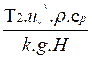
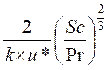
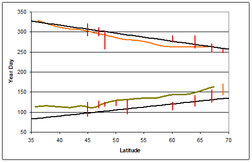
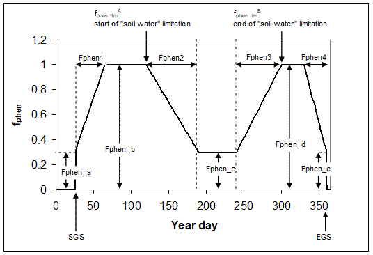
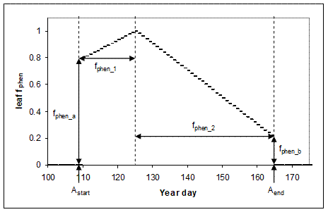
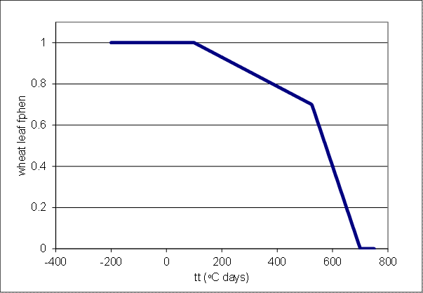
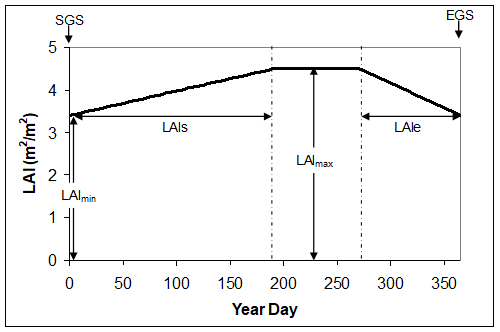

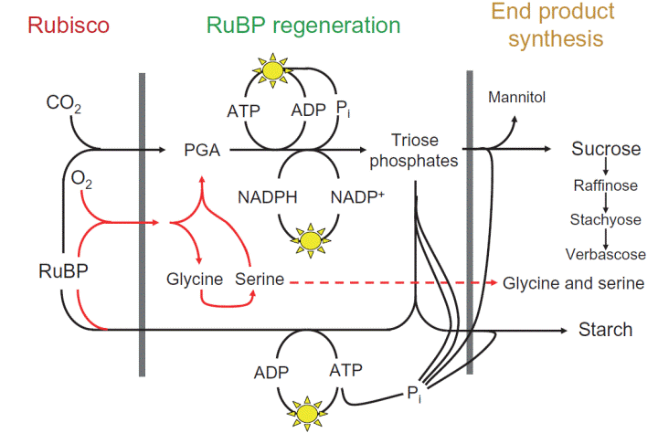
.. |image10| image:: general_files/image076.gif
   :width: 576px
   :height: 428px
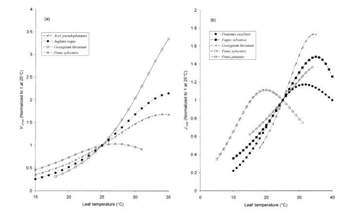

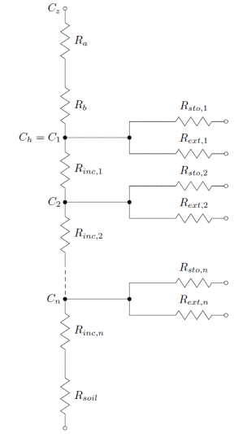
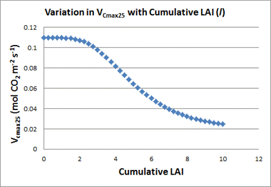
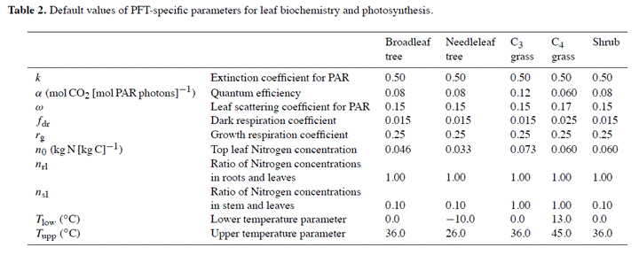
.. |image16| image:: general_files/image111.gif
   :width: 576px
   :height: 324px

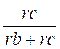

.. |image22| image:: general_files/image119.gif
   :width: 601px
   :height: 302px
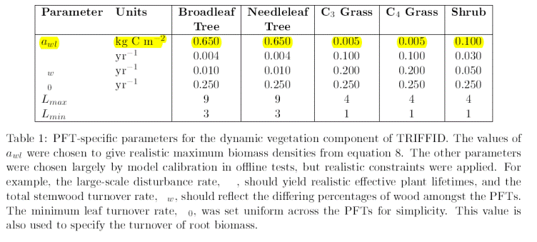
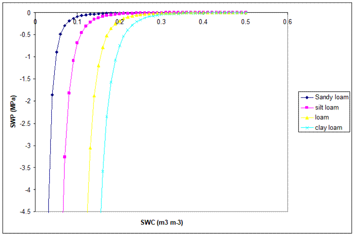
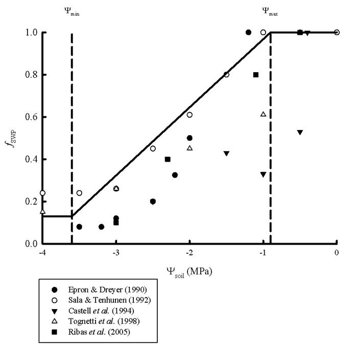
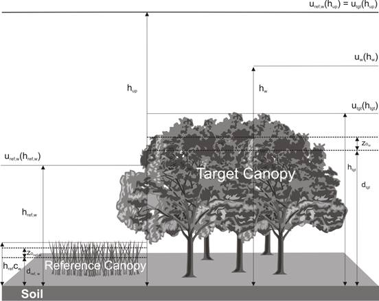
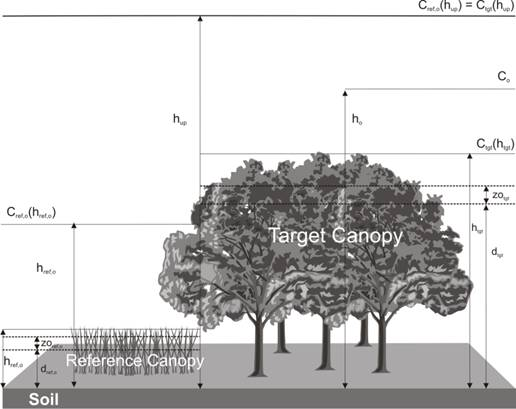

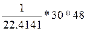
