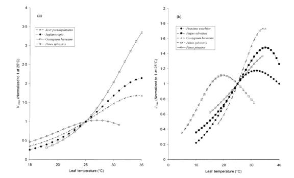
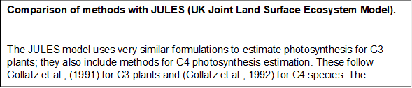
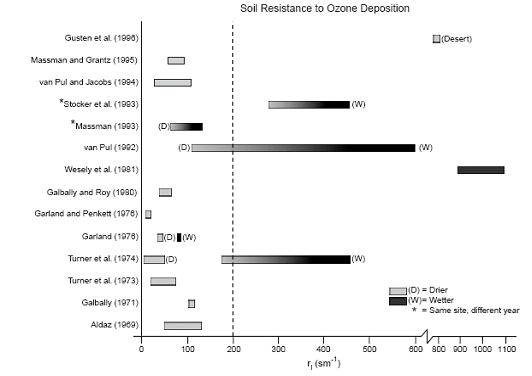

Parameterisation and Terms
==========================

Download the original word file  :download:`parameters.docx <parameters.docx>`

.. container:: WordSection1

   .. _Toc36708831:

   Parameterisation and Terms

    

   Contents

   `Parameterisation.1 <#toc50042583>`__

   `a)     Slope parameter m..3 <#toc50042584>`__

   `b)    Temperature response of Jmax and Vcmax4 <#toc50042585>`__

   `c)     Influencing factors.5 <#toc50042586>`__

   `Non-Stomatal resistance terms Rsoil, Rinc and Rext
   7 <#toc50042587>`__

   `External leaf-resistance (rext).7 <#toc50042588>`__

   `In-Canopy resistance (Rinc).8 <#toc50042589>`__

   `Soil resistance (Rsoil).8 <#toc50042590>`__

    

    

   .. _Toc50042583:

   \_

   .. _Toc36708848:

   \_

   .. _Ref371692306:

   \_

   .. rubric:: Parameterisation
      :name: parameterisation

   The parameters ΔH\ a and ΔH\ d (energy for activation or deactivation
   of the process) describe the shape of the response function. Their
   values are species dependent and have to be fitted to experimental
   laboratory datasets.Medlyn et al. (2002) give a review of
   experimentalvalues, (Leuning, 2002)assesses uncertainties
   incorporated by using mean valuesand (Wohlfahrt et al., 1999)
   quantifies the mistakes caused by a wrong parameterisation. The value
   of the two quantities at T=25°C, P\ T,ref  can be more easily
   determined via gas exchange measurements.Wullschleger, (1993) reviews
   several experimental datasets and reports a wide set of values for
   different species.\ `[LDE1] <#msocom-1>`__\ \  

    

    

   [this is the bit that needs most work…..perhaps start off with the
   Sharkey paper and the parameterisation details…and refer largely to
   this?...plus als add table of values from review literature….to be
   expanded as research is ongoing.]]

    

   As the first step, empirical relationships are used to calculate the
   maximum electron

   transport rate J\ max as a function of ambient irradiance PAR and
   T\ leaf. and further maximum rubisco activity is calculated from
   T\ leaf in a similar manner as a function of leaf temperature (add
   T\ leaf  calculation details). The actual shape of the response
   functions differs significantly between species (seeFigure 1) and has
   to be determined empirically for each species.

    

   |image0|

    

   .. _Ref369714341:

   \_Ref369714341

   .. _Ref369714345:

   Figure

   **3.** Temperatureresponse of J\ :sub:`max` and V\ :sub:`cmax` for
   different species. From (Medlyn et al., 2002b).
    

    

   In total the combined model incorporates a total of 18 parameters
   (see table1). Out of these, only the parameters determining the shape
   of the temperature response of the Michaelis Menten constants
   (equation2) , and the universal gas constant R can be assumed to be
   constant throughout all species and environmental conditions and can
   therefore be taken from the literature. The characteristic size of
   the leaf can be estimated independently via measurements or from
   published values. Q and a, the two parameters governing the light
   response curve of the photosystem are nearly alwaysassumed to be
   reasonably consistent amongst different species.

    

   It is significantly harder to estimate the remaining six parameters.
   Especially the values of m, J\ max and V\ cmax have turned out to
   differ significantly and to be quite sensitive to the model results.
   Approaches to parametrize these parameters and the complications
   arising from spatial and temporal differences of the parameters are
   discussed in the proceeding chapter.

   .. _Toc50042584:

   \_

   .. rubric:: a)   Slope parameter m
      :name: a-slope-parameter-m

   The parameter m, the slope of the BWB relationship (equation1), can
   be estimated relatively straightforward via linear regression of
   measured stomatal conductance against assimilation rate, humidity and
   CO2 concentration at leaf surface as described above (chapter2.1).
   Still, reported values have all been within a small range (5-15) so
   authors assume its value to be roughly consistent within species and
   use literature values.Leuning(1995) andKosugi et al.(2003) review a
   small set of estimated values for different species.

   Despite the strong sensitivity of the stomatal conductance model to
   this parameter

   (gsto is directly linearly dependent on m) there has been
   surprisingly little research on changes within one species (spatial
   or temporal).Falge et al.(1996) found a change in stand age, though
   their analysis is based solely on two different stands of differing
   age.Kosugi et al.(2003) found changes between developments stages of
   perennial trees during the growing season by a factor of two to
   three. AdditionallyKosugi et al.(2006) report significantly differing
   values of m during the phenological stage of leaf expansion, but no
   further change during the growing season (see alsoKosugi et
   al.(2003)).

    

   Still, throughout the literature, it is assumed that m is
   considerably constant amongst well watered plants. Due to the
   observation that plants under water stress control their stomatal
   openings via processes which are not included in the BWB approach
   (like signal transmission from the roots to the leaves), several
   authors try to incorporate the effects of soil water stress on the
   behavior of the stomatal conductance model.Tenhunen et al.(1990,1994)
   found that m is significantly smaller at the end of a prolonged
   drought period and hypothesized that plants alter their stomatal
   response to environmental conditions to reduce water loss during
   drought. Similar observations are reported byKosugi et al.(2006).Sala
   Serra & Tenhunen(1996) fitted values of m for several diurnal gas
   exchange courses during different regimes of soil water content and
   found a roughly linear relationship between xylem water potential and
   optimized values for m. Several others (Wang(1998),Van Wijk et
   al.(2000) andTuzet et al.(2003)) include scaling factors into the BWB
   model (equation1) which vary between 0 and 1 according to soil water
   content or soil water potential Y, which is technically equivalent to
   a direct modification of m. All response functions of these factors
   to Y are purely empirical but are similar in their general shape (a
   value of zero for very low Y and a gradual rise into a saturation in
   well watered regimes). Challenging these findings,Xu &
   Baldocchi(2003) found no significant alteration of m during periods
   of drought.

    

   .. _Toc50042585:

   \_

   .. rubric:: b)   Temperature response of Jmax and Vcmax
      :name: b-temperature-response-of-jmax-and-vcmax

   One major advantage of the Farquhar model is its detailed
   representation of the temperature response of photosynthesis. This
   response is mainly governed by the exact shape of the T response
   curve of Jmax and Vcmax (equation3). Additionally, the actual shape
   and scale of this function also crucially influences which process
   the model “choses“ to be rate limiting and therefore uses for the
   calculation of Anet . In the following chapter different methods to
   estimate these two parameters and the factors influencing their
   actual size are discussed.

    

   The most direct way to determine the temperature response of Jmax and
   Vcmax is to measure several response curves of Anet to a change in
   ambient CO2 ci at different temperatures (Medlyn et al.,2002a) under
   a regime of high irradiance. Under the assumption that Rubisco
   activity is limiting at low CO2 concentration, equations3,5and8are
   used to gain best fit estimates for Vcmax at given temperatures to
   low ci values. With these values set fixed, Jmax values are fitted
   with the same method to the whole ci response curves. Finally
   estimates for Ha, Hd and PT=25 for both parameters are calculated by
   fitting equation3to the data. This procedure yields parameter values
   which are relatively independent from the data which is most often
   later used for modeling, but the calculations are rather complicated
   and lengthy measurements directly at the leaf scale are necessary,
   which are often not available. One option, used byKosugi et
   al.(2003), is to use field measurements to determine Vcmax and use a
   often published constant ratio of Vcmax/Jmax (see, for
   example,Wullschleger(1993),Medlyn et al.(2002a) orLeuning(1997)) to
   estimate Jmax.

    

   The majority of authors who follow this approach only acquire
   Vcmax;25 and Jmax;25 in this manner and use published values for Ha
   and Hd (the two parameters influencing the shape of the rise and
   decline of the function). Concerning similar plants (like different
   trees for example (Medlyn et al.,2002a)), it seems to be justifiable
   to assume similar responses, butLeuning(2002) demonstrated that the
   response of these parameters can differ significantly between
   different types of plants, especially in the range of temperatures
   above 30°C.

    

   Some authors (for exampleNikolov et al.(1995) orFalge et al.(1996))
   simply fit the parameters to parts of measured time series of
   assimilation rates or stomatal conductance. This approach should be
   seen very critically due to the huge amount of parameters with a
   direct interdependency on best-fit-model results and the resulting
   high equifinality of estimated parameter values.

   .. _Toc50042586:

   \_

   .. rubric:: c)   Influencing factors
      :name: c-influencing-factors

   The first generation of A\ net-g\ sto models, published in the
   beginning of the 1990s, all described g\ sto for independent
   (temporal) point measurements at the scale of the single
   leaf.Leuning(1990,1995), for example, fitted their models to single
   day time-series of different leaves independently. As soon as the
   focus moved more towards canopy scale models or models on longer
   timescales like the whole growing season, it became clear that the
   optimized parameter values Jmax and Vcmax differ significantly not
   only between different species but also between different leaves of
   one single plant, or between positions within the canopy. Furthermore
   they change during plant development and are highly dependent on
   environmental conditions during growth of the plant. A wide array of
   studies have been conducted since to mathematically incorporate these
   effects into the model.

    

   **Growth temperature**\ As the Rubisco enzyme governs assimilation in
   all C3 plants its enzyme kinetics are assumed not to vary between
   different plantsBernacchi et al.(2001), and the same equations and
   parameter values are usually taken to calculate Vcmax. On the the
   contrary, the temperature response of Jmax has been found to vary
   significantly according to temperatures during growth as a result of
   the high potential of adaptation to its local environment of each
   individual plant.June et al.(2004) found a significant rise of the
   temperature optimum of the electron transport rate with higher growth
   temperature. In agreement with these findings,Bernacchi et al.(2003)
   found a slower rise of Jcmax with temperature in plants grown in
   warmer environments (tobacco was found not to reach an optimum in the
   measured range of temperatures below 40°C). In these experiments
   values of Jmax for a given temperature differed by a factor of 1.5-3
   between species grown at 15 and at 25°C.

    

   **Leaf position**\ Even in one single plant, variations in
   photosynthetic activity have been found in different leaves of this
   plant.Schultz(2003) measured gas exchange differences between sun and
   shade leaves of a grapevine stand and found up to two times higher
   values for Vcmax and Jmax of sun leaves, compared to leaves within
   the stand. Leaf nitrogen content varied in a similar manner and could
   explain parts of the variation. Similar findings are reported
   byWilson et al.(2000) who explain this effect by a rise in leaf
   thickness in upper parts of a tree canopy.

    

   **Seasonality**\ Based on the observation that the two key
   photosynthetic parameters Jmax and Vcmax change significantly during
   the growing season especially under field conditions, a large group
   of authors tried to find correlations between the two parameters and
   factors like leaf age, leaf nitrogen content, leaf position, ambient
   temperature or phenological development stage. During interpretation
   of these results it should be kept in mind that these parameters are
   not independent of each other and statistical correlation should not
   be mistaken as causal explanation. Leaf nitrogen content for example
   is strongly correlated with leaf age and position of the leaf
   (sun/shade leaf) and ambient temperature follows seasonal changes in
   most parts of the world.Medlyn et al.(2002b) found a roughly linear
   relationship between leaf nitrogen content and values for Vcmax and
   Jmax for a yearly time series of evergreen pine trees. At the same
   time nitrogen content was significantly lower during summer months
   due to nitrogen relocation during times of growth of new needles. Due
   to the seasonality of the temperature, the authors could as well
   construct a reciprocal linear relationship between values of the two
   parameters and ambient temperature. They argue that this could have
   been, on the one hand, caused by acclimatisation of the plant to
   ambient climate conditions which caused lower photosynthetic activity
   with higher temperatures.

    

   On the other hand changes could have also been induced by
   phenological changes in

   nitrogen content and photosynthetic activity. Similar results have
   been reported bySchultz(2003) for gravepine, byXu & Baldocchi(2003)
   for blue oak and byKosugi et al.(2003,2006) orWilson et al.(2001) for
   several evergreen trees. In general the seasonal pattern showed a
   sharp rise of photosynthetic activity and the size of Jmax and Vcmax
   during leaf development and a gradual decline during the summer
   months. In accordance to the findings ofMedlyn et al.(2002b),Xu &
   Baldocchi(2003) found the same pattern in leaf nitrogen content and
   reasoned that about 70% of the observed variation in Vcmax could be
   attributed to changing nitrogen content. In all studies both
   parameters changed by a factor between 2 and up to 4 during the
   growing season. In additionXu & Baldocchi(2003) reported a gradual
   decline in the ratio of Jmax/Vcmax, which is often assumed to be
   constant, from 2.5 at the beginning down to 1 at the end of the
   season.

    

   Motivated by all these findingsMueller et al.(2005) developed a
   modification of the model in which they varied Vcmax seasonally
   according to leaf nitrogen content in different leaves and during
   different stages of plant development. They based their calculations
   on a remarkable linear correlation (R2 = 0.97) they found between
   Vcmax;25 and nitrogen content.

    

    

   == ========
   \ 
   \  |image1|
   == ========

   .. _Toc50042587:

   \_

   .. _Toc36708854:

   \_

   .. rubric:: Non-Stomatal resistance terms Rsoil, Rinc and Rext [B2] 
      :name: non-stomatal-resistance-terms-rsoil-rinc-and-rext-b2

   .. _Toc50042588:

   \_

   .. _Toc36708855:

   \_

   .. rubric:: External leaf-resistance (rext)
      :name: external-leaf-resistance-rext

   A value for r\ ext has been chosen to keep consistency with the EMEP
   deposition modules “big-leaf” external resistance, Rext = 2500/SAI,
   where SAI is the surface area index (green + senescent LAI). Assuming
   that SAI can be simply scaled:

   r\ ext= 2500  (s m\ -1)

   There are two different methods for estimating stomatal resistance
   (or its inverse, stomatal conductance): i. the multiplicative model
   and ii: the coupled photosynthesis-stomatal conductance model. These
   are described in the following sections.

    

   The external plant resistance (R\ ext) represents the resistance of
   O\ 3 deposition to all the external parts of the plant, including
   cuticles, twig, bark, mosses, etc. Massman (2004) reviewed the
   literature detailing investigations of R\ ext. This revealed that
   R\ ext was dependent upon variables such as relative humidity, the
   presence of leaf hairs and dust on the leaf surface, the thickness of
   the leaf cuticle, the type and amount of epiphytes and
   micro-organisms present on the leaf surface, and the length of time
   over which the surface is exposed to O\ 3.

    

   In view of the uncertainties surrounding deposition rates to
   canopies, either dry or wet, we assign a single value to describe the
   external plant resistance to O\ 3 deposition, irrespective of the
   land-cover category and water status of the cuticles :-

    

   Rext = 2500 s/m. `[p3] <#msocom-3>`__ 

    

   For a canopy with LAI = 5, this corresponds to a conductance of 0.2
   cm/s.

    

   .. _Toc50042589:

   \_

   .. _Toc36708856:

   \_

   .. rubric:: In-Canopy resistance (Rinc)
      :name: in-canopy-resistance-rinc

   The in-canopy resistance (Rinc) determines the resistance to ozone
   transfer within the canopy and hence the amount of ozone available
   for deposition to the surface underlying the vegetation (e.g. bare
   soil or leaf litter). Since this deposition pathway is controlled by
   the transfer through the canopy, it depends on the density and height
   of the surface elements. To estimate R\ inc, a highly simplified
   parameterisation is used after that suggested by Erisman et al.
   (1994) based on the analysis of maize field data by van Pul & Jacobs
   (1994). The in-canopy resistance is estimated by eq.30.

    

   .. _Ref393791879:

   53

    

   Where b = 14 m\ -1 and is an empirical constant derived from data
   obtained in association with a maize canopy and h is the vegetation
   height taken as constant for each land-cover class. The LAI in the
   original formula has been replaced here by the SAI to account in a
   simple way for leaves, twigs, bark, etc…. It must be emphasised that
   this parameterisation is based on one data set for a maize field with
   a rather limited range of SAI h/u\ \*.

    

   .. _Toc50042590:

   \_

   .. _Toc36708857:

   \_

   .. rubric:: Soil resistance (Rsoil)
      :name: soil-resistance-rsoil

   For bare soil a large range of resistance values has been observed
   and these have been documented by Massman et al. (2004) as shown in
   Fig x. This variation appears to be strongly influenced by soil
   wetness with drier soils tending to have lower resistances, evidence
   also suggests that soil type is important (Galbally & Roy, 1980).
   Soil wetness is thought to limit O\ 3 deposition by reducing the
   effective reactive surface due to the low solubility of O\ 3 in
   water.

    

    

    

    

    

    

    

    

    

    

    

   **Fig. x. Summary of observationally based inferences for the
   intrinsic soil resistance (Rsoil) from Massman et al. (2004). The
   dotted line represents the DO\ 3\ SE model value of  200 s/m.**

   == ========
   \ 
   \  |image2|
   == ========

    
    

    

    

    

    

    

    

    

    

    

    

    

    

    

   However, given the variability in the published values for R\ soil
   the data seem too inconclusive for a detailed treatment of this
   deposition pathway and therefore single values for base values for
   R\ soil_Base for different land-cover types have been identified by
   Simpson et al. (2003) as described in Table x.

    

    

   +-----------------------------------+-----------------------------------+
   | **Land-cover type**               | **R\ soil_Base (s/m)**            |
   +-----------------------------------+-----------------------------------+
   | Forests (CF, DF, NL, BL)          | 200                               |
   +-----------------------------------+-----------------------------------+
   | Crops                             | 200                               |
   +-----------------------------------+-----------------------------------+
   | Moorland                          | 400                               |
   +-----------------------------------+-----------------------------------+
   | Grassland                         | 1000                              |
   +-----------------------------------+-----------------------------------+
   | Mediterranean Scrub               | 200                               |
   +-----------------------------------+-----------------------------------+

    

   These R\ soil_Base values are modified to account for low temperature
   and snow cover conditions according to :-

    

   Rsoil = Rsoil_Base + Rlow + 2000 dsnow

    

   Wheredsnow is represented bydsnow = 1 when snow is present and zero
   otherwise. R\ low is calculated as :-

    

   Rlow = 1000 e-(ToC+4)

    

   For the DO3SE interface is assumed that Rsoil = Rsoil_Base since it
   is unlikely that the information on snow cover will be available as
   input to the modelling.

    

   An R\ soil_Base value of 200 s/m corresponds to a conductance of 0.5
   cm/s, i.e. a potentially rather efficient deposition velocity.
   However, as discussed above, deposition is limited by the in-canopy
   resistance in series with R\ soil.

    

.. container:: WordSection2

   **Table (x)    Default deposition land-cover and species class
   parameters for f\ VPD (VPDmin and VPD\ max) and f\ SWP (SWPmin and
   SWP\ max) calculations**\ `[p4] <#msocom-4>`__\ \  \ **.**

    

   +--------+--------+--------+--------+--------+--------+--------+--------+
   | **Land | **Clim | **VPD\ | **VPD\ | **VPD\ | **SWP\ | **SWP\ | **Refe |
   | -cover | ate    |  max** |  min** |  crit* |  max** |  min** | rence* |
   | type & | region |        |        | *      |        |        | *      |
   | Specie | **     |        |        |        |        |        |        |
   | s**    |        |        |        |        |        |        |        |
   +--------+--------+--------+--------+--------+--------+--------+--------+
   | ** **  |        |        |        |        |        |        |        |
   +--------+--------+--------+--------+--------+--------+--------+--------+
   | **Coni |        | 0.6    | 3.3    | -      | -0.76  | -1.2   | Simpso |
   | ferous |        |        |        |        |        |        | n      |
   | Forest |        |        |        |        |        |        | et al. |
   | s      |        |        |        |        |        |        | (2003) |
   | (CF)** |        |        |        |        |        |        |        |
   +--------+--------+--------+--------+--------+--------+--------+--------+
   | Norway | Northe | 0.8    | 2.8    | -      | 15\*\  | 1\*    | UNECE  |
   | spruce | rn     |        |        |        | `[B5]  |        | (2004) |
   |        | Europe |        |        |        | <#msoc |        | ;      |
   | (Picea |        |        |        |        | om-5>` |        | Hansso |
   | abies) |        |        |        |        | __\ \  |        | n      |
   |        |        |        |        |        |        |        | et al. |
   |        |        |        |        |        |        |        | (in    |
   |        |        |        |        |        |        |        | prep); |
   |        |        |        |        |        |        |        | Zimmer |
   |        |        |        |        |        |        |        | man    |
   |        |        |        |        |        |        |        | et     |
   |        |        |        |        |        |        |        | al;Sel |
   |        |        |        |        |        |        |        | lin.   |
   |        |        |        |        |        |        |        | (1997) |
   |        |        |        |        |        |        |        | .      |
   |        |        |        |        |        |        |        | (1988) |
   |        |        |        |        |        |        |        | ;      |
   +--------+--------+--------+--------+--------+--------+--------+--------+
   | Scots  | Atlant | 0.6    | 2.8    | -      | -0.7   | -1.5   | UNECE  |
   | Pine   | ic     |        |        |        |        |        | (2004) |
   |        | Centra |        |        |        |        |        | ;      |
   | (Pinus | l      |        |        |        |        |        | Beadle |
   | sylves | Europe |        |        |        |        |        | et al. |
   | tris)  |        |        |        |        |        |        | (1985) |
   |        |        |        |        |        |        |        | ;      |
   |        |        |        |        |        |        |        | Sturm  |
   |        |        |        |        |        |        |        | et     |
   |        |        |        |        |        |        |        | al.(19 |
   |        |        |        |        |        |        |        | 98);   |
   |        |        |        |        |        |        |        | Ng.    |
   |        |        |        |        |        |        |        | (1979) |
   |        |        |        |        |        |        |        | ;      |
   |        |        |        |        |        |        |        | Whiteh |
   |        |        |        |        |        |        |        | ead    |
   |        |        |        |        |        |        |        | et al. |
   |        |        |        |        |        |        |        | (1984) |
   +--------+--------+--------+--------+--------+--------+--------+--------+
   | Norway | Contin | 0.5    | 3.0    | -      | -0.05  | -0.5   | UNECE  |
   | Spruce | ental  |        |        |        |        |        | (2004) |
   |        | Centra |        |        |        |        |        | ;Zweif |
   | (Picea | l      |        |        |        |        |        | el     |
   | abies) | Europe |        |        |        |        |        | et al. |
   |        |        |        |        |        |        |        | (2000, |
   |        |        |        |        |        |        |        | 2001,2 |
   |        |        |        |        |        |        |        | 002);  |
   |        |        |        |        |        |        |        | Braun  |
   |        |        |        |        |        |        |        | et al. |
   |        |        |        |        |        |        |        | (in    |
   |        |        |        |        |        |        |        | prep)  |
   |        |        |        |        |        |        |        |        |
   |        |        |        |        |        |        |        |        |
   +--------+--------+--------+--------+--------+--------+--------+--------+
   | **Deci |        | 0.93   | 3.4    | -      | -0.55  | -1.3   | Simpso |
   | duous  |        |        |        |        |        |        | n      |
   | Forest |        |        |        |        |        |        | et al. |
   | s**    |        |        |        |        |        |        | (2003) |
   |        |        |        |        |        |        |        |        |
   | **(DF) |        |        |        |        |        |        |        |
   | **     |        |        |        |        |        |        |        |
   +--------+--------+--------+--------+--------+--------+--------+--------+
   | **Gene | **All  | **1.0* | **3.25 |        | **f\ S | **f\ S | **UNEC |
   | ric    | Europe | *      | **     |        | WP\ =1 | WP\ =1 | E      |
   | Decidu | **     |        |        |        | **     | **     | (2004) |
   | ous**  |        |        |        |        |        |        | **     |
   +--------+--------+--------+--------+--------+--------+--------+--------+
   | Silver | Northe | 0.5    | 2.7    | -      | 15\ `[ | 1      | UNECE  |
   | birch  | rn     |        |        |        | B6] <# |        | (2004) |
   |        | Europe |        |        |        | msocom |        | ;      |
   | (Betul |        |        |        |        | -6>`__ |        | Uddlin |
   | a      |        |        |        |        | \ \    |        | g      |
   | pendul |        |        |        |        |        |        | et al. |
   | a)     |        |        |        |        |        |        | (2005a |
   |        |        |        |        |        |        |        | )      |
   +--------+--------+--------+--------+--------+--------+--------+--------+
   | Beech  | Atlant | 1.0    | 3.25   | -      | -0.8   | -1.5   | UNECE  |
   |        | ic     |        |        |        |        |        | (2004) |
   | (Fagus | Centra |        |        |        |        |        |        |
   | sylvat | l      |        |        |        |        |        |        |
   | ica)   | Europe |        |        |        |        |        |        |
   +--------+--------+--------+--------+--------+--------+--------+--------+
   | Oak    | Atlant | 1.0    | 3.25   | -      | -0.5   | -1.2   | UNECE  |
   |        | ic     |        |        |        |        |        | (2004) |
   | (Querc | Centra |        |        |        |        |        |        |
   | us     | l      |        |        |        |        |        |        |
   | petrae | Europe |        |        |        |        |        |        |
   | a      |        |        |        |        |        |        |        |
   | &      |        |        |        |        |        |        |        |
   | robur) |        |        |        |        |        |        |        |
   +--------+--------+--------+--------+--------+--------+--------+--------+
   | Beech  | Contin | 1.0    | 3.1    | -      | -0.05  | -1.25  | UNECE  |
   |        | ental  |        |        |        |        |        | (2004) |
   | (Fagus | Centra |        |        |        |        |        |        |
   | sylvat | l      |        |        |        |        |        |        |
   | ica)   | Europe |        |        |        |        |        |        |
   |        | an     |        |        |        |        |        |        |
   +--------+--------+--------+--------+--------+--------+--------+--------+
   | Beech  | Medite | 1.0    | 4.0    | -      | -2.0   | -3.8   | UNECE  |
   |        | rranea |        |        |        |        |        | (2004) |
   | (Fagus | n      |        |        |        |        |        |        |
   | sylvat | Europe |        |        |        |        |        |        |
   | ica)   |        |        |        |        |        |        |        |
   +--------+--------+--------+--------+--------+--------+--------+--------+
   | **Need |        | 0.4    | 1.6    | -      | -0.4   | -1.0   | Simpso |
   | leleaf |        |        |        |        |        |        | n      |
   | Forest |        |        |        |        |        |        | et al. |
   | s**    |        |        |        |        |        |        | (2003) |
   |        |        |        |        |        |        |        |        |
   | **(NF) |        |        |        |        |        |        |        |
   | **     |        |        |        |        |        |        |        |
   +--------+--------+--------+--------+--------+--------+--------+--------+
   | Aleppo | Medite | 1.0    | 3.2    | -      | -0.5   | -1.0   | UNECE  |
   | Pine   | rranea |        |        |        |        |        | (2004) |
   |        | n      |        |        |        |        |        | ;      |
   | *(Pinu | Europe |        |        |        |        |        | Gimeno |
   | s      |        |        |        |        |        |        | .      |
   | halepe |        |        |        |        |        |        | (pers. |
   | nsis)* |        |        |        |        |        |        | comm); |
   |        |        |        |        |        |        |        | Picon  |
   |        |        |        |        |        |        |        | et al  |
   |        |        |        |        |        |        |        | 2006.  |
   +--------+--------+--------+--------+--------+--------+--------+--------+
   | **Broa |        | 1.8    | 2.8    | -      | -1.1   | -2.8   | Simpso |
   | dleaf  |        |        |        |        |        |        | n      |
   | Forest |        |        |        |        |        |        | et al. |
   | s**    |        |        |        |        |        |        | (2003) |
   |        |        |        |        |        |        |        |        |
   | **(BF) |        |        |        |        |        |        |        |
   | **     |        |        |        |        |        |        |        |
   +--------+--------+--------+--------+--------+--------+--------+--------+
   | **Gene | **All  | **2.2* | **4.0* |        | **f\ S | **f\ S | **UNEC |
   | ric    | Europe | *      | *      |        | WP\ =1 | WP\ =1 | E      |
   | Evergr | **     |        |        |        | **     | **     | (2004) |
   | een    |        |        |        |        |        |        | **     |
   | Medite |        |        |        |        |        |        |        |
   | rranea |        |        |        |        |        |        |        |
   | n**    |        |        |        |        |        |        |        |
   +--------+--------+--------+--------+--------+--------+--------+--------+
   | Holm   | Medite | 2.2    | 4.0    | -      | -1.0   | -4.5   | UNECE  |
   | Oak    | rranea |        |        |        |        |        | (2004) |
   |        | n      |        |        |        |        |        | ;      |
   | (Querc | Europe |        |        |        |        |        | Sala & |
   | us     |        |        |        |        |        |        | Tenhun |
   | ilex)  |        |        |        |        |        |        | en.    |
   |        |        |        |        |        |        |        | (1994) |
   |        |        |        |        |        |        |        | ;Togne |
   |        |        |        |        |        |        |        | tti    |
   |        |        |        |        |        |        |        | et al. |
   |        |        |        |        |        |        |        | (1998) |
   |        |        |        |        |        |        |        | ;      |
   |        |        |        |        |        |        |        | Vitale |
   |        |        |        |        |        |        |        | et al. |
   |        |        |        |        |        |        |        | (2005) |
   |        |        |        |        |        |        |        | ;      |
   |        |        |        |        |        |        |        | Manes  |
   |        |        |        |        |        |        |        | et     |
   |        |        |        |        |        |        |        | al.(19 |
   |        |        |        |        |        |        |        | 97);   |
   |        |        |        |        |        |        |        | Elvira |
   |        |        |        |        |        |        |        | et al. |
   |        |        |        |        |        |        |        | (2005) |
   |        |        |        |        |        |        |        | ;      |
   |        |        |        |        |        |        |        | Bussot |
   |        |        |        |        |        |        |        | ti     |
   |        |        |        |        |        |        |        | &      |
   |        |        |        |        |        |        |        | Ferret |
   |        |        |        |        |        |        |        | ti.    |
   |        |        |        |        |        |        |        | (2007) |
   |        |        |        |        |        |        |        | ;      |
   |        |        |        |        |        |        |        | Alonso |
   |        |        |        |        |        |        |        | et al. |
   |        |        |        |        |        |        |        | (2007) |
   +--------+--------+--------+--------+--------+--------+--------+--------+
   | **Temp |        | 0.9    | 2.8    | -      | -0.3   | -1.1   | Simpso |
   | erate  |        |        |        |        |        |        | n      |
   | crops* |        |        |        |        |        |        | et al. |
   | *      |        |        |        |        |        |        | (2003) |
   |        |        |        |        |        |        |        |        |
   | **(TC) |        |        |        |        |        |        |        |
   | **     |        |        |        |        |        |        |        |
   +--------+--------+--------+--------+--------+--------+--------+--------+
   | **Gene | **All  | **1.2* | **3.2* | **8**  | **f\ S | **f\ S | **UNEC |
   | ric    | Europe | *      | *      |        | WP\ =1 | WP\ =1 | E      |
   | crop** | **     |        |        |        | **     | **     | (2004) |
   |        |        |        |        |        |        |        | **     |
   +--------+--------+--------+--------+--------+--------+--------+--------+
   | Wheat  | All    | 1.2    | 3.2    | 8      | -0.3   | -1.1   | UNECE  |
   |        | Europe |        |        |        |        |        | (2004) |
   | (Triti |        |        |        |        |        |        | ;Grute |
   | cum    |        |        |        |        |        |        | rs     |
   | aestiv |        |        |        |        |        |        | (1995) |
   | um)    |        |        |        |        |        |        | ;Weber |
   |        |        |        |        |        |        |        | (1996) |
   |        |        |        |        |        |        |        | ;      |
   |        |        |        |        |        |        |        | Bunce  |
   |        |        |        |        |        |        |        | (2000) |
   |        |        |        |        |        |        |        | ;      |
   |        |        |        |        |        |        |        | Teubne |
   |        |        |        |        |        |        |        | r      |
   |        |        |        |        |        |        |        | (1995) |
   |        |        |        |        |        |        |        | ;      |
   |        |        |        |        |        |        |        |        |
   |        |        |        |        |        |        |        | Gollan |
   |        |        |        |        |        |        |        | et     |
   |        |        |        |        |        |        |        | al.(19 |
   |        |        |        |        |        |        |        | 86);   |
   |        |        |        |        |        |        |        | Embers |
   |        |        |        |        |        |        |        | on     |
   |        |        |        |        |        |        |        | (1997) |
   |        |        |        |        |        |        |        | ;      |
   |        |        |        |        |        |        |        |        |
   |        |        |        |        |        |        |        |        |
   |        |        |        |        |        |        |        |        |
   |        |        |        |        |        |        |        |        |
   +--------+--------+--------+--------+--------+--------+--------+--------+
   | **Medi |        | 1.0    | 2.5    | -      | -0.11  | -0.8   | Simpso |
   | terran |        |        |        |        |        |        | n      |
   | ean    |        |        |        |        |        |        | et al. |
   | crops* |        |        |        |        |        |        | (2003) |
   | *      |        |        |        |        |        |        |        |
   |        |        |        |        |        |        |        |        |
   | **(MC) |        |        |        |        |        |        |        |
   | **     |        |        |        |        |        |        |        |
   +--------+--------+--------+--------+--------+--------+--------+--------+
   | Maize  | All    | 0.0    | 5.0    | -      | -0.12  | -0.8   | ICP    |
   |        | Europe |        |        |        |        |        | Vegeta |
   | *(Zea  |        |        |        |        |        |        | tion   |
   | mays)* |        |        |        |        |        |        | contra |
   |        |        |        |        |        |        |        | ct     |
   |        |        |        |        |        |        |        | report |
   |        |        |        |        |        |        |        | (2006) |
   |        |        |        |        |        |        |        | ;Olios |
   |        |        |        |        |        |        |        | o      |
   |        |        |        |        |        |        |        | et al. |
   |        |        |        |        |        |        |        | (1995) |
   |        |        |        |        |        |        |        | ;      |
   |        |        |        |        |        |        |        | Tardie |
   |        |        |        |        |        |        |        | u      |
   |        |        |        |        |        |        |        | et al. |
   |        |        |        |        |        |        |        | (1992a |
   |        |        |        |        |        |        |        | );     |
   |        |        |        |        |        |        |        | Davies |
   |        |        |        |        |        |        |        | et     |
   |        |        |        |        |        |        |        | al.(19 |
   |        |        |        |        |        |        |        | 94)    |
   |        |        |        |        |        |        |        |        |
   |        |        |        |        |        |        |        |        |
   +--------+--------+--------+--------+--------+--------+--------+--------+
   | Sunflo | All    | 1.2    | 4.0    | -      | -0.25  | -1.65  | ICP    |
   | wer    | Europe |        |        |        |        |        | Vegeta |
   |        |        |        |        |        |        |        | tion   |
   | *(Heli |        |        |        |        |        |        | contra |
   | anthus |        |        |        |        |        |        | ct     |
   | annuus |        |        |        |        |        |        | report |
   | )*     |        |        |        |        |        |        | (2006) |
   |        |        |        |        |        |        |        | ;Ward  |
   |        |        |        |        |        |        |        | &      |
   |        |        |        |        |        |        |        | Bunce  |
   |        |        |        |        |        |        |        | (1986) |
   |        |        |        |        |        |        |        | ;      |
   |        |        |        |        |        |        |        | Turner |
   |        |        |        |        |        |        |        | et al. |
   |        |        |        |        |        |        |        | (1984) |
   |        |        |        |        |        |        |        | ;      |
   |        |        |        |        |        |        |        | Tuebne |
   |        |        |        |        |        |        |        | r,     |
   |        |        |        |        |        |        |        | F.     |
   |        |        |        |        |        |        |        | (1985) |
   |        |        |        |        |        |        |        | ;      |
   |        |        |        |        |        |        |        | Quick  |
   |        |        |        |        |        |        |        | et al. |
   |        |        |        |        |        |        |        | (1992) |
   |        |        |        |        |        |        |        | ;      |
   |        |        |        |        |        |        |        | Hirasa |
   |        |        |        |        |        |        |        | wa     |
   |        |        |        |        |        |        |        | et al. |
   |        |        |        |        |        |        |        | (1992) |
   |        |        |        |        |        |        |        | ;      |
   |        |        |        |        |        |        |        | Fambri |
   |        |        |        |        |        |        |        | ni     |
   |        |        |        |        |        |        |        | et al. |
   |        |        |        |        |        |        |        | (1994) |
   |        |        |        |        |        |        |        | ;      |
   |        |        |        |        |        |        |        | Sadras |
   |        |        |        |        |        |        |        | et al. |
   |        |        |        |        |        |        |        | (1993) |
   |        |        |        |        |        |        |        | ;      |
   |        |        |        |        |        |        |        | Zhang  |
   |        |        |        |        |        |        |        | (1989) |
   |        |        |        |        |        |        |        | ;      |
   |        |        |        |        |        |        |        | Gollan |
   |        |        |        |        |        |        |        | et al. |
   |        |        |        |        |        |        |        | (1986) |
   |        |        |        |        |        |        |        | ;      |
   |        |        |        |        |        |        |        | Trifil |
   |        |        |        |        |        |        |        | o      |
   |        |        |        |        |        |        |        | et     |
   |        |        |        |        |        |        |        | al.(20 |
   |        |        |        |        |        |        |        | 03)    |
   |        |        |        |        |        |        |        |        |
   |        |        |        |        |        |        |        |        |
   +--------+--------+--------+--------+--------+--------+--------+--------+
   | Tomato | All    | 1.0    | 2.7    | -      | -0.3   | -1.0   | ICP    |
   |        | Europe |        |        |        |        |        | Vegeta |
   | *(Sola |        |        |        |        |        |        | tion   |
   | num    |        |        |        |        |        |        | contra |
   | lycope |        |        |        |        |        |        | ct     |
   | rsicum |        |        |        |        |        |        | report |
   | )*     |        |        |        |        |        |        | (2006) |
   |        |        |        |        |        |        |        | ;Boula |
   |        |        |        |        |        |        |        | rd     |
   |        |        |        |        |        |        |        | et al. |
   |        |        |        |        |        |        |        | (1991) |
   |        |        |        |        |        |        |        | ;      |
   |        |        |        |        |        |        |        | Bakker |
   |        |        |        |        |        |        |        | (1991) |
   |        |        |        |        |        |        |        | ;      |
   |        |        |        |        |        |        |        | Romero |
   |        |        |        |        |        |        |        | -Arand |
   |        |        |        |        |        |        |        | a      |
   |        |        |        |        |        |        |        | et     |
   |        |        |        |        |        |        |        | al.(20 |
   |        |        |        |        |        |        |        | 01);   |
   |        |        |        |        |        |        |        | Katerj |
   |        |        |        |        |        |        |        | i      |
   |        |        |        |        |        |        |        | et al. |
   |        |        |        |        |        |        |        | (1998) |
   |        |        |        |        |        |        |        | ;      |
   |        |        |        |        |        |        |        | Haupt- |
   |        |        |        |        |        |        |        | Hertin |
   |        |        |        |        |        |        |        | g      |
   |        |        |        |        |        |        |        | & Fock |
   |        |        |        |        |        |        |        | (2000) |
   |        |        |        |        |        |        |        | ;      |
   |        |        |        |        |        |        |        | Makela |
   |        |        |        |        |        |        |        | et al. |
   |        |        |        |        |        |        |        | (1998) |
   |        |        |        |        |        |        |        |        |
   |        |        |        |        |        |        |        |        |
   +--------+--------+--------+--------+--------+--------+--------+--------+
   | Grape  | All    | 1.6    | 6.2    | -      | -0.35  | -1.2   | ICP    |
   | vine   | Europe |        |        |        |        |        | Vegeta |
   |        |        |        |        |        |        |        | tion   |
   | *(Viti |        |        |        |        |        |        | contra |
   | s      |        |        |        |        |        |        | ct     |
   | vinife |        |        |        |        |        |        | report |
   | ra)*   |        |        |        |        |        |        | (2006) |
   |        |        |        |        |        |        |        | ;Corre |
   |        |        |        |        |        |        |        | ia     |
   |        |        |        |        |        |        |        | et     |
   |        |        |        |        |        |        |        | al.(19 |
   |        |        |        |        |        |        |        | 95);   |
   |        |        |        |        |        |        |        | During |
   |        |        |        |        |        |        |        | (1987) |
   |        |        |        |        |        |        |        | ;      |
   |        |        |        |        |        |        |        | Massma |
   |        |        |        |        |        |        |        | n      |
   |        |        |        |        |        |        |        | et al. |
   |        |        |        |        |        |        |        | (1994) |
   |        |        |        |        |        |        |        | ;      |
   |        |        |        |        |        |        |        | Jacobs |
   |        |        |        |        |        |        |        | et al. |
   |        |        |        |        |        |        |        | (1996) |
   |        |        |        |        |        |        |        | ;      |
   |        |        |        |        |        |        |        | Medran |
   |        |        |        |        |        |        |        | o      |
   |        |        |        |        |        |        |        | et al. |
   |        |        |        |        |        |        |        | (2003) |
   |        |        |        |        |        |        |        | ;      |
   |        |        |        |        |        |        |        | Schult |
   |        |        |        |        |        |        |        | z      |
   |        |        |        |        |        |        |        | (2003) |
   |        |        |        |        |        |        |        | ;Winkl |
   |        |        |        |        |        |        |        | e      |
   |        |        |        |        |        |        |        | &      |
   |        |        |        |        |        |        |        | Ramble |
   |        |        |        |        |        |        |        | (1993) |
   |        |        |        |        |        |        |        | ;      |
   |        |        |        |        |        |        |        | Quick  |
   |        |        |        |        |        |        |        | (1992) |
   |        |        |        |        |        |        |        |        |
   |        |        |        |        |        |        |        |        |
   +--------+--------+--------+--------+--------+--------+--------+--------+
   | **Root |        | 0.31   | 2.7    | -      | -0.44  | -1.0   | Simpso |
   | crops* |        |        |        |        |        |        | n      |
   | *      |        |        |        |        |        |        | et al. |
   |        |        |        |        |        |        |        | (2003) |
   | **(RC) |        |        |        |        |        |        |        |
   | **     |        |        |        |        |        |        |        |
   +--------+--------+--------+--------+--------+--------+--------+--------+
   | Potato | All    | 2.1    | 3.5    | 10     | -0.5   | -1.1   | UNECE  |
   |        | Europe |        |        |        |        |        | (2004) |
   | (Solan |        |        |        |        |        |        | ;      |
   | uum    |        |        |        |        |        |        | Tuebne |
   | tubero |        |        |        |        |        |        | r      |
   | sum)   |        |        |        |        |        |        | (1985) |
   |        |        |        |        |        |        |        | ;      |
   |        |        |        |        |        |        |        | Vos &  |
   |        |        |        |        |        |        |        | Oyarzu |
   |        |        |        |        |        |        |        | n      |
   |        |        |        |        |        |        |        | (1987) |
   +--------+--------+--------+--------+--------+--------+--------+--------+
   | **Semi |        | 88.8   | 99.9   | -      | -      | -      | Simpso |
   | -Natur |        |        |        |        |        |        | n      |
   | al     |        |        |        |        |        |        | et al. |
   | /      |        |        |        |        |        |        | (2003) |
   | Moorla |        |        |        |        |        |        |        |
   | nd**   |        |        |        |        |        |        |        |
   |        |        |        |        |        |        |        |        |
   | **(SNL |        |        |        |        |        |        |        |
   | )**    |        |        |        |        |        |        |        |
   +--------+--------+--------+--------+--------+--------+--------+--------+
   | **Gras |        | 1.3    | 3.0    | -      | -0.49  | -1.5   | Simpso |
   | sland* |        |        |        |        |        |        | n      |
   | *      |        |        |        |        |        |        | et al. |
   |        |        |        |        |        |        |        | (2003) |
   | **(GR) |        |        |        |        |        |        |        |
   | **     |        |        |        |        |        |        |        |
   +--------+--------+--------+--------+--------+--------+--------+--------+
   | Perenn | All    | 2.0    | 4.0    | -      | -0.49  | -1.5   | ICP    |
   | ial    | Europe |        |        |        |        |        | Vegeta |
   | rye    |        |        |        |        |        |        | tion   |
   | grass  |        |        |        |        |        |        | contra |
   |        |        |        |        |        |        |        | ct     |
   | (Loliu |        |        |        |        |        |        | report |
   | m      |        |        |        |        |        |        | (2009) |
   | perenn |        |        |        |        |        |        |        |
   | e)     |        |        |        |        |        |        |        |
   +--------+--------+--------+--------+--------+--------+--------+--------+
   | Clover | All    | 2.8    | 4.5    | -      | -0.49  | -1.5   | ICP    |
   |        | Europe |        |        |        |        |        | Vegeta |
   | (Trifo |        |        |        |        |        |        | tion   |
   | lium   |        |        |        |        |        |        | contra |
   | repens |        |        |        |        |        |        | ct     |
   | )      |        |        |        |        |        |        | report |
   |        |        |        |        |        |        |        | (2009) |
   |        |        |        |        |        |        |        |        |
   +--------+--------+--------+--------+--------+--------+--------+--------+
   | **Medi |        | 1.3    | 3.0    | -      | -1.1   | -3.1   | Simpso |
   | terran |        |        |        |        |        |        | n      |
   | ean    |        |        |        |        |        |        | et al. |
   | scrub* |        |        |        |        |        |        | (2003) |
   | *      |        |        |        |        |        |        |        |
   +--------+--------+--------+--------+--------+--------+--------+--------+

    

    

    

.. container::

   --------------

   .. container::

      .. container:: msocomtxt

         .. _msocom-1:

         \_msocom-1

          \ \ `[LDE1] <#msoanchor-1>`__\ Do we need to worry about this
         or assume constant values irrespective of species.

   .. container::

      .. container:: msocomtxt

         .. _msocom-2:

         \_msocom-2

          \ \ `[B2] <#msoanchor-2>`__\ Also include problems with NOx
         which may titrate O3 from the atmosphere

   .. container::

      .. container:: msocomtxt

         .. _msocom-3:

         \_msocom-3

          \ \ `[p3] <#msoanchor-3>`__\ I would be keen to add here a
         para on latest Rext research findings

   .. container::

      .. container:: msocomtxt

         .. _msocom-4:

         \_msocom-4

          \ \ `[p4] <#msoanchor-4>`__\ Check and update (add units) –
         task for Richard?

   .. container::

      .. container:: msocomtxt

         .. _msocom-5:

         \_msocom-5

          \ \ `[B5] <#msoanchor-5>`__\ % soil water content…prob need to
         convert to MPa for interface…

   .. container::

      .. container:: msocomtxt

         .. _msocom-6:

         \_msocom-6

          \ \ `[B6] <#msoanchor-6>`__\ % soil water content…prob need to
         convert to MPa for interface

