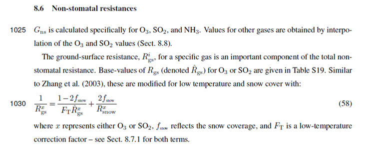
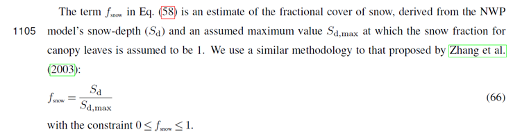
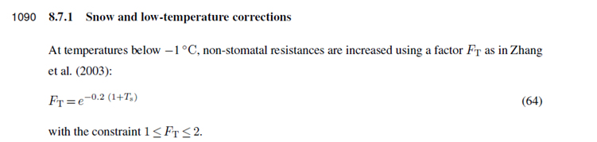
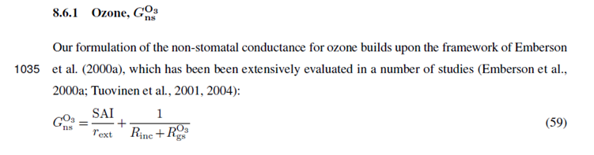
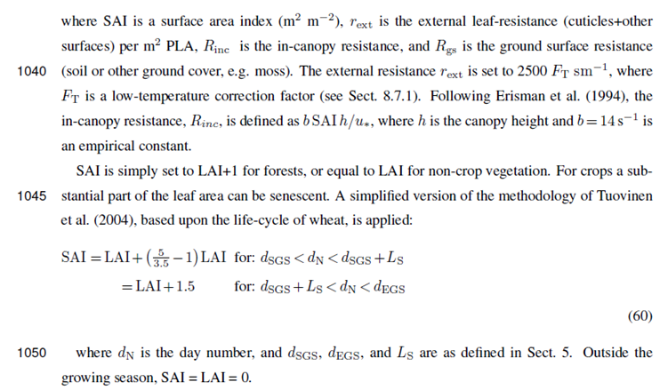
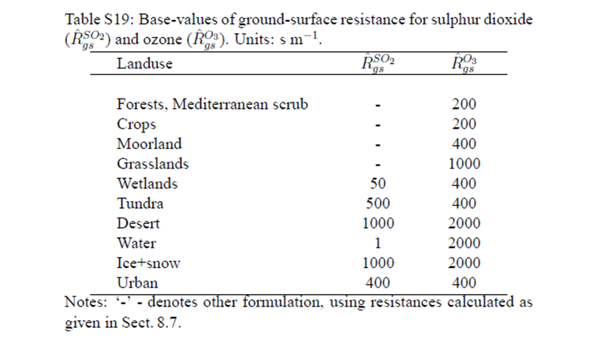

Soil Resistance(Rgs)
====================

Download the original word file  :download:`Ground.docx <Ground.docx>`

.. container:: WordSection1

   Soil Resistance(Rgs)

    

   Soil resistance is calculated based on ground cover.

   Contents

   `Model Flow..2 <#toc66182872>`__

   `Soil Resistance(Rgs)3 <#toc66182873>`__

   `References.6 <#toc66182874>`__

    

   | 

    

   .. _Toc66182872:

   \_

   .. rubric:: Model Flow
      :name: model-flow

   | TODO: Add model flow chart

   .. _Toc66182873:

   \_

   .. rubric:: Soil Resistance(Rgs)
      :name: soil-resistancergs-1

   Soil resistance is calculated from a land cover specific base
   resistance then modified with snow cover.\ `[SB1] <#msocom-1>`__\ \  

   This is because snow affects the Rsoil (or Rgs term) i.e. the ozone
   resistance of the soil term. You can find the equations for this in
   Eq 58 (and associated eqns) Simpson et al 2012 paper.

   Eq 58 describes the general formula for all gases.

   |image0|

   |image1|

   The Ft term is calculated from temperature as described in Eq
   64\ |image2|

    

   Eq 59 We can now modify our rext term with the Ft term.

   |image3|

   |image4|

   Here are the values for RO3gs for forests - 200s/m and for ice+snow -
   2000 (if latter needed?)

   This table S19 is also from the supplementary (also attached).

   |image5|

    

   .. _Toc66182874:

   \_

   .. rubric:: References
      :name: references

   ·       Simpson, David, et al. "The EMEP MSC-W chemical transport
   model–technical description." \ *Atmospheric Chemistry and
   Physics*\  12.16 (2012): 7825-7865.

.. container::

   --------------

   .. container::

      .. container:: msocomtxt

         .. _msocom-1:

         \_msocom-1

          \ \ `[SB1] <#msoanchor-1>`__\ Should add other ground cover
         too.

          

