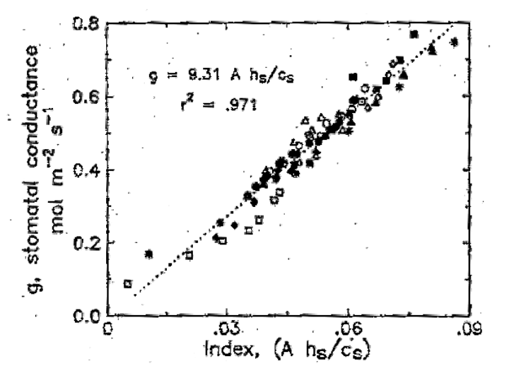
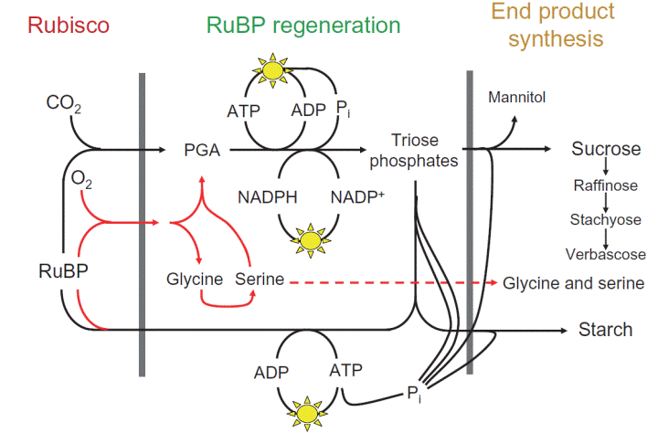
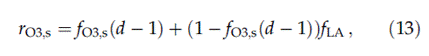
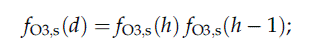
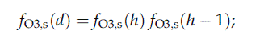
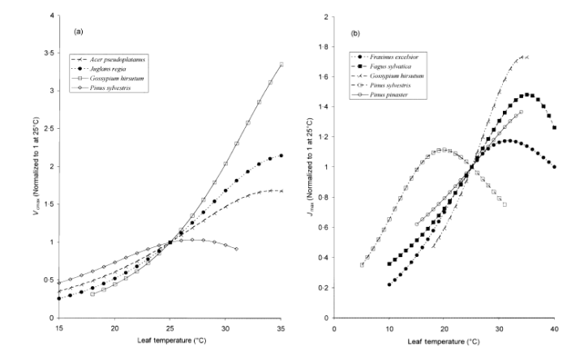
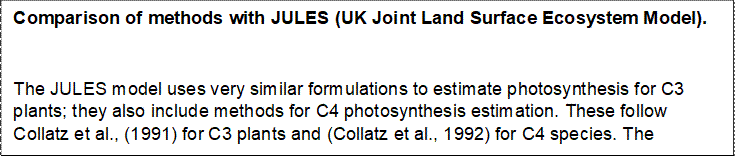

Photosynthesis based stomatal resistance (Rsto)
===============================================

Download the original word file  :download:`Photosynthesis.docx <Photosynthesis.docx>`

.. container:: WordSection1

   Photosynthesis based stomatal resistance (R:sub:`sto`)

   The objective of the coupled photosynthesis-stomatal conductance
   model (Anet-gsto) model is to quantify leaf or canopy scale g\ sto
   with the help of easily accessible environmental parameters such as
   air temperature (Tair), ambient CO\ 2 concentration (ca) and
   irradiance (PAR).  The A\ net-gsto  model consists of a combination
   of two separate models, whose main components are outlined below and
   include i. the empirical A\ net-gsto model that estimates
   g\ sto(Leuning, 1990)and ii. the mechanistic and biochemical Farquhar
   model(Farquhar et al., 1980)that estimates net carbon assimilation or
   net phostosynthesis (Anet).

   One of the first coupled\ *A\ net*\ -gstomodels was that published
   by(Leuning, 1990)though some other authors are often cited as the
   originating sources of the model (e.g.Collatz et al., 1991andHarley
   et al.,  1992). The models they apparently developed independently
   are essentially equivalent. The order of description of
   theA\ net-gstomodelling here follows the order in which they have to
   be computed.

   Contents

   `Default Configuration.1 <#toc50027130>`__

   `Model Flow..1 <#toc50027131>`__

   `Coupled photosynthesis-stomatal conductance (Anet-gsto)
   model.[2g]1 <#toc50027132>`__

   `Biochemical Farquhar model for net photosynthesis (Anet)[1 &
   2f]1 <#toc50027133>`__

   `Effects of ozone on Rubisco limited rate of photosynthesis (Ac)
   [2f]1 <#toc50027134>`__

   `Short-term ozone response [2a, 2b]1 <#toc50027135>`__

   `Cumulative daylight hour effect of ozone flux on Vcmax(fO3_d)
   [2b]1 <#toc50027136>`__

   `Calculation of incomplete recovery from ozone (rO3,s)
   [2b]1 <#toc50027137>`__

   `Long -term ozone response [2c, 2d]1 <#toc50027138>`__

   `Effect of leaf senescence on Ac (f_LS calculation)
   [2e]1 <#toc50027139>`__

   `4.2.1        Micrometeorological CO2 supply model
   [2h]1 <#toc50027140>`__

   `Advanced Configurations.1 <#toc50027141>`__

   `Canopy Level stomatal ozone flux for forest trees (Canopy
   AFst)[p8]1 <#toc50027142>`__

   `Parameterisation.1 <#toc50027143>`__

   `References.1 <#toc50027144>`__

    

    

   .. _Toc49267182:

   \_Toc49267182

   .. _Toc50027130:

    

   .. rubric:: Default Configuration
      :name: default-configuration

   .. _Toc49267183:

   \_

   .. _Toc50027131:

   \_

   .. rubric:: Model Flow
      :name: model-flow

   `media/photosynthesis_flow_chart.pdf <media/photosynthesis-flow-chart.pdf>`__

   ** **

   .. _Toc49267184:

    

   Figure 1: Calculate Photosynthesis Surface Resistance

   Figure 2: Calculate Stomatal Conductance (Ewert Model)

    

   Figure 3: Photosynthesis gsto upscaling

    

   .. _Toc50027132:

    

   .. rubric:: Coupled photosynthesis-stomatal conductance (Anet-gsto)
      model.[2g]
      :name: coupled-photosynthesis-stomatal-conductance-anet-gsto-model.2g

    

   Based on earlier observations of the constant ratio of g\ sto to net
   CO\ 2 assimilation rate (Anet),Ball et al. (1987)discovered an
   empirical linear relationship, which relates g\ sto to a combination
   of A\ net and environmental parameters, such as leaf surface relative
   humidity (Dh) and CO\ 2 concentration (Ca) as shown inFigure 2).

    

   Figure 4. The original BWB model. Stomatal conductance plotted
   against the BWB Index. From Ball et al. (1987).

   |image0|

   Leuning (1990 and1995)modified the originalBall et al.
   (1987)relationship so that the function used leaf surface CO\ 2
   concentration (Cs) less the CO\ 2 compensation point (Γ). and. They
   argued that the use of C\ s rather than C\ a (the CO\ 2 concentration
   outside the leaf boundary layer) eliminates complications arising
   from the transfer of CO\ 2 through the leaf boundary layer. The
   introduction of the Γ term allows the correct simulation of stomatal
   behaviour at low CO\ 2 concentrations which will tend towards zero as
   A\ net becomes minimal close to the Γ. The use of humidity deficit
   (Ds) rather than relative humidity (Dh) accounts for the fact that
   stomates respond to humidity deficit rather than surface relative
   humidity; this response is actually mediated through leaf
   transpiration (Etleaf) but the close link between Et\ leaf and D\ s
   means that the use of D\ s is appropriate for simulations.Leuning
   (1995)found that a hyperbolic function for D\ s provided an improved
   humidity response by accounting for the response of D\ s to leaf
   temperature. The resulting formulation they propose is given in eq.. 

    

                                                                                  33

    

   The parameter g\ 0 is interpreted as the minimal g\ sto(Leuning,
   1990)and is equivalent to the intercept of the regression which is
   sometimes greater, but often close, to zero. The parameter m is the
   so called composite sensitivity of g\ sto to assimilation rate and
   humidity/CO\ 2 concentration, can be obtained via a linear regression
   of g\ sto against experimental data from steady state gas exchange
   measurements. The value of m is surprisingly consistent amongst many
   different species, and ranges between 5 and 15(Kosugi et al.,
   2003)(if all quantities are in units consistent withBall et al.
   (1987)m is dimensionless). The parameter is the humidity deficit (or
   vapour pressure deficit, VPD) as which is reduced by a factor of
   two(Leuning et al., 1998). 

    

   Despite the empirical and non-mechanistic nature of this model it
   allows for the mathematical quantification of the key environmental
   feedbacks on stomatal behaviour: (1) Rising irradiance causes stomata
   to open (incorporated through the positive influence of radiation on
   A\ net); (2) Rising CO\ 2 causes stomata to close (incorporated
   through the negative influence of limited RuBP regeneration); (3) To
   minimize water loss, stomata close when the transpiration rate rises
   (incorporated through the response to leaf surface humidity deficit).

    

   However, caution has to be exercised concerning interpretation of the
   model. It allows for no mechanistic explanation or causal
   interpretation of the feedbacks between the different parameters
   (seeAphalo & Jarvis, (1993)for a discussion) and is, strictly
   speaking, only a statistical correlation.

   .. _Toc50027133:

   \_

   .. _Toc36708845:

   \_

   .. rubric:: Biochemical Farquhar model for net photosynthesis
      (Anet)[1 & 2f]
      :name: biochemical-farquhar-model-for-net-photosynthesis-anet1-2f

   The underlying assumption to Farquhars’s 1980 model is that,
   according to prevailing environmental conditions, either rubisco
   activity (Ac) or the regeneration of ribulose-1,5-bisphosphate (RuBP)
   which is limited by the rate of electron transport (Aj)  limits
   photosynthesis. Subsequent to Farquhar’s 1980 paper,Harley et al.
   (1992)identified a third limitation resulting from inadequate rate of
   transport of photosynthetic products (most commonly this is due to
   triose phosphate utilization) (Ap), this limit has now become
   standard in many models of A\ net (e.g.Sellers et al., 1996;Cox et
   al., 1999) and is included here.Taking these influences on
   photosynthesis into account A\ net is calculated by determination of
   the smaller of these theoretical CO\ 2 assimilation rates less the
   rate of dark respiration (Rd)(Farquhar et al., 1980)as in eq.1and as
   described inFigure 1.

    

   .. _Ref370897851:

   \_Ref370897851

                         
                                                              26
    

    

   .. _Ref371696252:

   Figure

   **5**\ Scheme showing some of the processes that affect
   photosynthetic rate. For each of the three panels, any process in
   that panel will cause the photosynthetic rate to vary with [CO2] in
   the same way. FromSharkey et al. (2007).
    

   |image1|

   Within the literature there are small variations in the precise
   methods to estimate Ac, Aj and Ap. One important application of our
   A\ net-gsto model is that it is to be made with empirical data
   collected at sites across Europe. This provides the opportunity to
   use empirical data to parametrise the key components of the model;
   however methods to perform this parameterisation should be consistent
   with these methods used to estimate A\ net. Therefore our model will
   follow the eqs. recently described bySharkey et al. (2007)since these
   are expected to represent both the most recent formulations as well
   as those that are consistent with the derivation of key parameters,
   described in more detail in section3. The potential rate of
   assimilation, limited only by Rubisco activity (Ac) is
   calculatedaccording to Sharkey et al. (2007) as in eq2.

    

   .. _Ref371676518:

   \_Ref371676518

                                                                    
            27
    

   Where V\ Cmax is the maximum rate of Rubisco activity, c\ i and O\ i
   are intercellular concentrations of CO\ 2 and O\ 2 respectively, K\ c
   and K\ o are the Michaelis-Menten coefficients of Rubisco for CO\ 2
   activity (in μmol mol\ -1) and O\ 2 (in mmol mol\ -1) , respectively,
   and Γ\* is the CO\ 2 compensation point in the absence of
   mitochondrial (dark) respiration and they all are calculates as:

    

   V\ Cmax\ :sub:`=` :sub:`temp_dep_inhibit(V_cmax_25, deg_to_kel(25),
   H_a_vcmax,`

   :sub:`                              H_d_vcmax, S_V_vcmax, Tleaf_K,
   R)`\ `[SB1] <#msocom-1>`__\ \  

    

    

    

   The potential rate of assimilation when RuBP regeneration is limiting
   is given in eq.3.

    

   .. _Ref371677285:

   \_Ref371677285

                                                                                           28
    

   Where J is the electron transport rate, the parameters a and b denote
   the electron requirements for the formation of NADPH and ATP
   respectively. The exact values differ slightly throughout the
   literature but are all close to a\ =4 and b\ =8  assuming four
   electrons per carboxylation and oxygenation(Sharkey et al.,
   2007).\ `[LDE2] <#msocom-2>`__\ \  J is related to incident
   photosynthetically active photon flux density (Q) where the light
   response of a plants photosystem first follows a linear rise with an
   increase in radiation Q until it reaches an area of saturation where
   the electron transport rate J approaches the maximum value of J\ max.
   Mathematically this is represented by the quadric relationship shown
   in eq.4afterLeuning (1990).

    

   .. _Ref371679300:

   \_Ref371679300

                                                                           29
    

   Where α is the quantum yield of electron transport, which determines
   the slope of the linear rise in the low irradiance regime, and Ø is
   the curvature of the light response curve normally acquired by
   experimentalfitting. The value of α was fixed at 0.3 mol electrons
   mol\ -1 photon, based on an average C3 photosynthetic quantum yield
   of 0.093and a leaf absorptance of 0.8 (cf.Medlyn et al., 2002). The
   value of Ø was taken to be 0.90 (Medlyn et al., 2002). These
   parameter values have only a slight effect on the estimated value of
   J\ max.

    

   Finally, the potential rate of assimilation when the utilization of
   triose phosphate is limiting assimilation (Ap) (i.e. when the
   chloroplast reactions have a higher capacity than the capacity of the
   leaf to use the products of the chloroplasts) is estimated rather
   simply by eq.5after(Collatz et al., 1991).

    

   .. _Ref371690790:

   \_Ref371690790

                                                                                         30
    

   The key parameters of the model J\ max and V\ Cmax, as well asthe
   parameters K\ c, K\ o andΓ*, all vary withtemperature(Medlyn et al.,
   2002). J\ max and V\ Cmax also vary between species, whilst K\ c,
   K\ o andΓ*are considered intrinsic properties of the Rubisco enzyme
   and therefore can be assumed constant between species(Harley et al.,
   1986). Due to the temperature effects on the Rubisco enzyme which
   catalyses the corresponding process, Γ\* is temperature dependent as
   well.

    

   The original model ofFarquhar et al. (1980)used a purely empirical
   polynomial from(Brooks & Farquhar, 1985)which approximated the
   temperature dependence of these different parameters, since then many
   studies have investigated these temperature dependencies more
   thoroughly, here we follow the rational ofMedlyn et al. (2002)who
   advised using the temperature relationships provided byBernacchi et
   al. (2001)who used an Arrhenius equation to describe the processes
   and based these functions on measurements made in vivo without
   disturbance of the leaf. The rate of dark respiration R\ d, Γ\* and
   the Michaelis-Menten constants for CO\ 2 and O\ 2 (Kc and K\ o)
   arecomputed using the standard formulations described in eq6and 7.

    

   .. _Ref371693934:

   \_Ref371693934

    
                                                                              31
    

    

    

   .. _Ref371694350:

   \_Ref371694350

                                                 32
    

   where *P* denotes the different quantities, Δ\ *H*  is the activation
   energy Δ\ *Hd* is the deactivation energy and Δ\ *S* is entropy for
   the processes, values for each process follow those given in
   Bernacchi et al. (2001).  In general this formula describes a normal
   Arrhenius equation modified to incorporate an inhibition term at high
   temperatures.

    

   In summary, the Farquhar model mathematically quantifies a detailed
   mechanistic understanding of the biochemical processes in the
   chloroplasts which govern photosynthesis. It allows for the
   estimation and calculation of the CO\ 2 assimilation rate as a
   function of leaf temperature, irradiance and internal CO\ 2
   concentration.

    

   .. _Toc49267185:

   \_

   .. _Toc50027134:

   \_

   .. rubric:: Effects of ozone on Rubisco limited rate of
      photosynthesis (Ac) [2f]
      :name: effects-of-ozone-on-rubisco-limited-rate-of-photosynthesis-ac-2f

    

   Effects of ozone on Rubisco limited rate of photosynthesis (Ac)
   calculated in the equation (27) is further estimated to see the
   impact of ozone under the assumption that Ac decreases 1) immediately
   at high ozone fluxes and 2) with enhanced leaf senescence due to
   cumulative ozone uptake. It is computed according to the approach
   used in Ewert’s model (Ewert & Porter 2000);

    

    

   Where ; V_cmax – maximum carboxylation velocity

                    c_i and O_i – intercellular CO\ 2  and O\ 2
   concentration

                    K_C and K_O – Rubisco Michaelis-Menten constant for
   CO\ 2  and O\ 2

                   -  CO2 compensation point in the absence of
   respiration

                    fO\ 3,s  -factor that accounts for daily hour effect
   of ozone flux on Vcmax at

                                 the end of the day

                    f_LS   -factor that accounts for the effect of leaf
   senescence on Ac

                                 

   .. rubric:: Calculating FST
      :name: calculating-fst

   TODO: COMPLETE THIS SECTION

    

   .. _Toc49267190:

   \_

   .. _Toc50027135:

   \_

   .. rubric:: Short-term ozone response [2a, 2b]
      :name: short-term-ozone-response-2a-2b

   Plants exposed to high doses of ozone for short-term have shown
   impact on Vcmax, whereas at low ozone doses plants can recover fully
   via repair system and detoxification without impacting the Vcmax.
   Therefore hourly short term ozone effect on Rubisco-limited
   photosynthesis and ozone uptake (fO3,s (h)=1, no effect and fO\ 3,s
   (h)=0, maximum effect) is calculated hourly as follows:

    

   fO\ 3,s (h) = 1
   ;                                                                    
   for f_st≤γ1 /γ2

   fO\ 3,s (h)= 1+γ1-γ2\* f_st                                          
        forγ1/γ2 < f_st<(1+γ1)/γ2

   fO\ 3,s (h) = 0
   ;                                                                    
   for f_st≥ (1+γ1)/γ2

    

   where; f_st is instantaneous ozone uptake andγ1(0.06) andγ2 (0.0045
   nmolm\ -2\ s\ -1)\ -1) are empirically determined coefficient
   representing the short-term damage coefficient. f_stwhich is computed
   in DO3SE model while taking into account O\ :sub:`3`\ deposition to
   the external leaf surface as well as the O\ 3 actually taken up
   through the stomates. Therefore, if  ozone conductance (Gsto_l) is 0,
   then f_st will also be 0 as ozone won’t be taken up by stomates if
   there is no conductance, whereas if Gsto_l>0  then Fst is calculated
   as follows;

   +-----------------------------------+-----------------------------------+
   |                                   |                                   |
   +-----------------------------------+-----------------------------------+
   |                                   | Fst =  O\ 3 \* (1/Rsto_l) \*      |
   |                                   | (leaf_r / (leaf_rb + leaf_r));    |
   |                                   |                                   |
   |                                   | leaf_rb = 1.3 \* 150 \*           |
   |                                   | sqrt(Lm/uh)                       |
   +-----------------------------------+-----------------------------------+
   |                                   | leaf_r = 1.0 / ((1.0/Rsto_l) +    |
   |                                   | (1.0/Rext))                       |
   +-----------------------------------+-----------------------------------+
   |                                   |                                   |
   +-----------------------------------+-----------------------------------+

   Where; Gsto_l    - single leaf ozone conductance(mmol/m3)

                  leaf_rb   - leaf boundary layer resistance (s/m)

                  Lm          - leaf dimension (m)

                  Uh           - windspeed at canopy (m/s)

                  leaf_r      - leaf resistance (s/m)

                  Rsto_l     - single leaf cuticle resistance (s/m)

                  Rext        - external plant cuticle resistance (s/m)

                  O\ 3            - Ozone concentration  (nmol/m3)

    

    

   .. _Toc49267191:

   \_

   .. _Toc50027136:

   \_

   .. rubric:: Cumulative daylight hour effect of ozone flux on
      Vcmax(fO3_d) [2b]
      :name: cumulative-daylight-hour-effect-of-ozone-flux-on-vcmaxfo3_d-2b

   Factor that accounts for the cumulative daylight hour effect of ozone
   flux on Vcmax(fO\ 3_d)  is computed as;

   fO\ 3_d = fO\ 3_S\ (h)\*
   rO\ 3,s                                                        (If h
   is not a daylight hour)

   fO\ 3_d = fO\ 3_S\ (h)\* previous hour fO\ 3,s\ (d_1)  (if h is a
   daylight hour)

   where; fO\ 3,s\ (d_1) is effect of ozone on Vcmax of first daylight
   hour which is calculated based on the assumption that recovery from
   ozone happens only during night hours (here assumed when PAR>50 W
   m\ :sup:`2­`\ ), otherwise the value of fO3,s(d_1) is same as the
   cumulative daylight hour effect of ozone flux on Vcmax (fO3_d) ,
   expressed as;

   fO3,s (d_1) = fO3,s (h) \* rO\ 3,s         for PAR<=50;  and

   fO3,s (d_1) = fO3_d                           for PAR>50

    

    

   .. _Toc49267192:

   \_

   .. _Toc50027137:

   \_

   .. rubric:: Calculation of incomplete recovery from ozone (rO3,s)
      [2b]
      :name: calculation-of-incomplete-recovery-from-ozone-ro3s-2b

   rO\ 3 depends on the leaf age (f_LA) and the factor which accounts
   for previous day ozone effect on Vcmax (fO3,s) at the end of the day,
   calculated as; 

   |image2|

   Note we use f\ :sub:`O­3(d-1)­­` as the daily accumulated damage
   factor from the previous hour.

    

   We have 2 methods to calculate. The first assumes recovery only at
   hour 0 (As in Ewert & Porter 2000). The second assumes recovery when
   there is no daylight.

    

   .. rubric:: fO3d Method A – Single hour recovery (Ewert & Porter
      2000)
      :name: fo3d-method-a-single-hour-recovery-ewert-porter-2000

   where; Ozone effect on Vcmax at the end of the day (fO3,s) is
   computed as follows;

   |image3|

   when hour = 2..24;

   otherwise   

    

   .. rubric:: fO3d Method B – Full Night recovery
      :name: fo3d-method-b-full-night-recovery

   where; Ozone effect on Vcmax at the end of the day (fO3,s) is
   computed as follows;

   |image4|

   when PAR=0;

   otherwise ;

    

   and f_LA  is the factor which accounts for leaf age and is calculated
   over the life span of leaf (t_l). Ewert model assumed that young leaf
   recover fully from ozone damage and didn’t take into account
   irreversible injury at high ozone concentration, therefore f_LA is
   calculated as :

    

   f_LA= 1;                                                         
   for    a\ l ≤ t\ l,em

   f_LA= 1- (al - t\ l,em )/ t\ l,ma ;                          for   
   t\ l,em\ < a\ l < t\ l

   f_LA = 0;                                                        
   for    al ≥tl

    

   where f_LA – factor which accounts for leaf age

                 a\ l –        age of leaf

   :sub:`                    `\ t\ l,em –    thermal time interval of
   emerging leaf

                 t\ l,ma  -    thermal time interval of mature leaf

   :sub:`                    `\ t\ l -          total life span of leaf

    

   .. _Toc49267193:

   \_

   .. _Toc50027138:

   \_

   .. rubric:: Long -term ozone response [2c, 2d]
      :name: long--term-ozone-response-2c-2d

   Long-term accumulation of low doses of ozone degrades rubisco enzyme
   and triggers senescence in mature leaves at early age, which can be
   explained with the linear relationship between the life-span of a
   mature leaf and accumulated ozone consumption;

                  t\ l,ma = (tl,ep + tl,se)*fO3,l

   and tl,se also changes with tl,ma which is given by

    tl,se = 0.33 tl,ma

   Where; t\ l,ma  -    thermal time interval of mature leaf

                  t\ l,se    -       thermal time interval of senescence
   leaf

                  t\ l,ep   -       thermal time interval of expanded
   leaf

                  fO\ 3,l -  factor which accounts for long term ozone
   impact on Vcmax

   We also calculate the tl_ep value.

                  t\ l,ep = t\ l,ma +  tl,se   

   We recalculate t_lma, t_lse and t_lep with the impact of ozone
   (fO3_l). These new values are then used for calculating the new
   senescence factor below.

   Factor which accounts for long term ozone impact (fO3,l )is
   calculated using the i) empiricalfactor γ3=0.5(µmolm-2)-1 (which
   describes reduction in life-time of a mature leaf per unit
   accumulatedozone) and ii) integrated ozone uptake value which changes
   with respect to age of the leaf which gives integrated f_st from the
   beginning to the total life span of the leaf and represented as
   follows:

   .. _Toc49267194:

   \_

   .. _Toc50027139:

   \_

   .. rubric:: Effect of leaf senescence on Ac (f_LS calculation) [2e]
      :name: effect-of-leaf-senescence-on-ac-f_ls-calculation-2e

    

   Factor which accounts for effect of leaf senescence on A_c (fLS) is
   calculated as

   fLS =
   1;                                                                        
   for a\ l ≤ t\ l,em + t\ l,epO3

   | for
   |                                   for
      tl,em\ +t\ l,epO3\ <al\ <tlO3

   fLS= 0;                                   
                                         for a\ l≥ t\ lO3

    This is based on Ewert equation below\ `[SB3] <#msocom-3>`__\ \  :

                                                

    

    

   where; a\ l        -       age of  leaf (°Cday)

                 t\ lO3     -        \ life span of leaf after ozone
   damage

                 t\ l,ma   -    thermal time interval of mature leaf

                 t\ l,seO3     -       thermal time interval of
   senescence leaf after ozone damage

                 t\ l,epO3    -       thermal time interval of expanded
   leaf after ozone damage

                 t\ l,em   -      thermal time interval of emerging
   leaf\ `[SB4] <#msocom-4>`__\ \  

    

   .. _Toc50027140:

   \_

   .. rubric:: 4.2.1      Micrometeorological CO2 supply model [2h]
      :name: micrometeorological-co2-supply-model-2h

   It becomes clear that to calculate g\ sto, the value of A\ net is
   needed and for the calculation of A\ net  it is necessary to know
   g\ sto.Baldocchi(1994) found an analytical solution for parts of the
   problem, andSu et al.(1996) andNikolov et al.(1995) developed
   solutions for other sets of coupled equations. Still the vast
   majority of published models had to use numerical loops to
   iteratively guess values for different parameters that satisfy the
   different equations as the available analytic solutions are limited
   to certain sets of given environmental quantities and model
   formulations. An additional cross dependency is added to the model
   when T\ leaf values have to be computed from T\ air, as transpiration
   is a main driving force for leaf surface temperature control.
   Therefore g\ sto is needed to calculate T\ leaf , which can only be
   calculated when A\ net is known and for this, again, T\ leaf is
   needed (seeNikolov et al.(1995) for a
   solution\ `[LDE5] <#msocom-5>`__\ \  ).

    

   To facilitate the calculation of the internal (Ci) and surface (Cs)
   CO\ 2 from ambient CO\ 2 concentrations (Ca) a boundary layer model
   equivalent to that used for calculating the exchange of O\ 3 across
   the same physical pathway is used. C\ s is calculated as a function
   of  C\ a, A\ net and g\ b; C\ i also requires an estimate of gsto.
   These equations also follow those described invon Caemmerer &
   Farquhar (1981)and are as described in eq. and.

    

                                                                                                     34

    

                                                                                     35

    

   The g\ b and g\ sto conductance values are for water vapour and
   therefore eqs. and  use the factors 1.37 and 1.6 (which are the
   ratios of the diffusivity of CO\ 2 and water vapour in semi turbulent
   air and still air respectively; the former value equates to 1.6\ 2/3
   and results from the Pohlhausen analysis of mass transfer from a
   plate in laminar parallel flows (Kays, 1966)). See also2.3.2for
   methods on how to estimate gb, the values used here are rounded up.

    

    

    

    

   Finally, the leaf surface humidity deficit D\ s also has to be
   calculated. This relies on estimates of leaf temperature and standard
   equations to convert relative humidity into leaf to air vapour
   pressure deficits (humidity deficit). EXPLAIN HOW WE CLACULATE LEAF
   ToC…..

    

    

     are similar to those used for ambient air humidity (seeNikolov et
   al. (1995)).\ `[LDE6] <#msocom-6>`__\ \  

    

    (19)

    

   where ei is the water-vapor pressure in the intercellular air space
   of the leaf, es(T\ leaf) is the saturation vapor pressure at leaf
   temperature and ea is the vapor pressure in the ambient air (all in
   Pa). This implies that the air inside the leaf boundary layer is at
   leaf temperature. In the case of a wet leaf, Eq. 20 still holds
   (assuming that the CO\ 2 exchange through stomatal pores is not
   significantly affected by water droplets residing on the leaf
   surface), but then Eq. 19 does not apply because the air next to a
   wet surface is normally vapor-saturated and, therefore, h\ s = 1.

    

   ** \/\/\/\/\/\/Not Checked \\/\/\/\/\/\/**

   .. _Toc49267195:

   \_

   .. _Toc50027141:

   \_

   .. rubric:: Advanced Configurations
      :name: advanced-configurations

   .. _Toc50027142:

   \_

   .. _Toc49267196:

   \_

   .. _Toc36708862:

   \_

   .. _msoanchor-8:

   \_

   .. rubric:: Canopy Level stomatal ozone flux for forest trees (Canopy
      AFst)[p8] 
      :name: canopy-level-stomatal-ozone-flux-for-forest-trees-canopy-afstp8

   AF\ st based risk assessments for forest trees might be improved by
   estimating whole-canopy rather than leaf-level stomatal flux. This is
   due to the fact that whole tree sensitivity to ozone may not be
   adequately represented through the calculation of uptake by only the
   sunlit leaves of the upper canopy; rather the uptake of sun and shade
   leaves of the entire canopy may have to be considered. As such, here
   we define provisional methods to estimate canopy stomatal flux
   (canopy AF\ st). Since these methods are only provisional they are
   only recommended to be used to provide comparisons with leaf level
   AF\ st estimates to give an indication of whether the geographical
   distribution of ozone risk to forest trees may be altered when using
   canopy vs. leaf level fluxes. For comparative purposes, leaf level
   stomatal ozone fluxes should be estimated without the use of the
   threshold (Y) since there is evidence of that detoxification capacity
   may change with age dependant changes in leaf/needle morphology (e.g.
   Wieser et al. 2002).

    

   However, measurement data suggest that a more appropriate division of
   leaf and needle populations within a canopy would be made according
   to leaf/needle morphology (i.e. sun and shade leaves/needles). This
   is supported by data which shows shade needles to have significantly
   lowerg\ max(ca. 70%) compared to sun needles. Based on data from
   Schulze et al. (1977) a simple 60:40 (sun:shade) split is suggested,
   applicable all year round, for provisional modelling of canopy
   AF\ st. It is noted that these proportions are likely dependent on
   tree type, stand density and other factors, and efforts should be
   targeted in the future to refining these canopy fractions as new data
   become available.

    

   The incorporation of leaf/needle morphology in estimates of canopy
   stomatal flux would improve methods used to scale up from the leaf to
   the canopy for both coniferous and deciduous forests. A simple method
   described belowassumes that sun and shade leaves/needles are evenly
   distributed over the tree canopy.

    

   g\ max\_shade = 0.6 \* g\ max\ \_sun

                                                                                                                          
   [2]

   Canopy g\ sto =0.6 \* g\ max\ \_sun + 0.4 \* g\ max\ \_shade

    

   which can be simplified, assuming a60:40 (sun:shade) splitto :-

    

   g\ max\ \_canopy = 0.84 \*
   g\ max\ \_sun                                                              
   [3]

    

   The estimation of forest tree canopy stomatal ozone flux would be
   made using [3] in combination with existing up-scaling methods in the
   DO\ 3\ SE dry deposition model.  These methods use standard
   algorithms to define light extinction with canopy depth to estimate
   the fraction of- and irradiance to- sunlit and shaded leaves within
   the canopy (e.g. Emberson et al. 2000). Resultingf\ lightvalues for
   both sunlit and shaded fractions are then scaled to the canopy level
   using an estimate ofLAI; hence definition of this parameter is
   crucial in canopy level stomatal ozone flux estimates. Values
   forLAIfor each “Real” species are given by climate region in the
   parameterisation table provided in the following sections. Further
   details of the up-scaling methods used can be found in Simpson et al.
   (2003).

    

   In the future methods that define theLAIfractions of sun and shade
   leaves/needles with canopy depth can be combined with estimates of
   sunlit and shaded fractions of the canopy to refine these up-scaling
   methods. However, the increased complexity of these methods would
   warrant larger datasets with which to parameterise the fractional
   distribution of leaf/needle morphologies within the canopy and hence
   will not be considered here.

    

   ** /\/\/\/\/\/\/\/\/\\ NOT CHECKED /\/\/\/\/\/\/\/\/\/**

    

    

   ** \/\/\/\/\/\/\/\/\\ NOT CHECKED /\/\/\/\/\/\/\/\/\/**

   .. _Ref371692306:

   \_

   .. _Toc36708848:

   \_

   .. _Toc50027143:

   \_

   .. rubric:: Parameterisation
      :name: parameterisation

   The parameters ΔH\ a and ΔH\ d (energy for activation or deactivation
   of the process) describe the shape of the response function. Their
   values are species dependent and have to be fitted to experimental
   laboratory datasets.Medlyn et al. (2002) give a review of
   experimentalvalues, (Leuning, 2002)assesses uncertainties
   incorporated by using mean valuesand (Wohlfahrt et al., 1999)
   quantifies the mistakes caused by a wrong parameterisation. The value
   of the two quantities at T=25°C, P\ T,ref  can be more easily
   determined via gas exchange measurements.Wullschleger, (1993) reviews
   several experimental datasets and reports a wide set of values for
   different species.\ `[LDE7] <#msocom-7>`__\ \  

    

    

   [this is the bit that needs most work…..perhaps start off with the
   Sharkey paper and the parameterisation details…and refer largely to
   this?...plus als add table of values from review literature….to be
   expanded as research is ongoing.]]

    

   As the first step, empirical relationships are used to calculate the
   maximum electron

   transport rate J\ max as a function of ambient irradiance PAR and
   T\ leaf. and further maximum rubisco activity is calculated from
   T\ leaf in a similar manner as a function of leaf temperature (add
   T\ leaf  calculation details). The actual shape of the response
   functions differs significantly between species (seeFigure 1) and has
   to be determined empirically for each species.

    

   |image5|

    

   .. _Ref369714341:

   \_Ref369714341

   .. _Ref369714345:

   Figure

   **6.** Temperatureresponse of J\ :sub:`max` and V\ :sub:`cmax` for
   different species. From (Medlyn et al., 2002b).
    

    

   In total the combined model incorporates a total of 18 parameters
   (see table1). Out of these, only the parameters determining the shape
   of the temperature response of the Michaelis Menten constants
   (equation2) , and the universal gas constant R can be assumed to be
   constant throughout all species and environmental conditions and can
   therefore be taken from the literature. The characteristic size of
   the leaf can be estimated independently via measurements or from
   published values. Q and a, the two parameters governing the light
   response curve of the photosystem are nearly alwaysassumed to be
   reasonably consistent amongst different species.

    

   It is significantly harder to estimate the remaining six parameters.
   Especially the values of m, J\ max and V\ cmax have turned out to
   differ significantly and to be quite sensitive to the model results.
   Approaches to parametrize these parameters and the complications
   arising from spatial and temporal differences of the parameters are
   discussed in the proceeding chapter.

   .. rubric:: a.     Slope parameter m
      :name: a.-slope-parameter-m

   The parameter m, the slope of the BWB relationship (equation1), can
   be estimated relatively straightforward via linear regression of
   measured stomatal conductance against assimilation rate, humidity and
   CO2 concentration at leaf surface as described above (chapter2.1).
   Still, reported values have all been within a small range (5-15) so
   authors assume its value to be roughly consistent within species and
   use literature values.Leuning(1995) andKosugi et al.(2003) review a
   small set of estimated values for different species.

   Despite the strong sensitivity of the stomatal conductance model to
   this parameter

   (gsto is directly linearly dependent on m) there has been
   surprisingly little research on changes within one species (spatial
   or temporal).Falge et al.(1996) found a change in stand age, though
   their analysis is based solely on two different stands of differing
   age.Kosugi et al.(2003) found changes between developments stages of
   perennial trees during the growing season by a factor of two to
   three. AdditionallyKosugi et al.(2006) report significantly differing
   values of m during the phenological stage of leaf expansion, but no
   further change during the growing season (see alsoKosugi et
   al.(2003)).

    

   Still, throughout the literature, it is assumed that m is
   considerably constant amongst well watered plants. Due to the
   observation that plants under water stress control their stomatal
   openings via processes which are not included in the BWB approach
   (like signal transmission from the roots to the leaves), several
   authors try to incorporate the effects of soil water stress on the
   behavior of the stomatal conductance model.Tenhunen et al.(1990,1994)
   found that m is significantly smaller at the end of a prolonged
   drought period and hypothesized that plants alter their stomatal
   response to environmental conditions to reduce water loss during
   drought. Similar observations are reported byKosugi et al.(2006).Sala
   Serra & Tenhunen(1996) fitted values of m for several diurnal gas
   exchange courses during different regimes of soil water content and
   found a roughly linear relationship between xylem water potential and
   optimized values for m. Several others (Wang(1998),Van Wijk et
   al.(2000) andTuzet et al.(2003)) include scaling factors into the BWB
   model (equation1) which vary between 0 and 1 according to soil water
   content or soil water potential Y, which is technically equivalent to
   a direct modification of m. All response functions of these factors
   to Y are purely empirical but are similar in their general shape (a
   value of zero for very low Y and a gradual rise into a saturation in
   well watered regimes). Challenging these findings,Xu &
   Baldocchi(2003) found no significant alteration of m during periods
   of drought.

    

   .. rubric:: b.     Temperature response of Jmax and Vcmax
      :name: b.-temperature-response-of-jmax-and-vcmax

   One major advantage of the Farquhar model is its detailed
   representation of the temperature response of photosynthesis. This
   response is mainly governed by the exact shape of the T response
   curve of Jmax and Vcmax (equation3). Additionally, the actual shape
   and scale of this function also crucially influences which process
   the model “choses“ to be rate limiting and therefore uses for the
   calculation of Anet . In the following chapter different methods to
   estimate these two parameters and the factors influencing their
   actual size are discussed.

    

   The most direct way to determine the temperature response of Jmax and
   Vcmax is to measure several response curves of Anet to a change in
   ambient CO2 ci at different temperatures (Medlyn et al.,2002a) under
   a regime of high irradiance. Under the assumption that Rubisco
   activity is limiting at low CO2 concentration, equations3,5and8are
   used to gain best fit estimates for Vcmax at given temperatures to
   low ci values. With these values set fixed, Jmax values are fitted
   with the same method to the whole ci response curves. Finally
   estimates for Ha, Hd and PT=25 for both parameters are calculated by
   fitting equation3to the data. This procedure yields parameter values
   which are relatively independent from the data which is most often
   later used for modeling, but the calculations are rather complicated
   and lengthy measurements directly at the leaf scale are necessary,
   which are often not available. One option, used byKosugi et
   al.(2003), is to use field measurements to determine Vcmax and use a
   often published constant ratio of Vcmax/Jmax (see, for
   example,Wullschleger(1993),Medlyn et al.(2002a) orLeuning(1997)) to
   estimate Jmax.

    

   The majority of authors who follow this approach only acquire
   Vcmax;25 and Jmax;25 in this manner and use published values for Ha
   and Hd (the two parameters influencing the shape of the rise and
   decline of the function). Concerning similar plants (like different
   trees for example (Medlyn et al.,2002a)), it seems to be justifiable
   to assume similar responses, butLeuning(2002) demonstrated that the
   response of these parameters can differ significantly between
   different types of plants, especially in the range of temperatures
   above 30°C.

    

   Some authors (for exampleNikolov et al.(1995) orFalge et al.(1996))
   simply fit the parameters to parts of measured time series of
   assimilation rates or stomatal conductance. This approach should be
   seen very critically due to the huge amount of parameters with a
   direct interdependency on best-fit-model results and the resulting
   high equifinality of estimated parameter values.

   .. rubric:: c.      Influencing factors
      :name: c.-influencing-factors

   The first generation of A\ net-g\ sto models, published in the
   beginning of the 1990s, all described g\ sto for independent
   (temporal) point measurements at the scale of the single
   leaf.Leuning(1990,1995), for example, fitted their models to single
   day time-series of different leaves independently. As soon as the
   focus moved more towards canopy scale models or models on longer
   timescales like the whole growing season, it became clear that the
   optimized parameter values Jmax and Vcmax differ significantly not
   only between different species but also between different leaves of
   one single plant, or between positions within the canopy. Furthermore
   they change during plant development and are highly dependent on
   environmental conditions during growth of the plant. A wide array of
   studies have been conducted since to mathematically incorporate these
   effects into the model.

    

   **Growth temperature**\ As the Rubisco enzyme governs assimilation in
   all C3 plants its enzyme kinetics are assumed not to vary between
   different plantsBernacchi et al.(2001), and the same equations and
   parameter values are usually taken to calculate Vcmax. On the the
   contrary, the temperature response of Jmax has been found to vary
   significantly according to temperatures during growth as a result of
   the high potential of adaptation to its local environment of each
   individual plant.June et al.(2004) found a significant rise of the
   temperature optimum of the electron transport rate with higher growth
   temperature. In agreement with these findings,Bernacchi et al.(2003)
   found a slower rise of Jcmax with temperature in plants grown in
   warmer environments (tobacco was found not to reach an optimum in the
   measured range of temperatures below 40°C). In these experiments
   values of Jmax for a given temperature differed by a factor of 1.5-3
   between species grown at 15 and at 25°C.

    

   **Leaf position**\ Even in one single plant, variations in
   photosynthetic activity have been found in different leaves of this
   plant.Schultz(2003) measured gas exchange differences between sun and
   shade leaves of a grapevine stand and found up to two times higher
   values for Vcmax and Jmax of sun leaves, compared to leaves within
   the stand. Leaf nitrogen content varied in a similar manner and could
   explain parts of the variation. Similar findings are reported
   byWilson et al.(2000) who explain this effect by a rise in leaf
   thickness in upper parts of a tree canopy.

    

   **Seasonality**\ Based on the observation that the two key
   photosynthetic parameters Jmax and Vcmax change significantly during
   the growing season especially under field conditions, a large group
   of authors tried to find correlations between the two parameters and
   factors like leaf age, leaf nitrogen content, leaf position, ambient
   temperature or phenological development stage. During interpretation
   of these results it should be kept in mind that these parameters are
   not independent of each other and statistical correlation should not
   be mistaken as causal explanation. Leaf nitrogen content for example
   is strongly correlated with leaf age and position of the leaf
   (sun/shade leaf) and ambient temperature follows seasonal changes in
   most parts of the world.Medlyn et al.(2002b) found a roughly linear
   relationship between leaf nitrogen content and values for Vcmax and
   Jmax for a yearly time series of evergreen pine trees. At the same
   time nitrogen content was significantly lower during summer months
   due to nitrogen relocation during times of growth of new needles. Due
   to the seasonality of the temperature, the authors could as well
   construct a reciprocal linear relationship between values of the two
   parameters and ambient temperature. They argue that this could have
   been, on the one hand, caused by acclimatisation of the plant to
   ambient climate conditions which caused lower photosynthetic activity
   with higher temperatures.

    

   On the other hand changes could have also been induced by
   phenological changes in

   nitrogen content and photosynthetic activity. Similar results have
   been reported bySchultz(2003) for gravepine, byXu & Baldocchi(2003)
   for blue oak and byKosugi et al.(2003,2006) orWilson et al.(2001) for
   several evergreen trees. In general the seasonal pattern showed a
   sharp rise of photosynthetic activity and the size of Jmax and Vcmax
   during leaf development and a gradual decline during the summer
   months. In accordance to the findings ofMedlyn et al.(2002b),Xu &
   Baldocchi(2003) found the same pattern in leaf nitrogen content and
   reasoned that about 70% of the observed variation in Vcmax could be
   attributed to changing nitrogen content. In all studies both
   parameters changed by a factor between 2 and up to 4 during the
   growing season. In additionXu & Baldocchi(2003) reported a gradual
   decline in the ratio of Jmax/Vcmax, which is often assumed to be
   constant, from 2.5 at the beginning down to 1 at the end of the
   season.

    

   Motivated by all these findingsMueller et al.(2005) developed a
   modification of the model in which they varied Vcmax seasonally
   according to leaf nitrogen content in different leaves and during
   different stages of plant development. They based their calculations
   on a remarkable linear correlation (R2 = 0.97) they found between
   Vcmax;25 and nitrogen content.

    

    

   == ========
   \ 
   \  |image6|
   == ========

   ** /\/\/\/\/\/\/\/\\ NOT CHECKED /\/\/\/\/\/\/\/\/\\**

   ** **

   .. _Toc49267197:

   \_Toc49267197

   .. _Toc50027144:

    

   .. rubric:: Appendix
      :name: appendix

   .. rubric:: Gas units
      :name: gas-units

   | The Ewert model works with CO2 gas for calculations while the DO3SE
     model primarily works with O3. This means that we must convert
     gsto_O3 inputs to CO2 to run the Ewert photosynthesis model then
     convert the resulting gsto back to O3 to use elsewhere in the
     model.

   .. rubric:: References
      :name: references

   ·       Ewert, F. and Porter, J.R. (2000), Ozone effects on wheat in
   relation to CO2: modelling short‐term and long‐term responses of leaf
   photosynthesis and leaf duration. Global Change Biology, 6: 735-750.
   doi:10.1046/j.1365-2486.2000.00351.x

   ·       Osborne, T., Gornall, J., Hooker, J., Williams, K.,
   Wiltshire, A., Betts, R., and Wheeler, T.: JULES-crop: a
   parametrisation of crops in the Joint UK Land Environment Simulator,
   Geosci. Model Dev., 8, 1139–1155,
   https://doi.org/10.5194/gmd-8-1139-2015, 2015.

    

    

    

.. container::

   --------------

   .. container::

      .. container:: msocomtxt

         .. _msocom-1:

         \_msocom-1

          \ \ `[SB1] <#msoanchor-1>`__\ Copied from code. Needs correct
         formula and reference

   .. container::

      .. container:: msocomtxt

         .. _msocom-2:

         \_msocom-2

          \ \ `[LDE2] <#msoanchor-2>`__\ Find alternative reference for
         this and check eq. as Sharkey also distinguish a Cc (Co2 at
         Rubisco) that allows for Rmes.

   .. container::

      .. container:: msocomtxt

         .. _msocom-3:

         \_msocom-3

          \ \ `[SB3] <#msoanchor-3>`__\ Using correct t_lse_o3 and
         t_lep_o3 values

   .. container::

      .. container:: msocomtxt

         .. _msocom-4:

         \_msocom-4

          \ \ `[SB4] <#msoanchor-4>`__\ These should be explained at
         start

   .. container::

      .. container:: msocomtxt

         .. _msocom-5:

         \_msocom-5

          \ \ `[LDE5] <#msoanchor-5>`__\ What do we do?

   .. container::

      .. container:: msocomtxt

         .. _msocom-6:

         \_msocom-6

          \ \ `[LDE6] <#msoanchor-6>`__\ This originally was for
         humidity but I think we need to make sure this is for humidity
         deficit (VPD). Can we just use the VPD eqs but with Tleaf to do
         this. Need to exaplin the Tleaf equations.

   .. container::

      .. container:: msocomtxt

         .. _msocom-7:

         \_msocom-7

          \ \ `[LDE7] <#msoanchor-7>`__\ Do we need to worry about this
         or assume constant values irrespective of species.

