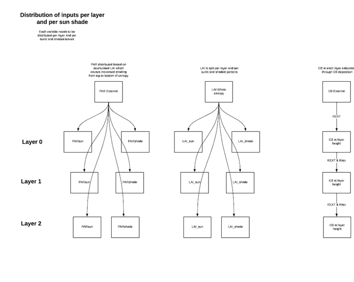
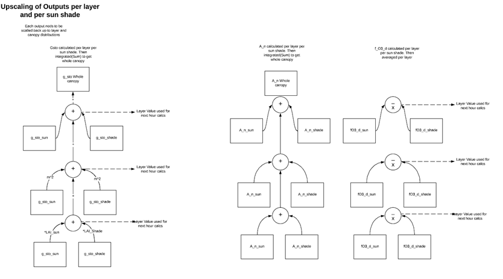
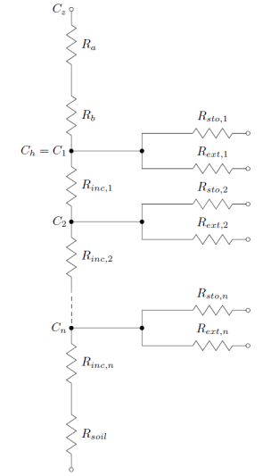
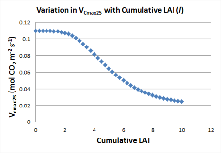
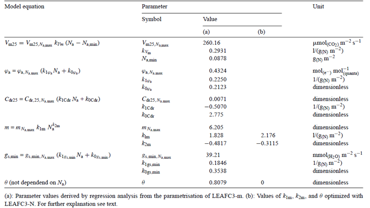
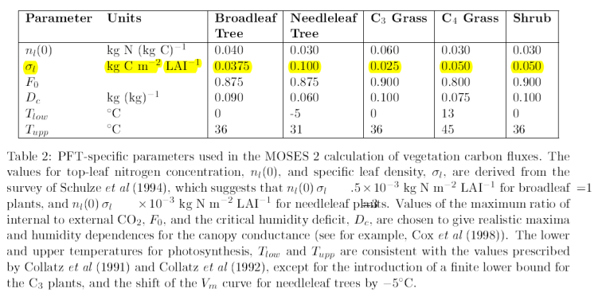
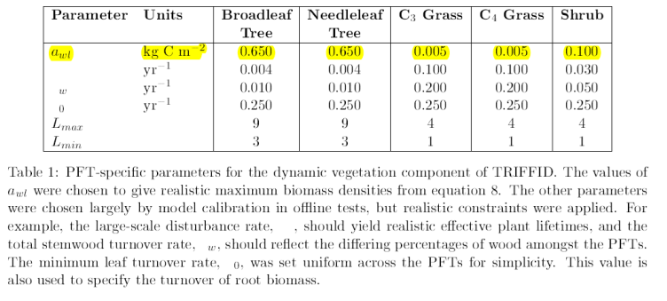

Up-scaling from leaf to canopy
==============================

Download the original word file  :download:`Up-scaling.docx <Up-scaling.docx>`

.. container:: WordSection1

   .. _Toc36708849:

   Up-scaling from leaf to canopy

   There are two methods of upscaling from leaf to canopy; the
   Multiplicative method using F\ :sub:`light` and the photosynthesis
   method using C allocation growth model.

   Contents

   `Multiplicative Method.2 <#toc50044219>`__

   `Photosynthesis Method.3 <#toc50044220>`__

   `Old Documentation.4 <#toc50044221>`__

   `Big-leaf model4 <#toc50044222>`__

   `Multi-layer model4 <#toc50044223>`__

   `The hybrid multi-layer multi-component model4 <#toc50044224>`__

   `Within canopy ozone concentration.5 <#toc50044225>`__

   `Within canopy irradiance 6 <#toc50044226>`__

   `Photosynthesis based modelling.9 <#toc50044227>`__

   `Variation with Leaf Nitrogen (N)10 <#toc50044228>`__

   `Carbon allocation.16 <#toc50044229>`__

   `8.1       Fixed C allocation coefficients.16 <#toc50044230>`__

   `8.2       Dynamic C allocation driven by allometric
   constraints.16 <#toc50044231>`__

   `Dynamic C allocation driven by resource
   availability.17 <#toc50044232>`__

    

    

    

   .. _Toc50044219:

   \_

   .. rubric:: Multiplicative Method
      :name: multiplicative-method

   Add F\ :sub:`light` docs here

    

   .. _Toc50044220:

   \_

   .. rubric:: Photosynthesis Method
      :name: photosynthesis-method

   Add documentation on C allocation growth model here…

    

   To upscale stomatal conductance and carbon allocation we sum up the
   sunlit and shaded gsto and A_n components and then integrate(Sum) up
   the layers.

   |image0|

   |image1|

    

   :sub:` `

    

    

   .. _Toc50044221:

   \_

   .. rubric:: Old Documentation
      :name: old-documentation

   .. _Toc36708850:

   \_

   .. _Toc50044222:

   \_

   .. rubric:: Big-leaf model
      :name: big-leaf-model

    

    

    

   .. _Toc36708851:

   \_

   .. _Toc50044223:

   \_

   .. rubric:: Multi-layer model
      :name: multi-layer-model

    

   .. _Toc36708852:

   \_

   .. _Toc50044224:

   \_

   .. rubric:: The hybrid multi-layer multi-component model
      :name: the-hybrid-multi-layer-multi-component-model

   To accommodate the variable sink strength of different layers within
   canopies we have developed a hybrid multi-layer model; this model
   incorporates the variation of irradiance, ozone concentration, wind
   speed and leaf nitrogen within the canopy, defined according to
   different layers of LAI within the canopy. This model is also able to
   accommodate different vegetation characteristics that also vary with
   canopy height (or cumulative LAI) such as the proportion of sun and
   shade leaves in forest trees or the combination of different canopy
   components (forbs, grasses and legumes) in grasslands. This is
   necessary as studies in for trees (Launiainen et al., 2013), crops
   (Pleijel, 2008) and grasslands (Jaggi et al., 2006) have found that
   these variables change with canopy depth affecting canopy layer, and
   hence whole canopy ozone fluxes. To achieve this the original ‘big
   leaf’ DO\ :sub:`3`\ SE model (Emberson et al., 2001) is split into
   several layers, the resistance of each layer (R:sub:`x`) is
   calculated as described in eq. 16\ `[DP1] <#msocom-1>`__\ \   and
   treated as a parallel sink within the overall ‘big-leaf’ framework as
   shown in Figure 4.

    

   .. _Ref393439495:

   \_Ref393439495

   .. _Ref393791594:

   36

                                                                                      

   Where R\ :sub:`sto,x` and R\ :sub:`ext,x`, are the ‘stomatal’ and
   ‘external plant part’ resistances respectively of each layer x.
   *R\ inc,x limits transfer between canopy layers and to the soil based
   on an estimate of an in-canopy mixing co-efficient. This is estimated
   from R\ inc (see eq. 30) with R\ inc,x (i.e. the in-canopy
   aerodynamic resistance associated with each layer) being scaled
   according to the SAI* of that layer. R\ :sub:`n+1` represents the
   soil resistance, since the same resistance is associated with each
   layer this is written as in eq 17.

    

   .. _Ref393439603:

   \_Ref393439603

   .. _Ref393792175:

   37

   .. _Toc50044225:

   \_

   .. rubric:: Within canopy ozone concentration
      :name: within-canopy-ozone-concentration

   The O\ :sub:`3` concentration within a canopy will vary as a function
   of O\ :sub:`3` loss to the canopy (i.e. uptake via the stomates and
   to the external plant parts) and O\ :sub:`3` replacement from ambient
   air concentrations above the canopy. Limited data have been collected
   showing how O\ :sub:`3` concentrations vary with canopy depth in
   semi-natural communities (Jaggi et al., 2006). These data suggest
   that a minimum, bottom canopy, *c(zb)*, O\ :sub:`3` concentration is
   about 0.2 that at the top of the canopy, *c(zh)*; and that the
   O\ :sub:`3` concentration within the canopy is closely related to
   whole canopy *LAI*.

    

   Since each layer is an independent parallel sink, the flux to a layer
   depends on the conductance (inverse of resistance) of that layer and
   the ozone concentration at the top of the layer (C:sub:`x`; with
   C\ :sub:`1` being the ozone concentration at height C\ :sub:`h`, the
   top of the canopy); this is calculated as shown in eqs. 18 and 19

    

   .. _Ref393439733:

   \_Ref393439733

   .. _Ref393792254:

   38

    

   .. _Ref393439895:

   \_Ref393439895

   .. _Ref393792308:

   39

    

   Where R\ :sub:`1` is the total resistance of layer *x* and the canopy
   above. The resistance R\ :sub:`x` refers to the total resistance of
   layer *x* and below. If the whole canopy is treated as a single layer
   this resistance scheme is identical to the existing DO\ :sub:`3`\ SE
   resistance scheme, as shown in eq 20.

    

   .. _Ref393439983:

   \_Ref393439983

   .. _Ref393792416:

   40

    

   .. _Ref393791631:

   \_Ref393791631

   .. _Ref393791637:

   Figure

   4. Resistance scheme for the DO\ :sub:`3`\ SE hybrid multi-layer
   (multi-component grassland) flux model.
    

   |image2|

   The R\ :sub:`sto, x` term is calculated using the DO\ :sub:`3`\ SE
   stomatal conductance (g:sub:`sto`) model (this can use either the
   multiplicative scheme (see section 4.1) or the coupled
   photosynthesis-stomatal conductance model (see section 4.2). These
   models are parameterised for each of the different components
   (*g\ sto, comp*) (e.g. sun and shade leaves, grassland types) defined
   within the canopies depending on whether the multiplicative or
   coupled photosynthesis-stomatal conductance model is used. Key
   variables upon which photosynthesis and /or stomatal conductance
   depend will be affected by canopy height. Irradiance affects gsto
   both in its derivation by the multiplicative model and the coupled
   photosynthesis-stomatal conductance model; leaf nitrogen content can
   only currently be incorporated through its affects on photosynthesis.

    

   ** **

   .. _Toc50044226:

   \_

   .. rubric:: Within canopy irradiance [LDE2] 
      :name: within-canopy-irradiance-lde2

   The model estimates canopy stomatal conductance as a function of
   irradiance (F:sub:`light`) according to the method of Baldocchi et
   al. (1987) identifying fractions of sunlit and shaded leaf area and
   the PAR flux densities on those leaves as in eq. 21.

    

   .. _Ref393441178:

   \_Ref393441178

   .. _Ref393796520:

   41

    

    

   Where *f* is the leaf area, d\ *f*\ sun and d\ *f*\ shade are the
   differences in sunlit (*f*\ sun) and shaded (*f*\ shade) leaf areas
   respectively, between *f* and *f* +d\ *f,* and PARsun and PARshade
   are the flux densities of PAR on sunlit and shaded leaves
   respectively. *f*\ sun, *f*\ shade, PARsun and PARshade are
   calculated according to the model of Weiss & Norman (1985) used in
   DO\ :sub:`3`\ SE to estimate radiative transfer allowing for canopy
   component variation in the angle of leaf inclination
   `[lde3] <#msocom-3>`__\ \  (α) (of which there is some difference for
   grass (more vertically aligned leaves) and legume of forbs (leaves
   tend towards a horizontal alignment)). The cumulative sunlit leaf
   area between the top of the canopy level (*f*) within the canopy is
   estimated as in eq. 22.

    

   .. _Ref393797692:

   42

    

   where β is the solar elevation angle with the shaded leaf area being
   the remaining fraction in that particular layer.

    

    

    

   The stomatal O\ :sub:`3` flux within each canopy layer (F:sub:`st,`
   *comp*) is calculated as described in eq 21.

    

   .. _Ref393440767:

   \_Ref393440767

   .. _Ref393793100:

   43

    

   Where the leaf resistance term (*r\ c, comp*) is equal to
   1/(g\ :sub:`sto,` :sub:`comp` *+ g\ ext*) with g\ :sub:`ext`  being
   the same for all canopy components with a value of 1/2500 in m/s,
   g\ :sub:`sto,` *comp* is in units of m/s estimated from mmol
   m\ :sup:`-2` s :sup:`-1` according to temperature and pressure.  Leaf
   level  is estimated as described in section 2.3.2). However, this
   requires that the wind speed within each layer be known This is
   estimated as described below in section 5.2.1.1.

    

   .. _Ref393795250:

   \_

   .. rubric:: 5.2.1.1            Within canopy wind speed
      :name: within-canopy-wind-speed

   To estimate in canopy wind speed we use the methods described in
   Campbell & Norman (1998). These assume wind decreases exponentially
   with depth with eq. 22 describing the wind speed in the top 90% of
   the canopy.

    

   .. _Ref393708815:

   \_Ref393708815

   .. _Ref393795373:

   44

    

   Where *u(z)* is the wind speed at height *z* within the canopy, u(h)
   is the wind speed at the top of the canopy, a\ :sub:`u` is the
   attenuation coefficient, *z* is the height within the canopy and *h*
   is the total canopy height. 

    

   Goudriaan, 1977 suggested a simple equation for calculating the
   attenuation coefficient (a:sub:`u`) as a function of canopy structure
   as given in eq. 23.

    

   .. _Ref393709386:

   \_Ref393709386

   .. _Ref393795458:

   45

    

    

   Where *SAI* is the Stand Area Index, *h* is the canopy height and
   l\ :sub:`m` is a mean distance between leaves in the canopy given by
   eq. 24 for crops

    

   .. _Ref393709651:

   \_Ref393709651

   .. _Ref393795517:

   46

    

   and eq. 47 for grasses.

    

   .. _Ref393709813:

   \_Ref393709813

   .. _Ref393795558:

   47

    

   Where *w* is the leaf width.

    

   For the bottom 10% of the canopy a new logarithmic profile is
   developed with a zero plane displacement of zero and a roughness
   length characteristic of the underlying soil surface, eq. 48 can be
   used for this part of the canopy. Not currently used in current
   version of DO\ 3\ SE model.

    

   .. _Ref393795603:

   48

    

   The wind speed at the top of this layer is equal to the wind speed at
   the bottom of the exponential layer so that from one wind speed at
   the top of the canopy all wind speeds can be estimated to the bottom
   of the canopy. N.B. *u\** is constant for all heights within the
   canopy.

    

   As such, this hybrid model ensures that the calculation of *F\ st,
   comp* at each layer *x* incorporates the canopy variation in the
   distribution of plant species (characterised by *LAI* and
   g\ :sub:`sto` parameterisation), O\ :sub:`3` concentration,
   irradiance and wind speed.  It is assumed that *T* and *D* remain
   constant over the canopy. Given the importance of the two latter
   variables it is useful to provide more detail of their calculation.

    

   The phytotoxic ozone dose above a threshold (PODy) can then be
   calculated by summing F\ :sub:`st,, comp` values, over threshold *y*,
   over the respective accumulation period.

    

   .. rubric:: 5.2.1.2            Calculating whole canopy stomatal
      ozone flux
      :name: calculating-whole-canopy-stomatal-ozone-flux

   The estimate of whole canopy stomatal conductance (G:sub:`sto`) and
   stomatal O\ :sub:`3` flux (F:sub:`st`)can be estimated by simply
   summing the individual fluxes to each species component within the
   different *f* layers. This method also allows derivation of the
   F\ :sub:`st` to the canopy component fractions of the total canopy
   which can be used in derivation of flux-response relationships for
   these component species.

    

    

    

   .. _Toc36708853:

   \_

   .. _Toc50044227:

   \_

   .. rubric:: Photosynthesis based modelling
      :name: photosynthesis-based-modelling

    

   14/07/2014 – Propose the following 2 methods for use in DO3SE:

    

   1.       Simple method largely following that used in JULES(Clark et
   al., 2011)but which allows for variation of leaf N within the canopy
   not only to be driven by irradiance penetration by using methods
   of(Johnson et al., 2010). This methodassumes a direct relationship
   between leaf N, V\ cmax and hence photosynthesis and also allows for
   a certain amount of Leaf N not to be associated with photosynthesis.
   Uses Equations[11],[13] with[13] being used for each layer (i) of the
   canopy. Think this can be condensed to the following…

    

                                   

    

    

    

    

    

   |image3|

    

    

    

   2.    Complex method following Mueller et al (2011) which requires
   modification within the photosynthesis module (see Patrick).

    

    

   .. _Toc50044228:

   \_

   .. rubric:: Variation with Leaf Nitrogen (N)
      :name: variation-with-leaf-nitrogen-n

   Photosynthesis over the canopy depends on the biochemical capacity
   for photosynthesis of individual leaves. An important determinant of
   this biochemical capacity is the amount of leaf nitrogen (N) which
   will determine the Rubisco and ribulose-1,5-bisphosphate
   carboxylase/oxygenase contents of leaves. Within-canopy profiles of
   leaf N (or photosynthetic capacity) have been shown to be
   significantly non-uniform and vary between species (cf.Pury &
   Farquhar, 1997). These canopy profiles have led to the hypothesis
   that leaves adapt or acclimate to their radiation environment such
   that a plant’s N resources may be distributed to maximise daily
   canopy photosynthesis. This leads to the assumption that the optimal
   distribution of N occurs when N is distributed in proportion to the
   distribution of absorbed irradiance in the canopy, averaged over the
   previous several days to a week (Pury & Farquhar, 1997).

    

   However, respiration (and in particular maintenance respiration) is
   also related to protein content through its role in the synthesis and
   recycling of proteins, and so increasing the photosynthetic enzymes
   (and protein concentration in general) will not only increase
   photosynthetic potential, but also maintenance respiration costs. For
   example,Johnson et al. (1996)developed a model that optimized leaf N
   concentration through the balance between photosynthesis and
   respiration, so that increases in N influenced both photosynthetic
   potential and maintenance respiration losses. This approach was
   further extended though description of protein distribution over the
   canopy (as opposed to setting just a mean value) and reference to
   protein concentration (mol leaf C)\ -1, rather than N (which is often
   translated into protein via specific leaf area – leaf mass per unit
   area)(Johnson et al., 2010)).

    

   Johnson et al. (2010)do not use the widely applied assumption that N
   is exponentially distributed through the canopy following the canopy
   extinction of light since it is recognised that a variety of
   environmental variables influence N distribution (as summarised by
   Kull, (2002)) with non-exponential profiles also supported by studies
   published in the literature(Yin et al., 2003).Johnson et al.
   (2010)use an algorithm that assumes a distribution of N that is
   fairly linear in the upper canopy and then curves at depth through
   the canopy allowing for the influence on distribution of both  the
   within canopy light profile (and hence C assimilation) as well as the
   respiration potential. Here, we use the alogorithm ofJohnson et al.
   (2010)to provide flexibility in the description of N distribution,
   see[11].

    

   .. _Ref392052413:

   \_Ref392052413

                                                                 [49
   .. _Ref392052444:

   \_Ref392052444

   ]
    

   Where N\ 1 is leaf N concentration per unit leaf area (in mmol/m\ 2),
   N\ 0 is leaf N concetration at the top of the canopy (in mmol/m\ 2),
   N\ b is leaf N concentration not associated with photosynthesis (in
   mmol/m\ 2), k is the canopy extinction co-efficient (0.5 m\ 2 ground
   m\ -2 leaf), l is the cumulative leaf area index from the top of the
   canopy (where l=0) (in m\ 2/m2) and γρ is dimensionless co-efficient
   that sets the distribution of N over the canopy. γρ ≥ 0 and when γρ =
   0[11]simplifies to a constant N distribution over the canopy, when γρ
   = 1 it assumes an exponential distribution (e.g. a distribution
   determined by within canopy irradiance penetration and as γρit
   simplifies to a constant protein distributiondefined by N\ b. In the
   absence of species-specific parameterisation of this function we use
   default values of  N\ 0 = 0.3,  N\ b = 0.05 and γρ = 8. 

    

   Leaf N is converted to photosynthetic Rubisco capacity per unit leaf
   area, V\ 1 (in μmol m\ -2 s\ -1), assuming a linear relationship
   between V\ 1 and N\ 1(Field & Mooney, 1986;Evans, 1983)with a
   residual leaf N content of N\ b which equates to 0.5% N when V\ 1 =
   0, see[12].

    

   .. _Ref392059701:

   \_Ref392059701

     
                                                                                                       
   [50
   .. _Ref392059687:

   \_Ref392059687

   ]
    

   Where X\ :sub:`n`  is the ratio of measured Rubisco capacity to leaf
   N and can be calculated from values of V\ :sub:`1` (from leaf
   photosynthesis measurements) and from measurements of N\ :sub:`1`. 

    

   In JULES V\ cmax25 is assumed to be linearly related to leaf N
   concentration at the top of the canopy (N0) by[13]

    

   .. _Ref393097997:

   \_Ref393097997

                                                                                                                                      
   [51]
    

   where N\ e is a constant that has values of 0.0008 and 0.0004 mol
   CO\ 2 m\ -2 s\ -1 kgC (kg N)\ -1 for C3 and C4 plants
   respectively(Clark et al., 2011). These values were derived
   from(Schulze et al., 1994)assuming that leaf dry matter is 40% carbon
   by mass and that maximum rate of photosynthetic uptake is 0.5 V\ cmax
   for C3 plants and equals V\ cmax for C4 plants. N\ 1 is either set
   equal to N\ 0, the leaf N concentration at the top of the canopy, or
   can be allowed to vary with canopy layer.

    

   Here, photosynthetic capacity at each canopy layer i is calculated
   assuming that the reference value varies according to[14]

    

   .. _Ref393098087:

   \_Ref393098087

                             
                                                                                            
   [52
   .. _Ref393098076:

   \_Ref393098076

   ]
    

    

   with N\ 0 the leaf N concentration at the top of the canopy and k\ n
   a nitrogen profile coefficient estimated to be 0.78. Vertical
   profiles of V\ cmax remain to be tested further and evaluated for
   other vegetation types(Clark et al., 2011). All values scale by N0 so
   that whatever unit is used here should define the units of the
   calculation (e.g. see Table from(Clark et al., 2011)below).

    

   |image4|

    

    

   However, a study by(Müller et al., 2005)shows that leaf N interacts
   with photosynthesis in a number of different ways including:

    

                 i.         The parameter m of the BWB model may change
   with leaf age (related to N\ 1?).

               ii.         The slope of V\ Cmax to N\ 1 is a measure of
   the photosynthetic capacity per unit leaf N.

              iii.         The slope of maximum quantum yield on
   incident Q basis  to N\ 1 can be interpreted in terms of a maximum
   quantum yield of electron transport per unit leaf N.

              iv.         The increase in C\ dr25 (ratio of dark
   respiration to V\ Cmax, (Cdr at 25\ o\ C)) observed in senescing
   leaves results from a reduction in V\ m25 with decreasing N\ 1 of
   about 80% accompanied by a drop in Rd25 of only 60%. Therefore,
   C\ dr25 may vary during leaf senescence and possibly has to be
   developed in photosynthesis models rather as a function of leaf
   development stage than as a constant.

               v.         Acclimation of leaves to environmental
   variables across the canopy can affect both N partitioning between
   photosynthetic pools and leaf structure (e.g. SLA). This may lead to
   variation in the slope of the relationships between V\ Cmax, J\ max
   and N\ 1 and concentration of nitrogen per unit dry mass.

    

   Therefore, assuming a linear relationship between V\ cmax and N\ 1 is
   rather simplistic.Müller et al. (2005)developed a method by which
   different aspects of photosynthesis would in turn be affected by leaf
   N according to empirical relationships derived from studiesinvolving
   winter wheat (see Table 1).

    

    

   .. _Ref393098693:

   Table

   **2**. Model equations and parameter values describing parameter-N1
   relationships in LEAFC3-N (Müller et al., 2005).
    

   |image5|

   Where N\ a = N\ 1, N\ a, max and N\ a, min is the maximum and minimum
   leaf nitrogen concentration respectively.

    

   However, the parameter-N\ 1 relationships suggested by(Müller et al.,
   2005)cannot be concluded to be universally valid without independent
   measurements (the data used to define these are from winter wheat).

    

   Equations[11]and[12] allow leaf N to be calculated for leaves of each
   layer and converted to photosynthetic capacity. The variable V\ 1 can
   then be used to determine a V\ Cmax for each leaf layer according to
   formulas fromMüller et al. (2005).

    

    

   +-----------------+-----------------+-----------------+-----------------+
   | Variable        | Unit            | Value           | Equation        |
   +-----------------+-----------------+-----------------+-----------------+
   | **Canopy        |                 |                 |                 |
   | nitrogen (N)**  |                 |                 |                 |
   +-----------------+-----------------+-----------------+-----------------+
   | Leaf N          | mmol/m\ 2       |                 | [11],[12]       |
   | concentration   |                 |                 |                 |
   | at the top of   |                 |                 |                 |
   | the canopy,     |                 |                 |                 |
   | N\ 0            |                 |                 |                 |
   +-----------------+-----------------+-----------------+-----------------+
   | Leaf N          | mmol/m\ 2       |                 | [11],[12]       |
   | concentration   |                 |                 |                 |
   | not associated  |                 |                 |                 |
   | with            |                 |                 |                 |
   | photosynthesis, |                 |                 |                 |
   | N\ b            |                 |                 |                 |
   +-----------------+-----------------+-----------------+-----------------+
   | Leaf N          | mmol/m\ 2       |                 | [11],[12]       |
   | concentration   |                 |                 |                 |
   | per unit leaf   |                 |                 |                 |
   | area, N\ 1      |                 |                 |                 |
   +-----------------+-----------------+-----------------+-----------------+
   | dimensionless   | -               |                 | [11]            |
   | co-efficient    |                 |                 |                 |
   | that sets the   |                 |                 |                 |
   | distribution of |                 |                 |                 |
   | N over the      |                 |                 |                 |
   | canopy, γρ      |                 |                 |                 |
   +-----------------+-----------------+-----------------+-----------------+
   | canopy          | m\ 2 ground     | 0.7             | [11]            |
   | extinction      | m\ -2 leaf      |                 |                 |
   | co-efficient, k |                 |                 |                 |
   +-----------------+-----------------+-----------------+-----------------+
   | Cumulative leaf | m\ 2/m2         |                 | [11]            |
   | area index, l   |                 |                 |                 |
   +-----------------+-----------------+-----------------+-----------------+
   | Photosynthetic  | μmol m\ -2      |                 | [12]            |
   | Rubisco         | s\ -1           |                 |                 |
   | capacity per    |                 |                 |                 |
   | unit leaf area, |                 |                 |                 |
   | V\ 1            |                 |                 |                 |
   +-----------------+-----------------+-----------------+-----------------+
   | ratio of        | -               |                 | [12]            |
   | measured        |                 |                 |                 |
   | Rubisco         |                 |                 |                 |
   | capacity to     |                 |                 |                 |
   | leaf N, X\ n    |                 |                 |                 |
   +-----------------+-----------------+-----------------+-----------------+
   | Constant        | mol CO\ 2 m\ -2 | 0.0008 (C3)     | [13],[14]       |
   | relating leaf N | s\ -1 kg C (kg  |                 |                 |
   | to Rubisco      | N)\ -1          | 0.0004 (C4)     |                 |
   | carboxylation   |                 |                 |                 |
   | capacity, N\ e  |                 |                 |                 |
   +-----------------+-----------------+-----------------+-----------------+
   | ** **           |                 |                 |                 |
   +-----------------+-----------------+-----------------+-----------------+

    

    

    

   .. _Toc36708863:

   \_

   .. _Toc50044229:

   \_

   .. rubric:: Carbon allocation
      :name: carbon-allocation

    

    

   There are three general approaches to C allocation in (dynamic)
   vegetation models (also seeMalhi et al., 2011):

   .. _Toc36708864:

   \_

   .. _Toc50044230:

   \_

   .. rubric:: 8.1          Fixed C allocation coefficients
      :name: fixed-c-allocation-coefficients

    

   This fairly simplistic approach assumes a fixed C allocation
   proportion for leaves/canopy : stem/wood : roots, e.g.

    

   0.25 : 0.35 : 0.40 (trees; Running and Coughlan, 1988)  

   These fixed coefficients are PFT-specific. Models that use this
   approach include BIOME-BGC, CASA etc.

    

   (Units used here?)

   .. _Toc36708865:

   \_

   .. _Toc50044231:

   \_

   .. rubric:: 8.2          Dynamic C allocation driven by allometric
      constraints
      :name: dynamic-c-allocation-driven-by-allometric-constraints

    

   Here allocation must satisfy allometric relationships between
   different C pools. Approach often used for forest ecosystems, where
   leaf mass is scaled to stem and root mass and stem mass is scaled to
   root mass (see for example Mccarthy and Enquist, 2007).

    

   This approach is used in JULES/TRIFFID (Cox, 2001), where the stem
   biomass is taken to scale allometrically with LAI; this involves an
   allometric constant which is PFT-specific. The biomass of leaves and
   (fine) roots is assumed to be equivalent:

    

   **1)           Leaf C =** s\ :sub:`l` \* LAI

               Where s\ :sub:`l` is the specific leaf C density (kg C
   M-2 LAI-1), which is PFT-specific:\ |image6|

    **2)        Root C = Leaf C**

                          

   ** 3)        Wood/stem C = a\ wl \* LAI\ 5/3**

    Where a\ :sub:`wl` is a PFT-dependent parameter relating to LAI and
   total stem biomass:

   |image7|

    

   .. _Toc36708866:

   \_

   .. _Toc50044232:

   \_

   .. rubric:: Dynamic C allocation driven by resource availability
      :name: dynamic-c-allocation-driven-by-resource-availability

    

   Most sophisticated method of C allocation since it follows the widely
   accepted theory that plants should allocate biomass according to the
   most limiting resource. More precisely, plants allocate relatively
   more C to roots when water or nutrients are limiting and more C to
   shoots when light is limiting. Accordingly, the typical limiting
   resources accounted for in dynamic vegetation models (e.g. ORCHIDEE)
   are light, water and N. As such, it would fit very well with the
   scope of ECLAIRE.

    

   To account for the effect of light on C allocation, Friedlingstein et
   al. (1999) suggested a light availability factor *L*:

    

   *L* = exp \* (-*k* \* LAI)

    

   Where *k* is the light extinction coefficient which is usually set to
   0.5.

    

   To account for the effect of water availability on C allocation,
   often a water availability function *W* is used that influences the C
   allocation to roots:

   * *

   *W* = max [0, min \* (1, *q* - *q*\ :sub:`wilt`/*q*\ :sub:`FC` -
   *q*\ :sub:`wilt`)]

    

   Where *q* is the actual soil moisture content and *q*\ :sub:`FC` and
   *q*\ :sub:`wilt` are the soil moisture contents at field capacity and
   wilting point, respectively. These parameters should be available
   from DO\ :sub:`3`\ SE.

   The N limitation effect on C allocation is – if at all – usually
   accounted for indirectly, i.e. through impacts of soil moisture and
   temperature on N availability (Friedlingstein et al., 1999), because
   water and N limitations are often well correlated since soil moisture
   controls the mineralisation rate (Schimel and Braswell, 1996).
   Friedlingstein et al. (1999) suggest:

   * *

   *N* = *T* \* *W*

    

   Where T is the temperature abiotic factor, a standard Q\ :sub:`10`
   formulation (Potter et al., 1993).   

   In addition,Friedlingstein et al.(1999) assumes that light directly
   control the stem allocation of C and one below-ground resource
   (either water or N) defines the root allocation of C. Leaves receive
   the residual; the C allocation to leaves increases when light, water
   and N are not limiting.

    

   The following equations summarise the Friedlingstein et al. (1999)
   model:

    

   **1)              **\ RootC = 3 \* r\ :sub:`0` \*  L/(L + 2 \* min
   (W,N))

   ** **

   **2)              Wood/stemC = 3 \* s\ 0 \* (min (W, N)/(2 \* L + 2
   \* min (W,N))**

   ** **

   **3)              LeafC = 1 – (RootC + Wood/stemC)**

   ** **

   Where r\ :sub:`0` and s\ :sub:`0` are the fractional C allocation to
   root and stem for non-limiting conditions, respectively. They are
   usually set to 0.3 both, leaving a leaf C allocation of 0.4 under
   totally non-limiting resource conditions. The resources *L*, *W*, *N*
   (see equations above) are scalars ranging from 0.1 (severely limited)
   to 1 (non-limited).   

    

    

   ** **

.. container:: WordSection2

   **Table (x)   Default deposition land-cover and species class
   methods/values for various aspects of the DO\ 3\ SE
   model**\ `[p4] <#msocom-4>`__\ \  \ **.**

    

    

   +---------+---------+---------+---------+---------+---------+---------+
   | **Land- | **Clima | **Canop | **Root  | **Albed | **Leaf  | **Stoma |
   | cover   | te      | y       | depth   | o       | dimensi | tal     |
   | type &  | region* | height  | (m)**   | (%)**   | on      | flux    |
   | Species | *       | (m)**   |         |         | (m)**   | thresho |
   | **      |         |         |         |         |         | ld      |
   |         |         |         |         |         |         | (Y,     |
   |         |         |         |         |         |         | nmol    |
   |         |         |         |         |         |         | O\ 3    |
   |         |         |         |         |         |         | m\ -2   |
   |         |         |         |         |         |         | PLA     |
   |         |         |         |         |         |         | s\ -1   |
   |         |         |         |         |         |         | )**     |
   +---------+---------+---------+---------+---------+---------+---------+
   | ** **   |         |         |         |         |         |         |
   +---------+---------+---------+---------+---------+---------+---------+
   | **Conif |         | 20      | 1       | 12      | 0.008   | 1.6     |
   | erous   |         |         |         |         |         |         |
   | Forests |         |         |         |         |         |         |
   | (CF)**  |         |         |         |         |         |         |
   +---------+---------+---------+---------+---------+---------+---------+
   | Norway  | Norther | 20      | 1       | 12      | 0.008   | 1.6     |
   | spruce  | n       |         |         |         |         |         |
   |         | Europe  |         |         |         |         |         |
   | (Picea  |         |         |         |         |         |         |
   | abies)  |         |         |         |         |         |         |
   +---------+---------+---------+---------+---------+---------+---------+
   | Scots   | Atlanti | 20      | 1       | 12      | 0.008   | 1.6     |
   | Pine    | c       |         |         |         |         |         |
   |         | Central |         |         |         |         |         |
   | (Pinus  | Europe  |         |         |         |         |         |
   | sylvest |         |         |         |         |         |         |
   | ris)    |         |         |         |         |         |         |
   +---------+---------+---------+---------+---------+---------+---------+
   | Norway  | Contine | 20      | 1       | 12      | 0.008   | 1.6     |
   | Spruce  | ntal    |         |         |         |         |         |
   |         | Central |         |         |         |         |         |
   | (Picea  | Europe  |         |         |         |         |         |
   | abies)  |         |         |         |         |         |         |
   +---------+---------+---------+---------+---------+---------+---------+
   | **Decid |         | 20      | 1       | 16      | 0.07    | 1.6     |
   | uous    |         |         |         |         |         |         |
   | Forests |         |         |         |         |         |         |
   | **      |         |         |         |         |         |         |
   |         |         |         |         |         |         |         |
   | **(DF)* |         |         |         |         |         |         |
   | *       |         |         |         |         |         |         |
   +---------+---------+---------+---------+---------+---------+---------+
   | **Gener | **All   | 20      | 1       | 16      | 0.07    | **1.6** |
   | ic      | Europe* |         |         |         |         |         |
   | Deciduo | *       |         |         |         |         |         |
   | us**    |         |         |         |         |         |         |
   +---------+---------+---------+---------+---------+---------+---------+
   | Silver  | Norther | 20      | 1       | 16      | 0.05    | 1.6     |
   | birch   | n       |         |         |         |         |         |
   |         | Europe  |         |         |         |         |         |
   | (Betula |         |         |         |         |         |         |
   | pendula |         |         |         |         |         |         |
   | )       |         |         |         |         |         |         |
   +---------+---------+---------+---------+---------+---------+---------+
   | Beech   | Atlanti | 20      | 1       | 16      | 0.07    | 1.6     |
   |         | c       |         |         |         |         |         |
   | (Fagus  | Central |         |         |         |         |         |
   | sylvati | Europe  |         |         |         |         |         |
   | ca)     |         |         |         |         |         |         |
   +---------+---------+---------+---------+---------+---------+---------+
   | Oak     | Atlanti | 20      | 1       | 16      | 0.05    | 1.6     |
   |         | c       |         |         |         |         |         |
   | (Quercu | Central |         |         |         |         |         |
   | s       | Europe  |         |         |         |         |         |
   | petraea |         |         |         |         |         |         |
   | &       |         |         |         |         |         |         |
   | robur)  |         |         |         |         |         |         |
   +---------+---------+---------+---------+---------+---------+---------+
   | Beech   | Contine | 20      | 1       | 16      | 0.07    | 1.6     |
   |         | ntal    |         |         |         |         |         |
   | (Fagus  | Central |         |         |         |         |         |
   | sylvati | Europea |         |         |         |         |         |
   | ca)     | n       |         |         |         |         |         |
   +---------+---------+---------+---------+---------+---------+---------+
   | Beech   | Mediter | 20      | 4       | 16      | 0.07    | 1.6     |
   |         | ranean  |         |         |         |         |         |
   | (Fagus  | Europe  |         |         |         |         |         |
   | sylvati |         |         |         |         |         |         |
   | ca)     |         |         |         |         |         |         |
   +---------+---------+---------+---------+---------+---------+---------+
   | **Medit |         | **10**  | **4**   | 12      | 0.008   | 1.6     |
   | erranea |         |         |         |         |         |         |
   | n       |         |         |         |         |         |         |
   | Needlel |         |         |         |         |         |         |
   | eaf     |         |         |         |         |         |         |
   | Forests |         |         |         |         |         |         |
   | **      |         |         |         |         |         |         |
   |         |         |         |         |         |         |         |
   | **(NF)* |         |         |         |         |         |         |
   | *       |         |         |         |         |         |         |
   +---------+---------+---------+---------+---------+---------+---------+
   | Aleppo  | Mediter | 10      | 4       | 12      | 0.008   | 1.6     |
   | Pine    | ranean  |         |         |         |         |         |
   |         | Europe  |         |         |         |         |         |
   | *(Pinus |         |         |         |         |         |         |
   | halepen |         |         |         |         |         |         |
   | sis)*   |         |         |         |         |         |         |
   +---------+---------+---------+---------+---------+---------+---------+
   | **Medit |         | 15      | 4       | 16      | 0.055   | 1.6     |
   | erranea |         |         |         |         |         |         |
   | n       |         |         |         |         |         |         |
   | Broadle |         |         |         |         |         |         |
   | af      |         |         |         |         |         |         |
   | Forests |         |         |         |         |         |         |
   | **      |         |         |         |         |         |         |
   |         |         |         |         |         |         |         |
   | **(BF)* |         |         |         |         |         |         |
   | *       |         |         |         |         |         |         |
   +---------+---------+---------+---------+---------+---------+---------+
   | **Gener | **All   | **15**  | **4**   | **16**  | **0.055 | **1.6** |
   | ic      | Europe* |         |         |         | **      |         |
   | Evergre | *       |         |         |         |         |         |
   | en      |         |         |         |         |         |         |
   | Mediter |         |         |         |         |         |         |
   | ranean* |         |         |         |         |         |         |
   | *       |         |         |         |         |         |         |
   +---------+---------+---------+---------+---------+---------+---------+
   | Holm    | Mediter | 15      | 4       | 16      | 0.055   | 1.6     |
   | Oak     | ranean  |         |         |         |         |         |
   |         | Europe  |         |         |         |         |         |
   | (Quercu |         |         |         |         |         |         |
   | s       |         |         |         |         |         |         |
   | ilex)   |         |         |         |         |         |         |
   +---------+---------+---------+---------+---------+---------+---------+
   | **Tempe |         | 1       | 0.75    | 20      | 0.02    | 6       |
   | rate    |         |         |         |         |         |         |
   | crops** |         |         |         |         |         |         |
   |         |         |         |         |         |         |         |
   | **(TC)* |         |         |         |         |         |         |
   | *       |         |         |         |         |         |         |
   +---------+---------+---------+---------+---------+---------+---------+
   | **Gener | **All   | **1**   | **0.75* | **20**  | **0.02* | **3**   |
   | ic      | Europe* |         | *       |         | *       |         |
   | crop**  | *       |         |         |         |         |         |
   +---------+---------+---------+---------+---------+---------+---------+
   | Wheat   | All     | 1       | 0.75    | 20      | 0.02    | 6       |
   |         | Europe  |         |         |         |         |         |
   | (Tritic |         |         |         |         |         |         |
   | um      |         |         |         |         |         |         |
   | aestivu |         |         |         |         |         |         |
   | m)      |         |         |         |         |         |         |
   +---------+---------+---------+---------+---------+---------+---------+
   | **Medit |         | 2       | 0.75    | 20      | 0.1     | 0       |
   | erranea |         |         |         |         |         |         |
   | n       |         |         |         |         |         |         |
   | crops** |         |         |         |         |         |         |
   |         |         |         |         |         |         |         |
   | **(MC)* |         |         |         |         |         |         |
   | *       |         |         |         |         |         |         |
   +---------+---------+---------+---------+---------+---------+---------+
   | Maize   | All     | 2       | 0.75    | 20      | 0.1     | 0       |
   |         | Europe  |         |         |         |         |         |
   | *(Zea   |         |         |         |         |         |         |
   | mays)*  |         |         |         |         |         |         |
   +---------+---------+---------+---------+---------+---------+---------+
   | Sunflow | All     | 2       | 0.75    | 20      | 0.25    | 0       |
   | er      | Europe  |         |         |         |         |         |
   |         |         |         |         |         |         |         |
   | *(Helia |         |         |         |         |         |         |
   | nthus   |         |         |         |         |         |         |
   | annuus) |         |         |         |         |         |         |
   | *       |         |         |         |         |         |         |
   +---------+---------+---------+---------+---------+---------+---------+
   | Tomato  | All     | 1       | 0.75    | 20      | 0.05    | 0       |
   |         | Europe  |         |         |         |         |         |
   | *(Solan |         |         |         |         |         |         |
   | um      |         |         |         |         |         |         |
   | lycoper |         |         |         |         |         |         |
   | sicum)* |         |         |         |         |         |         |
   +---------+---------+---------+---------+---------+---------+---------+
   | Grape   | All     | 1.7     | 0.75    | 20      | 0.15    | 0       |
   | vine    | Europe  |         |         |         |         |         |
   |         |         |         |         |         |         |         |
   | *(Vitis |         |         |         |         |         |         |
   | vinifer |         |         |         |         |         |         |
   | a)*     |         |         |         |         |         |         |
   +---------+---------+---------+---------+---------+---------+---------+
   | **Root  |         | 1       | 0.75    | 20      | 0.04    | 6       |
   | crops** |         |         |         |         |         |         |
   |         |         |         |         |         |         |         |
   | **(RC)* |         |         |         |         |         |         |
   | *       |         |         |         |         |         |         |
   +---------+---------+---------+---------+---------+---------+---------+
   | Potato  | All     | 1       | 0.75    | 20      | 0.04    | 6       |
   |         | Europe  |         |         |         |         |         |
   | (Solanu |         |         |         |         |         |         |
   | um      |         |         |         |         |         |         |
   | tuberos |         |         |         |         |         |         |
   | um)     |         |         |         |         |         |         |
   +---------+---------+---------+---------+---------+---------+---------+
   | **Semi- |         |         | 0.5     | 14      | 0.01    | 0       |
   | Natural |         |         |         |         |         |         |
   | /       |         |         |         |         |         |         |
   | Moorlan |         |         |         |         |         |         |
   | d**     |         |         |         |         |         |         |
   |         |         |         |         |         |         |         |
   | **(SNL) |         |         |         |         |         |         |
   | **      |         |         |         |         |         |         |
   +---------+---------+---------+---------+---------+---------+---------+
   | **Grass |         | 1       | 0.75    | 20      | 0.02    | 0       |
   | land**  |         |         |         |         |         |         |
   |         |         |         |         |         |         |         |
   | **(GR)* |         |         |         |         |         |         |
   | *       |         |         |         |         |         |         |
   +---------+---------+---------+---------+---------+---------+---------+
   | Perenni | All     | 1       | 0.75    | 20      | 0.02    | 0       |
   | al      | Europe  |         |         |         |         |         |
   | rye     |         |         |         |         |         |         |
   | grass   |         |         |         |         |         |         |
   |         |         |         |         |         |         |         |
   | (Lolium |         |         |         |         |         |         |
   | perenne |         |         |         |         |         |         |
   | )       |         |         |         |         |         |         |
   +---------+---------+---------+---------+---------+---------+---------+
   | Clover  | All     | 1       | 0.75    | 20      | 0.03    | 0       |
   |         | Europe  |         |         |         |         |         |
   | (Trifol |         |         |         |         |         |         |
   | ium     |         |         |         |         |         |         |
   | repens) |         |         |         |         |         |         |
   +---------+---------+---------+---------+---------+---------+---------+
   | **Medit |         | 1       | 0.5     | 20      |         | 0       |
   | erranea |         |         |         |         |         |         |
   | n       |         |         |         |         |         |         |
   | scrub** |         |         |         |         |         |         |
   +---------+---------+---------+---------+---------+---------+---------+

    

   N.B. The values provided in the table are taken from a number of
   different references: Simpson et al. (2003); UNECE (2004); ICP
   Vegetation report (2006); ICP Vegetation report (2009).

    

    

.. container:: WordSection3

    

    

.. container::

   --------------

   .. container::

      .. container:: msocomtxt

         .. _msocom-1:

         \_msocom-1

          \ \ `[DP1] <#msoanchor-1>`__\ eq 36?

   .. container::

      .. container:: msocomtxt

         .. _msocom-2:

         \_msocom-2

          \ \ `[LDE2] <#msoanchor-2>`__\ Is this really the method we
         use??

   .. container::

      .. container:: msocomtxt

         .. _msocom-3:

         \_msocom-3

          \ \ `[lde3] <#msoanchor-3>`__\ Alan...can we allow for this?

   .. container::

      .. container:: msocomtxt

         .. _msocom-4:

         \_msocom-4

          \ \ `[p4] <#msoanchor-4>`__\ Check and update – task for
         Richard?

          

.. |image4| image:: Up-scaling_files/image025.png
   :width: 576px
   :height: 230px

