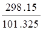
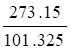
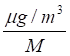
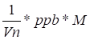
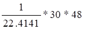

APPENDIX I
==========

Download the original word file  :download:`Appendix.docx <Appendix.docx>`

.. container:: WordSection1

   .. _Toc36708871:

   APPENDIX I

    

   Table IList of symbols and abbreviations\ `[p1] <#msocom-1>`__\ \  

    

   +-----------------+-----------------+-----------------+-----------------+
   | **Symbol /      | **Description** | **Unit**        | **Comment**     |
   | abbreviation**  |                 |                 |                 |
   +-----------------+-----------------+-----------------+-----------------+
   | esat            | Saturated water | kPa or Pa       | Used in g\ sto  |
   |                 | vapour pressure |                 | and PEt / AEt   |
   |                 |                 |                 | calculation and |
   |                 |                 |                 | Rn derivation   |
   +-----------------+-----------------+-----------------+-----------------+
   | eact            | Actual water    | kPa or Pa       | Used in PEt /   |
   |                 | vapour pressure |                 | AEt calculation |
   |                 |                 |                 | and Rn          |
   |                 |                 |                 | derivation      |
   +-----------------+-----------------+-----------------+-----------------+
   | VPD             | Water vapour    | kPa or Pa       | Used in g\ sto  |
   |                 | pressure        |                 | and PEt / AEt   |
   |                 | deficit         |                 | calculation and |
   |                 |                 |                 | Rn derivation   |
   +-----------------+-----------------+-----------------+-----------------+
   | Ts_c            | Temperature     | Degrees Celcius | Ts_c = Ts_k –   |
   |                 |                 |                 | 273.16          |
   +-----------------+-----------------+-----------------+-----------------+
   | Ts_k            | Temperature     | Kelvin          | Ts_k = Ts_c +   |
   |                 |                 |                 | 273.16          |
   +-----------------+-----------------+-----------------+-----------------+
   |                 |                 |                 |                 |
   +-----------------+-----------------+-----------------+-----------------+
   |                 |                 |                 |                 |
   +-----------------+-----------------+-----------------+-----------------+
   |                 |                 |                 |                 |
   +-----------------+-----------------+-----------------+-----------------+
   |                 |                 |                 |                 |
   +-----------------+-----------------+-----------------+-----------------+
   |                 |                 |                 |                 |
   +-----------------+-----------------+-----------------+-----------------+
   |                 |                 |                 |                 |
   +-----------------+-----------------+-----------------+-----------------+
   |                 |                 |                 |                 |
   +-----------------+-----------------+-----------------+-----------------+
   |                 |                 |                 |                 |
   +-----------------+-----------------+-----------------+-----------------+
   |                 |                 |                 |                 |
   +-----------------+-----------------+-----------------+-----------------+
   |                 |                 |                 |                 |
   +-----------------+-----------------+-----------------+-----------------+
   |                 |                 |                 |                 |
   +-----------------+-----------------+-----------------+-----------------+
   |                 |                 |                 |                 |
   +-----------------+-----------------+-----------------+-----------------+
   |                 |                 |                 |                 |
   +-----------------+-----------------+-----------------+-----------------+
   |                 |                 |                 |                 |
   +-----------------+-----------------+-----------------+-----------------+
   |                 |                 |                 |                 |
   +-----------------+-----------------+-----------------+-----------------+
   |                 |                 |                 |                 |
   +-----------------+-----------------+-----------------+-----------------+
   |                 |                 |                 |                 |
   +-----------------+-----------------+-----------------+-----------------+
   |                 |                 |                 |                 |
   +-----------------+-----------------+-----------------+-----------------+
   |                 |                 |                 |                 |
   +-----------------+-----------------+-----------------+-----------------+
   |                 |                 |                 |                 |
   +-----------------+-----------------+-----------------+-----------------+
   |                 |                 |                 |                 |
   +-----------------+-----------------+-----------------+-----------------+
   |                 |                 |                 |                 |
   +-----------------+-----------------+-----------------+-----------------+
   |                 |                 |                 |                 |
   +-----------------+-----------------+-----------------+-----------------+
   |                 |                 |                 |                 |
   +-----------------+-----------------+-----------------+-----------------+

    

    

.. container:: WordSection2

   APPENDIX I    List of variables

    

    

   +-----------------------+-----------------------+-----------------------+
   | Variable              | Unit                  | Equation              |
   +-----------------------+-----------------------+-----------------------+
   | **O\ 3 deposition**   |                       |                       |
   +-----------------------+-----------------------+-----------------------+
   | Total O\ 3            | nmol/m\ 2/s           |                       |
   | deposition, FO\ 3  in |                       |                       |
   | text as fO\ 3         |                       |                       |
   +-----------------------+-----------------------+-----------------------+
   | O\ 3 deposition       | mmol/m\ 2/s           | 1,2                   |
   | velocity, Vg in text  |                       |                       |
   | as V\ g               |                       |                       |
   +-----------------------+-----------------------+-----------------------+
   | O\ 3 concentration,   | nmol/mol              | 1                     |
   | O\ 3                  |                       |                       |
   +-----------------------+-----------------------+-----------------------+
   | Reference height at   | m                     | 1,2                   |
   | which variable        |                       |                       |
   | measured, z\ Ref      |                       |                       |
   +-----------------------+-----------------------+-----------------------+
   | ** **                 |                       |                       |
   +-----------------------+-----------------------+-----------------------+
   | **Atmospheric (Ra)    |                       |                       |
   | and boundary layer    |                       |                       |
   | (Rb) resistances**    |                       |                       |
   +-----------------------+-----------------------+-----------------------+
   | Atmospheric           | s/m                   | (2, 3, 18, 22)        |
   | resistance, Ra not    |                       |                       |
   | always in italic in   |                       |                       |
   | the  text             |                       |                       |
   +-----------------------+-----------------------+-----------------------+
   | Friction velocity,    | m/s                   | (3a, 3d, 4, 6)        |
   | u\* not always in     |                       |                       |
   | italic in the text    |                       |                       |
   +-----------------------+-----------------------+-----------------------+
   | Monin-Obukhov length, | -                     | (3a, 3b, 3c, 3f)      |
   | L not always in       |                       |                       |
   | italic in the text    |                       |                       |
   +-----------------------+-----------------------+-----------------------+
   | Displacement height,  | m                     | (3a, 3b, 3c)          |
   | d                     |                       |                       |
   +-----------------------+-----------------------+-----------------------+
   | Roughness length, zo  | m                     | (3a, 3b, 3c)          |
   | not in italic in the  |                       |                       |
   | text                  |                       |                       |
   +-----------------------+-----------------------+-----------------------+
   | Plant canopy height,  | m                     | (3a, 6)               |
   | h                     |                       |                       |
   +-----------------------+-----------------------+-----------------------+
   | Turbulent surface     | kg / m / s\ -2        | (3d)                  |
   | stress, τ             |                       |                       |
   +-----------------------+-----------------------+-----------------------+
   | Surface density of    | kg/m\ 3               | (3d)                  |
   | dry air, ρ            |                       |                       |
   +-----------------------+-----------------------+-----------------------+
   | Surface temperature,  | kelvin                | (3e)                  |
   | Tk in text as T\ k    |                       |                       |
   +-----------------------+-----------------------+-----------------------+
   | Specific heat         | ?                     | (3f)                  |
   | capacity of dry air,  |                       |                       |
   | c\ p in text as both  |                       |                       |
   | c\ p and Cp           |                       |                       |
   +-----------------------+-----------------------+-----------------------+
   | Sensible heat flux, H | W/m\ 2                | (3f)                  |
   | not in the text       |                       |                       |
   +-----------------------+-----------------------+-----------------------+
   |                       |                       |                       |
   +-----------------------+-----------------------+-----------------------+
   | **Surface resistance  |                       |                       |
   | (Rsur)**              |                       |                       |
   +-----------------------+-----------------------+-----------------------+
   | Surface resistance,   | s/m                   | (2, 5)                |
   | R\ sur written in the |                       |                       |
   | text as both Rsur and |                       |                       |
   | R\ sur                |                       |                       |
   +-----------------------+-----------------------+-----------------------+
   | Leaf Area Index, LAI  | m\ 2/m2               | (5, 7a, 7b, 8a, 8b)   |
   | not written in italic |                       |                       |
   | in the text           |                       |                       |
   +-----------------------+-----------------------+-----------------------+
   | Surface Area Index,   | m\ 2/m2               | (5, 6)                |
   | SAI not written in    |                       |                       |
   | italic in the text    |                       |                       |
   +-----------------------+-----------------------+-----------------------+
   | Leaf level stomatal   | m/s                   | (5)                   |
   | resistance to O\ 3,   |                       |                       |
   | r\ sto not always in  |                       |                       |
   | italic, sometimes     |                       |                       |
   | written as            |                       |                       |
   | rsto/R\ sto           |                       |                       |
   +-----------------------+-----------------------+-----------------------+
   | Leaf level plant      | m/s                   | (5)                   |
   | external resistance,  |                       |                       |
   | r\ extnot always in   |                       |                       |
   | italic in the text    |                       |                       |
   +-----------------------+-----------------------+-----------------------+
   | In-canopy resistance  | m/s                   | (5)                   |
   | to O\ 3, R\ inc not   |                       |                       |
   | always in italic in   |                       |                       |
   | the text, sometimes   |                       |                       |
   | written as rinc       |                       |                       |
   +-----------------------+-----------------------+-----------------------+
   | Soil surface          | m/s                   | (5)                   |
   | resistance to O\ 3,   |                       |                       |
   | R\ gs not always in   |                       |                       |
   | italics, sometimes    |                       |                       |
   | written as Rgs        |                       |                       |
   +-----------------------+-----------------------+-----------------------+
   | Year day, dd          | day                   | (7a, 7b, 10)          |
   +-----------------------+-----------------------+-----------------------+
   | Leaf level stomatal   | mmol/m\ 2/s           | (9)                   |
   | conductance to O\ 3,  |                       |                       |
   | g\ sto                |                       |                       |
   +-----------------------+-----------------------+-----------------------+
   | Maximum stomatal      | mmol/m\ 2/s           | (9)                   |
   | conductance to O\ 3   |                       |                       |
   | (gmax) not always in  |                       |                       |
   | italic, sometimes     |                       |                       |
   | written as gmax       |                       |                       |
   +-----------------------+-----------------------+-----------------------+
   | Minimum daytime       | -                     | (9)                   |
   | stomatal conductance  |                       |                       |
   | to O\ 3 (fmin) not    |                       |                       |
   | always in italic      |                       |                       |
   +-----------------------+-----------------------+-----------------------+
   | Maximum potential     | -                     | (9, 10)               |
   | conductance to O\ 3   |                       |                       |
   | over a species growth |                       |                       |
   | period (fphen) not    |                       |                       |
   | always in italic in   |                       |                       |
   | the text              |                       |                       |
   +-----------------------+-----------------------+-----------------------+
   | Stomatal conductance  | -                     | (9, 11)               |
   | response function for |                       |                       |
   | irradiance (flight)   |                       |                       |
   | not always in italics |                       |                       |
   +-----------------------+-----------------------+-----------------------+
   | Stomatal conductance  | -                     | (9, 12)               |
   | response function for |                       |                       |
   | air temperature       |                       |                       |
   | (ftemp) not always in |                       |                       |
   | italics               |                       |                       |
   +-----------------------+-----------------------+-----------------------+
   | Stomatal conductance  | -                     | (9, 13)               |
   | response function for |                       |                       |
   | air vapour pressure   |                       |                       |
   | deficit (fVPD) not    |                       |                       |
   | always in italic      |                       |                       |
   +-----------------------+-----------------------+-----------------------+
   | Stomatal conductance  | -                     | (9, 14)               |
   | response function for |                       |                       |
   | soil moisture (fSWP)  |                       |                       |
   | not always in italic  |                       |                       |
   | in the text           |                       |                       |
   +-----------------------+-----------------------+-----------------------+
   |                       |                       |                       |
   +-----------------------+-----------------------+-----------------------+
   | **Soil Water Balance  | ** **                 | ** **                 |
   | (Sn)**                |                       |                       |
   +-----------------------+-----------------------+-----------------------+
   | Species-specific      | m                     | (16)                  |
   | maximum root depth,   |                       |                       |
   | Rz not always in      |                       |                       |
   | italic                |                       |                       |
   +-----------------------+-----------------------+-----------------------+
   | Root zone soil water  | m\ 3/m3               | (15)                  |
   | storage capacity,     |                       |                       |
   | Sn\* not in italic in |                       |                       |
   | the text              |                       |                       |
   +-----------------------+-----------------------+-----------------------+
   | Root zone soil water  | mm                    | (16)                  |
   | storage, Sn not       |                       |                       |
   | always in italic      |                       |                       |
   +-----------------------+-----------------------+-----------------------+
   | Plant available soil  | m\ 3/m3               | (15, 19)              |
   | water, ASW same as    |                       |                       |
   | text                  |                       |                       |
   +-----------------------+-----------------------+-----------------------+
   | Field Capacity, FC    | m\ 3/m3               | (19)                  |
   | same as text          |                       |                       |
   +-----------------------+-----------------------+-----------------------+
   | Root zone soil water  | mm                    | (16)                  |
   | storage at the end of |                       |                       |
   | the preceding         |                       |                       |
   | day,S\ n-1 same as in |                       |                       |
   | text                  |                       |                       |
   +-----------------------+-----------------------+-----------------------+
   | Daily precipitation,  | mm                    | (16)                  |
   | P written as p in the |                       |                       |
   | text                  |                       |                       |
   +-----------------------+-----------------------+-----------------------+
   | Daily interception    | mm                    | (16, 17)              |
   | water loss, Ei        |                       |                       |
   | written as E\ i in    |                       |                       |
   | the text              |                       |                       |
   +-----------------------+-----------------------+-----------------------+
   | Soil water potential, | MPa                   | (14, 18)              |
   | Ψ same as in text     |                       |                       |
   +-----------------------+-----------------------+-----------------------+
   | Soil water potential  | MPa                   | (18)                  |
   | at air entry, Ψ\ e in |                       |                       |
   | italic in the text    |                       |                       |
   +-----------------------+-----------------------+-----------------------+
   | Soil water content, θ | m\ 3/\ m\ 3           | (18)                  |
   | is in                 |                       |                       |
   +-----------------------+-----------------------+-----------------------+
   | Saturated water       | m\ 3/\ m\ 3           | (18)                  |
   | content, θ\ sat not   |                       |                       |
   | in the text           |                       |                       |
   +-----------------------+-----------------------+-----------------------+
   | Soil water            | -                     | (18)                  |
   | co-efficient, b not   |                       |                       |
   | in the text           |                       |                       |
   +-----------------------+-----------------------+-----------------------+
   | Soil water potential  | MPa                   | (20)                  |
   | at plant specific     |                       |                       |
   | permanent wilting     |                       |                       |
   | point, Ψ\ min in      |                       |                       |
   | italic in the text    |                       |                       |
   +-----------------------+-----------------------+-----------------------+
   |                       |                       |                       |
   +-----------------------+-----------------------+-----------------------+
   | **Plant transpiration | ** **                 | ** **                 |
   | (Eat)**               |                       |                       |
   +-----------------------+-----------------------+-----------------------+
   | Daily actual          | mm                    | (16, 21)              |
   | transpiration, E\ at  |                       |                       |
   | not always in italics |                       |                       |
   | in the text           |                       |                       |
   +-----------------------+-----------------------+-----------------------+
   | Net radiation, Rn not | MJ m2/h               | (17, 21)              |
   | always in italics in  |                       |                       |
   | the text              |                       |                       |
   +-----------------------+-----------------------+-----------------------+
   | Soil heat flux, G     | MJ/m\ 2/h             | (17, 21)              |
   +-----------------------+-----------------------+-----------------------+
   | Mean air density, ρa  | Kg/m\ 3               | (17, 21)              |
   | not in text           |                       |                       |
   +-----------------------+-----------------------+-----------------------+
   | Specific heat         | MJ/kg/\ o\ C          | (17, 21)              |
   | capacity of dry, Cp   |                       |                       |
   | sometimes Cp and      |                       |                       |
   | sometimes c\ p in     |                       |                       |
   | text                  |                       |                       |
   +-----------------------+-----------------------+-----------------------+
   | Vapour pressure       | kPa                   | (17, 21)              |
   | deficit, e\ s-ea      |                       |                       |
   +-----------------------+-----------------------+-----------------------+
   | Latent heat of        | MJ/kg                 | (17, 21)              |
   | vaporisation, λ       |                       |                       |
   +-----------------------+-----------------------+-----------------------+
   | Psychrometric         | kPa/\ o\ C            | (17, 21)              |
   | constant, γ not       |                       |                       |
   | always in italic      |                       |                       |
   +-----------------------+-----------------------+-----------------------+
   | Boundary layer        | s/m                   | (17, 21)              |
   | resistance to water   |                       |                       |
   | vapour, R\ bH2O same  |                       |                       |
   | as in text            |                       |                       |
   +-----------------------+-----------------------+-----------------------+
   | Canopy stomatal       | s/m                   | (21)                  |
   | resistance to water   |                       |                       |
   | vapour,               |                       |                       |
   | R\ sto\ H\ 2\ O same  |                       |                       |
   | as in text            |                       |                       |
   +-----------------------+-----------------------+-----------------------+
   | Zr                    |                       |                       |
   +-----------------------+-----------------------+-----------------------+
   | Zl                    |                       |                       |
   +-----------------------+-----------------------+-----------------------+
   |                       |                       |                       |
   +-----------------------+-----------------------+-----------------------+
   |                       |                       |                       |
   +-----------------------+-----------------------+-----------------------+
   |                       |                       |                       |
   +-----------------------+-----------------------+-----------------------+
   |                       |                       |                       |
   +-----------------------+-----------------------+-----------------------+

.. container:: WordSection3

   Appendix II      List of constants

    

   +-----------------------+-----------------------+-----------------------+
   | Constants             | Unit                  | Equation              |
   +-----------------------+-----------------------+-----------------------+
   |                       |                       |                       |
   +-----------------------+-----------------------+-----------------------+
   | Von Karmans constant  | 0.41                  | (3a, 3f, 4)           |
   +-----------------------+-----------------------+-----------------------+
   | Mass gas constant for | XJ / Kg / K           | (3e)                  |
   | dry air, R\ mass in   |                       |                       |
   | text as Rmass, not in |                       |                       |
   | italic                |                       |                       |
   +-----------------------+-----------------------+-----------------------+
   | Gravitational         | 9.81 m / s\ 2         | (3f)                  |
   | acceleration, g       |                       |                       |
   +-----------------------+-----------------------+-----------------------+
   | Kinetic viscosity of  | 0.15 cm\ -2 s\ -1 at  | (4)                   |
   | air,  v               | 20°C                  |                       |
   +-----------------------+-----------------------+-----------------------+
   | Molecular diffusivity |                       | (4)                   |
   | of O\ 3, Di           |                       |                       |
   |                       |                       |                       |
   |                       |                       |                       |
   +-----------------------+-----------------------+-----------------------+
   | Prandtl number, Pr    | 0.72                  | (4)                   |
   +-----------------------+-----------------------+-----------------------+
   | In canopy resistance  | 14 s\ -1              | (6)                   |
   | empirical constant, b |                       |                       |
   +-----------------------+-----------------------+-----------------------+
   | External plant        | 2500 s / m            | (5)                   |
   | surface resistance,   |                       |                       |
   | R\ ext                |                       |                       |
   +-----------------------+-----------------------+-----------------------+
   | Soil surface          | 200 s / m             | (5)                   |
   | resistance, R\ soi in |                       |                       |
   | text as Rsoil, not    |                       |                       |
   | always in italic      |                       |                       |
   +-----------------------+-----------------------+-----------------------+
   | Saturated water       | m\ 3/m3               | (18)                  |
   | content,\ *θ*\ :sub:` |                       |                       |
   | sat`                  |                       |                       |
   +-----------------------+-----------------------+-----------------------+
   | Sandy loam            | 0.4                   |                       |
   +-----------------------+-----------------------+-----------------------+
   | Silt loam             | 0.4                   |                       |
   +-----------------------+-----------------------+-----------------------+
   | Loam                  | 0.4                   |                       |
   +-----------------------+-----------------------+-----------------------+
   | Clay loam             | 0.4                   |                       |
   +-----------------------+-----------------------+-----------------------+
   | Soil water potential  | m\ 3/m3               | (18)                  |
   | at air entry, Ψ\ e    |                       |                       |
   +-----------------------+-----------------------+-----------------------+
   | Sandy loam            | -9.10 x 10\ -4        |                       |
   +-----------------------+-----------------------+-----------------------+
   | Silt loam             | -1.58 x 10\ -3        |                       |
   +-----------------------+-----------------------+-----------------------+
   | Loam                  | -1.88 x 10\ -3        |                       |
   +-----------------------+-----------------------+-----------------------+
   | Clay loam             | -5.88 x 10\ -3        |                       |
   +-----------------------+-----------------------+-----------------------+
   | Soil water release    | -                     | (18)                  |
   | curve co-efficient, b |                       |                       |
   +-----------------------+-----------------------+-----------------------+
   | Sandy loam            | 3.31                  |                       |
   +-----------------------+-----------------------+-----------------------+
   | Silt loam             | 4.38                  |                       |
   +-----------------------+-----------------------+-----------------------+
   | Loam                  | 6.58                  |                       |
   +-----------------------+-----------------------+-----------------------+
   | Clay loam             | 7                     |                       |
   +-----------------------+-----------------------+-----------------------+
   |                       |                       |                       |
   +-----------------------+-----------------------+-----------------------+
   |                       |                       |                       |
   +-----------------------+-----------------------+-----------------------+

   \* all variables are defined on a projected leaf area basis

.. container:: WordSection4

   Appendix III     List of inputs for the interfaced version of the
   DO\ 3\ SE model.\ `[p2] <#msocom-2>`__\ \  

    

   ** **

   +-----------------+-----------------+-----------------+-----------------+
   | **Essential     | **units**       | **Comments**    | ** **           |
   | Site data**     |                 |                 |                 |
   +-----------------+-----------------+-----------------+-----------------+
   | Vegetation      |                 |                 |                 |
   | species/type    |                 |                 |                 |
   +-----------------+-----------------+-----------------+-----------------+
   | Soil texture    |                 |                 |                 |
   +-----------------+-----------------+-----------------+-----------------+
   | Longitude       | °               |                 |                 |
   +-----------------+-----------------+-----------------+-----------------+
   | Latitude        | °               |                 |                 |
   +-----------------+-----------------+-----------------+-----------------+
   | Elevation       | m               |                 |                 |
   +-----------------+-----------------+-----------------+-----------------+
   | Canopy height   | m               |                 |                 |
   +-----------------+-----------------+-----------------+-----------------+
   | Measurement     | m               |                 |                 |
   | height –   O\ 3 |                 |                 |                 |
   +-----------------+-----------------+-----------------+-----------------+
   |                 | m               |                 |                 |
   |                 |                 |                 |                 |
   |                 |                 |                 |                 |
   |                 |                 |                 |                 |
   | Windspeed       |                 |                 |                 |
   +-----------------+-----------------+-----------------+-----------------+
   |                 | m               |                 |                 |
   |                 |                 |                 |                 |
   |                 |                 |                 |                 |
   |                 |                 |                 |                 |
   | Other           |                 |                 |                 |
   | meteorology     |                 |                 |                 |
   +-----------------+-----------------+-----------------+-----------------+
   |                 |                 |                 |                 |
   +-----------------+-----------------+-----------------+-----------------+
   | **Essential     | ** **           | ** **           | ** **           |
   | Hourly data**   |                 |                 |                 |
   +-----------------+-----------------+-----------------+-----------------+
   | Year            |                 |                 |                 |
   +-----------------+-----------------+-----------------+-----------------+
   | Month           |                 |                 |                 |
   +-----------------+-----------------+-----------------+-----------------+
   | Day of Month    |                 |                 |                 |
   +-----------------+-----------------+-----------------+-----------------+
   | Day of Year     |                 |                 |                 |
   +-----------------+-----------------+-----------------+-----------------+
   | Hour (time)     |                 |                 |                 |
   +-----------------+-----------------+-----------------+-----------------+
   |                 |                 |                 |                 |
   +-----------------+-----------------+-----------------+-----------------+
   | Temperature     | °C              |                 |                 |
   +-----------------+-----------------+-----------------+-----------------+
   | VPD             | kPa             |                 |                 |
   +-----------------+-----------------+-----------------+-----------------+
   | Wind speed      | m s\ -1         |                 |                 |
   +-----------------+-----------------+-----------------+-----------------+
   | Precipitation   | mm              |                 |                 |
   +-----------------+-----------------+-----------------+-----------------+
   | Atmospheric     | kPa             |                 |                 |
   | pressure        |                 |                 |                 |
   +-----------------+-----------------+-----------------+-----------------+
   | O\ 3            | ppb             |                 |                 |
   | Concentration   |                 |                 |                 |
   +-----------------+-----------------+-----------------+-----------------+
   | LAI             | m\ 2 m\ -2      |                 |                 |
   +-----------------+-----------------+-----------------+-----------------+
   | Sensible heat   | mol m\ -2      |                 |                 |
   | flux HD         | s\ -1           |                 |                 |
   +-----------------+-----------------+-----------------+-----------------+
   |                 |                 |                 |                 |
   +-----------------+-----------------+-----------------+-----------------+
   |                 |                 |                 |                 |
   +-----------------+-----------------+-----------------+-----------------+
   |                 |                 |                 |                 |
   +-----------------+-----------------+-----------------+-----------------+
   | **Desirable     | These data are  |                 |                 |
   | Hourly data**   | required by the |                 |                 |
   |                 | DO\ 3\ SE model |                 |                 |
   |                 | and can be      |                 |                 |
   |                 | estimated from  |                 |                 |
   |                 | Essential       |                 |                 |
   |                 | variables       |                 |                 |
   +-----------------+-----------------+-----------------+-----------------+
   | Global          | Wh m\ -2        | Both R and PAR  |                 |
   | radiation       |                 | are required by |                 |
   |                 |                 | the DO\ 3\ SE   |                 |
   |                 |                 | model.  Where   |                 |
   |                 |                 | only one is     |                 |
   |                 |                 | entered this    |                 |
   |                 |                 | will be used to |                 |
   |                 |                 | derive the      |                 |
   |                 |                 | other.          |                 |
   +-----------------+-----------------+-----------------+-----------------+
   | PAR             | mol m\ -2      |                 |                 |
   |                 | s\ -1           |                 |                 |
   +-----------------+-----------------+-----------------+-----------------+
   | Net radiation   | Wh m\ -2 h\ -1  | Rn is derived   |                 |
   |                 |                 | from R, Td,     |                 |
   |                 |                 | Temp, VPD,      |                 |
   |                 |                 | elev, Lon, Lat  |                 |
   +-----------------+-----------------+-----------------+-----------------+
   | Soil heat flux  | Wh m\ -2 h\ -1  | G is derived    |                 |
   |                 |                 | from Rn         |                 |
   +-----------------+-----------------+-----------------+-----------------+
   | ustar           | m s\ -1         |                 | when ustar is   |
   |                 |                 |                 | not entered     |
   |                 |                 |                 | conditions of   |
   |                 |                 |                 | neutral         |
   |                 |                 |                 | stability are   |
   |                 |                 |                 | assumed         |
   +-----------------+-----------------+-----------------+-----------------+

    

    

.. container:: WordSection5

   APPENDIX III Conversions and derivations

   ** **

   .. _Toc36708872:

   \_

   .. rubric:: AIII.1 Unit conversions
      :name: aiii.1-unit-conversions

   * *

   .. _Toc36708873:

   \_

   .. rubric:: AIII.!.!. Radiation
      :name: aiii...-radiation

   Both global radiation (R Wh m\ -2) and photosynthetically active
   radiation\ `[B3] <#msocom-3>`__\ \  (PAR mol m\ -2 h\ -1) are
   required by the DO\ 3\ SE model.  If only one of these variable is
   entered, the model will derive the other using the conversion,

    

   PAR = R*0.45*4.57

   R = PAR/0.45/4.57

    

   Radiation data are entered in Wh m\ -2 and can be converted from
   other units (eg. MJ m-h-1) using Table X.  Where the DO3SE model
   converts energy terms from Wh m-2 these conversions are also used

    

   Table X. Conversion factors for radiation units

   +-------------+-------------+-------------+-------------+-------------+
   |             | Wh m\ -2    | J m\ -2     | MJ m\ -2    | MJ m\ -2    |
   |             |             | h\ -1       | h\ -1       | d\ -1       |
   +-------------+-------------+-------------+-------------+-------------+
   | 1 Wh m\ -2  | 1           | 3600        | 0.0036      | 0.0864      |
   +-------------+-------------+-------------+-------------+-------------+
   | 1 J m-2     | 0.000278    |             |             |             |
   | h\ -1       |             |             |             |             |
   +-------------+-------------+-------------+-------------+-------------+
   | 1 MJ m\ -2  | 277..8      |             |             |             |
   | h\ -1       |             |             |             |             |
   +-------------+-------------+-------------+-------------+-------------+
   | 1 MJ m\ -2  | 11.6        |             |             |             |
   | d\ -1       |             |             |             |             |
   +-------------+-------------+-------------+-------------+-------------+

    

   .. _Toc36708874:

   \_

   .. rubric:: AIII.1.2 Temperature
      :name: aiii.1.2-temperature

   Temperature in Kelvin = Temperature in degrees Celcius + 273.16

    

   .. _Toc36708875:

   \_

   .. rubric:: AIII.1.3 Water Vapour Pressure
      :name: aiii.1.3-water-vapour-pressure

   esat (Pa) = 611 \* exp((17.27*Ts_c)/(Ts_c+237.3))

    

   .. _Toc36708876:

   \_

   .. rubric:: AIII.1.4 Ozone concentration
      :name: aiii.1.4-ozone-concentration

   Estimation of the specific molar volume of an ideal gas (Vn)
   (incorporating variation in T and P in concentration derivation)

    

   **Vn** = R \* |image0| 

   T is the temperature in Kelvin [equal to :sup:`o`\ C + 273.15]

   P is the surface air pressure in kPa Pa

    

   e.g. 24.46554 = 8.314510 \* |image1|

    

   is the **Vn** at standard Pressure (101.325 kPa or 1 atm and
   25\ :sup:`o`\ C)

    

          22.4141 = 8.314510 \* |image2|

    

   is **Vn** at standard Pressure (101.325 kPa and 0\ :sup:`o`\ C)

    

   μg / m\ :sup:`3` to ppb

    

   ppb = Vn \* |image3|

    

   M is the molecular weight of the gas (i.e. for O\ :sub:`3` = 48g)

    

   e.g. if concentration = 60 mg/m\ :sup:`3` then ppb = 22.4141 \*
   |image4| = 30 ppb at standard temperature (25:sup:`o`\ C) and
   pressure.

    

   This is where the 0.5 conversion factor from μg / m\ :sup:`3` to ppb
   comes from.

    

    

   ppb to μg / m\ :sup:`3`

    

   μg / m\ :sup:`3` = |image5| 

    

   M is the molecular weight of the gas (i.e. for O\ :sub:`3` = 48g)

    

   e.g. if concentration = 30 ppb then mg/m\ :sup:`3` = |image6| = 60 mg
   / m\ :sup:`3`

    

    

   **mg / m\ 3 to nmol / m\ 3**

    

    

   48 g of O\ 3 = 1 mol O\ 3

   1 g of O\ 3  = 0.020833 mol O\ 3

   1 mg O\ 3   = 0.000 020833 mol O\ 3

   1mg O\ 3    = 0.000 000 020833 mol O\ 3

   1mg O\ 3    = 20.83 nmol O\ 3

   1mg / m\ 3 O\ 3 = 20.83 nmol /m3 O\ 3

    

   Therefore to convert ppb to nmol / m\ 3

   nmol / m\ :sup:`3` =

    

    

    

    

   AIII.2 Derivation of net radiation (R:sub:`n`)

   If possible, net radiation (R:sub:`n`) should be entered into the
   DO\ :sub:`3`\ SE model as input data.  However, where these data are
   not available R\ :sub:`n` will be estimated within the
   DO\ :sub:`3`\ SE model using derivations described in FAO (19??). 

    

   Global radiation (R) is entered into the DO\ :sub:`3`\ SE model as Wh
   m\ :sup:`-2` and is converted into MJ m-2 h-1 using the conversion
   factor given in Appendix X.

    

   R\ :sub:`n`  = R\ :sub:`­ns` – R\ :sub:`nl`

    

   Where R\ :sub:`ns` is net shortwave radiation (MJ m\ :sup:`-2`
   h\ :sup:`-1`) and Rnl is net longwave radiation (MJ m\ :sup:`-2`
   h\ :sup:`-1`).

    

   R\ :sub:`ns` = (1-)R

    

   Where  is a landcover specific constant representing albedo

    

   R\ nl = T\ k\ :sup:`4`\ (0.34-0.14 √e\ a) (1.35 (R/pR)-0.35

    

   Where s is the Stefan-Boltzman constant (4.903 10\ -9 MJ K\ -4 m\ -2
   h\ -1, T\ k is air temperature (°K), e\ a is the actual vapour
   pressure (kPa), R is the actual global radiation (MJ m\ -2 h\ -1) and
   pR is the potential global radiation (MJ m\ -2 h\ -1).

    

   T\ k= T\ c + 273.16

    

   Where T\ c is air temperature (°C)

    

   e\ a = e\ sat – VPD

    

   where e\ sat is the saturated vapour pressure (kPa) and VPD is the
   vapour pressure deficit (kPa)

    

   esat = 0.611exp(17.27T\ c/(Tc\ +237.3))

    

   pR =  (0.75 + 2 10\ -5\ z)R\ ext

    

   Where z is site elevation (m) and R\ ext is extraterrestrial
   radiation (MJ m\ -2 h\ -1)

    

   R\ ext= (12(60)/) G\ sc d\ r sin

    

   Where G\ sc is solar constant (0.0820 MJ m\ -2 min\ -1), d­\ r is the
   inverse relative distance Earth-Sun and sin is the solar elevation
   (see Irradiance, section XX)

    

   d\ r = 1 + 0.033cos ((2/365)J)

    

   where J is the Julian day.

    

   ** **

    

.. container::

   --------------

   .. container::

      .. container:: msocomtxt

         .. _msocom-1:

         \_msocom-1

          \ \ `[p1] <#msoanchor-1>`__\ fill in – task for Richard or
         Freya? Maybe better after contents page at beginning of
         document?

   .. container::

      .. container:: msocomtxt

         .. _msocom-2:

         \_msocom-2

          \ \ `[p2] <#msoanchor-2>`__\ Shift to a more prominent place
         in document?

   .. container::

      .. container:: msocomtxt

         .. _msocom-3:

         \_msocom-3

          \ \ `[B3] <#msoanchor-3>`__\ Think this should be referred to
         as PPFD…if units are micromoles m-2 s-1

