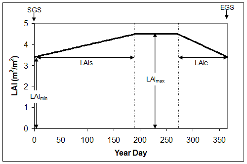

Phenology
=========

Download the original word file  :download:`Phenology.docx <Phenology.docx>`

.. container:: WordSection1

   .. _Hlk70078777:

   Phenology

   Estimation of growing season (SGS to EGS); using i. observations, ii.
   fixed time (latitude) and iii. Thermal time (o\ C Days).

    

    

   Contents

   `Old Documentation.3 <#toc70078864>`__

   `Phenology (SGS, EGS and fphen) and Canopy Structure (LAI and SAI)
   3 <#toc70078865>`__

   `Estimation of length of growth period (SGS and EGS) this chapter has
   to be updated – define what is of importance for
   interface.3 <#toc70078866>`__

   `Canopy level Fphen6 <#toc70078867>`__

   `Canopy Structure.20 <#toc70078868>`__

   `Glossary.25 <#toc70078869>`__

   `References.26 <#toc70078870>`__

    

   .. _Toc49267197:

   \_Toc49267197

   .. _Toc49348697:

    

   .. _Toc70078864:

   \_

   .. rubric:: Old Documentation
      :name: old-documentation

   Old documentation from Documentation of DO3SEmodel_Ver15.doc

   .. _Toc36708837:

   \_

   .. _Toc70078865:

   \_

   .. rubric:: Phenology (SGS, EGS and fphen) and Canopy Structure (LAI
      and SAI) [p1] 
      :name: phenology-sgs-egs-and-fphen-and-canopy-structure-lai-and-sai-p1

   A key driver of O\ 3 deposition to vegetated surfaces and stomatal
   O\ 3 flux is seasonality (i.e. the timing of the physiologically
   active growth period); this will primarily depend on geographical
   location but will also be influenced by land-cover type and species.
   Add an extra introductory descriptive para with a schematic that
   describes how SGS/EGS, F/fphen and LAI are all part of one approach
   accounting for seasonality of flux; also describe the difference
   between SGS/EGS and Astart/Aend

    

    

   .. _Toc70078866:

   \_

   .. rubric:: Estimation of length of growth period (SGS and EGS) this
      chapter has to be updated – define what is of importance for
      interface
      :name: estimation-of-length-of-growth-period-sgs-and-egs-this-chapter-has-to-be-updated-define-what-is-of-importance-for-interface

    

   .. rubric:: Forest Trees
      :name: forest-trees

   For forest trees the EMEP latitude model was developed to identify
   the timing of the growing season of the “generic” deciduous tree
   species (UNECE, 2004). This model gave good agreement with observed
   phenological data for a range of deciduous species (e.g. birch, beech
   and oak; see also Fig x), with measurements of carbon flux from
   CarboEurope (\ http://www.carboeurope.org/\ ) which were used to
   identify the initiation and cessation of physiological activity, and
   was also able to describe the onset of forest green-up and dormancy
   as determined from European remotely sensed data (Zhang et al. 2004);
   see UNECE (2004) for additional details.

   **Fig xComparison of observational phenological data with the EMEP
   latitude model. The black lines show the SGS and EGS determined with
   the EMEP latitude model. The green and orange lines show the onset of
   green-up and dormancy described by remotely sensed data for the year
   2001 (Zhang et al. 2004) and the vertical red lines show the
   variation in observed SGS and EGS dates for sites at specific
   latitudes for a number of different years. **

    

    

   The EMEP forest latitude model for the estimation of SGS and EGS is
   given below.

    

   .. container::

      SGS occurs at year day 105 at latitude 50\ o\ N. SGS will alter by
      1.5 day per degree latitude earlier on moving south and later on
      moving north.

       

      EGS occurs at year day 297 at latitude 50\ o\ N. EGS will alter by
      2 days per degree latitude earlier on moving north and later on
      moving south.

       

      The effect of altitude on phenology is incorporated by assuming a
      later SGS and earlier EGS by 10 days for every 1000 m a.s.l.

   `[p2] <#msocom-2>`__\ \  

   It is useful to define the physiologically active growth period using
   the terms SGS and EGS. SGS is defined as the date of leaf unfolding
   (deciduous & broadleaved evergreen species) or the start of
   leaf/needle physiological activity (coniferous and evergreen
   species). For the “real” species\ `[p3] <#msocom-3>`__\ \  , SGS is
   estimated by the EMEP latitude model with the exception of temperate
   conifers south of ~55\ o\ N, where SGS is defined by prevailing
   environmental conditions (using the f\ temp function), and for
   Mediterranean trees where a year round growth period is
   assumed\ `[p4] <#msocom-4>`__\ \  . EGS is defined as the onset of
   dormancy; the EMEP latitude model is used to identify EGS, again with
   the exception of temperate conifers south of ~55\ o\ N where EGS is
   defined by prevailing environmental conditions (using the f\ temp
   function) and for Mediterranean trees where a year round growth
   period is assumed. Table x summarises the methods used to derive SGS
   and EGS for different real species by forest type.

    

   .. rubric:: Crops
      :name: crops

   The EMEP Crop latitude model uses a simple function :-

    

   .. container::

      SGS occurs at year day 105 at latitude 50\ o\ N. SGS will alter by
      3.0 days per degree latitude earlier on moving south and later on
      moving north.\ `[p5] <#msocom-5>`__\ \  

    

   **Table (x)   Default deposition land-cover and species class
   methods/values for estimation of the start (SGS) and end (EGS) of the
   growing season.**

    

   +-------------+-------------+-------------+-------------+-------------+
   | **Land-cove | **Climate   | **SGS**     | **EGS**     | **Reference |
   | r           | region**    |             |             | **          |
   | type &      |             |             |             |             |
   | Species**   |             |             |             |             |
   +-------------+-------------+-------------+-------------+-------------+
   | ** **       |             |             |             |             |
   +-------------+-------------+-------------+-------------+-------------+
   | **Coniferou |             | EMEP Forest | EMEP Forest | UNECE       |
   | s           |             | Latitude    | Latitude    | (2004)      |
   | Forests     |             | model       | model       |             |
   | (CF)**      |             |             |             |             |
   +-------------+-------------+-------------+-------------+-------------+
   | Norway      | Northern    | EMEP Forest | EMEP Forest | UNECE       |
   | spruce      | Europe      | Latitude    | Latitude    | (2004)      |
   |             |             | model       | model       |             |
   | (Picea      |             |             |             |             |
   | abies)      |             |             |             |             |
   +-------------+-------------+-------------+-------------+-------------+
   | Scots Pine  | Atlantic    | f\ temp     | f\ temp     | UNECE       |
   |             | Central     |             |             | (2004)      |
   | (Pinus      | Europe      |             |             |             |
   | sylvestris) |             |             |             |             |
   +-------------+-------------+-------------+-------------+-------------+
   | Norway      | Continental | f\ temp     | f\ temp     | UNECE       |
   | Spruce      | Central     |             |             | (2004)      |
   |             | Europe      |             |             |             |
   | (Picea      |             |             |             |             |
   | abies)      |             |             |             |             |
   +-------------+-------------+-------------+-------------+-------------+
   | **Deciduous |             | EMEP Forest | EMEP Forest | UNECE       |
   | Forests**   |             | Latitude    | Latitude    | (2004)      |
   |             |             | model       | model       |             |
   | **(DF)**    |             |             |             |             |
   +-------------+-------------+-------------+-------------+-------------+
   | **Generic   | **All       | EMEP Forest | EMEP Forest | **UNECE     |
   | Deciduous** | Europe**    | Latitude    | Latitude    | (2004)**    |
   |             |             | model       | model       |             |
   +-------------+-------------+-------------+-------------+-------------+
   | Silver      | Northern    | EMEP Forest | EMEP Forest | UNECE       |
   | birch       | Europe      | Latitude    | Latitude    | (2004)      |
   |             |             | model       | model       |             |
   | (Betula     |             |             |             |             |
   | pendula)    |             |             |             |             |
   +-------------+-------------+-------------+-------------+-------------+
   | Beech       | Atlantic    | EMEP Forest | EMEP Forest | UNECE       |
   |             | Central     | Latitude    | Latitude    | (2004)      |
   | (Fagus      | Europe      | model       | model       |             |
   | sylvatica)  |             |             |             |             |
   +-------------+-------------+-------------+-------------+-------------+
   | Oak         | Atlantic    | EMEP Forest | EMEP Forest | UNECE       |
   |             | Central     | Latitude    | Latitude    | (2004)      |
   | (Quercus    | Europe      | model       | model       |             |
   | petraea &   |             |             |             |             |
   | robur)      |             |             |             |             |
   +-------------+-------------+-------------+-------------+-------------+
   | Beech       | Continental | EMEP Forest | EMEP Forest | UNECE       |
   |             | Central     | Latitude    | Latitude    | (2004)      |
   | (Fagus      | European    | model       | model       |             |
   | sylvatica)  |             |             |             |             |
   +-------------+-------------+-------------+-------------+-------------+
   | Beech       | Mediterrane | EMEP Forest | EMEP Forest | UNECE       |
   |             | an          | Latitude    | Latitude    | (2004)      |
   | (Fagus      | Europe      | model       | model       |             |
   | sylvatica)  |             |             |             |             |
   +-------------+-------------+-------------+-------------+-------------+
   | **Needlelea |             | **Year      | **Year      | UNECE       |
   | f           |             | round       | round       | (2004)      |
   | Forests**   |             | growth**    | growth**    |             |
   |             |             |             |             |             |
   | **(NF)**    |             |             |             |             |
   +-------------+-------------+-------------+-------------+-------------+
   | Aleppo Pine | Mediterrane | Year round  | Year round  | UNECE       |
   |             | an          | growth      | growth      | (2004)      |
   | *(Pinus     | Europe      |             |             |             |
   | halepensis) |             |             |             |             |
   | *           |             |             |             |             |
   +-------------+-------------+-------------+-------------+-------------+
   | **Broadleaf |             | Year round  | Year round  | UNECE       |
   | Forests**   |             | growth      | growth      | (2004)      |
   |             |             |             |             |             |
   | **(BF)**    |             |             |             |             |
   +-------------+-------------+-------------+-------------+-------------+
   | **Generic   | **All       | **Year      | **Year      | **UNECE     |
   | Evergreen   | Europe**    | round       | round       | (2004)**    |
   | Mediterrane |             | growth**    | growth**    |             |
   | an**        |             |             |             |             |
   +-------------+-------------+-------------+-------------+-------------+
   | Holm Oak    | Mediterrane | Year round  | Year round  | UNECE       |
   |             | an          | growth      | growth      | (2004)      |
   | (Quercus    | Europe      |             |             |             |
   | ilex)       |             |             |             |             |
   +-------------+-------------+-------------+-------------+-------------+
   | **Temperate |             | EMEP Crop   | = SGS + 90  | Simpson et  |
   | crops**     |             | Latitude    |             | al. (2003)  |
   |             |             | model       |             |             |
   | **(TC)**    |             |             |             |             |
   +-------------+-------------+-------------+-------------+-------------+
   | **Generic   | **All       | **= (2.57   | **= SGS +   | **UNECE     |
   | crop**      | Europe**    | \* latitude | 90**        | (2004)**    |
   |             |             | + 40) -     |             |             |
   |             |             | 50 **       |             |             |
   +-------------+-------------+-------------+-------------+-------------+
   | Wheat       | All Europe  | = (2.57 \*  | = SGS + 92  | UNECE       |
   |             |             | latitude +  |             | (2004);     |
   | (Triticum   |             | 40) - 50    |             |             |
   | aestivum)   |             |             |             |             |
   +-------------+-------------+-------------+-------------+-------------+
   | **Mediterra |             | EMEP Crop   | = SGS + 92  | Simpson et  |
   | nean        |             | Latitude    |             | al. (2003)  |
   | crops**     |             | model       |             |             |
   |             |             |             |             |             |
   | **(MC)**    |             |             |             |             |
   +-------------+-------------+-------------+-------------+-------------+
   | Maize       | All Europe  | 130         | 250         | ICP         |
   |             |             |             |             | Vegetation  |
   | *(Zea       |             |             |             | contract    |
   | mays)*      |             |             |             | report      |
   |             |             |             |             | (2006);     |
   +-------------+-------------+-------------+-------------+-------------+
   | Sunflower   | All Europe  | 150         | 250         | ICP         |
   |             |             |             |             | Vegetation  |
   | *(Helianthu |             |             |             | contract    |
   | s           |             |             |             | report      |
   | annuus)*    |             |             |             | (2006);     |
   +-------------+-------------+-------------+-------------+-------------+
   | Tomato      | All Europe  | 180         | 300         | ICP         |
   |             |             |             |             | Vegetation  |
   | *(Solanum   |             |             |             | contract    |
   | lycopersicu |             |             |             | report      |
   | m)*         |             |             |             | (2006);     |
   +-------------+-------------+-------------+-------------+-------------+
   | Grape vine  | All Europe  | 105         | 270         | ICP         |
   |             |             |             |             | Vegetation  |
   | *(Vitis     |             |             |             | contract    |
   | vinifera)*  |             |             |             | report      |
   |             |             |             |             | (2006);     |
   +-------------+-------------+-------------+-------------+-------------+
   | **Root      |             | 146         | 216         | Simpson et  |
   | crops**     |             |             |             | al. (2003); |
   |             |             |             |             | UNECE       |
   | **(RC)**    |             |             |             | (2004)      |
   +-------------+-------------+-------------+-------------+-------------+
   | Potato      | All Europe  | 146         | 266\ `[B6]  | UNECE       |
   |             |             |             | <#msocom-6> | (2004);     |
   | (Solanuum   |             |             | `__\ \      | Simpson et  |
   | tuberosum)  |             |             |             | al. (2003)  |
   +-------------+-------------+-------------+-------------+-------------+
   | **Semi-Natu |             | 1           | 365         | Simpson et  |
   | ral         |             |             |             | al. (2003)  |
   | /           |             |             |             |             |
   | Moorland**  |             |             |             |             |
   |             |             |             |             |             |
   | **(SNL)**   |             |             |             |             |
   +-------------+-------------+-------------+-------------+-------------+
   | **Grassland |             | 1           | 365         | Simpson et  |
   | **          |             |             |             | al. (2003)  |
   |             |             |             |             |             |
   | **(GR)**    |             |             |             |             |
   +-------------+-------------+-------------+-------------+-------------+
   | Perennial   | All Europe  | 1           | 365         | Simpson et  |
   | rye grass   |             |             |             | al. (2003)  |
   |             |             |             |             |             |
   | (Lolium     |             |             |             |             |
   | perenne)    |             |             |             |             |
   +-------------+-------------+-------------+-------------+-------------+
   | Clover      | All Europe  | 1           | 365         | Simpson et  |
   |             |             |             |             | al. (2003)  |
   | (Trifolium  |             |             |             |             |
   | repens)     |             |             |             |             |
   |             |             |             |             |             |
   |             |             |             |             |             |
   +-------------+-------------+-------------+-------------+-------------+
   | **Mediterra |             | 1           | 365         | Simpson et  |
   | nean        |             |             |             | al. (2003)  |
   | scrub**     |             |             |             |             |
   +-------------+-------------+-------------+-------------+-------------+

    

   .. rubric:: 3.1.  Estimation of canopy and leaf level gsto during the
      growth period (Fphen and fphen)
      :name: estimation-of-canopy-and-leaf-level-gsto-during-the-growth-period-fphen-and-fphen

    

   .. _Toc36708839:

   \_

   .. _Toc70078867:

   \_

   .. rubric:: Canopy level Fphen
      :name: canopy-level-fphen

    

   .. rubric:: Forest trees
      :name: forest-trees-1

   .. rubric:: Coniferous and deciduous forest species
      :name: coniferous-and-deciduous-forest-species

   For the “Coniferous” and “Deciduous” forests species the F\ phen
   parameterisation is based on data describing the increase and
   reduction in g\ sto with the onset and end of physiological activity
   (coniferous species) and the green growth period (deciduous species)
   respectively. The minimum length of these respective periods (see
   Tables V.A1 to V.A4) has been used in the parameterisation to ensure
   that periods when forests are potentially experiencing higher ozone
   uptake are incorporated in the risk assessment.

    

   For the beginning of the growing season the increase in g\ sto to
   g\ max will begin on the year day defined as SGS. The time to reach
   g\ max is defined by fphen\_e\ `[p7] <#msocom-7>`__\ \  . For the end
   of the growing season, the decrease in g\ sto from g\ max is defined
   by fphen\_f\ `[p8] <#msocom-8>`__\ \  and assumed to occur on the
   year day defined as EGS. Would be good to add schematic here....

    

   .. rubric:: Mediterranean evergreen forest species are updates
      available here?
      :name: mediterranean-evergreen-forest-species-are-updates-available-here

   For Mediterranean forests, the F\ phen value would ideally be set
   equal to 1 and the reduction in g\ sto that is frequently observed
   during the summer period would be estimated as a function of soil
   water status. However, if tested methods to determine soil water
   content for the “real” species and conditions are not available, it
   is recommended to default to the F\ phen relationship used previously
   for Mediterranean evergreen “generic” species (see notes for Table
   V.A4). This function acts as a surrogate for soil water stress and
   may also incorporate phenological limitations to g\ sto that have
   been suggested to occur during the summer. For example, a depletion
   in g\ sto for Holm Oak was found during summer even under apparent
   non-drought stress conditions (Alonso et al., 2008) suggesting both
   the F\ phen and f\ SWP terms may be required to estimate g\ sto. In
   conclusion it is recognised that further work is needed to improve
   methods to understand the influence of drought on g\ sto and hence
   O\ 3 uptake; for example, ideally, the onset of soil water stress
   would determine the timing and extent of leaf flushing avoiding
   inconsistencies that currently exist between assumed fixed periods of
   stress and leaf flushing.

    

   .. rubric:: Crops
      :name: crops-1

   …add text….

    

   A generic formulation for the canopy g\ sto relationship with canopy
   age (F\ phen) is given by the equations provided below. This allows
   the use of a consistent formulation irrespective of whether there is
   a mid-season dip in F\ phen (as is required to model F\ phen for some
   Mediterranean species in the absence of methods to simulate the
   effect of water stress on gsto) check equations:-

    

   Fphen = 0

   when dd £ SGS

    

   Fphen = ((1-Fphen_a)*((dd-SGS)/fphen1)+fphen_a)

   when SGS < dd£fphen1+SGS

    

   Fphen = Fphen_b

   when fphen1+SGS < dd£Fphen_limA

    

   Fphen = (1-fphen_c) \* (((fphen2 + Fphen_limA)  -  (Fphen_limA +
   (dd-Fphen_limA))) /fphen2) + fphen_c

   when Fphen_limA < dd < Fphen_limA + fphen2

    

   Fphen = Fphen_c

   when Fphen_limA + fphen2£dd£Fphen_limB - fphen3

    

   Fphen = (1-fphen_c) \* ((dd-(Fphen_limB - fphen3))/fphen3) + fphen_c

   when Fphen_limB - Fphen3 < dd < Fphen_limB

    

   Fphen = Fphen_d

   when Fphen_limB£dd£EGS - fphen4

    

   Fphen = (1-fphen_e) \* ((EGS-dd) / fphen4) + fphen_e

   when EGS - fphen4 < dd < EGS

    

   Fphen = 0

   When dd ≥ EGS

    

   Fig x. Generic function for Fphen relationship.

    

    

.. container:: WordSection2

   Table (x)          Default deposition land-cover and species class
   values for fphen parameters.

   Problem that Fphen2 and Fphen3 may not work if the growth period is
   in the wrong place i.e. for crops where the SGS starts later but the
   growth period is only short (i.e. for approx 100 days). Will work if
   can use SGS but not sure this is possible in the code???

    

   +----+----+----+----+----+----+----+----+----+----+----+----+----+----+
   | ** | ** | ** | ** | ** | ** | ** | ** | ** | ** | ** | ** | ** | ** |
   | La | Cl | F\ | F\ | F\ | F\ | F\ | F\ | F\ | F\ | F\ | F\ | F\ | Re |
   | nd | im |  p |  p |  p |  p |  p |  p |  p |  p |  p |  p |  p | fe |
   | -c | at | he | he | he | he | he | he | he | he | he | he | he | re |
   | ov | e  | n\ | n\ | n\ | n\ | n\ | n\ | n\ | n\ | n\ | n\ | n\ | nc |
   | er | re |  \ |  \ |  \ |  \ |  \ |  1 |  2 |  3 |  4 |  \ |  \ | e* |
   | ty | gi | _a | _b | _c | _d | _e | ** | ** | ** | ** | _l | _l | *  |
   | pe | on | ** | ** | ** | ** | ** |    |    |    |    | im | im |    |
   | &  | ** |    |    |    |    |    |    |    |    |    | A* | B* |    |
   | Sp |    |    |    |    |    |    |    |    |    |    | *  | *  |    |
   | ec |    |    |    |    |    |    |    |    |    |    |    |    |    |
   | ie |    |    |    |    |    |    |    |    |    |    |    |    |    |
   | s* |    |    |    |    |    |    |    |    |    |    |    |    |    |
   | *  |    |    |    |    |    |    |    |    |    |    |    |    |    |
   +----+----+----+----+----+----+----+----+----+----+----+----+----+----+
   | ** |    |    |    |    |    |    |    |    |    |    |    |    |    |
   |  * |    |    |    |    |    |    |    |    |    |    |    |    |    |
   | *  |    |    |    |    |    |    |    |    |    |    |    |    |    |
   +----+----+----+----+----+----+----+----+----+----+----+----+----+----+
   | ** |    | 0  | -  | 1  | -  | 0  | 30 | -  | -  | 35 | -  | -  |    |
   | Co |    |    | (1 |    | (1 |    |    | (2 | (2 |    | (0 | (0 |    |
   | ni |    |    | )  |    | )  |    |    | 00 | 00 |    | )  | )  |    |
   | fe |    |    |    |    |    |    |    | )  | )  |    |    |    |    |
   | ro |    |    |    |    |    |    |    |    |    |    |    |    |    |
   | us |    |    |    |    |    |    |    |    |    |    |    |    |    |
   | Fo |    |    |    |    |    |    |    |    |    |    |    |    |    |
   | re |    |    |    |    |    |    |    |    |    |    |    |    |    |
   | st |    |    |    |    |    |    |    |    |    |    |    |    |    |
   | s  |    |    |    |    |    |    |    |    |    |    |    |    |    |
   | (C |    |    |    |    |    |    |    |    |    |    |    |    |    |
   | F) |    |    |    |    |    |    |    |    |    |    |    |    |    |
   | ** |    |    |    |    |    |    |    |    |    |    |    |    |    |
   +----+----+----+----+----+----+----+----+----+----+----+----+----+----+
   | No | No | 0  | -  | 1  | -  | 0  | 20 | -  | -  | 30 | -  | -  | UN |
   | rw | rt |    | (1 |    | (1 |    |    | (2 | (2 |    | (0 | (0 | EC |
   | ay | he |    | )  |    | )  |    |    | 00 | 00 |    | )  | )  | E  |
   | sp | rn |    |    |    |    |    |    | )  | )  |    |    |    | (2 |
   | ru | Eu |    |    |    |    |    |    |    |    |    |    |    | 00 |
   | ce | ro |    |    |    |    |    |    |    |    |    |    |    | 4) |
   |    | pe |    |    |    |    |    |    |    |    |    |    |    |    |
   | (P |    |    |    |    |    |    |    |    |    |    |    |    |    |
   | ic |    |    |    |    |    |    |    |    |    |    |    |    |    |
   | ea |    |    |    |    |    |    |    |    |    |    |    |    |    |
   | ab |    |    |    |    |    |    |    |    |    |    |    |    |    |
   | ie |    |    |    |    |    |    |    |    |    |    |    |    |    |
   | s) |    |    |    |    |    |    |    |    |    |    |    |    |    |
   +----+----+----+----+----+----+----+----+----+----+----+----+----+----+
   | Sc | At | 0. | -  | 1  | -  | 0. | 40 | -  | -  | 40 | -  | -  | UN |
   | ot | la | 8  | (1 |    | (1 | 8  |    | (2 | (2 |    | (0 | (0 | EC |
   | s  | nt |    | )  |    | )  |    |    | 00 | 00 |    | )  | )  | E  |
   | Pi | ic |    |    |    |    |    |    | )  | )  |    |    |    | (2 |
   | ne | Ce |    |    |    |    |    |    |    |    |    |    |    | 00 |
   |    | nt |    |    |    |    |    |    |    |    |    |    |    | 4) |
   | (P | ra |    |    |    |    |    |    |    |    |    |    |    |    |
   | in | l  |    |    |    |    |    |    |    |    |    |    |    |    |
   | us | Eu |    |    |    |    |    |    |    |    |    |    |    |    |
   | sy | ro |    |    |    |    |    |    |    |    |    |    |    |    |
   | lv | pe |    |    |    |    |    |    |    |    |    |    |    |    |
   | es |    |    |    |    |    |    |    |    |    |    |    |    |    |
   | tr |    |    |    |    |    |    |    |    |    |    |    |    |    |
   | is |    |    |    |    |    |    |    |    |    |    |    |    |    |
   | )  |    |    |    |    |    |    |    |    |    |    |    |    |    |
   +----+----+----+----+----+----+----+----+----+----+----+----+----+----+
   | No | Co | 0  | -  | 1  | -  | 0  | 0  | -  | -  | 0  | -  | -  | UN |
   | rw | nt |    | (1 |    | (1 |    |    | (2 | (2 |    | (0 | (0 | EC |
   | ay | in |    | )  |    | )  |    |    | 00 | 00 |    | )  | )  | E  |
   | Sp | en |    |    |    |    |    |    | )  | )  |    |    |    | (2 |
   | ru | ta |    |    |    |    |    |    |    |    |    |    |    | 00 |
   | ce | l  |    |    |    |    |    |    |    |    |    |    |    | 4) |
   |    | Ce |    |    |    |    |    |    |    |    |    |    |    |    |
   | (P | nt |    |    |    |    |    |    |    |    |    |    |    |    |
   | ic | ra |    |    |    |    |    |    |    |    |    |    |    |    |
   | ea | l  |    |    |    |    |    |    |    |    |    |    |    |    |
   | ab | Eu |    |    |    |    |    |    |    |    |    |    |    |    |
   | ie | ro |    |    |    |    |    |    |    |    |    |    |    |    |
   | s) | pe |    |    |    |    |    |    |    |    |    |    |    |    |
   +----+----+----+----+----+----+----+----+----+----+----+----+----+----+
   | ** |    | 0  | -  | 1  | -  | 0  | 20 | -  | -  | 30 | -  | -  |    |
   | De |    |    | (1 |    | (1 |    |    | (2 | (2 |    | (0 | (0 |    |
   | ci |    |    | )  |    | )  |    |    | 00 | 00 |    | )  | )  |    |
   | du |    |    |    |    |    |    |    | )  | )  |    |    |    |    |
   | ou |    |    |    |    |    |    |    |    |    |    |    |    |    |
   | s  |    |    |    |    |    |    |    |    |    |    |    |    |    |
   | Fo |    |    |    |    |    |    |    |    |    |    |    |    |    |
   | re |    |    |    |    |    |    |    |    |    |    |    |    |    |
   | st |    |    |    |    |    |    |    |    |    |    |    |    |    |
   | s* |    |    |    |    |    |    |    |    |    |    |    |    |    |
   | *  |    |    |    |    |    |    |    |    |    |    |    |    |    |
   |    |    |    |    |    |    |    |    |    |    |    |    |    |    |
   | ** |    |    |    |    |    |    |    |    |    |    |    |    |    |
   | (D |    |    |    |    |    |    |    |    |    |    |    |    |    |
   | F) |    |    |    |    |    |    |    |    |    |    |    |    |    |
   | ** |    |    |    |    |    |    |    |    |    |    |    |    |    |
   +----+----+----+----+----+----+----+----+----+----+----+----+----+----+
   | ** | ** | 0  | -  | 1  | -  | 0  | 15 | -  | -  | 20 | -  | -  | ** |
   | Ge | Al |    | (1 |    | (1 |    |    | (2 | (2 |    | (0 | (0 | UN |
   | ne | l  |    | )  |    | )  |    |    | 00 | 00 |    | )  | )  | EC |
   | ri | Eu |    |    |    |    |    |    | )  | )  |    |    |    | E  |
   | c  | ro |    |    |    |    |    |    |    |    |    |    |    | (2 |
   | De | pe |    |    |    |    |    |    |    |    |    |    |    | 00 |
   | ci | ** |    |    |    |    |    |    |    |    |    |    |    | 4) |
   | du |    |    |    |    |    |    |    |    |    |    |    |    | ** |
   | ou |    |    |    |    |    |    |    |    |    |    |    |    |    |
   | s* |    |    |    |    |    |    |    |    |    |    |    |    |    |
   | *  |    |    |    |    |    |    |    |    |    |    |    |    |    |
   +----+----+----+----+----+----+----+----+----+----+----+----+----+----+
   | Si | No | 0  | -  | 1  | -  | 0  | 20 | -  | -  | 30 | -  | -  | UN |
   | lv | rt |    | (1 |    | (1 |    |    | (2 | (2 |    | (0 | (0 | EC |
   | er | he |    | )  |    | )  |    |    | 00 | 00 |    | )  | )  | E  |
   | bi | rn |    |    |    |    |    |    | )  | )  |    |    |    | (2 |
   | rc | Eu |    |    |    |    |    |    |    |    |    |    |    | 00 |
   | h  | ro |    |    |    |    |    |    |    |    |    |    |    | 4) |
   |    | pe |    |    |    |    |    |    |    |    |    |    |    |    |
   | (B |    |    |    |    |    |    |    |    |    |    |    |    |    |
   | et |    |    |    |    |    |    |    |    |    |    |    |    |    |
   | ul |    |    |    |    |    |    |    |    |    |    |    |    |    |
   | a  |    |    |    |    |    |    |    |    |    |    |    |    |    |
   | pe |    |    |    |    |    |    |    |    |    |    |    |    |    |
   | nd |    |    |    |    |    |    |    |    |    |    |    |    |    |
   | ul |    |    |    |    |    |    |    |    |    |    |    |    |    |
   | a) |    |    |    |    |    |    |    |    |    |    |    |    |    |
   +----+----+----+----+----+----+----+----+----+----+----+----+----+----+
   | Be | At |    |    |    |    |    |    |    |    |    |    |    | UN |
   | ec | la |    |    |    |    |    |    |    |    |    |    |    | EC |
   | h  | nt |    |    |    |    |    |    |    |    |    |    |    | E  |
   |    | ic |    |    |    |    |    |    |    |    |    |    |    | (2 |
   | (F | Ce |    |    |    |    |    |    |    |    |    |    |    | 00 |
   | ag | nt |    |    |    |    |    |    |    |    |    |    |    | 4) |
   | us | ra |    |    |    |    |    |    |    |    |    |    |    |    |
   | sy | l  |    |    |    |    |    |    |    |    |    |    |    |    |
   | lv | Eu |    |    |    |    |    |    |    |    |    |    |    |    |
   | at | ro |    |    |    |    |    |    |    |    |    |    |    |    |
   | ic | pe |    |    |    |    |    |    |    |    |    |    |    |    |
   | a) |    |    |    |    |    |    |    |    |    |    |    |    |    |
   +----+----+----+----+----+----+----+----+----+----+----+----+----+----+
   | Oa | At | 0  | -  | 1  | -  | 0  | 20 | -  | -  | 30 | -  | -  | UN |
   | k  | la |    | (1 |    | (1 |    |    | (2 | (2 |    | (0 | (0 | EC |
   |    | nt |    | )  |    | )  |    |    | 00 | 00 |    | )  | )  | E  |
   | (Q | ic |    |    |    |    |    |    | )  | )  |    |    |    | (2 |
   | ue | Ce |    |    |    |    |    |    |    |    |    |    |    | 00 |
   | rc | nt |    |    |    |    |    |    |    |    |    |    |    | 4) |
   | us | ra |    |    |    |    |    |    |    |    |    |    |    |    |
   | pe | l  |    |    |    |    |    |    |    |    |    |    |    |    |
   | tr | Eu |    |    |    |    |    |    |    |    |    |    |    |    |
   | ae | ro |    |    |    |    |    |    |    |    |    |    |    |    |
   | a  | pe |    |    |    |    |    |    |    |    |    |    |    |    |
   | &  |    |    |    |    |    |    |    |    |    |    |    |    |    |
   | ro |    |    |    |    |    |    |    |    |    |    |    |    |    |
   | bu |    |    |    |    |    |    |    |    |    |    |    |    |    |
   | r) |    |    |    |    |    |    |    |    |    |    |    |    |    |
   +----+----+----+----+----+----+----+----+----+----+----+----+----+----+
   | Be | Co | 0  | -  | 1  | -  | 0. | 20 | -  | -  | 20 | -  | -  | UN |
   | ec | nt |    | (1 |    | (1 | 4  |    | (2 | (2 |    | (0 | (0 | EC |
   | h  | in |    | )  |    | )  |    |    | 00 | 00 |    | )  | )  | E  |
   |    | en |    |    |    |    |    |    | )  | )  |    |    |    | (2 |
   | (F | ta |    |    |    |    |    |    |    |    |    |    |    | 00 |
   | ag | l  |    |    |    |    |    |    |    |    |    |    |    | 4) |
   | us | Ce |    |    |    |    |    |    |    |    |    |    |    |    |
   | sy | nt |    |    |    |    |    |    |    |    |    |    |    |    |
   | lv | ra |    |    |    |    |    |    |    |    |    |    |    |    |
   | at | l  |    |    |    |    |    |    |    |    |    |    |    |    |
   | ic | Eu |    |    |    |    |    |    |    |    |    |    |    |    |
   | a) | ro |    |    |    |    |    |    |    |    |    |    |    |    |
   |    | pe |    |    |    |    |    |    |    |    |    |    |    |    |
   |    | an |    |    |    |    |    |    |    |    |    |    |    |    |
   +----+----+----+----+----+----+----+----+----+----+----+----+----+----+
   | Be | Me | 0  | -  | 1  | -  | 0  | 15 | -  | -  | 20 | -  | -  | UN |
   | ec | di |    | (1 |    | (1 |    |    | (2 | (2 |    | (0 | (0 | EC |
   | h  | te |    | )  |    | )  |    |    | 00 | 00 |    | )  | )  | E  |
   |    | rr |    |    |    |    |    |    | )  | )  |    |    |    | (2 |
   | (F | an |    |    |    |    |    |    |    |    |    |    |    | 00 |
   | ag | ea |    |    |    |    |    |    |    |    |    |    |    | 4) |
   | us | n  |    |    |    |    |    |    |    |    |    |    |    |    |
   | sy | Eu |    |    |    |    |    |    |    |    |    |    |    |    |
   | lv | ro |    |    |    |    |    |    |    |    |    |    |    |    |
   | at | pe |    |    |    |    |    |    |    |    |    |    |    |    |
   | ic |    |    |    |    |    |    |    |    |    |    |    |    |    |
   | a) |    |    |    |    |    |    |    |    |    |    |    |    |    |
   +----+----+----+----+----+----+----+----+----+----+----+----+----+----+
   | ** |    | 1  | 1  | 0. | 1  | 1  | -  | 13 | 60 | -  | 80 | 32 |    |
   | Ne |    |    |    | 3  |    |    | (0 | 0  |    | (0 |    | 0  |    |
   | ed |    |    |    |    |    |    | )  |    |    | )  |    |    |    |
   | le |    |    |    |    |    |    |    |    |    |    |    |    |    |
   | le |    |    |    |    |    |    |    |    |    |    |    |    |    |
   | af |    |    |    |    |    |    |    |    |    |    |    |    |    |
   | Fo |    |    |    |    |    |    |    |    |    |    |    |    |    |
   | re |    |    |    |    |    |    |    |    |    |    |    |    |    |
   | st |    |    |    |    |    |    |    |    |    |    |    |    |    |
   | s* |    |    |    |    |    |    |    |    |    |    |    |    |    |
   | *  |    |    |    |    |    |    |    |    |    |    |    |    |    |
   |    |    |    |    |    |    |    |    |    |    |    |    |    |    |
   | ** |    |    |    |    |    |    |    |    |    |    |    |    |    |
   | (N |    |    |    |    |    |    |    |    |    |    |    |    |    |
   | F) |    |    |    |    |    |    |    |    |    |    |    |    |    |
   | ** |    |    |    |    |    |    |    |    |    |    |    |    |    |
   +----+----+----+----+----+----+----+----+----+----+----+----+----+----+
   | Al | Me | 1  | 1  | 0. | 1  | 1  | -  | 13 | 60 | -  | 80 | 32 | UN |
   | ep | di |    |    | 3  |    |    | (0 | 0  |    | (0 |    | 0  | EC |
   | po | te |    |    |    |    |    | )  |    |    | )  |    |    | E  |
   | Pi | rr |    |    |    |    |    |    |    |    |    |    |    | (2 |
   | ne | an |    |    |    |    |    |    |    |    |    |    |    | 00 |
   |    | ea |    |    |    |    |    |    |    |    |    |    |    | 4) |
   | *( | n  |    |    |    |    |    |    |    |    |    |    |    | ;  |
   | Pi | Eu |    |    |    |    |    |    |    |    |    |    |    |    |
   | nu | ro |    |    |    |    |    |    |    |    |    |    |    |    |
   | s  | pe |    |    |    |    |    |    |    |    |    |    |    |    |
   | ha |    |    |    |    |    |    |    |    |    |    |    |    |    |
   | le |    |    |    |    |    |    |    |    |    |    |    |    |    |
   | pe |    |    |    |    |    |    |    |    |    |    |    |    |    |
   | ns |    |    |    |    |    |    |    |    |    |    |    |    |    |
   | is |    |    |    |    |    |    |    |    |    |    |    |    |    |
   | )* |    |    |    |    |    |    |    |    |    |    |    |    |    |
   +----+----+----+----+----+----+----+----+----+----+----+----+----+----+
   | ** |    | 1  | 1  | 0. | 1  | 1  | -  | 13 | 60 | -  | 80 | 32 |    |
   | Br |    |    |    | 1  |    |    | (0 | 0  |    | (0 |    | 0  |    |
   | oa |    |    |    |    |    |    | )  |    |    | )  |    |    |    |
   | dl |    |    |    |    |    |    |    |    |    |    |    |    |    |
   | ea |    |    |    |    |    |    |    |    |    |    |    |    |    |
   | f  |    |    |    |    |    |    |    |    |    |    |    |    |    |
   | Fo |    |    |    |    |    |    |    |    |    |    |    |    |    |
   | re |    |    |    |    |    |    |    |    |    |    |    |    |    |
   | st |    |    |    |    |    |    |    |    |    |    |    |    |    |
   | s* |    |    |    |    |    |    |    |    |    |    |    |    |    |
   | *  |    |    |    |    |    |    |    |    |    |    |    |    |    |
   |    |    |    |    |    |    |    |    |    |    |    |    |    |    |
   | ** |    |    |    |    |    |    |    |    |    |    |    |    |    |
   | (B |    |    |    |    |    |    |    |    |    |    |    |    |    |
   | F) |    |    |    |    |    |    |    |    |    |    |    |    |    |
   | ** |    |    |    |    |    |    |    |    |    |    |    |    |    |
   +----+----+----+----+----+----+----+----+----+----+----+----+----+----+
   | ** | ** | ** | ** | ** | ** | ** | ** | ** | ** | ** | ** | ** | ** |
   | Ge | Al | 1* | 1* | 0. | 1* | 1* | -  | 13 | 60 | -  | 80 | 32 | UN |
   | ne | l  | *  | *  | 1* | *  | *  | (0 | 0* | ** | (0 | ** | 0* | EC |
   | ri | Eu |    |    | *  |    |    | )* | *  |    | )* |    | *  | E  |
   | c  | ro |    |    |    |    |    | *  |    |    | *  |    |    | (2 |
   | Ev | pe |    |    |    |    |    |    |    |    |    |    |    | 00 |
   | er | ** |    |    |    |    |    |    |    |    |    |    |    | 4) |
   | gr |    |    |    |    |    |    |    |    |    |    |    |    | ** |
   | ee |    |    |    |    |    |    |    |    |    |    |    |    |    |
   | n  |    |    |    |    |    |    |    |    |    |    |    |    |    |
   | Me |    |    |    |    |    |    |    |    |    |    |    |    |    |
   | di |    |    |    |    |    |    |    |    |    |    |    |    |    |
   | te |    |    |    |    |    |    |    |    |    |    |    |    |    |
   | rr |    |    |    |    |    |    |    |    |    |    |    |    |    |
   | an |    |    |    |    |    |    |    |    |    |    |    |    |    |
   | ea |    |    |    |    |    |    |    |    |    |    |    |    |    |
   | n* |    |    |    |    |    |    |    |    |    |    |    |    |    |
   | *  |    |    |    |    |    |    |    |    |    |    |    |    |    |
   +----+----+----+----+----+----+----+----+----+----+----+----+----+----+
   | Ho | Me | 1  | 1  | 0. | 1  | 1  | -  | 13 | 60 | -  | 80 | 32 | UN |
   | lm | di |    |    | 1  |    |    | (0 | 0  |    | (0 |    | 0  | EC |
   | Oa | te |    |    |    |    |    | )  |    |    | )  |    |    | E  |
   | k  | rr |    |    |    |    |    |    |    |    |    |    |    | (2 |
   |    | an |    |    |    |    |    |    |    |    |    |    |    | 00 |
   | (Q | ea |    |    |    |    |    |    |    |    |    |    |    | 4) |
   | ue | n  |    |    |    |    |    |    |    |    |    |    |    |    |
   | rc | Eu |    |    |    |    |    |    |    |    |    |    |    |    |
   | us | ro |    |    |    |    |    |    |    |    |    |    |    |    |
   | il | pe |    |    |    |    |    |    |    |    |    |    |    |    |
   | ex |    |    |    |    |    |    |    |    |    |    |    |    |    |
   | )  |    |    |    |    |    |    |    |    |    |    |    |    |    |
   +----+----+----+----+----+----+----+----+----+----+----+----+----+----+
   | ** |    | 0. | -  | 1  | -  | 0. | 0  | -  | -  | 45 | -  | -  | Si |
   | Te |    | 1  | (1 |    | (1 | 1  |    | (S | (2 |    | (0 | (0 | mp |
   | mp |    |    | )  |    | )  |    |    | GS | 00 |    | )  | )  | so |
   | er |    |    |    |    |    |    |    | )  | )  |    |    |    | n  |
   | at |    |    |    |    |    |    |    |    |    |    |    |    | et |
   | e  |    |    |    |    |    |    |    |    |    |    |    |    | al |
   | cr |    |    |    |    |    |    |    |    |    |    |    |    | .  |
   | op |    |    |    |    |    |    |    |    |    |    |    |    | (2 |
   | s* |    |    |    |    |    |    |    |    |    |    |    |    | 00 |
   | *  |    |    |    |    |    |    |    |    |    |    |    |    | 3) |
   |    |    |    |    |    |    |    |    |    |    |    |    |    |    |
   | ** |    |    |    |    |    |    |    |    |    |    |    |    |    |
   | (T |    |    |    |    |    |    |    |    |    |    |    |    |    |
   | C) |    |    |    |    |    |    |    |    |    |    |    |    |    |
   | ** |    |    |    |    |    |    |    |    |    |    |    |    |    |
   +----+----+----+----+----+----+----+----+----+----+----+----+----+----+
   | ** | ** | 0. | -  | 1  | -  | 0. | 0  | -  | -  | 45 | -  | -  | ** |
   | Ge | Al | 1  | (1 |    | (1 | 1  |    | (S | (2 |    | (0 | (0 | UN |
   | ne | l  |    | )  |    | )  |    |    | GS | 00 |    | )  | )  | EC |
   | ri | Eu |    |    |    |    |    |    | )  | )  |    |    |    | E  |
   | c  | ro |    |    |    |    |    |    |    |    |    |    |    | (2 |
   | cr | pe |    |    |    |    |    |    |    |    |    |    |    | 00 |
   | op | ** |    |    |    |    |    |    |    |    |    |    |    | 4) |
   | ** |    |    |    |    |    |    |    |    |    |    |    |    | ** |
   +----+----+----+----+----+----+----+----+----+----+----+----+----+----+
   | Wh | Al | 0. | -  | 1  | -  | 0. | 0  | -  | -  | 45 | -  | -  | UN |
   | ea | l  | 1  | (1 |    | (1 | 1  |    | (S | (2 |    | (0 | (0 | EC |
   | t  | Eu |    | )  |    | )  |    |    | GS | 00 |    | )  | )  | E  |
   |    | ro |    |    |    |    |    |    | )  | )  |    |    |    | (2 |
   | (T | pe |    |    |    |    |    |    |    |    |    |    |    | 00 |
   | ri |    |    |    |    |    |    |    |    |    |    |    |    | 4) |
   | ti |    |    |    |    |    |    |    |    |    |    |    |    | ;  |
   | cu |    |    |    |    |    |    |    |    |    |    |    |    |    |
   | m  |    |    |    |    |    |    |    |    |    |    |    |    |    |
   | ae |    |    |    |    |    |    |    |    |    |    |    |    |    |
   | st |    |    |    |    |    |    |    |    |    |    |    |    |    |
   | iv |    |    |    |    |    |    |    |    |    |    |    |    |    |
   | um |    |    |    |    |    |    |    |    |    |    |    |    |    |
   | )  |    |    |    |    |    |    |    |    |    |    |    |    |    |
   +----+----+----+----+----+----+----+----+----+----+----+----+----+----+
   | ** |    | 0. | -  | 1  | -  | 0. | 0  | -  | -  | 45 | -  | -  | Si |
   | Me |    | 1  | (1 |    | (1 | 1  |    | (S | (2 |    | (0 | (0 | mp |
   | di |    |    | )  |    | )  |    |    | GS | 00 |    | )  | )  | so |
   | te |    |    |    |    |    |    |    | )  | )  |    |    |    | n  |
   | rr |    |    |    |    |    |    |    |    |    |    |    |    | et |
   | an |    |    |    |    |    |    |    |    |    |    |    |    | al |
   | ea |    |    |    |    |    |    |    |    |    |    |    |    | .  |
   | n  |    |    |    |    |    |    |    |    |    |    |    |    | (2 |
   | cr |    |    |    |    |    |    |    |    |    |    |    |    | 00 |
   | op |    |    |    |    |    |    |    |    |    |    |    |    | 3) |
   | s* |    |    |    |    |    |    |    |    |    |    |    |    |    |
   | *  |    |    |    |    |    |    |    |    |    |    |    |    |    |
   |    |    |    |    |    |    |    |    |    |    |    |    |    |    |
   | ** |    |    |    |    |    |    |    |    |    |    |    |    |    |
   | (M |    |    |    |    |    |    |    |    |    |    |    |    |    |
   | C) |    |    |    |    |    |    |    |    |    |    |    |    |    |
   | ** |    |    |    |    |    |    |    |    |    |    |    |    |    |
   +----+----+----+----+----+----+----+----+----+----+----+----+----+----+
   | Ma | Al | 0. | -  | 1  | -  | 0. | 0  | -  | -  | 45 | -  | -  | Si |
   | iz | l  | 1  | (1 |    | (1 | 1  |    | (S | (2 |    | (0 | (0 | mp |
   | e  | Eu |    | )  |    | )  |    |    | GS | 00 |    | )  | )  | so |
   |    | ro |    |    |    |    |    |    | )  | )  |    |    |    | n  |
   | *( | pe |    |    |    |    |    |    |    |    |    |    |    | et |
   | Ze |    |    |    |    |    |    |    |    |    |    |    |    | al |
   | a  |    |    |    |    |    |    |    |    |    |    |    |    | .  |
   | ma |    |    |    |    |    |    |    |    |    |    |    |    | (2 |
   | ys |    |    |    |    |    |    |    |    |    |    |    |    | 00 |
   | )* |    |    |    |    |    |    |    |    |    |    |    |    | 3) |
   +----+----+----+----+----+----+----+----+----+----+----+----+----+----+
   | Su | Al | 0. | -  | 1  | -  | 0. | 34 | -  | -  | 34 | -  | -  | IC |
   | nf | l  | 6  | (1 |    | (1 | 4  |    | (2 | (2 |    | (0 | (0 | P  |
   | lo | Eu |    | )  |    | )  |    |    | 00 | 00 |    | )  | )  | Ve |
   | we | ro |    |    |    |    |    |    | )  | )  |    |    |    | ge |
   | r  | pe |    |    |    |    |    |    |    |    |    |    |    | ta |
   |    |    |    |    |    |    |    |    |    |    |    |    |    | ti |
   | *( |    |    |    |    |    |    |    |    |    |    |    |    | on |
   | He |    |    |    |    |    |    |    |    |    |    |    |    | co |
   | li |    |    |    |    |    |    |    |    |    |    |    |    | nt |
   | an |    |    |    |    |    |    |    |    |    |    |    |    | ra |
   | th |    |    |    |    |    |    |    |    |    |    |    |    | ct |
   | us |    |    |    |    |    |    |    |    |    |    |    |    | re |
   | an |    |    |    |    |    |    |    |    |    |    |    |    | po |
   | nu |    |    |    |    |    |    |    |    |    |    |    |    | rt |
   | us |    |    |    |    |    |    |    |    |    |    |    |    | (2 |
   | )* |    |    |    |    |    |    |    |    |    |    |    |    | 00 |
   |    |    |    |    |    |    |    |    |    |    |    |    |    | 6) |
   |    |    |    |    |    |    |    |    |    |    |    |    |    | ;  |
   +----+----+----+----+----+----+----+----+----+----+----+----+----+----+
   | To | Al | 0. | -  | 1  | -  | 0. | 0  | -  | -  | 45 | -  | -  | IC |
   | ma | l  | 1  | (1 |    | (1 | 1  |    | (S | (2 |    | (0 | (0 | P  |
   | to | Eu |    | )  |    | )  |    |    | GS | 00 |    | )  | )  | Ve |
   |    | ro |    |    |    |    |    |    | )  | )  |    |    |    | ge |
   | *( | pe |    |    |    |    |    |    |    |    |    |    |    | ta |
   | So |    |    |    |    |    |    |    |    |    |    |    |    | ti |
   | la |    |    |    |    |    |    |    |    |    |    |    |    | on |
   | nu |    |    |    |    |    |    |    |    |    |    |    |    | co |
   | m  |    |    |    |    |    |    |    |    |    |    |    |    | nt |
   | ly |    |    |    |    |    |    |    |    |    |    |    |    | ra |
   | co |    |    |    |    |    |    |    |    |    |    |    |    | ct |
   | pe |    |    |    |    |    |    |    |    |    |    |    |    | re |
   | rs |    |    |    |    |    |    |    |    |    |    |    |    | po |
   | ic |    |    |    |    |    |    |    |    |    |    |    |    | rt |
   | um |    |    |    |    |    |    |    |    |    |    |    |    | (2 |
   | )* |    |    |    |    |    |    |    |    |    |    |    |    | 00 |
   |    |    |    |    |    |    |    |    |    |    |    |    |    | 6) |
   |    |    |    |    |    |    |    |    |    |    |    |    |    | ;  |
   +----+----+----+----+----+----+----+----+----+----+----+----+----+----+
   | Gr | Al | 0. | -  | 1  | -  | 0. | 60 | -  | -  | 45 | -  | -  | IC |
   | ap | l  | 2  | (1 |    | (1 | 2  |    | (2 | (2 |    | (0 | (0 | P  |
   | e  | Eu |    | )  |    | )  |    |    | 00 | 00 |    | )  | )  | Ve |
   | vi | ro |    |    |    |    |    |    | )  | )  |    |    |    | ge |
   | ne | pe |    |    |    |    |    |    |    |    |    |    |    | ta |
   |    |    |    |    |    |    |    |    |    |    |    |    |    | ti |
   | *( |    |    |    |    |    |    |    |    |    |    |    |    | on |
   | Vi |    |    |    |    |    |    |    |    |    |    |    |    | co |
   | ti |    |    |    |    |    |    |    |    |    |    |    |    | nt |
   | s  |    |    |    |    |    |    |    |    |    |    |    |    | ra |
   | vi |    |    |    |    |    |    |    |    |    |    |    |    | ct |
   | ni |    |    |    |    |    |    |    |    |    |    |    |    | re |
   | fe |    |    |    |    |    |    |    |    |    |    |    |    | po |
   | ra |    |    |    |    |    |    |    |    |    |    |    |    | rt |
   | )* |    |    |    |    |    |    |    |    |    |    |    |    | (2 |
   |    |    |    |    |    |    |    |    |    |    |    |    |    | 00 |
   |    |    |    |    |    |    |    |    |    |    |    |    |    | 6) |
   |    |    |    |    |    |    |    |    |    |    |    |    |    | ;  |
   +----+----+----+----+----+----+----+----+----+----+----+----+----+----+
   | ** |    | 0. | -  | 1  | -  | 0. | 20 | -  | -  | 45 | -  | -  | Si |
   | Ro |    | 2  | (1 |    | (1 | 2  |    | (S | (2 |    | (0 | (0 | mp |
   | ot |    |    | )  |    | )  |    |    | GS | 00 |    | )  | )  | so |
   | cr |    |    |    |    |    |    |    | )  | )  |    |    |    | n  |
   | op |    |    |    |    |    |    |    |    |    |    |    |    | et |
   | s* |    |    |    |    |    |    |    |    |    |    |    |    | al |
   | *  |    |    |    |    |    |    |    |    |    |    |    |    | .  |
   |    |    |    |    |    |    |    |    |    |    |    |    |    | (2 |
   | ** |    |    |    |    |    |    |    |    |    |    |    |    | 00 |
   | (R |    |    |    |    |    |    |    |    |    |    |    |    | 3) |
   | C) |    |    |    |    |    |    |    |    |    |    |    |    |    |
   | ** |    |    |    |    |    |    |    |    |    |    |    |    |    |
   +----+----+----+----+----+----+----+----+----+----+----+----+----+----+
   | Po | Al | 0. | -  | 1  | -  | 0. | 20 | -  | -  | 45 | -  | -  | UN |
   | ta | l  | 2  | (1 |    | (1 | 2  |    | (S | (2 |    | (0 | (0 | EC |
   | to | Eu |    | )  |    | )  |    |    | GS | 00 |    | )  | )  | E  |
   |    | ro |    |    |    |    |    |    | )  | )  |    |    |    | (2 |
   | (S | pe |    |    |    |    |    |    |    |    |    |    |    | 00 |
   | ol |    |    |    |    |    |    |    |    |    |    |    |    | 4) |
   | an |    |    |    |    |    |    |    |    |    |    |    |    | ;  |
   | uu |    |    |    |    |    |    |    |    |    |    |    |    |    |
   | m  |    |    |    |    |    |    |    |    |    |    |    |    |    |
   | tu |    |    |    |    |    |    |    |    |    |    |    |    |    |
   | be |    |    |    |    |    |    |    |    |    |    |    |    |    |
   | ro |    |    |    |    |    |    |    |    |    |    |    |    |    |
   | su |    |    |    |    |    |    |    |    |    |    |    |    |    |
   | m) |    |    |    |    |    |    |    |    |    |    |    |    |    |
   +----+----+----+----+----+----+----+----+----+----+----+----+----+----+
   | ** |    | 0. | -  | 1  | -  | 0. | 0  | -  | -  | 45 | -  | -  | Si |
   | Se |    | 1  | (1 |    | (1 | 1  |    | (S | (2 |    | (0 | (0 | mp |
   | mi |    |    | )  |    | )  |    |    | GS | 00 |    | )  | )  | so |
   | -N |    |    |    |    |    |    |    | )  | )  |    |    |    | n  |
   | at |    |    |    |    |    |    |    |    |    |    |    |    | et |
   | ur |    |    |    |    |    |    |    |    |    |    |    |    | al |
   | al |    |    |    |    |    |    |    |    |    |    |    |    | .  |
   | /  |    |    |    |    |    |    |    |    |    |    |    |    | (2 |
   | Mo |    |    |    |    |    |    |    |    |    |    |    |    | 00 |
   | or |    |    |    |    |    |    |    |    |    |    |    |    | 3) |
   | la |    |    |    |    |    |    |    |    |    |    |    |    |    |
   | nd |    |    |    |    |    |    |    |    |    |    |    |    |    |
   | ** |    |    |    |    |    |    |    |    |    |    |    |    |    |
   |    |    |    |    |    |    |    |    |    |    |    |    |    |    |
   | ** |    |    |    |    |    |    |    |    |    |    |    |    |    |
   | (S |    |    |    |    |    |    |    |    |    |    |    |    |    |
   | NL |    |    |    |    |    |    |    |    |    |    |    |    |    |
   | )* |    |    |    |    |    |    |    |    |    |    |    |    |    |
   | *  |    |    |    |    |    |    |    |    |    |    |    |    |    |
   +----+----+----+----+----+----+----+----+----+----+----+----+----+----+
   | ** |    | 1. | -  | -  | -  | 1. | -  | -  | -  | -  | -  | -  | Si |
   | Gr |    | 0  | (1 | (1 | (1 | 0  | (0 | (2 | (2 | (0 | (0 | (0 | mp |
   | as |    |    | )  | )  | )  |    | )  | 00 | 00 | )  | )  | )  | so |
   | sl |    |    |    |    |    |    |    | )  | )  |    |    |    | n  |
   | an |    |    |    |    |    |    |    |    |    |    |    |    | et |
   | d* |    |    |    |    |    |    |    |    |    |    |    |    | al |
   | *  |    |    |    |    |    |    |    |    |    |    |    |    | .  |
   |    |    |    |    |    |    |    |    |    |    |    |    |    | (2 |
   | ** |    |    |    |    |    |    |    |    |    |    |    |    | 00 |
   | (G |    |    |    |    |    |    |    |    |    |    |    |    | 3) |
   | R) |    |    |    |    |    |    |    |    |    |    |    |    |    |
   | ** |    |    |    |    |    |    |    |    |    |    |    |    |    |
   +----+----+----+----+----+----+----+----+----+----+----+----+----+----+
   | Pe | Al | 1. | -  | -  | -  | 1. | -  | -  | -  | -  | -  | -  | Si |
   | re | l  | 0  | (1 | (1 | (1 | 0  | (0 | (2 | (2 | (0 | (0 | (0 | mp |
   | nn | Eu |    | )  | )  | )  |    | )  | 00 | 00 | )  | )  | )  | so |
   | ia | ro |    |    |    |    |    |    | )  | )  |    |    |    | n  |
   | l  | pe |    |    |    |    |    |    |    |    |    |    |    | et |
   | ry |    |    |    |    |    |    |    |    |    |    |    |    | al |
   | e  |    |    |    |    |    |    |    |    |    |    |    |    | .  |
   | gr |    |    |    |    |    |    |    |    |    |    |    |    | (2 |
   | as |    |    |    |    |    |    |    |    |    |    |    |    | 00 |
   | s  |    |    |    |    |    |    |    |    |    |    |    |    | 3) |
   |    |    |    |    |    |    |    |    |    |    |    |    |    |    |
   | (L |    |    |    |    |    |    |    |    |    |    |    |    |    |
   | ol |    |    |    |    |    |    |    |    |    |    |    |    |    |
   | iu |    |    |    |    |    |    |    |    |    |    |    |    |    |
   | m  |    |    |    |    |    |    |    |    |    |    |    |    |    |
   | pe |    |    |    |    |    |    |    |    |    |    |    |    |    |
   | re |    |    |    |    |    |    |    |    |    |    |    |    |    |
   | nn |    |    |    |    |    |    |    |    |    |    |    |    |    |
   | e) |    |    |    |    |    |    |    |    |    |    |    |    |    |
   +----+----+----+----+----+----+----+----+----+----+----+----+----+----+
   | Cl | Al | 1. | -  | -  | -  | 1. | -  | -  | -  | -  | -  | -  | Si |
   | ov | l  | 0  | (1 | (1 | (1 | 0  | (0 | (2 | (2 | (0 | (0 | (0 | mp |
   | er | Eu |    | )  | )  | )  |    | )  | 00 | 00 | )  | )  | )  | so |
   |    | ro |    |    |    |    |    |    | )  | )  |    |    |    | n  |
   | (T | pe |    |    |    |    |    |    |    |    |    |    |    | et |
   | ri |    |    |    |    |    |    |    |    |    |    |    |    | al |
   | fo |    |    |    |    |    |    |    |    |    |    |    |    | .  |
   | li |    |    |    |    |    |    |    |    |    |    |    |    | (2 |
   | um |    |    |    |    |    |    |    |    |    |    |    |    | 00 |
   | re |    |    |    |    |    |    |    |    |    |    |    |    | 3) |
   | pe |    |    |    |    |    |    |    |    |    |    |    |    |    |
   | ns |    |    |    |    |    |    |    |    |    |    |    |    |    |
   | )  |    |    |    |    |    |    |    |    |    |    |    |    |    |
   |    |    |    |    |    |    |    |    |    |    |    |    |    |    |
   |    |    |    |    |    |    |    |    |    |    |    |    |    |    |
   +----+----+----+----+----+----+----+----+----+----+----+----+----+----+
   | ** |    | 0. | -  | 1  | -  | 0. | 13 | -  | -  | 13 | -  | -  | Si |
   | Me |    | 2  | (1 |    | (1 | 2  | 0  | (2 | (2 | 0  | (0 | (0 | mp |
   | di |    |    | )  |    | )  |    |    | 00 | 00 |    | )  | )  | so |
   | te |    |    |    |    |    |    |    | )  | )  |    |    |    | n  |
   | rr |    |    |    |    |    |    |    |    |    |    |    |    | et |
   | an |    |    |    |    |    |    |    |    |    |    |    |    | al |
   | ea |    |    |    |    |    |    |    |    |    |    |    |    | .  |
   | n  |    |    |    |    |    |    |    |    |    |    |    |    | (2 |
   | sc |    |    |    |    |    |    |    |    |    |    |    |    | 00 |
   | ru |    |    |    |    |    |    |    |    |    |    |    |    | 3) |
   | b* |    |    |    |    |    |    |    |    |    |    |    |    |    |
   | *  |    |    |    |    |    |    |    |    |    |    |    |    |    |
   +----+----+----+----+----+----+----+----+----+----+----+----+----+----+

.. container:: WordSection3

   .. rubric:: 3.1.1.3.          Current and older needle classes for
      Coniferous forest species [B9] 
      :name: current-and-older-needle-classes-for-coniferous-forest-species-b9

   However, coniferous forest species have rather complex canopies due
   to the presence of needles of different ages within the canopy that
   will have different maximum g\ s values. In addition, the proportion
   of needles of different ages will vary over the course of the year
   according to the phenological stage of the tree.

    

   To accommodate this, the EMEP model divides the canopy LAI into two
   needle classes a) current needles and b) older needles. The variation
   over the course of the year in the respective ratio of these two
   classes is modelled according to data provided by Beadle et al.
   (1982) and the start of the growing season (SGS) as shown in equation
   x

    

   Pc month =
   (Pc_max-Pc_min)*((month-SGSmonth)/5)+Pc_min                               
   x

   When SGS month£month£SGS month\ +5 

    

   where Pc month is the canopy ratio of current to older needles for
   that specific month (1-12); Pc_max is the maximum canopy ratio of
   current to older needles; Pc_min is the minimum canopy ratio of
   current to older needles; SGS\ month is the month (1 to 12) in which
   the start of the growing season occurs.  Pc_max and Pc_min are given
   values of 0.5 and 0.1 respectively after Beadle et al. (1982). 
   Outside the growing season g\ phen for both current and older needles
   is assumed to be equal to g\ min.

   The stomatal conductance of current year needles (gphen) is
   influenced by age and modelled as described in Table 1. The stomatal
   conductance of older needles (gphen old) is assumed constant at 0.5
   relative g. The phenological variation in canopy stomatal conductance
   (Gphen)  is calculated according to equation x

    

   G\ phen = Pc \* g\ phen + (1-Pc) \* g\ phen old             
                                                               x

    

   The G\ phen and G\ PFD values can then be substituted for g\ phen and
   g\ PFD in equation to provide estimates of canopy stomatal
   conductance (G\ sto) rather than needle stomatal conductance (gsto).

   ** **

   .. rubric:: 3.1.1.4.          Leaf  level fphen
      :name: leaf-level-fphen

    

   For wheat and potato the leaf-level fphen is different to the canopy
   level Fphen.The method for defining fphen has been revised in
   subsequent versions of the UNECE Mapping Manual. Initially a fixed
   day method was used whereby fphen ‘sat’ around the date of
   mid-anthesis which could, for example, be determined according to
   latitude(LRTAP Convention, 2004); this is described below under
   fphen_v1. In later versions of the Manual an aditional method was
   introduced which estimated fphen according to thermal time rather
   than the fixed days used previously(LRTAP Convention, 2008); below
   this is referred to as fphen_v2. Finally, the thermal time method
   from 2008 was updated with new parameterisations that accounted for a
   plateau in fphen around the time of anthesis(LRTAP Convention, 2010);
   the description of this method is given under fphen_v3 below. For all
   other species the leaf-level f\ phen is equal to the canopy level
   F\ phen.

    

   For all methods the time period over which fphen is calculated
   defines the accumulation period for PODy where Astart and Aend are
   the start and end of the accumulation period respectively.

   These parameters are also described by SGS (start of growing season)
   and EGS (end of growing season) respectively for receptors such as
   forest trees).

    

    

   **fphen_v1**

   The phenology function can be based on either a fixed number of days
   or effective temperature sum accumulation and has the same shape for
   both approaches. However, use of the effective temperature sum is
   generally accepted to describe plant development more accurately than
   using a fixed time period since it allows for the influence of
   temperature on growth. fphen is calculated according to Equations
   3.13a, b and c (when using a fixed number of days) and 3.14a, b and c
   (when using effective temperature sum accumulation). Each pair of
   equations gives fphen in relation to the accumulation period for
   AFstY where Astart and Aend are the start and end of the accumulation
   period respectively. The parameters fphen\_a and fphen\_b denote the
   maximum fraction of gmax that gsto takes at the start and end of the
   integration period for ozone flux. The start and end of the
   integration period are expressed as either number of days before
   (fphen\_c) and after (fphen\_d) anthesis and tuber initiation in
   wheat and potato (for equations 3.13a,b,c) or the temperature sum
   before (fphen\_e) and after (fphen\_f) anthesis and tuber initiation
   in wheat and potato (for equations 3.14 a,b,c).

    

    

    

    

    

   where dd is the year day; Astartand Aendare the year days for the
   start and end of the ozone accumulation period respectively. Describe
   how Astart and Aend are set with reference to Table XX

    

   Fig x. Generic function for leaf fphen relationship for wheat and
   potato.\ `[DP10] <#msocom-10>`__\ \  

    

    

   Table XX

   +-----------------------+-----------------------+-----------------------+
   | Parameter             | Wheat                 | Potato                |
   +-----------------------+-----------------------+-----------------------+
   | A\ start              | = (2.57 \* latitude + | 146                   |
   |                       | 40) - 15              |                       |
   +-----------------------+-----------------------+-----------------------+
   | A\ end                | = A\ start + 55       | 216                   |
   +-----------------------+-----------------------+-----------------------+
   | f\ phen_a             | 0.8                   | 0.4                   |
   +-----------------------+-----------------------+-----------------------+
   | f\ phen_b             | 0.2                   | 0.2                   |
   +-----------------------+-----------------------+-----------------------+
   | f\ phen_1             | 15                    | 20                    |
   +-----------------------+-----------------------+-----------------------+
   | f\ phen_2             | 40                    | 50                    |
   +-----------------------+-----------------------+-----------------------+

    

   N.B. The interface will only use fixed day methods, used in
   conjunction with latitude models.\ `[p11] <#msocom-11>`__\ \  

    

   **fphen_v2**

   The parameters fphen_a and fphen_b denote the maximum fraction of
   gmax that gsto takes at the start and end of the accumulation period
   for ozone flux. fphen_c to fphen-i are receptor-specific parameters
   describing the shape of the function within the  accumulation period.

   ** **

   When Astart ≤ tt < (Astart + fphen_e)

    

    

   When (Astart + fphen_e) ≤ tt ≤ (Aend – fphen_f)

    

    

   When (Aend – fphen_d) < tt ≤ Aend

    

   Where tt is the effective temperature sum in degree days using a base
   temperature of 0oC and Astart and Aend are the effective temperature
   sums (above a base temperature of 0\ o\ C at the start and end of the
   ozone accumulation period respectively. As such Astart will be equal
   to 0\ o\ C.

   **fphen_v3 (only for wheat)**

   **[see version on R:\SEI-Y RESEARCH GROUPS\Theme 1 MES\Projects\DO3SE
   Documentation]**

    

   ·       \ **Estimating the timing of mid-anthesis (and SGS, EGS,
   Astart, Aend)**

   The Mappping Manual provides different methods for estimating
   mid-anthesis based on national crop statistics, thermal time
   phenological models or a latitude function. For this fphen-v3 version
   calculation it would seem most consistent to use the thermal time
   models to estimate mid-anthesis.

    

   Mid-anthesis is estimated to occur 1075\ o\ C days after plant
   emergence. Spring wheat and winter wheat (both common types of wheat
   grown across Europe) are sown at different times (winter wheat in the
   preceding autumn and spring wheat in the spring); therefore plant
   emergence will occur at different times of the year.

    

   For winter wheat it is assumed the plant will overwinter and hence
   the plant will already have emerged by the start of the year.
   Therefore, mid-anthesis is estimated according to thermal time
   (1075o\ C days) accumulated from 1\ st January. For spring wheat, the
   thermal time should be accumulated from the time of plant emergence
   which occurs 75\ o\ C days after sowing (assuming a base temperature
   of 0\ o\ C for both); sowing varies by region with climate ranging
   from 10\ th Feb in Mediterranean Europe to 30\ th May in Northern
   Europe (see Table 1x).

    

   **Table 1.x Observed sowing dates for spring wheat in Europe**

    

   +-----------------------+-----------------------+-----------------------+
   | **Region**            | **Range**             | **Default**           |
   +-----------------------+-----------------------+-----------------------+
   | **Northern Europe**   | ** **                 | ** **                 |
   +-----------------------+-----------------------+-----------------------+
   | Finland               | 1-30 May              | 30 May                |
   +-----------------------+-----------------------+-----------------------+
   | Norway                | 1-20 May              | 30 May                |
   +-----------------------+-----------------------+-----------------------+
   | Sweden                | 1-20 April            | 20 Apr                |
   +-----------------------+-----------------------+-----------------------+
   | Denmark               | 1 Mar - 20 Apr        | 20 Mar                |
   +-----------------------+-----------------------+-----------------------+
   | **Continental Central | ** **                 | ** **                 |
   | Europe**              |                       |                       |
   +-----------------------+-----------------------+-----------------------+
   | Poland                | 1-20 Apr              | 10 Apr                |
   +-----------------------+-----------------------+-----------------------+
   | Czech Republic        | 10-30 Apr             | 20 Apr                |
   +-----------------------+-----------------------+-----------------------+
   | Slovakia              | 10-30 Apr             | 20 Apr                |
   +-----------------------+-----------------------+-----------------------+
   | Germany               | 10 Mar – 10 Apr       | 01 Apr                |
   +-----------------------+-----------------------+-----------------------+
   | **Atlantic Central    | ** **                 | ** **                 |
   | Europe**              |                       |                       |
   +-----------------------+-----------------------+-----------------------+
   | UK                    | 20 Feb – 20 Mar       | 10 Mar                |
   +-----------------------+-----------------------+-----------------------+
   | The Netherlands       | 1-30 Mar              | 15 Mar                |
   +-----------------------+-----------------------+-----------------------+
   | France                | 1 Mar – 10 Apr        | 20 Mar                |
   +-----------------------+-----------------------+-----------------------+
   | **Meditterranean      | ** **                 | ** **                 |
   | Europe**              |                       |                       |
   +-----------------------+-----------------------+-----------------------+
   | Bulgaria              |                       |                       |
   +-----------------------+-----------------------+-----------------------+
   | Portugal              | 20 Jan-10 Mar         | 10 Feb                |
   +-----------------------+-----------------------+-----------------------+
   | Spain                 | 1-28 Feb              | 10 Feb                |
   +-----------------------+-----------------------+-----------------------+

    

   For regional scale DO\ 3\ SE model runs (e.g. when using data from
   across Europe that cannot easily be assigned to particular
   country/climate regions) we run three versions of the model to
   account for the variation in sowing date of spring wheat i.e. one run
   using 10 Feb; one run using 1 April and one run using 1 May for all
   regions.

    

   The estimates of SGS and EGS (which are intended to represent the
   period during which Fphen is greater than zero) need to be consistent
   with these thermal time estimates. Currently, the DO\ 3\ SE model
   assumes that the full wheat growth period (from SGS to EGS) takes 92
   days. To accommodate the new thermal time model we will now assume
   that for spring wheat SGS starts at plant emergence and ends at Aend.
   For winter wheat, where plant emergence occurs the preseeding year,
   we assume that SGS occurs when the thermal time reach70\ o\ C days
   after 1\ st Jan.         

    

    

   ·       \ **Estimating fphen**

   The parameters fphen_a and fphen_b denote the maximum fraction of
   gmax that gsto takes at the start and end of the accumulation period
   for ozone flux. fphen_c to fphen-i are receptor-specific parameters
   describing the shape of the function within the  accumulation period.

   ** **

   When

    

    

    

   When

    

    

    

   When ()

    

    

    

   Where tt is the effective temperature sum in degree days using a base
   temperature of 0\ o\ C and and are the effective temperature sums
   (above a base temperature of 0\ o\ C) at the start and end of the
   ozone accumulation period respectively. As such will be equal to
   200\ o\ C days before (-200oC),to 0\ o\ C days, to 700\ o\ C days
   after. The total temperature sum thus being 900\ o\ C days.

    

   +-----------------+-----------------+-----------------+-----------------+
   | **Parameter**   | **Units**       | **Winter        | **Spring        |
   |                 |                 | Wheat**         | wheat**         |
   +-----------------+-----------------+-----------------+-----------------+
   | SGS             | :sup:`o`\ Cdays | =75\ o\ C days  | =75\ o\ C days  |
   |                 |                 | accumulated     | accumulated     |
   |                 |                 | from 1 Jan      | from sowing     |
   |                 |                 |                 | date            |
   +-----------------+-----------------+-----------------+-----------------+
   | EGS             | :sup:`o`\ Cdays | =1775\ o\ C     | =1775\ o\ C     |
   |                 |                 | days            | days            |
   |                 |                 | accumulated     | accumulated     |
   |                 |                 | from 1 Jan      | from sowing     |
   |                 |                 |                 | date            |
   +-----------------+-----------------+-----------------+-----------------+
   | A\ start        | :sup:`o`\ C     | =875\ o\ C days | =950\ o\ C days |
   |                 | days            | accumulated     | accumulated     |
   |                 |                 | from 1 Jan      | from sowing     |
   |                 |                 |                 | date            |
   +-----------------+-----------------+-----------------+-----------------+
   | Mid Anthesis    | :sup:`o`\ C     | 1075\ o\ C      | 1075\ o\ C      |
   |                 | days            | accumulated     | accumulated     |
   |                 |                 | from 1 Jan      | from SGS        |
   +-----------------+-----------------+-----------------+-----------------+
   | f\ phen_a       | fraction        | 0.3             | 0.3             |
   +-----------------+-----------------+-----------------+-----------------+
   | f\ phen_b       | fraction        | 0.7             | 0.7             |
   +-----------------+-----------------+-----------------+-----------------+
   | f\ phen_e       | :sup:`o`\ C     | 200             | 200             |
   |                 | days            |                 |                 |
   +-----------------+-----------------+-----------------+-----------------+
   | f\ phen_f\ \*   | :sup:`o`\ C     | 0               | 0               |
   |                 | days            |                 |                 |
   +-----------------+-----------------+-----------------+-----------------+
   | f\ phen_g       | :sup:`o`\ C     | 100             | 100             |
   |                 | days            |                 |                 |
   +-----------------+-----------------+-----------------+-----------------+
   | f\ phen_h       | :sup:`o`\ C     | 525             | 252             |
   |                 | days            |                 |                 |
   +-----------------+-----------------+-----------------+-----------------+
   | f\ phen_i       | :sup:`o`\ C     | 700             | 700             |
   |                 | days            |                 |                 |
   +-----------------+-----------------+-----------------+-----------------+

    

    

    

    

    

    

    

    

    

    

    

    

    

    

    

    

    

    

    

    

    

    

    

   .. _Toc36708840:

   \_

   .. _Toc70078868:

   \_

   .. rubric:: Canopy Structure
      :name: canopy-structure

   The modelling of LAI and F\ phen needs to be consistent with the
   timing of SGS and EGS.

    

   The development of both??? Leaf Area Index (LAI) within the growing
   season is modelled with the simple function given in equations [x]:

    

   LAI = LAImin              

   when dd < SGS

    

   LAI = (LAImax-LAImin)*((dd-SGS)/LAIs) + LAImin   

   SGS£dd < SGS+LAIs

    

   LAI = LAImax             

   When   SGS+Ls  ≥ dd < EGS-LAIe

    

   LAI = (LAImax-LAImin)*((EGS-dd)/LAIe) + LAImin 

   When  EGS-LAIe  ≥ dd < EGS

    

   LAI = LAImin

   when dd ≥ EGS

    

    

   where dd is the day of year, LAIs is the number of days to go from
   minimum (LAI\ min) to maximum (LAI\ max) LAI and LAIe is the number
   of days to go from maximum (LAI\ max) to minimum (LAI\ min) LAI.

    

    

   SAI\ `[p12] <#msocom-12>`__\ \  is simply set to LAI=1 for forests,
   orLAI for non-crop vegetation. A simplified version of the
   methodology of Tuovinen et al (2003), based upon the life cycle of
   wheat, is applied for this crop type :-

    

   SAI     = LAI +            

   when SGS < dd < SGS+LAIs

    

   LAI + 1.5

   when SGS + LAIs < dd < EGS

    

   where dd is the day number.

   Out-side the growing season, SAI = LAI = 0 m2 m-2.

    

   The structure of the LAI function for Holm Oak is based on data for
   that species from Ferretti & Bussotti (2007) as follows:

    

   LAI =  0.35*((LAIs-dd)/LAIs)+LAImin                         

   when  dd ≤ LAIs

    

   LAI =
   (LAImax-LAImin)*(dd-LAIs)/LAIs+LAImin                                

   when LAIs < dd ≤ (366 – LAIe)

    

   LAI = (LAImax-(LAImin+0.35))*((366-dd)/LAIe)+(LAImin+0.35)       

   when dd > (366 – LAIe)

    

   N.B. Aleppo pine and beech follow the original LAI function described
   in the Mapping Manual, LRTAP Convention, 2004.

    

   LAI at SGS = 3.85

   Second point LAI = 3.5

   Third point LAI = 5

   LAI at EGS is 3.85

   Period from LAI_a to LAI_b = 100

   Period from LAI_b to LAI_c = 100

   `[p13] <#msocom-13>`__ 

   Fig x. Generic function for LAI relationships over the course of the
   year…this needs to change to allow for Med evergreen…

    

   |image0|\ 

    

    

   **Table (x)   Default deposition land-cover and species class values
   for LAI parameters.**

    

   +---------+---------+---------+---------+---------+---------+---------+
   | **Land- | **Clima | **LAI\  | **LAI\  | **LAI\  | **LAI\  | **Refer |
   | cover   | te      | min**   | max**   | s**     | e**     | ence**  |
   | type &  | region* |         |         |         |         |         |
   | Species | *       |         |         |         |         |         |
   | **      |         |         |         |         |         |         |
   +---------+---------+---------+---------+---------+---------+---------+
   | ** **   |         |         |         |         |         |         |
   +---------+---------+---------+---------+---------+---------+---------+
   | **Conif | ** **   | **3.4** | **4.5** | **192** | **96**  | **Simps |
   | erous   |         |         |         |         |         | on      |
   | Forests |         |         |         |         |         | et al   |
   | (CF)**  |         |         |         |         |         | (2003)* |
   |         |         |         |         |         |         | *       |
   +---------+---------+---------+---------+---------+---------+---------+
   | Norway  | Norther | 6.5     | 6.5     | -       | -       | UNECE   |
   | spruce  | n       |         |         |         |         | (2004); |
   |         | Europe  |         |         |         |         | Schulze |
   | (Picea  |         |         |         |         |         | .       |
   | abies)  |         |         |         |         |         | (2000); |
   |         |         |         |         |         |         | Lagergr |
   |         |         |         |         |         |         | en      |
   |         |         |         |         |         |         | et al.  |
   |         |         |         |         |         |         | (2002); |
   |         |         |         |         |         |         | Slovik  |
   |         |         |         |         |         |         | et      |
   |         |         |         |         |         |         | al.(199 |
   |         |         |         |         |         |         | 5);     |
   |         |         |         |         |         |         | Nihlgar |
   |         |         |         |         |         |         | dh.     |
   |         |         |         |         |         |         | (1972)  |
   +---------+---------+---------+---------+---------+---------+---------+
   | Scots   | Atlanti | 4.5     | 4.5     | -       | -       | UNECE   |
   | Pine    | c       |         |         |         |         | (2004)  |
   |         | Central |         |         |         |         |         |
   | (Pinus  | Europe  |         |         |         |         |         |
   | sylvest |         |         |         |         |         |         |
   | ris)    |         |         |         |         |         |         |
   +---------+---------+---------+---------+---------+---------+---------+
   | Norway  | Contine | 12      | 12      | -       | -       | UNECE   |
   | Spruce  | ntal    |         |         |         |         | (2004); |
   |         | Central |         |         |         |         | Breuer  |
   | (Picea  | Europe  |         |         |         |         | et al.  |
   | abies)  |         |         |         |         |         | (2003); |
   |         |         |         |         |         |         | Schaub. |
   |         |         |         |         |         |         | (pers.  |
   |         |         |         |         |         |         | comm);  |
   |         |         |         |         |         |         | Braun.  |
   |         |         |         |         |         |         | (pers.  |
   |         |         |         |         |         |         | comm.)  |
   |         |         |         |         |         |         |         |
   |         |         |         |         |         |         |         |
   +---------+---------+---------+---------+---------+---------+---------+
   | **Decid | ** **   | **3.5** | **5.0** | **56**  | **92**  | **Simps |
   | uous    |         |         |         |         |         | on      |
   | Forests |         |         |         |         |         | et al   |
   | **      |         |         |         |         |         | (2003)* |
   |         |         |         |         |         |         | *       |
   | **(DF)* |         |         |         |         |         |         |
   | *       |         |         |         |         |         |         |
   +---------+---------+---------+---------+---------+---------+---------+
   | **Gener | **All   |         | ** **   |         |         | **UNECE |
   | ic      | Europe* |         |         |         |         | (2004)* |
   | Deciduo | *       |         |         |         |         | *       |
   | us**    |         |         |         |         |         |         |
   +---------+---------+---------+---------+---------+---------+---------+
   | Silver  | Norther | 0.0     | 3.0     | 15      | 30      | UNECE   |
   | birch   | n       |         |         |         |         | (2004); |
   |         | Europe  |         |         |         |         | Wang et |
   | (Betula |         |         |         |         |         | al.     |
   | pendula |         |         |         |         |         | (1995)  |
   | )       |         |         |         |         |         |         |
   +---------+---------+---------+---------+---------+---------+---------+
   | Beech   | Atlanti | 0.0     | 4.0     | 15      | 30      | UNECE   |
   |         | c       |         |         |         |         | (2004)  |
   | (Fagus  | Central |         |         |         |         |         |
   | sylvati | Europe  |         |         |         |         |         |
   | ca)     |         |         |         |         |         |         |
   +---------+---------+---------+---------+---------+---------+---------+
   | Oak     | Atlanti | 0.0     | 4.0     | 20      | 30      | UNECE   |
   |         | c       |         |         |         |         | (2004)  |
   | (Quercu | Central |         |         |         |         |         |
   | s       | Europe  |         |         |         |         |         |
   | petraea |         |         |         |         |         |         |
   | &       |         |         |         |         |         |         |
   | robur)  |         |         |         |         |         |         |
   +---------+---------+---------+---------+---------+---------+---------+
   | Beech   | Contine | 0.0     | 5.0     | 15      | 20      | UNECE   |
   |         | ntal    |         |         |         |         | (2004); |
   | (Fagus  | Central |         |         |         |         | Bugman. |
   | sylvati | Europea |         |         |         |         | (1994); |
   | ca)     | n       |         |         |         |         | Zierl.  |
   |         |         |         |         |         |         | (2000); |
   |         |         |         |         |         |         | Brassel |
   |         |         |         |         |         |         | &       |
   |         |         |         |         |         |         | Brandli |
   |         |         |         |         |         |         | .(1999) |
   +---------+---------+---------+---------+---------+---------+---------+
   | Beech   | Mediter | 0.0     | 5.0     | 15      | 30      | UNECE   |
   |         | ranean  |         |         |         |         | (2004); |
   | (Fagus  | Europe  |         |         |         |         | Ferrett |
   | sylvati |         |         |         |         |         | i.      |
   | ca)     |         |         |         |         |         | (pers.c |
   |         |         |         |         |         |         | omm.)   |
   +---------+---------+---------+---------+---------+---------+---------+
   | **Needl | ** **   | **3.5** | **3.5** | **192** | **96**  | **Simps |
   | eleaf   |         |         |         |         |         | on      |
   | Forests |         |         |         |         |         | et al   |
   | **      |         |         |         |         |         | (2003)* |
   |         |         |         |         |         |         | *       |
   | **(NF)* |         |         |         |         |         |         |
   | *       |         |         |         |         |         |         |
   +---------+---------+---------+---------+---------+---------+---------+
   | Aleppo  | Mediter | 5.0     | 5.0     | -       | -       | UNECE   |
   | Pine    | ranean  |         |         |         |         | (2004); |
   |         | Europe  |         |         |         |         | Gimeno. |
   | *(Pinus |         |         |         |         |         | (pers.c |
   | halepen |         |         |         |         |         | omm.)   |
   | sis)*   |         |         |         |         |         |         |
   +---------+---------+---------+---------+---------+---------+---------+
   | **Broad | ** **   | **3.5** | **3.5** | **192** | **96**  | **Simps |
   | leaf    |         |         |         |         |         | on      |
   | Forests |         |         |         |         |         | et al   |
   | **      |         |         |         |         |         | (2003)* |
   |         |         |         |         |         |         | *       |
   | **(BF)* |         |         |         |         |         |         |
   | *       |         |         |         |         |         |         |
   +---------+---------+---------+---------+---------+---------+---------+
   | **Gener | **All   | **5.0** | **5.0** |         |         | **UNECE |
   | ic      | Europe* |         |         |         |         | (2004)* |
   | Evergre | *       |         |         |         |         | *       |
   | en      |         |         |         |         |         |         |
   | Mediter |         |         |         |         |         |         |
   | ranean* |         |         |         |         |         |         |
   | *       |         |         |         |         |         |         |
   +---------+---------+---------+---------+---------+---------+---------+
   | Holm    | Mediter | 3.5     | 5.0     | 100     | 166     | UNECE   |
   | Oak     | ranean  |         |         |         |         | (2004); |
   |         | Europe  |         |         |         |         | Ferrett |
   | (Quercu |         |         |         |         |         | i.      |
   | s       |         |         |         |         |         | (pers.c |
   | ilex)   |         |         |         |         |         | omm.)   |
   +---------+---------+---------+---------+---------+---------+---------+
   | **Tempe | ** **   | **0.0** | **3.5** | **70**  | **22**  | **Simps |
   | rate    |         |         |         |         |         | on      |
   | crops** |         |         |         |         |         | et al.  |
   |         |         |         |         |         |         | (2003)* |
   | **(TC)* |         |         |         |         |         | *       |
   | *       |         |         |         |         |         |         |
   +---------+---------+---------+---------+---------+---------+---------+
   | **Gener | **All   | **0.0** | **3.5** | **70**  | **22**  | **Simps |
   | ic      | Europe* |         |         |         |         | on      |
   | crop**  | *       |         |         |         |         | et al.  |
   |         |         |         |         |         |         | (2003)* |
   |         |         |         |         |         |         | *       |
   +---------+---------+---------+---------+---------+---------+---------+
   | Wheat   | All     | 0.0     | 3.5     | 70      | 22      | Simpson |
   |         | Europe  |         |         |         |         | et al.  |
   | (Tritic |         |         |         |         |         | (2003); |
   | um      |         |         |         |         |         |         |
   | aestivu |         |         |         |         |         |         |
   | m)      |         |         |         |         |         |         |
   +---------+---------+---------+---------+---------+---------+---------+
   | **Medit | ** **   | **0.0** | **3.0** | **70**  | **44**  | **Simps |
   | erranea |         |         |         |         |         | on      |
   | n       |         |         |         |         |         | et al.  |
   | crops** |         |         |         |         |         | (2003)* |
   |         |         |         |         |         |         | *       |
   | **(MC)* |         |         |         |         |         |         |
   | *       |         |         |         |         |         |         |
   +---------+---------+---------+---------+---------+---------+---------+
   | Maize   | All     | 0.0     | 3.0     | 40      | 30      | ICP     |
   |         | Europe  |         |         |         |         | Vegetat |
   | *(Zea   |         |         |         |         |         | ion     |
   | mays)*  |         |         |         |         |         | contrac |
   |         |         |         |         |         |         | t       |
   |         |         |         |         |         |         | report  |
   |         |         |         |         |         |         | (2006); |
   +---------+---------+---------+---------+---------+---------+---------+
   | Sunflow | All     | 0.0     | 5.0     | 30      | 0.0     | ICP     |
   | er      | Europe  |         |         |         |         | Vegetat |
   |         |         |         |         |         |         | ion     |
   | *(Helia |         |         |         |         |         | contrac |
   | nthus   |         |         |         |         |         | t       |
   | annuus) |         |         |         |         |         | report  |
   | *       |         |         |         |         |         | (2006); |
   +---------+---------+---------+---------+---------+---------+---------+
   | Tomato  | All     | 0.0     | 4.5     | 90      | 0       | ICP     |
   |         | Europe  |         |         |         |         | Vegetat |
   | *(Solan |         |         |         |         |         | ion     |
   | um      |         |         |         |         |         | contrac |
   | lycoper |         |         |         |         |         | t       |
   | sicum)* |         |         |         |         |         | report  |
   |         |         |         |         |         |         | (2006); |
   +---------+---------+---------+---------+---------+---------+---------+
   | Grape   | All     | 0.0     | 3.0     | 20      | 20      | ICP     |
   | vine    | Europe  |         |         |         |         | Vegetat |
   |         |         |         |         |         |         | ion     |
   | *(Vitis |         |         |         |         |         | contrac |
   | vinifer |         |         |         |         |         | t       |
   | a)*     |         |         |         |         |         | report  |
   |         |         |         |         |         |         | (2006); |
   +---------+---------+---------+---------+---------+---------+---------+
   | **Root  | ** **   | **0**   | **4.2** | **35**  | **65**  | **Simps |
   | crops** |         |         |         |         |         | on      |
   |         |         |         |         |         |         | et al.  |
   | **(RC)* |         |         |         |         |         | (2003); |
   | *       |         |         |         |         |         | UNECE   |
   |         |         |         |         |         |         | (2004)* |
   |         |         |         |         |         |         | *       |
   +---------+---------+---------+---------+---------+---------+---------+
   | Potato  | All     |         |         |         |         | UNECE   |
   |         | Europe  |         |         |         |         | (2004); |
   | (Solanu |         |         |         |         |         | Simpson |
   | um      |         |         |         |         |         | et al.  |
   | tuberos |         |         |         |         |         | (2003)  |
   | um)     |         |         |         |         |         |         |
   +---------+---------+---------+---------+---------+---------+---------+
   | **Semi- | ** **   | **2.0** | **3.0** | **192** | **96**  | **Simps |
   | Natural |         |         |         |         |         | on      |
   | /       |         |         |         |         |         | et al.  |
   | Moorlan |         |         |         |         |         | (2003)* |
   | d**     |         |         |         |         |         | *       |
   |         |         |         |         |         |         |         |
   | **(SNL) |         |         |         |         |         |         |
   | **      |         |         |         |         |         |         |
   +---------+---------+---------+---------+---------+---------+---------+
   | **Grass | ** **   | **2.0** | **3.5** | **140** | **135** | **Simps |
   | land**  |         |         |         |         |         | on      |
   |         |         |         |         |         |         | et al.  |
   | **(GR)* |         |         |         |         |         | (2003)* |
   | *       |         |         |         |         |         | *       |
   +---------+---------+---------+---------+---------+---------+---------+
   | Perenni | All     | 4.0     | 4.0     | -       | -       | Simpson |
   | al      | Europe  |         |         |         |         | et al.  |
   | rye     |         |         |         |         |         | (2003)  |
   | grass   |         |         |         |         |         |         |
   |         |         |         |         |         |         |         |
   | (Lolium |         |         |         |         |         |         |
   | perenne |         |         |         |         |         |         |
   | )       |         |         |         |         |         |         |
   +---------+---------+---------+---------+---------+---------+---------+
   | Clover  | All     | 4.0     | 4.0     | -       | -       | Simpson |
   |         | Europe  |         |         |         |         | et al.  |
   | (Trifol |         |         |         |         |         | (2003)  |
   | ium     |         |         |         |         |         |         |
   | repens) |         |         |         |         |         |         |
   |         |         |         |         |         |         |         |
   |         |         |         |         |         |         |         |
   +---------+---------+---------+---------+---------+---------+---------+
   | **Medit | ** **   | **2.5** | **2.5** | **1**   | **1**   | **Simps |
   | erranea |         |         |         |         |         | on      |
   | n       |         |         |         |         |         | et al.  |
   | scrub** |         |         |         |         |         | (2003)* |
   |         |         |         |         |         |         | *       |
   +---------+---------+---------+---------+---------+---------+---------+

    

    

   .. _Toc70078869:

   \_

   .. rubric:: Glossary
      :name: glossary

   +-----------------+-----------------+-----------------+-----------------+
   | **Term**        | **Description** | **Short name**  | ** **           |
   +-----------------+-----------------+-----------------+-----------------+
   |                 |                 |                 |                 |
   +-----------------+-----------------+-----------------+-----------------+
   |                 |                 |                 |                 |
   +-----------------+-----------------+-----------------+-----------------+
   |                 |                 |                 |                 |
   +-----------------+-----------------+-----------------+-----------------+
   |                 |                 |                 |                 |
   +-----------------+-----------------+-----------------+-----------------+

   .. rubric::  
      :name: section

   .. _Toc70078870:

   \_

   .. rubric:: References
      :name: references

   Osborne, T., Gornall, J., Hooker, J., Williams, K., Wiltshire, A.,
   Betts, R., and Wheeler, T.: JULES-crop: a parametrisation of crops in
   the Joint UK Land Environment Simulator, Geosci. Model Dev., 8,
   1139–1155, https://doi.org/10.5194/gmd-8-1139-2015, 2015.

   Porter, J.R., 1984. A model of canopy development in winter wheat.
   The Journal of Agricultural Science, 102(2), pp.383-392.

   Ewert, F. and Porter, J.R., 2000. Ozone effects on wheat in relation
   to CO2: modelling short‐term and long‐term responses of leaf
   photosynthesis and leaf duration. Global Change Biology, 6(7),
   pp.735-750.

   Mulholland, B.J., Fussell, M., Edmondson, R.N., Burns, I.G., McKee,
   J.M.T. and Basham, J. (2000) Effect of humidity and nutrient feed
   K/Ca ratio on physiological responses and the accumulation of dry
   matter, Ca and K in tomato. Journal of Horticultural Science &
   Biotechnology 75 (6): 713-722

   Olioso, A., Bethenod, O., Rambal, S., Thamitchian, M. (1995)
   Comparison of empirical leaf photosynthesis and stomatal conductance
   models. In 10th International Photosynthesis Congress, Montpellier
   (FRA), 20-25 August 1995, 4pp.

    

    

    

    

.. container::

   --------------

   .. container::

      .. container:: msocomtxt

         .. _msocom-1:

         \_msocom-1

          \ \ `[p1] <#msoanchor-1>`__\ Should this chapter better be a
         sub-chapter of the Rsur chapter?

   .. container::

      .. container:: msocomtxt

         .. _msocom-2:

         \_msocom-2

          \ \ `[p2] <#msoanchor-2>`__\ Should have different styling to
         distinguish from shaded boxes with interface-related content

   .. container::

      .. container:: msocomtxt

         .. _msocom-3:

         \_msocom-3

          \ \ `[p3] <#msoanchor-3>`__\ The concept of “real” species has
         to be described here

   .. container::

      .. container:: msocomtxt

         .. _msocom-4:

         \_msocom-4

          \ \ `[p4] <#msoanchor-4>`__\ Should we maybe state here that
         this is different to the MM?

   .. container::

      .. container:: msocomtxt

         .. _msocom-5:

         \_msocom-5

          \ \ `[p5] <#msoanchor-5>`__\ Again, stress that this is
         different to MM; layout should be changed (see above)

   .. container::

      .. container:: msocomtxt

         .. _msocom-6:

         \_msocom-6

          \ \ `[B6] <#msoanchor-6>`__\ This defines SGS from the mapping
         manual and the length of the growth period from Simpson et al.
         2003 as 120 days

   .. container::

      .. container:: msocomtxt

         .. _msocom-7:

         \_msocom-7

          \ \ `[p7] <#msoanchor-7>`__\ Rather Fphen1?

   .. container::

      .. container:: msocomtxt

         .. _msocom-8:

         \_msocom-8

          \ \ `[p8] <#msoanchor-8>`__\ Rather Fphen2?

   .. container::

      .. container:: msocomtxt

         .. _msocom-9:

         \_msocom-9

          \ \ `[B9] <#msoanchor-9>`__\ Do we need to worry about this in
         the interface....think not! Certainly not in interface, but
         maybe retain for description of model development purposes?

   .. container::

      .. container:: msocomtxt

         .. _msocom-10:

         \_msocom-10

          \ \ `[DP10] <#msoanchor-10>`__\ Needs to be revised according
         to the mapping manual 2015

          

   .. container::

      .. container:: msocomtxt

         .. _msocom-11:

         \_msocom-11

          \ \ `[p11] <#msoanchor-11>`__\ Add extra box for interface
         requirements

   .. container::

      .. container:: msocomtxt

         .. _msocom-12:

         \_msocom-12

          \ \ `[p12] <#msoanchor-12>`__\ \ \ Describe what SAI is...

   .. container::

      .. container:: msocomtxt

         .. _msocom-13:

         \_msocom-13

          \ \ `[p13] <#msoanchor-13>`__\ Put in table

