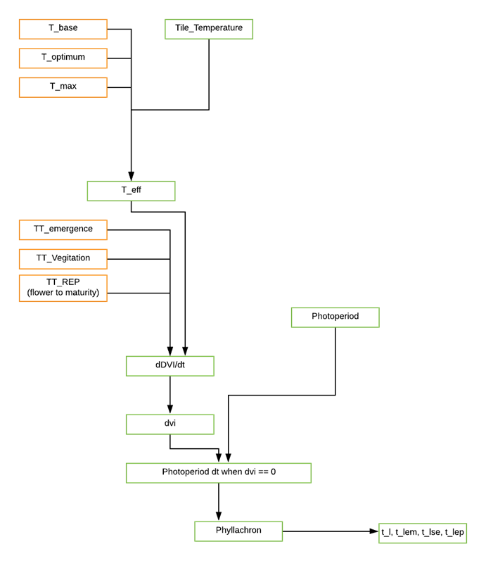
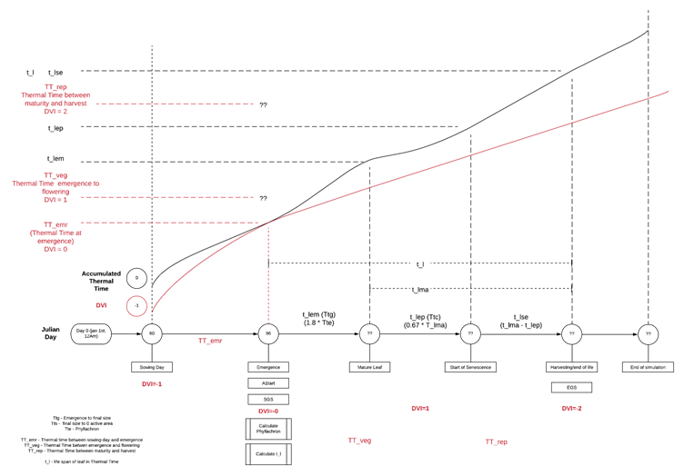

Phyllochron DVI Method
======================

Download the original word file  :download:`Phyllochron_DVI.docx <Phyllochron_DVI.docx>`

.. container:: WordSection1

   Phyllochron DVI Method

    

   The Phyllochron DVI phenology method is based on the JULES model and
   Ewert & Porter 2000 papers.

    

   Contents

   `Methods.1 <#toc70104075>`__

   `Model Flow (Thermal Time Method)1 <#toc70104076>`__

   `Model Notes.1 <#toc70104077>`__

   `Phenology.1 <#toc70104078>`__

   `Leaf Stage Durations (Approaches to defining leaf
   duration)1 <#toc70104079>`__

   `Calculating the Phyllochron.1 <#toc70104080>`__

   `Calculating Photoperiod.1 <#toc70104081>`__

   `Calculating SGS and EGS.1 <#toc70104082>`__

   `Calculating development index (DVI)1 <#toc70104083>`__

   `Appendix.1 <#toc70104084>`__

   `Glossary of parameters.1 <#toc70104085>`__

   `References.1 <#toc70104086>`__

    

    

   .. _Toc50367397:

   \_

   .. _Toc70104075:

   \_

   .. rubric:: Methods
      :name: methods

   1.     Thermal Time DVI JULES method– Phenology calculated using
   thermal time (Osborne 2015, Porter 1984)

   2.     Constant – t_l etc provided

   3.     F_phen – values estimated from f_phen input

   .. _Toc70104076:

   \_

   .. rubric:: Model Flow (Thermal Time Method)
      :name: model-flow-thermal-time-method

   |image0|

   Figure 1: Calculating life cycle of leaf using Phyllachron

   |image1|

   Figure 2: WIP Model timeline for calculating Phenology

   .. _Toc70104077:

   \_

   .. rubric:: Model Notes
      :name: model-notes

   1.     The model is currently only setup for spring wheat.

   2.     The phyllochron is calculated at emergence day and is then
   constant for the rest of the growing season

   .. _Toc50367398:

   \_

   .. _Toc70104078:

   \_

   .. rubric:: Phenology
      :name: phenology

   A key driver of O\ 3 deposition to vegetated surfaces and stomatal
   O\ 3 flux is seasonality (i.e. the timing of the physiologically
   active growth period); this will primarily depend on geographical
   location but will also be influenced by land-cover type and species

   To calculate the plant leaf stage durations we use the phyllochron
   which is calculated based on the change in daylight at emergence.

   **INSERT COMPARISON OF KEY PHENOLOGY STAGES HERE**

   .. _Toc50367399:

   \_

   .. _Toc70104079:

   \_

   .. rubric:: Leaf Stage Durations (Approaches to defining leaf
      duration)
      :name: leaf-stage-durations-approaches-to-defining-leaf-duration

   There are multiple methods of defining the key stages of leaf
   duration as outlined below.

   .. rubric:: Ewert & Porter 2000
      :name: ewert-porter-2000

                 t\ l          -         life span of leaf
   (\ :sup:`o`\ C Days)

                 t\ l,ma   -    thermal time interval of mature leaf
   (\ :sup:`o`\ C Days)

                 t\ l,se     -       thermal time interval of senescence
   leaf (\ :sup:`o`\ C Days)

                 t\ l,ep    -       thermal time interval of expanded
   leaf (\ :sup:`o`\ C Days)

                 t\ l,em   -      thermal time interval of emerging leaf
   (\ :sup:`o`\ C Days)

   .. rubric:: Jules (Osborne, T et al 2015)
      :name: jules-osborne-t-et-al-2015

    

   TTemr - thermal time between sowing and emergence (\ :sup:`o`\ C
   Days)

   TTveg - thermal time between emergence and flowering (\ :sup:`o`\ C
   Days)

   TTrep - thermal time between flowering and maturity/harvest
   (\ :sup:`o`\ C Days)

    

   We calculate the leaf durations using the Jules method then convert
   these to the values used in the Ewert Paper (Porter 1984).

   Ttg =  t\ l,em= 1.8*Tte                

   Tts = t\ l,ma= 3.5*Tte                 

   Ttc = t\ l,ep= 0.67\*t\ l,ma              

   Tts - Ttc = t\ l,se = 0.33\*t\ l,ma                             

   t\ :sub:`l` = Tts + Ttg = t\ l,em+ t\ l,ma                   

   Where Tte is the Phyllochron

    

   .. _Toc50367400:

   \_

   .. _Toc70104080:

   \_

   .. rubric:: Calculating the Phyllochron
      :name: calculating-the-phyllochron

   The phyllochron is 1/y, where y is the rate of leaf emergence and is
   equal to 0.026 Δ + 0.0104.

   *Baker equation from McMaster, G.S. and Wilhelm, W.W., 1995. Accuracy
   of equations predicting the phyllochron of wheat. Crop Science,
   35(1), pp.30-36.*

   The change of daylight at emergence (Δ) is calculated using the
   photoperiod which estimates the daylight hours based on the latitude
   (Weir 1984)

   Δ = Change in day length (in hours) from day n to day n+1, with day n
   being day of seedling emergence

   .. _Toc50367401:

   \_

   .. _Toc70104081:

   \_

   .. rubric:: Calculating Photoperiod
      :name: calculating-photoperiod

   Calculated from site latitude (Lat) and Julian day number (DOY) using
   formulae describing the relative movement of the earth and sun

   *Weir, A.H., Bragg, P.L., Porter, J.R. and Rayner, J.H., 1984. A
   winter-wheat crop simulation-model without water or nutrient
   limitations. The Journal of Agricultural Science, 102(2),
   pp.371-382.*

    

   dec = ASIN(0.3978*SIN(((2*PI())*(dd-80)/365) +
   (0.0335*(SIN(2*PI()*dd) - SIN(2*PI()*80))/365)))

   PR =
   24*(ACOS((((-0.10453)/(COS(RADIANS(lat)))*(COS(dec)))-TAN(RADIANS(lat))*TAN(dec))))/PI()\ `[SB1] <#msocom-1>`__\ \  

   ** **

   .. _Toc50367402:

   \_

   .. _Toc70104082:

   \_

   .. rubric:: Calculating SGS and EGS
      :name: calculating-sgs-and-egs

   DVI starts at -1 upon sowing. When DVI reaches 0 indicates EMERGENCE,
   therefore, the SGS where leaves begin to appear depending on the
   phylochron interval. When it reaches 2 indicates MATURITY and thus
   the EGS.

   .. _Toc50367403:

   \_

   .. _Toc70104083:

   \_

   .. rubric:: Calculating development index (DVI)
      :name: calculating-development-index-dvi

   The DVI takes the value of -1 upon sowing, increasing to 0 on
   emergence, 1 at the end of vegetative stage (anthesis) and 2 at crop
   maturity.

   The change in DVI per day is calculated using equation 3 from
   Osborne, T et al 2015

   :func:`calc_dvi\`

   Where T\ :sub:`eff` is the effective temperature (:sup:`o`\ C);
   TT\ :sub:`emr` is the thermal time between sowing and emergence;
   T\ :sub:`veg` is the thermal time between emergence and flowering;
   T\ :sub:`rep` is the thermal time between flowering and
   maturity/harvest.

   The effective temperature T\ :sub:`eff` is calculated as follows
   (Osborne, T et al 2015):

   Where T is the mean daily temperature calculated from observed data;
   T\ :sub:`b` is the base temperature; T\ :sub:`o` is the optimum
   temperature and T\ :sub:`m` is the maximum temperature (:sup:`o`\ C)

   Note: the base temperature used for t_eff can vary. By default DO3SE
   uses a base temperature of 0.

    

   The relative photoperiod effect(RPE) is calculated as follows:

   Where P is day length; P­\ :sub:`crit` is the crop specific critical
   photoperiod and P\ :sub:`sens` is the degree of sensitivity to the
   photoperiod (+:sub:`ve` for short day plants and –:sub:`ve` for long
   day plants

    

    

   .. _Toc70104084:

   \_

   .. rubric:: Appendix
      :name: appendix

   .. _Toc70104085:

   \_

   .. rubric:: Glossary of parameters
      :name: glossary-of-parameters

   +-----------------+-----------------+-----------------+-----------------+
   | **Parameter in  | **Parameter in  | **Description** | **Units**       |
   | Equation**      | code**          |                 |                 |
   +-----------------+-----------------+-----------------+-----------------+
   |                 |                 |                 |                 |
   +-----------------+-----------------+-----------------+-----------------+
   |                 |                 |                 |                 |
   +-----------------+-----------------+-----------------+-----------------+
   |                 |                 |                 |                 |
   +-----------------+-----------------+-----------------+-----------------+
   |                 |                 |                 |                 |
   +-----------------+-----------------+-----------------+-----------------+

    

    

   .. _Toc70104086:

   \_

   .. rubric:: References
      :name: references

    

   Osborne, T., Gornall, J., Hooker, J., Williams, K., Wiltshire, A.,
   Betts, R., Wheeler, T., 2015. JULES-crop: a parametrisation of crops
   in the Joint UK Land Environment Simulator. Geosci. Model Dev. 8,
   1139–1155. https://doi.org/10.5194/gmd-8-1139-2015

   Ewert, F., Porter, J.R., 2000. Ozone effects on wheat in relation to
   CO2: modelling short-term and long-term responses of leaf
   photosynthesis and leaf duration. Global Change Biology 6, 735–750.
   https://doi.org/10.1046/j.1365-2486.2000.00351.x

.. container::

   --------------

   .. container::

      .. container:: msocomtxt

         .. _msocom-1:

         \_msocom-1

          \ \ `[SB1] <#msoanchor-1>`__\ Equations pulled from excel.
         Swap for actual equations

