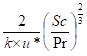

Boundary Layer Resistance (Rb and rb)
=====================================

Download the original word file  :download:`boundary_layer.docx <boundary_layer.docx>`

.. container:: WordSection1

   .. _Toc36708831:

   Boundary Layer Resistance (Rb and rb)

   The boundary layer of a plant surface can be defined as the layer of
   air surrounding the surface within which O\ 3 transfer is reduced
   from that which would occur in the atmosphere due to friction
   imparted by the plant surface.

    

   Contents

   `Model Flow..2 <#toc50042699>`__

   `Boundary layer resistance (Rb & rb).3 <#toc50042700>`__

   `Canopy level quasi-laminar boundary layer resistance
   (Rb).3 <#toc50042701>`__

   `Leaf level quasi-laminar boundary layer resistance
   (rb).3 <#toc50042702>`__

    

    

   .. _Toc50042699:

   \_

   .. rubric:: Model Flow
      :name: model-flow

   TODO

   .. _Toc36708834:

    

   .. _Toc50042700:

   \_

   .. rubric:: Boundary layer resistance (Rb & rb)
      :name: boundary-layer-resistance-rb-rb

   The boundary layer of a plant surface can be defined as the layer of
   air surrounding the surface within which O\ 3 transfer is reduced
   from that which would occur in the atmosphere due to friction
   imparted by the plant surface. The processes which determine transfer
   across canopy and leaf boundary layers occur due both to mechanical
   forcing (imparted by the momentum of the atmosphere) and molecular
   diffusion, with the latter becoming more important closer to the leaf
   surface as the momentum is reduced due to surface friction. The
   boundary layer resistance is commonly termed quasi-laminar since it
   comprises turbulent air movement occurring in the direction of
   laminar flow. The calculation of total O\ 3 deposition requires that
   the whole canopy boundary layer resistance (Rb) be estimated. In
   contrast, to estimate stomatal O\ 3 deposition to representative
   leaves of the upper canopy, leaf boundary layer resistances (rb) need
   to be calculated.  Explain what is of relevance for interface

   .. _Toc50042701:

   \_

   .. _Toc36708835:

   \_

   .. rubric:: Canopy level quasi-laminar boundary layer resistance (Rb)
      :name: canopy-level-quasi-laminar-boundary-layer-resistance-rb

    

   Whole canopy boundary layer resistance is approximated according to
   the following formulation presented by Hicks et al (1987)

    

   Rb = |image0|

    

   where Sc is the Schmidt number equal to v/Di, with v being the
   kinematic viscosity of air (0.15 cm\ -2 s\ -1 at 20°C), Di being the
   molecular diffusivity (for O\ 3 this is 0.15 cm\ -2 s\ -1  and for
   H\ 2\ O this is 0.25 cm\ -2 s\ -1 at 20\ o\ C) and Pr being the
   Prandtl number (0.72).

   [Include Rb for CO2, H2O, O3 and heat]

   ** **

   .. _Toc50042702:

   \_

   .. _Toc36708836:

   \_

   .. _Ref393795104:

   \_

   .. _Ref393795084:

   \_

   .. _Ref393724949:

   \_

   .. _Ref393724938:

   \_

   .. _Ref393724934:

   \_

   .. rubric:: Leaf level quasi-laminar boundary layer resistance (rb)
      :name: leaf-level-quasi-laminar-boundary-layer-resistance-rb

    

   Consistency of the quasi-laminar boundary layer is harder to achieve,
   so a leaf-level r\ b term (McNaughton and van der Hurk, 1995) is
   used. This incorporates the cross-wind leaf dimension L (given in m)
   and u\ (h) (the wind speed at the top of the canopy given in m/s).
   According toCampbell & Norman (1998), r\ b for heat (for forced
   convection) can be calculated according to eq.3giving values in s/m
   (these formulations take into account both sides of the leaf and
   therefore provide r\ b for PLA).

    

    

   .. _Ref393793568:

   3

    

   The approximate value of 150 (as used in the UNECE Mapping
   Manual(LRTAP Convention, 2010)) is arrived at using the value of
   0.135 which is a constant for heat conductance in mol m\ -2 s\ -1 for
   a single leaf surface and is converted to a resistance term (s/m).
   This is achieved using 41 to convert from mol m\ -2 s\ -1 to m/s, 2
   from single surface to PLA and by dividing by 1 to give a resistance
   (i.e. 1/(0.135*2)/41 which gives 151.85 and is then rounded down to
   150).

    

   For the gases - water vapour, carbon dioxide and ozone, the values of
   0.147, 0.110 and 0.105 are the constants used for used for
   conductance in mol m\ -2 s\ -1 for a single leaf surface (i.e. these
   replace the 0.135 constant for heat). These are equivalent to 139,
   186 and 195 when used in the equations giving units in s/m (similar
   to eq3). 

    

   N.B. Some boundary layer models also make a distinction between free
   (or natural) convection and forced convection. Free (natural)
   convection occurs due to temperature differences which affect the
   density, and thus relative buoyancy, of the fluid (e.g. water
   vapour). In forced convection, sometimes also called heat convection,
   fluid movement results from external surface forces such as expansion
   of air due to heat. Free (or natural) convection is not currently
   used in the DO\ 3\ SE model. However, we describe the method to
   estimate free (or natural) convection below in case this might be
   introduced in subsequent model versions.

    

   For the definition of the criteria for free *vs*. forced convection,
   a ratio term is necessary which is calculated as in eq. 4.

    

   .. _Ref393794979:

   4

    

   ratio     = (9.81*abs(Tleaf_K-Tair_K))/((u**2)*((Tleaf_K+Tair_K)/2))
   – these brackets aren’t correct and what does ‘abs’ stand for.

              

   If ratio ≤ 0.1, then forced convection dominates (see above). Else if
   the ratio is > 0.1 then free convention is occurring which is
   estimated according to Campbell & Norman (1998) as described in eq. 5
   in units of s/m. 

    

   .. _Ref393794954:

   5

