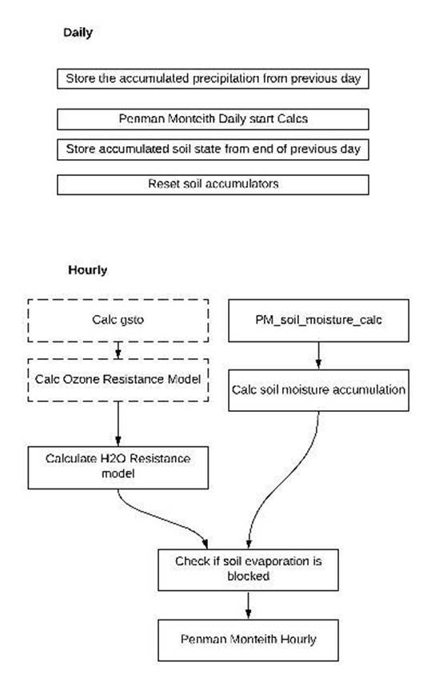
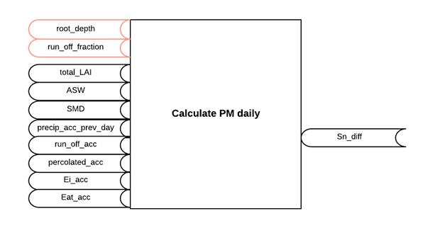
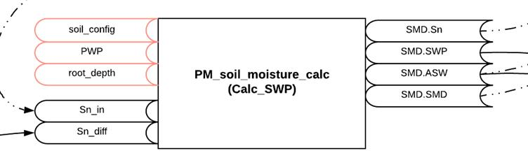
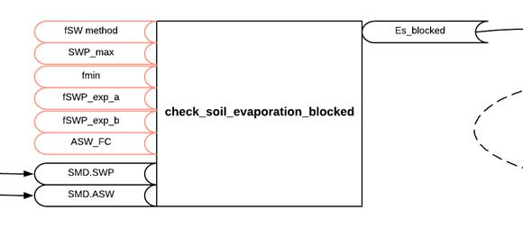
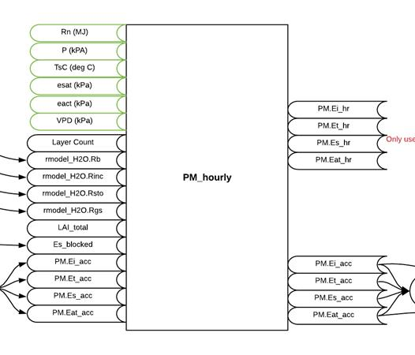
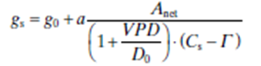
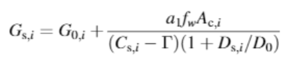

Soil Moisture Model
===================

Download the original word file  :download:`SMD.docx <SMD.docx>`

.. container:: WordSection1

   Soil Moisture Model

    

   The soil moisture model calculates the …

   Contents

   `Model Flow..2 <#toc67482366>`__

   `Calculating change in Soil Water4 <#toc67482367>`__

   `Start of year/simulation.4 <#toc67482368>`__

   `Daily Calculations.4 <#toc67482369>`__

   `Hourly Calculations.5 <#toc67482370>`__

    

   | 

    

   .. _Toc67482366:

   \_

   .. rubric:: Model Flow
      :name: model-flow

    

   |image0|

    

    

    

   .. _Toc67482367:

   \_

   .. rubric:: Calculating change in Soil Water
      :name: calculating-change-in-soil-water

   The DO\ 3\ SE soil moisture model comprises a soil box model to
   estimate soil water balance (Figure 1). A simple mass balance
   calculation is carried out over a finite depth of soil determined by
   a species-specific maximum root depth (R\ z).

   .. _Toc67482368:

   \_

   .. rubric:: Start of year/simulation
      :name: start-of-yearsimulation

   At the start of the year, when soil water calculations are
   initialized, root zone soil water (S\ n\ \*) is assumed to be equal
   to field capacity (FC) in the absence of data defining actual root
   zone soil water storage (S\ n), hence plant available soil water
   (ASW) is assumed to be at a maximum (eq. 2). FC defines the relative
   amount of water held by capillarity against drainage by gravity (m3
   m\ -3) and is dependant on soil texture (Foth, 1984). 

    

   .. _Toc67482369:

   \_

   .. rubric:: Daily Calculations
      :name: daily-calculations

   At the start of the day we calculate the change in Sn (Figure 1)
   using accumulated values from the end of the previous day. The new Sn
   value is then used to calculate SWP and ASW (Figure 2) to be used for
   the hourly calculations for the current day.

   |image1|

   .. _Ref67474072:

   Figure

   1 inputs and outputs to calculating Sn_diff. Red inputs are model
   parameters.
    

   |image2|

   .. _Ref67474397:

   Figure

   2 Inputs and outputs to calculate SWP and ASW at the start of the
   day. Red inputs are model parameters.
    

   .. _Toc67482370:

   \_

   .. rubric:: Hourly Calculations
      :name: hourly-calculations

   Precipitation is accumulated hourly with the final accumulated value
   used for the following day.

   The H2O resistance model is calculated\ `[SB1] <#msocom-1>`__\ \  …

   We then check if soil evaporation is blocked (Figure 3).

   |image3|

   .. _Ref67474607:

   Figure

   3. Inputs and outputs to checking if soil evaporation is blocked. Red
   inputs are model parameters.
    

    

   Finally we calculate the accumulated Ei, Et, Es and Eat (Figure 4).

   |image4|

   .. _Ref67474749:

   Figure

   4. Inputs and outputs to calculated accumulated PM values. Green
   inputs are environment data.
    

    

    

   .. container::

       

   UNCHECKED\ `[SB2] <#msocom-2>`__\ \  

   Daily estimations of S\ n are made according to the mass balance
   formulation based on the method used by Mintz and Walker (1993) (eq.
   3) where S\ n-1 is the S\ n of the preceding day and the root zone
   soil water storage difference between the previous day and the
   current day (Sn-diff) is calculated as a function of R\ z, the
   incoming daily precipitation (p), the daily canopy-intercepted P
   evaporated from the wet vegetation surface (Ei) and from the wet soil
   surface (Es), and the daily actual transpiration (E\ at) representing
   the water transferred from the soil to the atmosphere through the
   root-stem-leaf system of the vegetation and the .

    

   S\ :sub:`n` = S\ :sub:`n-1` + S\ :sub:`n-diff`

    

   *S\ n-diff*\  = (p  - Sc) + (Sc – min (Ei, Sc)) / R\ z,  when p > 0

    

   *S\ n-diff*\  = – E\ at + E\ s / R\ z,  when p = 0

    

    

   S\ n-1is recharged by p events and the amount of p intercepted by the
   canopy is based on its storage capacity (Sc) with remaining p assumed
   to enter directly into the soil. This method is in accordance with
   the global land surface parameterisation of the Revised Simple
   Biosphere Model (SiB2; Sellers et al, 1995) which is applied for a
   range of land covers including broadleaf and needleleaf trees, short
   vegetation and grassland. In there, Sc (mm) is defined as:

    

   Sc = 0.1\*LAI

    

    

   *Interception and evaporation of P in the canopy*

    

   The fraction of intercepted p that might ultimately reach the soil is
   dependant upon Ei, which is estimated using the Penman equation for
   evaporation from a wet surface (Monteith, 1965).

    

   E\ i\ **=**

    

    

   Where:

    

    is the slope of the vapour pressure curve (Pa °C\ -1), R\ n is the
   net radiation at crop surface (J m\ -2 h\ -1), G is the soil heat
   flux (J m\ -2 h\ -1),\ *\ a*\ is the air density (kg cm\ -3), C\ p
   is the specific heat capacity of air (J g\ -1 °C\ -1), VPD is the
   vapour pressure deficit (Pa),  is the psychrometric constant (Pa
   °C\ -1),  is the latent heat of vapourisation (J kg\ -1), R\ a is
   the aerodynamic resistance for water (m s\ -1),  R\ bH2O is boundary
   layer resistance for water (m s\ -1) and 3600 is a time conversion
   factor.

    

   To estimate E\ i, only those resistances (i.e. R\ a and R\ bH2O) that
   occur between the top of the canopy and the measurement height of VPD
   need to be included in eq. X.  The same is the case for the
   calculation of E\ at and eq. 5.

    

   Where possible, R\ n and G should be directly measured and entered in
   Wh m\ -2 which will then be converted by the DO\ 3\ SE model to J
   m\ -2 h\ -1 for the estimation of Ei.. However, when these data are
   not available, they will be estimated within the DO\ 3\ SE model from
   global radiation (R). For the derivation of R\ n see section XX.
   Furthermore,

    

   *G*\          =          0.1 R\ n  

    

   Intercepted p that is not evaporated will be assumed to add to soil
   water recharge up to FC. In cases where E\ i exceeds intercepted p,
   no additional water will be available to recharge S\ n-1 and on days
   with no p, S\ n-1 dries at a rate controlled by evapotranspiration.

    

    

   Hourly actual plant transpiration (Eat) is calculated using the
   Penman-Monteith model allowing for evaporation from a vegetated
   surface (Monteith, 1965) (eq. X). Again, to estimate E\ at, only
   those resistances (i.e. R\ a and R\ bH2O) that occur between the top
   of the canopy and the measurement height of VPD need to be included
   in eq. 5.

    

    

   E\ at=

    

    

   Where R\ stoH2O is the canopy resistance to transfer of water vapour.
   Soil water balance is based on summed daily values of p, E\ i and
   E\ at. Any water loss occurring will only affect the g\ sto (and
   hence R\ stoH2O) of the following day.

    

    

   DO\ 3\ SE assumes a single, integrated root-zone similar to the
   approach taken in several forest growth models (e.g. Randel et al.
   2000, Grünhage & Haenel, 1997). Water inputs into the soil-rooting
   zone are limited to that from p until the soil reaches FC; all water
   in excess of FC is assumed to run-off or percolate into the
   substrate. Any capillary movement of water from the soil below the
   root zone is ignored.

    

   When soil moisture is not limiting (i.e. when SWC is equal to FC),
   the soil will lose moisture though evaporation (Es) at a rate defined
   by the Penman-Monteith equation for evaporation modified to include
   the resistances from the soil surface to the atmosphere (eq. X).

    

   E\ s\ **=**\ `[B3] <#msocom-3>`__\ \  

    

    

   Where Rn\ s is the net radiation available at the soil surface
   beneath the canopy, estimated by

    

   *Rn\ s = R\ n*

                                                                                                                                      
   [7]

   * = exp(-K\ a\ \*LAI)*

    

   Where K\ a is the coefficient for attenuation of available energy and
   is set to 0.5 for consistency with the DO\ 3\ SE module used to
   estimate canopy radiation penetration.

    

   The amount of water available to the plant is dependent upon the
   water holding characteristics of the soil and the water extraction
   capabilities of the plant. Soil water characteristic curves (eq. 8)
   are used to determine the soil water potential (­soil) for a given
   volumetric water content within a given texture class. In order for
   the parameterisation of the DO\ 3\ SE model to be applicable across
   Europe, soil water characteristic curves were defined for 4
   representative soil textures: sandy loam, silt loam, loam and clay
   loam. The soil water release curve profiles (Fig. X) were defined
   according to Campbell (1985) and empirical parameters based on Tuzet
   et al. (2003) as described in Table X.

    

    

                                                                                                    
   [8]

    

   **Table X**\ Water holding characteristics of four soil texture
   classes.

   .. container::

      +-------------+-------------+-------------+-------------+-------------+
      |             |             | *FC*\ ,     | *Ψ\ e*\ MPa | *b*         |
      |             |             | m\ 3 m\ -3  |             |             |
      +-------------+-------------+-------------+-------------+-------------+
      | Sandy loam  | Coarse      | 0.16        | -0.00091    | 3.31        |
      +-------------+-------------+-------------+-------------+-------------+
      | Silt loam   | Medium      | 0.26        | -0.00158    | 4.38        |
      |             | coarse      |             |             |             |
      +-------------+-------------+-------------+-------------+-------------+
      | Loam        | Medium      | 0.29        | -0.00188    | 6.58        |
      +-------------+-------------+-------------+-------------+-------------+
      | Clay loam   | Fine        | 0.37        | -0.00588    | 7           |
      +-------------+-------------+-------------+-------------+-------------+

    

    

    

    

   Fig. X. Soil water release curves according to Campbell (1985) and
   Tuzet et al. (2003)

    

   When expressed as % volumetric content water available to the plant
   throughout the rooting depth (ASW; eq. 10) is estimated assuming the
   roots are capable of extracting water from the soil from the FC to
   the point where the root zone soil water content has reduced to the
   permanent wilting point (PWP). Commonly a PWP of -1.5 MPa is assumed
   for all plant species, however, results especially from plants
   growing under dry conditions in the Mediterranean shows that PWP for
   these species can extend down to -4 MPa (i.e. these plants are
   capable of extracting water held more tightly by the soil) and this
   is accounted for in DO\ 3\ SE by allowing stomatal flux to continue
   at f\ min when \ soil falls below \ min. FC is assumed to be
   approximately -0.01 MPa (Foth, 1984) and equivalent volumetric FC
   values are estimated by re-arranging eq. 8 for each soil texture
   class. 

    

   *ASW = R\ z\ (FC –
   PWP*\ `[B4] <#msocom-4>`__\ \  \ *)                                                                                             
              *\ [9]

    

   The internal consistency of the O\ 3 deposition and water vapour
   exchange estimates are largely governed by f\ swp.  This determines a
   daily baseline g\ sto meaning that as the soil dries, the stomates
   shut thus limiting both the amount of water lost from the soil system
   as well as the amount of O\ 3 taken up via the stomates. As water
   lost from the soil system is integrated over the course of a day, the
   model does not specifically incorporate xylem hydraulic conductivity
   (Tuzet et al., 2003), however the rapid decrease in g\ sto with a
   drying soil in effect acts as a surrogate for this
   phenomenon\ `[LDE5] <#msocom-5>`__\ \ \  .

    

   The plant’s ability to access water is determined according to the
   f\ SWP relationship, described in eq. 10.  Primarily, it is assumed
   that over R\ z, soil water is readily able to leave the soil system
   up to a critical value (ψmax) past which point soil water is held
   ever more tightly until a second critical value (ψmin) is reached, at
   this point g\ sto is restricted to f\ min. 

    

   Appropriate values for \ max, \ min, f\ min were determined using
   experimental data collated for beech (Fagus sylvatica), temperate
   oak(\ Quercus robur and Quercus petraea), Scots pine (Pinus
   sylvestrus), Norway spruce (Picea albes) and holm oak (Quercus ilex).
   Because f\ SWP relationships for boreal/temperate coniferous and
   deciduous trees are very similar we use a generic f\ SWP relationship
   for northern and central Europe derived using combined data for both
   tree types.  Both north/central European and Mediterranean
   relationships are standardised to incorporate 80% of experimental
   data points as shown in Figure 2.

    

                                                 [10]

    

    

    

   `[B6] <#msocom-6>`__\ \  

   To summarise, all input variables required for the estimation of
   E\ i, E\ at and E\ s are given in Table X.

    

    

   **Table X**\ .  All input variables required for estimation of
   evapotranspiration using the Penman-Monteith equation.

   +-----------------+-----------------+-----------------+-----------------+
   | Input variable  | **unit**        | **description** | **source**      |
   +-----------------+-----------------+-----------------+-----------------+
   | R\ n            | J m\ -2 h\ -1   | Net radiation   | measured or     |
   |                 |                 | at crop surface | calculated by   |
   |                 |                 |                 | DO\ 3\ SE       |
   +-----------------+-----------------+-----------------+-----------------+
   | G               | J m\ -2 h\ -1   | Soil heat flux  | measured or     |
   |                 |                 |                 | calculated by   |
   |                 |                 |                 | DO\ 3\ SE       |
   +-----------------+-----------------+-----------------+-----------------+
   | r\ a            | s m\ -1         | Aerodynamic     | calculated by   |
   |                 |                 | resistance      | DO\ 3\ SE       |
   +-----------------+-----------------+-----------------+-----------------+
   | r\ sto          | s m\ -1         | Bulk surface    | calculated by   |
   |                 |                 | (canopy)        | DO\ 3\ SE       |
   |                 |                 | resistance      |                 |
   +-----------------+-----------------+-----------------+-----------------+
   | VPD             | Pa              | Vapour pressure | measured        |
   |                 |                 | deficit         |                 |
   +-----------------+-----------------+-----------------+-----------------+
   | P\ `[B7] <#msoc | Pa              | atmospheric     | measured        |
   | om-7>`__\ \     |                 | pressure        |                 |
   +-----------------+-----------------+-----------------+-----------------+
   | T               | °C              | temperature     | measured\ `[B8] |
   |                 |                 |                 |  <#msocom-8>`__ |
   |                 |                 |                 | \ \             |
   +-----------------+-----------------+-----------------+-----------------+

    

    

   All other derived variables are:

    

   *= slope of the vapour pressure curve (Pa °C\ -1)*

   * *

    

   Where:

    

   Where e\ :sub:`sat` is the saturated vapour pressure of air (Pa) and
   T is the air temperature (°C).

    

   *e\ act:*\ actual vapour pressure (Pa)

    

    

   Where e\ :sub:`sat` is the saturated air pressure (Pa) and VPD is the
   vapour pressure deficit (Pa).

    

   ** latent heat of vapourisation (J kg\ :sup:`-1`)

    

    

   ** the psychrometric constant (Pa °C\ :sup:`-1`)

    

    

   \ :sub:`a`: the air density (kg cm\ :sup:`-3`)

    

    

   Where P\ `[B9] <#msocom-9>`__\ \  is the atmospheric pressure (Pa)
   and

    

    

   *C\ p: specific heat capacity of air (J g\ -1 °C\ -1)*

    

    

   **Figure 2.**\              f\ SWPrelationships in comparison with
   observed data describing relative g with pre-dawn leaf water
   potential for a) coniferous (Norway spruce and Scots pine) and
   Deciduous (beech) trees in north and central Europe.
   \ max\ =-0.6MPa; \ min\ =-1.5MPa; PWP\ =-4.0MPa and b)
   Mediterranean trees (Holm oak). . \ max\ =-0.9MPa; \ min\ =-3.6
   MPa; PWP\ =-4.0MPa

    

   **b)**

   ** **

   ** **

    

    

   .. rubric:: Water Stress
      :name: water-stress

   According to Damour et al 2010 water stress has an impact on the
   stomatal conductance of leaves. Currently we use the Leuning 1995
   model `[SB10] <#msocom-10>`__\ \  (Eq 12a in Damour et al 2010) to
   calculate the relationship between Anet and gsto. To include water
   stress we use the method used in Wang and Leuning 1998 below:

   |image5|

   *Leuning 1995*

   |image6|

   *Wang and Leuning 1998*

    

   Where

    is The VPD at which g_sto is reduced by a factor of 2

    is the net CO2 assimilation

    is surface CO2 

   a is the species specific sensitivity to A­­\ :sub:`­net`

   Γis CO2 compensation point in the absense of respiration

    

    is the fractional influence of water stress on stomatal conductance

    

   And

    

   .. rubric:: References
      :name: references

   ·       Damour et al (2010) An overview of models of stomatal
   conductance at the leaf level

   ·       Leuning R. (1995) A critical appraisal of a combined stomatal
   photosynthesis model for C3 plants. Plant, Cell & Environment

   ·       Wang, Y.-P., Leuning, R., 1998. A two-leaf model for canopy
   conductance, photosynthesis and partitioning of available energy I::
   Model description and comparison with a multi-layered model.
   Agricultural and Forest Meteorology 91, 89–111.
   https://doi.org/10.1016/S0168-1923(98)00061-6

    

    

    

    

    

    

.. container::

   --------------

   .. container::

      .. container:: msocomtxt

         .. _msocom-1:

         \_msocom-1

          \ \ `[SB1] <#msoanchor-1>`__\ Explain how H2O resistance model
         should be calculated. Currently it is converted from the O3
         resistance model.

   .. container::

      .. container:: msocomtxt

         .. _msocom-2:

         \_msocom-2

          \ \ `[SB2] <#msoanchor-2>`__\ Most of the below method seems
         to be in the code but we should make clearer the steps taken as
         in info above.

   .. container::

      .. container:: msocomtxt

         .. _msocom-3:

         \_msocom-3

          \ \ `[B3] <#msoanchor-3>`__\ why no R_ext included here?

   .. container::

      .. container:: msocomtxt

         .. _msocom-4:

         \_msocom-4

          \ \ `[B4] <#msoanchor-4>`__\ Do we want to substitute this by
         SWP?

   .. container::

      .. container:: msocomtxt

         .. _msocom-5:

         \_msocom-5

          \ \ `[LDE5] <#msoanchor-5>`__\ is this true or does the fact
         that we only estimate on a daily time-step mean that
         incorporation of hydraulic resistance is not considered
         necessary??? Patrick: there is indeed some evidence for this in
         the literature

   .. container::

      .. container:: msocomtxt

         .. _msocom-6:

         \_msocom-6

          \ \ `[B6] <#msoanchor-6>`__\ The following paras could be
         shifted up slightly

   .. container::

      .. container:: msocomtxt

         .. _msocom-7:

         \_msocom-7

          \ \ `[B7] <#msoanchor-7>`__\ We also use a P for
         precipitation!!!

   .. container::

      .. container:: msocomtxt

         .. _msocom-8:

         \_msocom-8

          \ \ `[B8] <#msoanchor-8>`__\ update

   .. container::

      .. container:: msocomtxt

         .. _msocom-9:

         \_msocom-9

          \ \ `[B9] <#msoanchor-9>`__\ we also use a P for precipitation

   .. container::

      .. container:: msocomtxt

         .. _msocom-10:

         \_msocom-10

          \ \ `[SB10] <#msoanchor-10>`__\ We convert relative humidity
         to VPD

